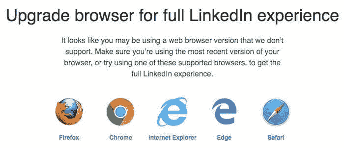
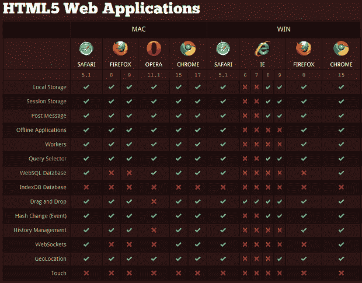
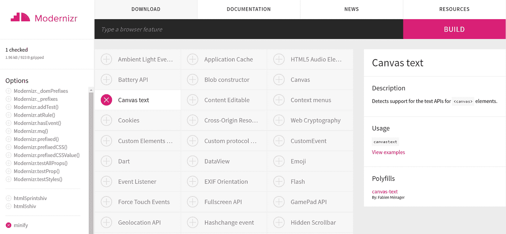
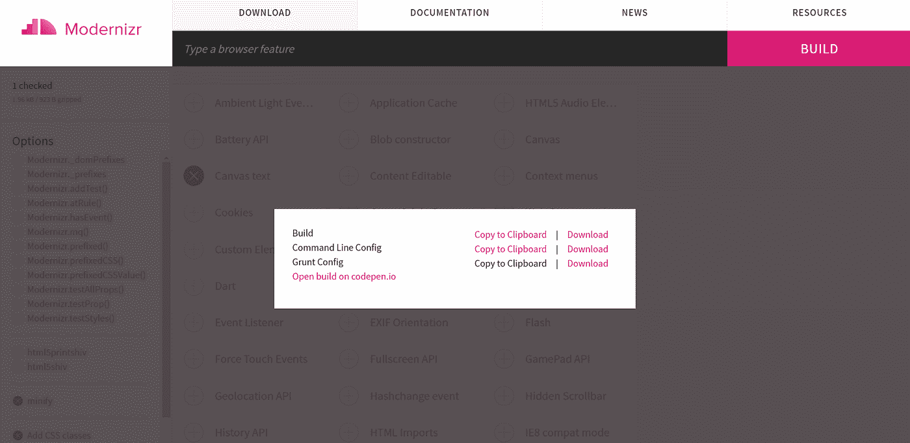

# 通过功能检测改进您的网站

> 原文：<https://levelup.gitconnected.com/improve-your-websites-with-feature-detection-6c35d5f485e9>

作为一名 Web 开发人员，你必须确保你的网站或应用程序可以跨所有浏览器和设备工作，不管它们有多不同或多旧。如果你的网站可以在 Mozilla Firefox 上运行，并不意味着它可以在其他浏览器或人们仍在使用的旧版本上运行。如果你的网站可以在最新的 MacBook Pro 上运行，并不意味着它可以在其他设备或旧产品上运行。

浏览器和设备的差异主要是因为它们有不同的**特性集**。新的浏览器/设备可以支持最新的 HTML5 或 CSS3 特性，而旧的浏览器没有这些特性，因此会显示一个错误或类似的东西，如下所示。



【jvmediadesign.com/blog/wp-content/uploads/2..】来源:[](https://jvmediadesign.com/blog/wp-content/uploads/2017/10/linkedin-upgrade-min.jpg)

## **结论**

*我们不能仅仅因为人们使用较旧的设备或浏览器，或者使用与我们不同的浏览器，就拒绝他们访问网站。确保每个人的可访问性是 web 开发的一个基本原则。*

**

# *什么是特征检测？*

*功能检测是一个过程，包括检测当前使用的浏览器是否支持某些功能。如果它不支持某个特定的特性，它会提供一些回退代码——一种替代的工作体验——而不是崩溃或显示错误。*

*一个简单的特征检测代码可能看起来像这样:*

```
*if ("geolocation" in navigator) {
  navigator.geolocation.getCurrentPosition(function(position) {
    // show the location on a map, perhaps using the Google Maps API
  });
} else {
  // Give the user a choice of static maps instead perhaps
}*
```

*(代码来自:[developer.mozilla.org/en-US/docs/Learn/Tool..](https://developer.mozilla.org/en-US/docs/Learn/Tools_and_testing/Cross_browser_testing/Feature_detection))*

*在这段代码中，我们试图检查当前浏览器是否支持地理位置 API。如果没有，提供一个替代方案，比如使用静态地图。*

*哇，这似乎很容易实现，不是吗？*

> **不会，因为有这么多特性集要测试兼容性！使用这样的代码检查每一个将会花费很长时间！**

**

**来源:*[*speckyboy.com/wp-content/uploads/2012/03/ch..*](https://speckyboy.com/wp-content/uploads/2012/03/chart2.png)*

> ****解决方案:使用特征检测库！****

# *现代化 zr*

*业界的特征检测库*

**

**来源:*[*helpdev.eu/wp-content/uploads/2018/12/moder..*](https://helpdev.eu/wp-content/uploads/2018/12/modernizr.jpg)*

*使用 Modernizr 是实现功能检测和提高网站可访问性的最佳方式。入门很简单。*

# *步骤 1:用 npm 安装 Modernizr*

```
*npm install -g modernizr*
```

# *步骤 2:选择您的配置*

*转到此[链接](https://modernizr.com/download?canvastext-setclasses)仅选择您需要检查兼容性的功能。然后点击 Build 下载**命令行 config.json** 。*

*在我的例子中，我为`canvas text`属性选择了一个特性测试。*

**

**来源:【modernizr.com/download?canvastext-setclasses】[](https://modernizr.com/download?canvastext-setclasses)**

**然后我下载**命令行 config.json** 。**

****

# **第三步:构建`modernizr.js`**

**将你下载的`config.json`移动到你的项目文件夹中。然后运行:**

```
**modernizr -c modernizr-config.json**
```

**这将生成一个`modernizr.js`文件，这是您可以用于您的网站的自定义特征检测模块。**

# **步骤 4:配置 HTML**

**现在将 js 文件插入到 HTML 中。**

```
**<script src="modernizr.js" type="text/javascript"></script>**
```

**另外，将类“no-js”添加到您的标签中。**

```
**<html class="no-js">**
```

**这个添加的类确保了如果浏览器在没有 JavaScript 的情况下运行时有一个后备。如果浏览器运行 JavaScript，Modernizr 将只替换`js`类。**

**Modernizr 将对您的`config.json`中陈述的所有其他功能进行同样的操作。如果它在你的浏览器上检测到这个特性，它会把这个类添加到 html 标签中。但是如果您的浏览器不支持该特性，它将添加带有前缀`no-`的类来显示回退类。**

**对于我的例子，我只有`canvastext`属性来进行特性测试。当我运行我的 HTML 页面时，这是我的< html >标签的样子:**

```
**<html class="js canvas canvastext">**
```

**我可以看到 Modernizr 已经把我的`no-js`替换成了`js`，这意味着我的浏览器已经启用了 JavaScript。接下来的两个类没有附加`no-`前缀，这意味着我的浏览器同时支持`canvas`和`canvastext`。**

# **第五步:写回退**

**所以我的浏览器正好支持`canvastext`。但是如果一些用户不使用支持这个特性的浏览器呢？**

**当 Modernizr 在< html >标签中显示`no-canvastext`类时，我应该提供后备。**

```
**if (Modernizr.canvastext) {
    //show some cool canvas text
  } else {
    //show a picture with text on it
  }**
```

**如果浏览器不支持某个特定功能，您可以通过这种方式提供一个后备方案。**

**代替 API 属性的`canvastext`,如果你正在测试一些 CSS3 特性，你可以这样写:**

```
**.no-cssfeature {
  /*some CSS attributes if browser does not support*/
}

.cssfeature {
  /*the new CSS feature that can be used*/
}**
```

# **这就是要点！**

**使用 Modernizr，您现在可以轻松实现特征检测，从而节省大量时间！当使用 HTML5 或 CSS3 时，包含这个有用的库来提高网站的可访问性是一个非常好的主意。请随意浏览 Modernizr 的[文档](https://modernizr.com/docs/)以了解更多信息。**

**我希望这是对你有帮助的阅读。请不要犹豫在下面的评论中提出任何问题。祝你一切顺利。干杯！**