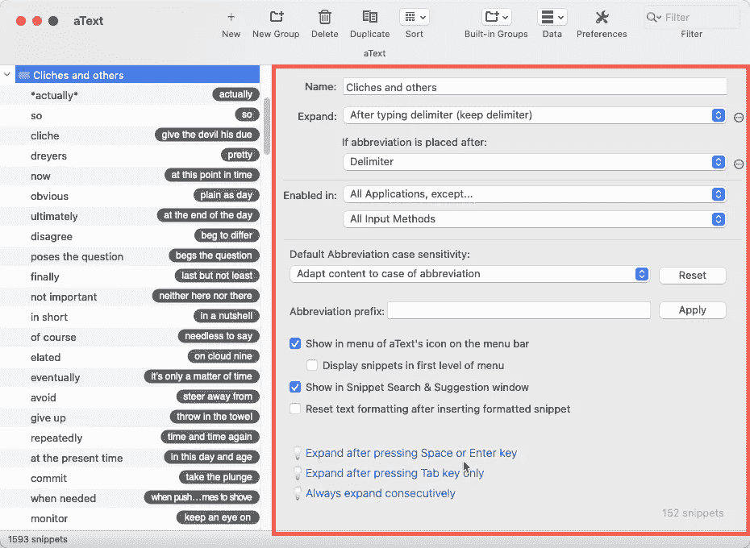
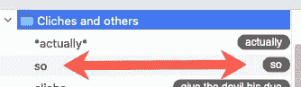
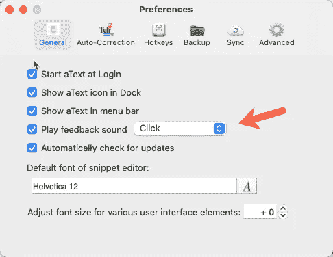
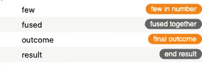

# 用这个意想不到的工具提高你的写作水平

> 原文：<https://levelup.gitconnected.com/improve-your-writing-with-this-unexpected-tool-488130d74c1b>

## 提高写作水平的工具

## “aText”，表面上是一个 snippet 工具，可以迫使你写更好的电子邮件，slack 帖子，短信，中型文章，小说，等等。如果你愿意的话。

如果你用自来水笔写信，那就没用了

您可能认为这是对一个工具的大胆断言，当您第一眼看到它时，很容易被误认为是代码片段扩展工具。虽然 [aText](https://www.trankynam.com/atext/) **是**一个片段工具，但它足够灵活，可以做得更多。

# 自动避免陈词滥调

与其节省击键次数，你还不如让你的读者免于过度使用陈词滥调，免于“近距离”接触“意想不到的惊喜”。

我最近读完了本杰明·德莱尔的《德莱尔的英语》，有趣又实用。就在第一章，德莱尔先生建议，如果你停止使用某些单词，你会成为一名更好的作家。这是部分清单。

*   很
*   宁愿
*   事实上
*   仅仅
*   即便如此
*   实际上

如果你像我一样，大多数时候你甚至没有意识到你使用这些词有多频繁。但是，如果你每次都注意到它，想象一下那会有多大帮助。另一个公认的更有趣的提高写作的方法是去购买和吸收 Dryer 的英语。我也没有经济利益。

# 设置它

这不是一个使用 aText 的教程，你可以很容易地下载它并学习基础知识。一旦你掌握了这一点——我保证这并不难——建立一个文件夹，并将其命名为`Clichés.`以下是我为我的文件夹设置的选项:

设置文件夹选项(以橙色突出显示)

举个例子，有了这些设置，当我键入单词`actually`后跟一个分隔符时，它仍然会放在单词中，但它会用星号(*实际上*)将它括起来。

下图显示了另一种方法。你看到的不是替身，`so`这个词换成了`so`这个词，好像没什么用。

勉强过得去

但是，在我的首选项中，我设置了一个每次激活时都会播放声音的文本。文本保持不变，但声音让我知道我犯了一个轻微的罪。然后我就可以决定 Dryer 先生对这样一个小词是否有点过分了。

打开音频反馈

# 定制您的体验

你可以用任何你想要的东西来替换那些有针对性的陈词滥调，从一对简单的星号把有问题的样本圈起来，到一个完整的对话框，里面有一个建议替换的下拉列表。有些短语值得一提，为此，我设置了工具，用`cliché`或`empty phrase`替换我写的内容。与典型的 snippet 工具相反；这种方法不能节省你的时间，它迫使你花时间想出一个更好的方法来表达你的想法。

# 不要停留在陈词滥调上

我们经常使用过多的词汇。如果你提到免费的礼物，我妈妈会马上问你还有什么其他种类的。这些多余的词似乎很容易被忽视。它们在数量上并不少，它们中的许多似乎在我们的脑海中融合在一起，几乎是惯用的，然而最终的结果并不是我们希望读者看到的简洁的最终结果。如果你在阅读最后一句时注意到了所有四个冗余，你可能不需要文本在这方面的帮助。如果没有，只需添加以下替换内容:

触发器在右边，替换在左边

如果你需要一个来源来开始，这里有一个清单，上面有 150 多个陈词滥调，我需要帮助来避免。这个链接会把你带到一个 GitHub 文件夹，里面既有 CSV 文本版本，也有`aText`导出的文件。后者将让你导入文件钩子，线和井…没关系。