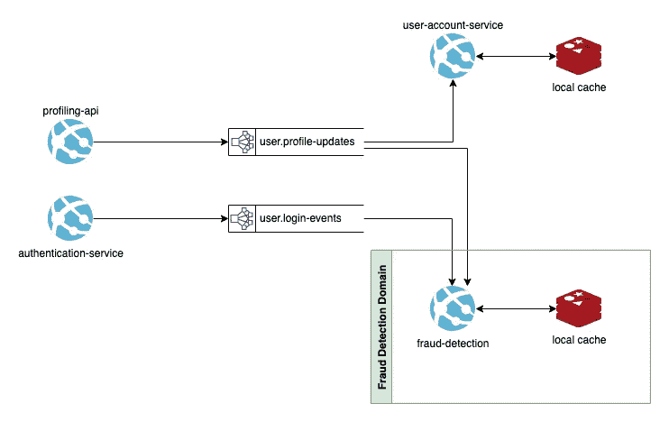

# 通过重新搜索改进欺诈检测

> 原文：<https://levelup.gitconnected.com/improved-fraud-detection-with-redisearch-acf1a5fa835b>


如果你在某种程度上参与了[事件驱动设计](https://medium.com/gitconnected/event-driven-architectures-in-software-design-757d92b85df5)(或者软件工程)的世界，你肯定听说过卡夫卡。同时，作为任何软件社区的一员，我想你应该熟悉我们钟爱的 Redis。

Kafka 是一个分布式流平台，有大量很酷的应用程序，允许我们构建可扩展的高性能分布式系统。它通常作为一个通信通道，以高性能的方式连接[微服务](https://medium.com/geekculture/brief-introduction-to-microservices-b99a91c77c72)，同时为其他应用程序保存不可变的数据。

Redis 是一个内存中的数据存储，它也有很多有趣的应用。

谈到 Redis，你可能更熟悉它的开源数据存储版本，我们可以将其用作高性能缓存数据库，但多年来 [Redis](https://redis.com/) 一直在构建一个名为 [Redis Stack](https://redis.io/docs/stack/) 的数据模型集合，其中大多数都在他们的企业产品下。

这有什么关系呢？

在[智能]软件工程中，我们的工作不是重新发明轮子，Redis Stack 添加了许多现成的现代数据模型，使我们的生活变得更加简单。

在本文中，我将重点关注[重新搜索](https://redis.io/docs/stack/search/)，但也可以在[官方文档](https://redis.io/docs/stack/)中随意查看它们的完整内容。

# 关于再研究的更多信息

对于我的许多 EDA 应用程序，我特别喜欢 Redis。在我工作的环境中，事件驱动是常态，Redis 数据存储允许我们在所有微服务上使用高效的缓存，以加快速度。使用 Redis 作为缓存的理由非常充分。

当您在事件驱动的设置中工作时，通常需要本地缓存来聚集事件数据。例如，如果您有传入的用户配置文件更改事件，您可能有一个微服务从流中读取并聚合一个整合的用户配置文件。这就是 Redis 派上用场的地方。

你想要一个真正快速的本地缓存，由于 Kafka 的性质，你可以通过重新处理 Kafka 主题来重建这些缓存，例如当启动一个新的微服务时。


从一个主题消费简单的服务并写入 Redis

现在，再搜索变得更有趣了。

根据 [Redis](https://redis.com/) (前 Redis 实验室)的说法，RediSearch 是 Redis 的一个强大的索引、查询和全文搜索引擎。

那么，这到底是什么意思？

您可能已经猜到了，RediSearch 允许您以一种高效的方式对 Redis 数据进行搜索或查询。

以标准 Redis 为例。用户配置文件哈希可以有以下格式的主索引:

```
users:profiles:user_id
```

您可以用这个键执行搜索操作，Redis 将使用主索引来找到它并检索其中存储的内容。这是标准的`HGETALL users:profiles:user_id`命令。

使用 RediSearch，您可以基于内容在同一个键上创建一个二级索引。如果用户配置文件包含姓名和电子邮件，您可以索引姓名字段，并根据该姓名执行搜索操作。

很酷，是吧？

您可以运行复杂的聚合、存储分析数据、使用纯文本甚至模糊匹配进行搜索等等。

我敢打赌，您可以看到如何在分布式环境中使用它。您可能有不同的数据流，从系统的不同部分收集和聚合数据，然后跨不同的服务构建本地缓存，并使用 RediSearch 以多种方式索引数据。

例如，您可以汇总有关您业务的关键指标，以便让决策者占上风，或者您可以存储实时分析和监控性能等。

**这与开箱即用的 Redis 有何不同？**

RediSearch 是建立在 Redis 之上的一个模块，它是一个现成的解决方案，这意味着我们不需要对它包含的任何数据存储进行建模。界面也是不同的，它超级加载了大量的新命令和功能。这是它自己的产物，否则你就得自己建造。

# 我们如何利用这一点进行欺诈检测？

让我们挑选一个特定的用例，看看再搜索如何帮助我们。

欺诈检测是一个充满挑战和机遇的领域。问题是复杂的，坏演员总是在门口等着尝试新的方法。

那么就要靠软件工程中可怜的灵魂来坚持我们的立场并为此做些什么了😅

我将描述一个非常常见的群体欺诈用例，它可以适用于任何类型的欺诈检测，因为欺诈检测本身的细节现在并不相关。

# 问题是

假设我们有一个系统，它很容易被具有相似行为的用户组滥用，这意味着实施欺诈的用户很可能与实施欺诈的其他用户具有相似的特征。

你可以用许多不同的方法来解决这个问题。你可以使用机器学习将具有相似行为的用户聚集在一起，或者你可以制定特定的规则来确定和检测欺诈对你意味着什么，或者你可以让分析师检查用户配置文件并寻找不寻常的标志，或者以上所有方式。

事实上，很可能你会使用多种技术和检查来捕捉滥用者。

知道相似的滥用者可能会有相似的行为方式，一旦您确定某个用户是欺诈性的，您如何利用这种行为并抓住其他人呢？

# 使用标准 Redis 缓存

在标准的现代架构中，我们可能有一个包含一些微服务的系统，通过 Kafka 进行通信，并将其数据存储在本地 Redis 缓存中。

像这样的东西:



简单的 EDA 设置，有多个消费者和生产者

在这种情况下，我们有一个专门用于欺诈检测的服务，监听多个数据流并将所有数据聚合到 Redis 中。

用户配置文件可以存储在 Redis 哈希中，如下所示:

```
# key: users:profiles:my_user_id
{
  name: John,
  lastname: Wick,
  email: john.wick@defonotfrauddomain.com,
  registration_ip_address: 156.33.241.5,
  latest_ip_address: 156.33.241.5,
  country: usa,
}
```

让我们使用 [node-redis](https://github.com/redis/node-redis) 库来创建它:

```
import { createClient, SchemaFieldTypes } from 'redis';
const client = createClient();
await client.connect();await client.hSet('users:profiles:my_user_id', {
  name: 'John',
  lastname: 'Wick',
  email: 'john.wick@defonotfrauddomain.com',
  registration_ip_address: '156.33.241.5',
  latest_ip_address: '156.33.241.56',
  country: 'usa'
})
```

请注意，在实践中，我们会从现有的不同传入数据流中构建这个配置文件。

既然数据已经集中在一个地方，我们就可以对它进行检查了。

例如，我们可以根据用户的注册 IP 地址对接收位置进行检查。

假设我们收到一个 IP 地址如下的登录事件:`91.218.114.206`。我们可以存储它，对照用户的注册 IP 进行检查，并注意到它们非常不同，所以这可能是一个基本的位置检查。

```
await client.hSet('users:profiles:my_user_id', {
  latest_ip_address: '91.218.114.206'
})if (isIpAddressSuspicious(registrationIp, latestIp)) {
  // Do something about this login attempt
}
```

这是一个使用 Redis 作为我们的数据存储的基本欺诈检查的非常简单的例子。

# 包括再研究

为了让事情变得有趣，我们可以利用 Redis 中已经存在的关于我们用户的数据，并通过 RediSearch 在他们之间建立联系。

有了 Redis 中的这个 IP 地址数据，我们可以假设被标记为可疑的用户是从可疑的位置连接的。

基于这个假设，我们可以搜索以前使用过这个 IP 的用户。

一种解决方案是将所有传入的 IP 地址及其用户存储在主索引中；但是这可能不是一个好的解决方案，因为它需要存储比我们需要的更多的数据。

另一种方法是使用 RediSearch 在用户的 IP 地址上创建二级索引，这将允许我们搜索所有提到该 IP 的用户，然后对结果用户进行单独的质量检查。

RediSearch 现在将适合我们的模型，作为一个模块附加到 Redis 本地缓存:


RediSearch 作为一个模块附属于 Redis

为了创建二级索引，我们可以使用同一个`node-redis`库:

```
await client.ft.create('idx:user_ip_address', {
  latest_ip_address: {
    type: SchemaFieldTypes.TEXT,
    sortable: true
  }
}, {
  ON: 'HASH',
  PREFIX: 'users:profiles'
});
```

这将在`latest_ip_address`上创建一个名为`idx:user_ip_address`的二级索引，它将对以`user:profiles`为前缀的散列进行操作。

有了这个索引，我们现在可以搜索所有与这个 IP 地址相关的用户，并对他们进行质量检查:

```
const ipAddressToCheck = '91.218.114.206';// Finding users that have used this IP address in the past
const usersWithSameIp = await client.ft.search(
  'idx:user_ip_address', 
  `@latest_ip_address:{${ipAddressToCheck}}`
);// Sending users for further inspection
if (usersWithSameIp.total > 0) {
  kafkaProduce('users.suspicious-ips', usersWithSameIp.documents)
}
```

请注意我们是如何将所有匹配的用户发送到 Kafka 的，这样系统中的其他消费者就可以对这些用户进行进一步的质量检查，并为他们实现更广泛的欺诈检测规则。

就像这样，我们通过使用再搜索检查具有相似特征的用户，稍微改进了我们的欺诈检测。

您可以按照自己认为合适的方式对该用例进行分割，但简单来说，这是要遵循的原则:

*   将流中的一些数据聚合到 Redis 中。
*   根据数据的性质为数据创建辅助索引。
*   运行进一步的搜索以扩展检查。

# 改进 RedisJSON 的使用

与 RediSearch 类似，您可以使用 RedisJSON 让您的生活更加轻松。您可以为用户存储一个复杂的 JSON 对象(或任何数据模型)，并以同样的方式索引路径，而不是将数据存储在散列中。

例如，您可以用不同的方式将您的用户资料分段，如下所示:

```
{
  profile: {
    name: John,
    lastname: Wick,
    email: john.wick@defonotfrauddomain.com,
},
  location: {
    registration_ip_address: 156.33.241.5,
    latest_ip_address: 156.33.241.5,
    country: usa,
  },
  ...
}
```

使用 RedisJSON 以这种格式存储数据相当简单

```
await client.json.set('users:json_profiles:my_user_id', '$', {
  profile: {
    name: 'John',
    lastname: 'Wick',
    email: 'john.wick@defonotfrauddomain.com',
  },
  location: {
    registration_ip_address: '156.33.241.5',
    latest_ip_address: '156.33.241.5',
    country: 'usa',
  }
});
```

同样，您可能会慢慢地构建这个对象，并随着时间的推移不断丰富它。

然后，要在 IP 地址上创建索引，您所要做的就是引用路径:

```
await client.ft.create('idx:user_ip_address', {
  '$.location.registration_ip_address': {
    type: SchemaFieldTypes.TEXT,
    SORTABLE: true,
    AS: 'reg_ip_address'
  }
}, {
  ON: 'JSON',
  PREFIX: 'users:json_profiles'
});
```

要使用它，同样的想法也适用:

```
const usersWithSameIp = await client.ft.search(
  'idx:user_ip_address', 
  `@reg_ip_address:{${ipAddressToCheck}}`
);
```

这方面的应用有很多。您可能会检查用户的电子邮件地址与相同的领域，或具有类似的名称，或任何其他用户数据，您正在收集和寻找关系。

# 替代解决方案

如果你没有使用 RediSearch 来寻找这些关联，你仍然有很多选择，但没有多少是如此简单和有效的。

**在关系数据库中存储数据**

您可以将您的 IP 数据存储在关系数据库中，并针对传入的 IP 地址运行查询，但这远不如将其存储在内存中快。

**在图形数据库中存储关系**

您可以在图形数据库中建立用户和他们的 IP 地址之间的关系模型，但这也没有重新搜索快，而且数据模型更复杂，需要更多的维护。

**仅使用主索引**

您可以创建另一个主索引，但是如前所述，我们会在没有任何实际需要的情况下复制数据。

# 结论

欺诈检测是一个需要解决有趣问题的世界，正如您所看到的，值得探索哪些选项可以保持对用户行为模式的了解。

Redis Stack 提供了一套很好的工具来帮助你，老实说，它们用起来很有趣。

不要试图重新发明轮子，而是使用久经考验的解决方案。

此外，Redis 有一个很好的企业产品，它带有 [Redis Cloud](https://redis.com/redis-enterprise-cloud/overview/) ，其中包括所有这些工具，这是了解 Redis 及其所有组件的最快方式。

您可以免费开始，并在此基础上进行构建。

编码快乐！

这篇文章是与 Redis 合作的。

**了解详情:**

*   [免费试用 Redis 云](https://redis.info/3NBGJRT)
*   [观看此视频，了解 Redis 云相对于其他 Redis 提供商的优势](https://redis.info/3Ga9YII)
*   [Redis 开发者中心——关于 Redis 的工具、指南和教程](https://redis.info/3LC4GqB)
*   [RedisInsight 桌面图形用户界面](https://redis.info/3wMR7PR)

# 分级编码

感谢您成为我们社区的一员！在你离开之前:

*   👏为故事鼓掌，跟着作者走👉
*   📰查看[升级编码出版物](https://levelup.gitconnected.com/?utm_source=pub&utm_medium=post)中的更多内容
*   🔔关注我们:[Twitter](https://twitter.com/gitconnected)|[LinkedIn](https://www.linkedin.com/company/gitconnected)|[时事通讯](https://newsletter.levelup.dev)

🚀👉 [**加入人才集体，找到一份令人惊喜的工作**](https://jobs.levelup.dev/talent/welcome?referral=true)