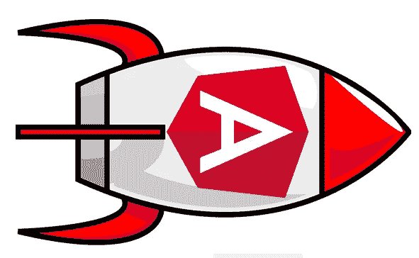
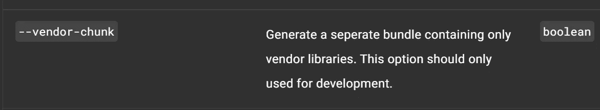
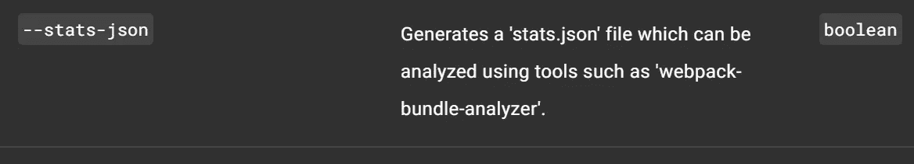

# 改善角初始加载时间

> 原文：<https://levelup.gitconnected.com/improving-angular-initial-load-time-fba8b1289c48>

如果你碰巧在一个大角度的应用上工作，你可能会遇到应用初始加载时间的问题。

如果你使用性能指标，比如新的 [Performance Insights Chrome 开发工具](https://www.youtube.com/watch?v=5PFmGeCZDvw&ab_channel=GoogleChromeDevelopers) ( *这是一个非常好的工具，可以探索你的网络请求、布局变化、渲染、TTI(互动时间)、FCP(第一次内容丰富的绘画)等。，并从谷歌获得关于如何修复您的一些主要问题的见解*)，或者[谷歌灯塔扩展](https://chrome.google.com/webstore/detail/lighthouse/blipmdconlkpinefehnmjammfjpmpbjk?hl=ro)，您可能会发现您的 TTI 可能会很慢。这对用户来说是不好的，因为如果你没有一个快速加载的应用程序，很多消费者就会失去兴趣。

针对这些问题有很多解决方案，其中大多数甚至与前端应用程序无关。本文仅针对前端工程师/开发人员的特定性能改进技巧。

# 1.懒装是你的朋友

如果您正在处理一个大型代码库，那么您可能有很多模块，并且您的主包可能非常大。这通常会降低脚本的执行速度，因此您会得到一个较慢的交互式页面。

angular 中解决这个问题最简单的方法是延迟加载你的大部分(或全部)路径。这样，当用户加载页面时，提供给他的块只包含路径所需的内容，而不包含现在不需要的模块(多亏了 ngular Ivy，angular 完成的树摇动非常好，它消除了 angular 中没有使用的内容，您的工作就是消除初始加载时应用程序中没有使用的内容)。

您可以编写一个定制的[预加载策略](https://angular.io/api/router/PreloadingStrategy)来开始在后台获取其余的模块(如果您使用遥测技术并且知道哪些是最常访问的模块，则为*或常用模块)，因此当用户离开当前页面时，它们已经被加载。*

# 2.分割供应商区块

在官方文件中，angular 团队并不建议在生产中这样做。

[来自 angular 的官方文件](https://angular.io/cli/build)

但是请听我说:如果你有一个甚至服务于你的块的 CDN(你有一个将你的构建发布到 CDN 的很好的部署管道)，在两个单独的部署之间，通常第三方库不会改变，所以它仍然可以从缓存中被服务，这稍微快一点。您的主包将只包含您的应用程序逻辑，因此它会更小。

这可能不适合你，[这里](https://stackoverflow.com/questions/52179853/angular-should-i-use-the-vendorchunk-in-production)是我在 stackoverflow 上发现的关于这个主题的一个很好的讨论。

# 3.APP_INITIALIZER 不应该很重

如果你使用 [APP_INITIALIZER](https://angular.io/api/core/APP_INITIALIZER) ，你就会知道 angular 会在应用程序引导阶段等待这个提供者中的所有东西都完成。

这可能会诱使您提出许多异步请求，这些请求可能相互依赖，但对于应用程序的完整全局状态却是必需的。您应该避免这种情况，因为它会延迟角度，并且用户的交互时间会变慢。

如果您的应用程序已经在使用这个注入令牌，并且很难重构，那么您可能希望使用缓存机制。如果缓存中没有任何内容，您可能希望发出请求，但是如果有，则从那里开始服务，并在后台启动一个新的请求来更新缓存，而不会阻塞 angular。也许这比重构更容易，这取决于你的用例。唯一的问题是，如果您用这些数据初始化应用程序状态，那么在后台请求发出后，您可能也想修补它。

# 4.启动 API 请求并行化/缓存

一个好的性能监控解决方案是在最初加载页面时检查 network 选项卡。检查 API 请求。也许你有一个请求在另一个请求之后被触发，等等。检查是否有任何东西可以并行化，以便获得更短的瀑布时间(如果请求阻塞了内容)。

您可能想要将资产服务委托给[服务人员](https://angular.io/guide/service-worker-config)。此外，也许你有不经常改变的大的请求。您可能希望配置一个服务工作者来缓存这些内容([本文](https://medium.com/swlh/caching-http-requests-in-angular-using-service-workers-c9d004298cd1)可能会帮助您开始)。

# 5.分析您的 webpack 包

有一个很好的 npm 包， [webpack-bundle-analyzer](https://www.npmjs.com/package/webpack-bundle-analyzer) 。如果您使用 stats-json 选项在生产模式下构建 angular 应用程序，那么您可以通过将 stats.json 文件的位置传递给它来使用它。

[来自 angular 的官方文件](https://angular.io/cli/build)

运行该命令后，将打开一个浏览器选项卡，显示您的 webpack 包。你可以分析有多少在 main.js 中，有多少在 vendor.js 中(如果你拆分 vendor 块)，有多少是延迟加载的。通过这种方式，您可以检查减少包大小的进度。您还可以确定块中哪些代码块较大，并决定按需导入这些代码(这样它们就不会在主块中)。

# 6.使用遥测技术获得实际产品性能

在您的本地机器上，lighthouse 或 performance insights 可能会给您带来意想不到的结果。消费者在生产中的实际结果可能与您看到的真的不同(这有很多原因，如互联网速度、机器性能差异等)。

这就是为什么您可能希望在应用中添加性能遥测。一个很好的遥测解决方案是 [Azure Application Insights](https://docs.microsoft.com/en-us/azure/azure-monitor/app/data-model) 。[这里的](https://devblogs.microsoft.com/premier-developer/angular-how-to-add-application-insights-to-an-angular-spa/)是一篇将它与你的角度应用整合的好文章。

配置就绪后，您现在可以在 app insights 中跟踪事件。剩下唯一要做的事情就是记录你的表现。为此，您可以使用[性能 api](https://developer.mozilla.org/en-US/docs/Web/API/Performance) 。也许 [PerformancePaintTiming](https://developer.mozilla.org/en-US/docs/Web/API/PerformancePaintTiming) 就足够满足你的需求了。*我将撰写一篇文章，提供一个具体的例子，说明如何在一个简单的 angular 应用程序中跟踪性能，并查询应用程序洞察力以查看实际指标(并将其链接到本文)。同时，* [*这篇*](https://devblogs.microsoft.com/premier-developer/angular-how-to-page-load-times-using-application-insights/) *也是一篇很好的文章，可以帮助你跟踪所有路线的页面加载时间，并告诉你如何查询它们。*

总之，对于您的一些用户来说，性能缓慢的原因有很多。许多问题实际上不是前端开发人员的责任(例如，缓慢的 API 请求，或者糟糕的服务器配置，糟糕的可伸缩性，等等)。)，但是在大型企业应用程序中，可以对前端应用程序进行许多改进，以确保良好的加载时间。

如果您对任何步骤有任何建议或修正，请告诉我。我认为互相学习很重要。

感谢您阅读我的文章。如果你喜欢，请点击下面的按钮，让其他人也能看到。