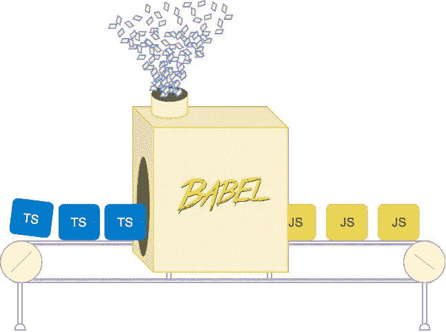
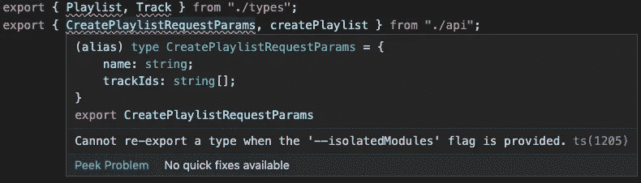

# 纯类型导入——一个新的 TypeScript 特性，对 Babel 用户有益

> 原文：<https://levelup.gitconnected.com/improving-babel-support-for-typescript-with-type-only-imports-28cb209d9460>



巴别塔技术架构图

您已经决定使用 Babel 并用 TypeScript 编写您的源代码。但是当你跨模块边界共享 TS 类型时会发生什么呢？巴别塔应该如何处理那些进出口？

让我们简单介绍一下 Babel 和 TypeScript 是如何协同工作的。

TypeScript 做两件事:

1.  将静态类型检查添加到传统上作为 JavaScript 编写的代码中。
2.  将 TS+JS 代码转换成各种 JS 风格。

巴别塔*也*做第二件事。Babel 的方法(特别是 [transform-typescript](https://babeljs.io/docs/en/babel-plugin-transform-typescript) 插件)是简单地删除类型，然后转换文件。这允许你使用 Babel 的所有好处，同时仍然能够喂它`ts`文件。

Babel 将移除([省略](https://www.merriam-webster.com/dictionary/elide))任何仅用作类型的`import`声明。

*来源:*

```
*// example.ts*import { Color } from "./types";
const changeColor = (color: Color) => {
  window.color = color;
};
```

*通天塔传送输出:*

```
*// example.js*const changeColor = (color) => {
  window.color = color;
};
```

如果有把握，Babel 可以删除该声明，只分析这个单独的文件。当 Babel 不可能知道某个特定的导入是应该删除的类型还是应该保留的实际值时，问题就出现了。利用再出口时会发生这种情况。

```
*// example.ts*import { Color } from "./types";
export { Color };
```

在这里，巴别塔不能通过查看`example.ts`来判断`Color`实际上是一个类型。Babel 将被迫在 transpiled 输出中错误地留下这个声明。

为什么会这样？嗯，Babel 在传输过程中一次显式处理一个文件。据推测，babel 团队不希望像 TypeScript 那样构建相同的类型解析过程，这样就可以删除那些类型。

# 输入，隔离模块

`isolatedModules`是一个 TypeScript 编译器选项，旨在作为一种保护措施。当`isolatedModules`编译器标志打开时，由`tsc`提供的类型检查将报告类型错误，如果不解决，将影响孤立处理文件的编译工具(babel)。

从[打字稿文件](https://www.typescriptlang.org/docs/handbook/compiler-options.html):

> 执行额外的检查以确保单独编译(比如用`[*transpileModule*](https://github.com/Microsoft/TypeScript/wiki/Using-the-Compiler-API#a-simple-transform-function)`或[@ babel/plugin-transform-typescript](https://babeljs.io/docs/en/babel-plugin-transform-typescript))是安全的。

来自[巴别塔文件](https://babeljs.io/docs/en/babel-plugin-transform-typescript#typescript-compiler-options):

> `*--isolatedModules*`这是默认的 Babel 行为，不能关闭，因为 Babel 不支持跨文件分析。

换句话说，**每个 ts 文件必须能够独立传输**。`isolatedModules`旗帜阻止我们包括含糊解决的进口。

# 隔离模块示例

看看 babel transpiles 代码展示了`isolatedModules`标志的重要性的几个例子。

这两个例子都围绕着音乐流 api 客户端的构建。

## 示例 1 —不明确的再出口

在这里，我们获取在`types.ts`文件中定义的类型，然后从`lib-ambiguous-re-export.ts`重新导出它们。当 isolatedModules 打开时，此代码**不会** **通过**类型检查。

*来源:*

```
*// src/types.ts*
export type Playlist = {
  id: string;
  name: string;
  trackIds: string[];
};export type Track = {
  id: string;
  name: string;
  artist: string;
  duration: number;
};*// src/lib-**ambiguous**-re-export.ts*
export { Playlist, Track } from "./types";
export { CreatePlaylistRequestParams, createPlaylist } from "./api";
```

*巴别塔传送输出:*

```
*// dist/types.js*
--empty--*// dist/lib-**ambiguous**-re-export.js*
export { Playlist, Track } from "./types";
export { CreatePlaylistRequestParams, createPlaylist } from "./api";
```

*来源错误:*



*几点感悟:*

*   Babel 删除了我们的`types`模块中的所有内容，因为它只包含了在 JS-land 中没有用的类型。
*   Babel 没有对我们的`lib`模块进行改造。*那就不好了*。`Playlist`和`Track`T33 应该已经被巴别塔去掉了。通过 node 运行这段代码是行不通的。当遇到`lib-ambiguous-re-export.js`中的重新导出行时，节点的模块解析过程将看到，没有任何内容从`types.js`中导出，并且该过程将终止。
*   如 VSCode 的截图所示，`tsc`类型检查过程会立即将这些不明确的重新导出报告为错误。

## 示例 2 —显式导入，显式类型导出

这一次，我们在`lib-import-export.ts`中明确了类型的再导出。当 isolatedModules 打开时，该代码**将** **通过**类型检查。

*来源:*

```
*// src/types.ts*Same as first example*// src/lib-import-export.ts*import {
  Playlist as PlaylistType,
  Track as TrackType,
} from "./types";
import {
  CreatePlaylistRequestParams as CreatePlaylistRequestParamsType,
  createPlaylist
} from "./api";export type Playlist = PlaylistType;
export type Track = TrackType;export type CreatePlaylistRequestParams = CreatePlaylistRequestParamsType;
export { createPlaylist };
```

*通天塔传送输出:*

```
*// dist/types.js*
--empty-- TODO or does babel remove it all together?*// dist/lib-import-export.js*
import { createPlaylist } from "./api";
export { createPlaylist };
```

*一对夫妇的见解:*

*   Babel 仍然输出一个空的`types.js`文件。但是没关系，因为我们的 transpiled `lib-import-export.js`不再引用它了。
*   `lib-import-export.js`现在只导出 JS 函数，`createPlaylist`。这些类型不存在。这是因为我们在源代码中做了额外的工作，通过导入我们的类型，然后显式地重新导出这些类型。
*   `tsc`对此感到满意，因此您不会看到它像我们在第一个示例中看到的那样报告错误。

可以看出用 Babel 处理 TypeScript 文件时`isolatedModules`的重要性。第一个例子更简单、更简洁。但是它违反了隔离模块。到目前为止，为了符合这一要求，必须使用类似冗长的第二个例子。

# 由 TypeScript 3.8 解决

TypeScript 3.8 引入了新的语法，当使用时，增加了类型解析过程的确定性。现在，编译器(无论是`tsc`、`babel`还是其他什么)将能够查看单个文件，如果它是类型脚本类型，就可以省略导入或导出。

实现这一点的新语法没有引入任何新的关键字，但是允许在两个新位置使用`type`。

`import type ... from` —让编译器知道您导入的肯定是一种类型，并且在构建的输出中不需要(或不想要)。

`export type ... from` —相同，但用于再出口。

由于我们上面有两个例子强调了对更好的东西的需求，下面是我们如何重构代码以用于 TS 3.8。

*来源:*

```
*// src/lib-type-re-export.ts* **export type** { Track, Playlist } **from** "./types";
**export type** { CreatePlaylistRequestParams } **from** "./api";
export { createPlaylist } from "./api";
```

*巴别塔传送输出:*

```
*// dist/lib-type-re-export.js*
export { createPlaylist } from "./api";
```

*又多了两个感悟:*

*   源代码看起来很像独立的模块示例 1，但是在再导出中消除了歧义。
*   好了，这实际上不是 babel transpiled 的输出，因为 babel 还不能处理新的 TS 3.8 类型的导入和导出。但是当巴别塔 7.9 发布的时候，这就是它*应该*的样子。

仅此而已。只有类型的导入/导出是我从[流](https://flow.org/)中错过的为数不多的语言特性之一。看到 TypeScript 的不断发展是很有希望的。

## 有关纯类型导入/导出的更多信息的相关资源:

*   新增 TS 文档部分:[https://www . typescriptlang . org/docs/handbook/modules . html # importing-types](https://www.typescriptlang.org/docs/handbook/modules.html#importing-types)
*   引入类型导入。公关描述中有很多很棒的信息:【https://github.com/microsoft/TypeScript/pull/35200 
*   TS 3.8 公告:[https://dev blogs . Microsoft . com/typescript/announcing-typescript-3-8-beta/# type-only-imports-exports](https://devblogs.microsoft.com/typescript/announcing-typescript-3-8-beta/#type-only-imports-exports)
*   Babel PR 增强了 Babel 解析器和 transform-typescript 插件，以利用新的语法。将与巴别塔 7.9 一同发布:[https://github.com/babel/babel/pull/11171](https://github.com/babel/babel/pull/11171)