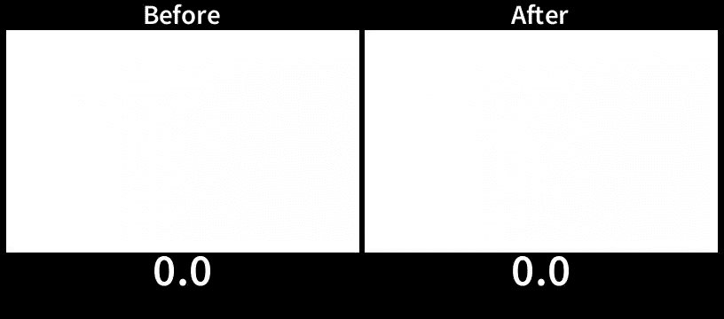
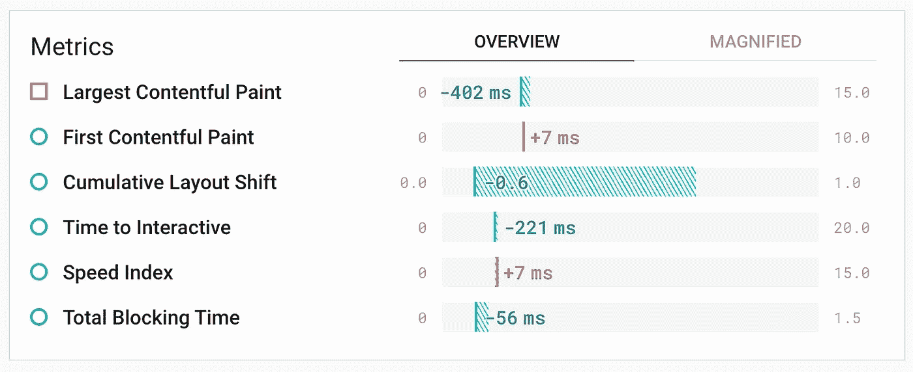
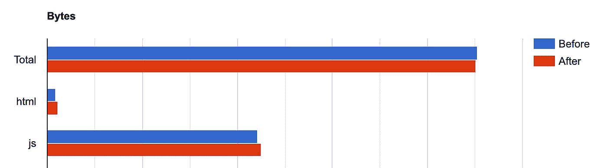
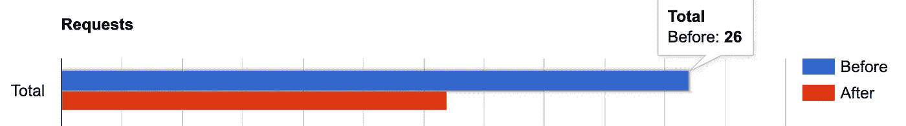

# 我如何使用预部署脚本消除网站布局偏移

> 原文：<https://levelup.gitconnected.com/improving-cumulative-layout-shift-on-pre-deploy-stage-1636fb1386cc>

三年多前，当我开始我的网络开发者之旅时，我创建了我的网站。最近，我检查了存储库，做了一些改进。看到我在那里犯了那么多错误，真是令人震惊。[累积布局偏移](https://web.dev/cls/) (CLS)是我遇到的最大的 UX 问题之一，也就是说，从 CMS 获取的内容导致了页面上的意外移动。

我敢肯定，每个人都有一个恼人的经验，突然改变页面，而它是加载。例如，当你开始读一篇文章，第二篇文章就消失了。或者当你正要点击一个按钮，却无意中点击了刚刚出现的广告。我的网站也有同样的问题！


[网页测试](https://www.webpagetest.org/video/)捕获的页面加载视频

不过我还是设法解决了:)

## 加载占位符

一开始我有多种解决方案。第一个是添加内容加载占位符，以显示内容即将到来。尽管这种方法会提高 CLS，但是如果呈现的内容条目的形状与占位符不同，它仍然会导致偏移。此外，内容加载速度没有提高。此外，通过添加占位符，我会装载额外的 JavaScript 来降低页面速度。

## 服务工作者缓存

其次，我尝试使用服务工作者来缓存内容条目[。这种方法可以提高页面访问者返回的速度和 UX。不幸的是，它不会影响首次页面加载。老实说，我并不指望我的页面会有很多回头客，因为它的内容不会定期变化。因此，我需要专注于提高初始页面加载。](https://developers.google.com/web/ilt/pwa/caching-files-with-service-worker)

## 构建前提取数据

在接下来的头脑风暴中，我开始质疑使用 CMS 的必要性。或者，我可以管理项目存储库中 JSON 文件的内容。然而，我更喜欢在 CMS 中编辑内容，因为它有方便的用户界面和图像的自动优化。我想到了在构建之前获取内容的想法。在这种情况下，数据将成为构建的一部分，并从网站服务器而不是 CMS 提供服务。为此，我创建了一个节点脚本来获取数据并将其写入 JSON 文件。

```
// fetchContent.jsonconst fetchPosts = async () => {
  const response = await client
    .getEntries({
      content_type: "card",
    }); writeData(response, "./src/data/posts.json");
};
```

*注:*`*client*`*`*getEntries*`*由*[*Contentful CMS JavaScript SDK*](https://contentful.github.io/contentful.js/contentful/8.1.7/)*提供。* 在 React 组件中，我用从文件导入的数据替换了对 CMS 的请求。*

```
*import posts from "../data/posts.json";*
```

*数据获取脚本被添加到`npm run predeploy`命令中。*

```
*// package.json"scripts": {
    "predeploy": "node fetchContent.js && npm run build",
}*
```

*我使用 [Netlify](https://www.netlify.com/products/build/) 作为托管和连续交付(CD)服务，在这里我可以配置一个构建命令。通过将默认的`npm run build`改为`npm run predeploy`，我已经将“获取内容”脚本添加到了 CD 管道中，每当我合并到主分支时，就会自动触发这个脚本。*

*这种方法帮助我将累积布局偏移减少到几乎为零！你可以用肉眼看出区别:*

**

*我在我的网站项目中配置的 [Lighthouse CI](https://github.com/GoogleChrome/lighthouse-ci/blob/master/docs/getting-started.md#github-status-checks) 支持 web 性能回归测试。基于与之前站点版本的比较，预部署脚本的更改带来了一系列积极的“副作用”，即[最大内容绘制](https://web.dev/lcp/)、[交互时间](https://web.dev/tti/)、[总阻塞时间](https://web.dev/tbt/)略有减少。令人惊讶的是，[第一个内容丰富的油漆](https://web.dev/fcp/)和整体[速度指数](https://web.dev/speed-index/)有所增加。*

**

*由 [Lighthouse CI 服务器](https://github.com/GoogleChrome/lighthouse-ci/blob/master/docs/getting-started.md#the-lighthouse-ci-server)生成的性能指标差异*

*在 [WebPageTest](https://www.webpagetest.org/) 上进行的更详细的手动测试显示，我的网站服务器响应时间([到第一个字节的时间](https://web.dev/time-to-first-byte/))比以前更长，因为它将内容数据包括到响应中。您可以在下面的图表中看到，随着包含内容的 JSON 文件被导入并与 React 组件捆绑在一起，JavaScript 的大小变大了。这是第一次内容丰富的油漆增加的原因之一。*

**

*一个更积极的成果是请求数量从 26 个下降到 16 个。*

**

## *CMS 触发的部署*

*由于请求被转移到“预部署”脚本，每次 CMS 中的内容发生变化时，都需要重新构建网站。为了避免任何手动步骤，可以使用 webhooks 自动触发 CD 管道。*

*我使用的内容丰富的 CMS 提供了这样一个[功能](https://www.contentful.com/developers/docs/tutorials/general/automate-site-builds-with-webhooks/)。设置分两步完成:在 Netlify 设置中生成 webhook URL，并将此 URL 添加到 Contentful webhook 设置中。每当发布新内容时，这样的事件会自动触发构建并部署网站的新版本。*

# *下一步是什么？*

*虽然我已经修复了累积布局偏移，但是我还有很多需要改进的地方。例如，最大的内容丰富的绘画是大约 3 秒，这对于像我这样的小页面来说是一个巨大的数字。*

*我的网站内容不会动态变化。从用户的角度来看，它是一个静态页面。尽管如此，它是在客户端呈现的，服务于大量未使用的 JavaScript，增加了服务器响应时间，并且需要比它应该的更多的 CPU。页面加载时间和 UX 将受益于在部署到服务器之前作为静态 HTML 页面生成。结果，客户端将收到准备好的 HTML 和 CSS，而不是处理 ReactJS 代码。*

*在构建项目之前获取数据是我生成静态站点的第一步。我会让你知道接下来的步骤🤙🏻*