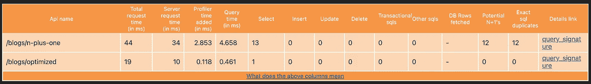
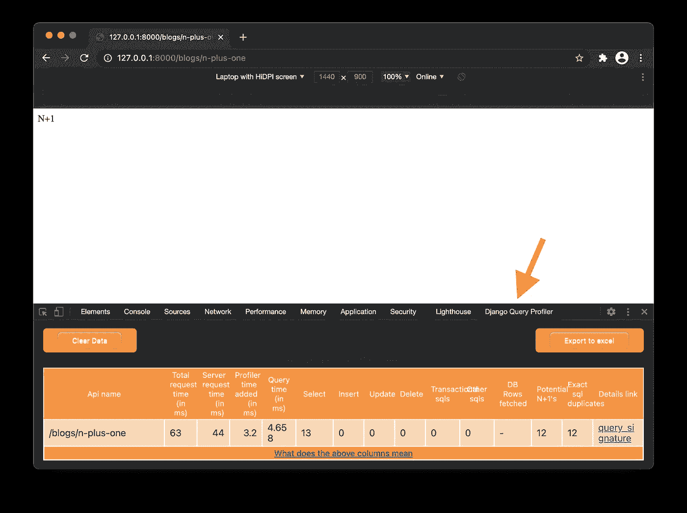
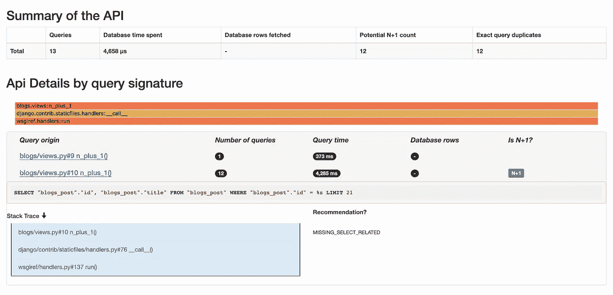

# 使用 Django 查询分析器改进 Django 查询

> 原文：<https://levelup.gitconnected.com/improving-django-queries-using-django-query-profiler-41cdedc97da9>


在 [Unsplash](https://unsplash.com?utm_source=medium&utm_medium=referral) 上由 [Fabrizio Verrecchia](https://unsplash.com/@fabrizioverrecchia?utm_source=medium&utm_medium=referral) 拍摄的照片

当你不知道*哪个*查询慢，以及*为什么*慢时，盲目地尝试优化查询是一种挫折。有一个非常流行的工具 [Django 调试工具栏](https://django-debug-toolbar.readthedocs.io/en/latest/)，但是这篇文章是关于一个更简单、更集中的工具，叫做 [Django 查询分析器](https://django-query-profiler.readthedocs.io/en/latest/index.html)。Django Query Profiler 是一个较新的工具，但它是一个很好的轻量级工具，可以深入查询，提供计时信息，突出潜在的 N+1 问题，查找重复的 SQL 查询，并提出修复建议。作为 Django 查询分析器项目的一名贡献者，我可以证明它的设置和实用性。

# 什么是 Django 查询分析器

Django 查询分析器的文档简介:

> Django 查询分析器是 Django 应用程序的分析器，用于帮助开发人员回答问题“我的 Django 代码或页面或 API 很慢，我如何找出原因？”
> 
> 以下是探查器的一些功能:
> 
> 显示进行 N+1 次 sql 调用的代码路径:显示进行 N+1 次调用的带有 stack_trace 的 sql，以及 sql 计数
> 
> 显示了建议的解决方案:如果减少 sql 的解决方案是简单地应用 select_related 或 prefetch_related，这将作为建议突出显示
> 
> 显示完全相同的 sql 重复项:其中(sql，parameters)完全相同的查询数。这是一种实现查询缓存会有所帮助的 sql
> 
> 火焰图可视化:将所有堆栈跟踪收集在一起，以便快速识别哪个(些)代码区域产生了负载

# N+1 问题

*如果您已经熟悉了 N+1 问题，可以跳到下一节来安装和配置 Django Query Profiler。*

## 背景

Django 查询分析器的一个关键特性是它能够识别遭受可怕的 N+1 问题的查询。对于外行来说，N+1 问题是低效查询的最常见来源之一— *它是查询设计的反模式*。它出现在一对多查询中，您首先需要发出一个初始请求(这是“1”部分)，然后根据初始请求的结果进行迭代以获得所需的底层数据(这是“N”部分)。更恰当的名称应该是“1+N ”,这样查询的顺序才是正确的。换句话说，当前一个查询中的每个结果导致第二个查询执行任意次时，就会出现 N+1 问题。

## 例子

这个例子是人为的，但是它仍然演示了问题，如何识别它，以及如何补救它。

为了跟进这个例子，[从我的回购协议中访问我的所有中型博客例子的完整代码](https://github.com/dbudwin/MediumBlogExamples/tree/master/DjangoQueryProfilerExample)。

假设我们有一个数据库，用博文和对博文的评论来模拟一个普通的博客。假设我们有一个评论，我们想打印数据库中所有评论的博客文章的标题。第 N+1 种方法是首先获取所有评论，然后获取所有博客文章标题*到*评论的`post` `QuerySet`对象。

```
comments = Comment.objects.all()

for comment in comments:
    print(comment.post.title)
```

上述姜戈`QuerySet`本质上可以归结为:

```
SELECT * FROM commentsSELECT * FROM posts WHERE post_id=<post ID>
```

在上面的查询中，我们首先得到所有的评论(这是“1”)。在第二个查询中，我们现在得到了每个评论所属的所有相应的帖子(这是“N”)。因为 Django 的`QuerySet`对象是延迟评估的，所以很容易用原始 SQL 创建`QuerySet`对象，如上例所示。幸运的是，这个例子中的修复很容易，只需修改上面的`QuerySet`以包含`select_related`:

```
comments = Comment.objects.all().select_related("post")

for comment in comments:
    print(comment.post.title)
```

重构上面的查询通过添加一个`INNER JOIN`来修改原始 SQL，与下面的查询没有太大的不同:

```
SELECT * FROM comments INNER JOIN posts ON comments.post_id = post.id
```

因此，我们不是进行 N+1 次查询，而是进行 1 次“更大”的查询。在许多情况下，这是期望的、更有效的行为。涵盖 N+1 问题的文献并不缺乏，所以我不想在这里深入探讨，我只想强调一个常见的场景，并在 Django 的上下文中演示其修复方法。

## 这在 Django 查询分析器中是什么样子

使用 Django Query Profiler 并在增强前后检查这些查询，将会在 Django Query Profiler 的 Chrome 扩展中呈现如下结果。



Django 查询分析器 Chrome 扩展的结果

我们可以看到有两个请求。第一个是 N+1 版本，第二个是优化版本。“总请求时间”列从 44 毫秒提高到 19 毫秒。在更大更复杂的数据集中，我看到这从一分钟提高到不到一秒钟！我还仔细查看了右边的一列“潜在的 N+1”，在第一个请求中我们可以看到有 12 个(每个评论一个)，而在第二个请求中有 0 个！理想情况下，目标应该始终是该列中的值为 0。同样值得注意的是“选择”列。我们前面提到的例子只是从数据库中提取数据。在我们查询的 N+1 版本中，我们进行了 13 次`SELECT`调用，1 次获取所有评论，然后再进行 12 次获取每篇文章的全部或标题，总共 13 次`SELECT`调用，哎呀！同样，在我们的优化版本中——通过`INNER JOIN`的力量——我们只有 1 个`SELECT`调用来收集我们在单个查询中需要的所有相关数据。这就是我们在使用 Django Query Profiler 识别和优化低效查询时所寻找的结果。

# 安装和配置

这些安装说明将假设使用相应的 Chrome 扩展，而不是支持的命令行用法。

## 安装

使用您选择的 Python 包管理器，安装`django-query-profiler`。举几个例子:

## 使用画中画

```
pip install django-query-profiler
```

## 使用诗歌

```
poetry add django-query-profiler
```

## 配置`INSTALLED_APPS`

首先，在将`django_query_profiler`添加到`INSTALLED_APPS`的元组之前，一定要将`from django_query_profiler.settings import *`导入添加到`settings.py`。

```
INSTALLED_APPS = (
    ...
    "django_query_profiler",
    ...
)
```

## 配置中间件

在元组中尽可能高的位置添加中间件。文档声明所有的请求和中间件都会被分析。Django 应用程序中 middleare 的顺序很重要，所以如果有什么地方不正常，可能有必要调整顺序。

```
MIDDLEWARE = (
    ...
    "django_query_profiler.client.middleware.QueryProfilerMiddleware",
    ...
)
```

## 配置数据库

根据您的应用程序正在使用的数据库类型，修改数据库`ENGINE`设置以使用以下之一。Django Query Profiler 支持 SQLite3、MySQL/MariaDB、Postgres 和 Oracle。

**对于 SQLite3**

注意，由于 SQLite3 的工作方式，它不提供作为`SELECT`查询的一部分返回的行数，所以当在 Chrome 中查看结果时，它将只显示一个破折号。

```
DATABASES = (
    ...
    "ENGINE": "django_query_profiler.django.db.backends.sqlite3",
)
```

**对于 MySQL/MariaDB**

```
DATABASES = (
    ...
    "ENGINE": "django_query_profiler.django.db.backends.mysql",
)
```

**对于 Postgres**

```
DATABASES = (
    ...
    "ENGINE": "django_query_profiler.django.db.backends.postgresql_psycopg2",
)
```

**对于甲骨文**

```
DATABASES = (
    ...
    "ENGINE": "django_query_profiler.django.db.backends.oracle",
)
```

## 配置 URL

配置根`urls.py`文件。

```
from django.urls import include, pathurlpatterns = [
    ...
    path("django_query_profiler/", include("django_query_profiler.client.urls"))
    ...
]
```

## 安装镀铬延伸件

此时只有 Chrome 扩展。从 Chrome 网上商店安装[Chrome 扩展](https://chrome.google.com/webstore/detail/django-query-profiler/ejdgfhecpkhdnpdmdheacfmknaegicff)。打开开发者工具，应该会有一个 Django 查询分析器的新标签。



在 Chrome 的开发者工具窗格中哪里可以找到 Django Query Profiler 标签

## 启动 Redis

这一步是可选的，在当前文档或其他在线资源中没有提到。如果您想要访问细节并释放 Django 查询分析器(**强烈推荐**)的全部能力，您需要运行 [Redis](https://redis.io/) 。使用 [Docker](https://www.docker.com/) ，这是一个单行命令，无需进一步配置。

```
docker run -p 6379:6379 -d redis
```

## 奔跑

现在——在 Chrome 中——启动你的 Django 应用并浏览网站。在开发人员工具窗格中查看 Django Query Profiler 选项卡应该会随着查询的发生而开始填充。如果您运行 Redis，请单击右侧的“query_signature”链接，深入了解您的查询的性能。如果 Redis 没有运行，此链接将不可用，它将改为显示“redis_or_urls.py_not_setup”。



使用前面提到的 N+1 示例运行 Redis 时，查询的细节是什么样的

如您所见，我们获得了关于查询的更多细节。我们可以看到被执行的原始查询，我们可以看到它被标记为“N+1”，我们可以看到建议的修复方法是添加一个对我们的`QuerySet`的`.select_related()`调用，正如上面通过一个例子演示的那样。

如果您在一个查询中看到`%s`，您可以确定它是 N+1 查询的一部分。

# 结束语

我希望这篇文章对你有用。你学到新东西了吗？我忘记了什么重要的事情吗？我很想听听使用 Django Query Profiler 如何帮助解决一个性能很差的查询。请在评论中告诉我。

编码快乐！🧑🏻‍💻

[GitHub](https://bit.ly/dbudwin-github)|[LinkedIn](https://bit.ly/dbudwin-linkedin)|[Medium](https://bit.ly/dbudwin-medium)|[budw . in](https://bit.ly/budw_dot_in)