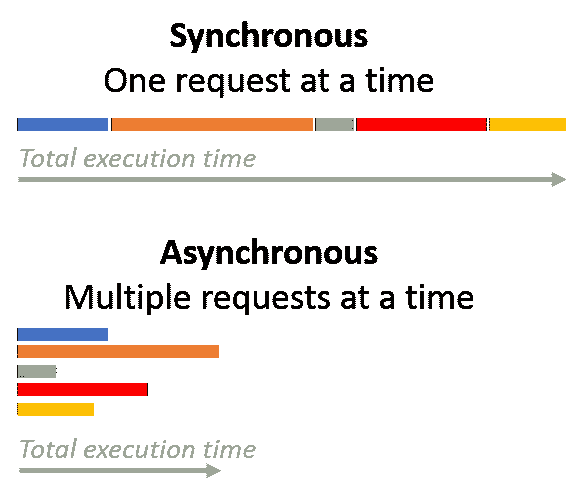
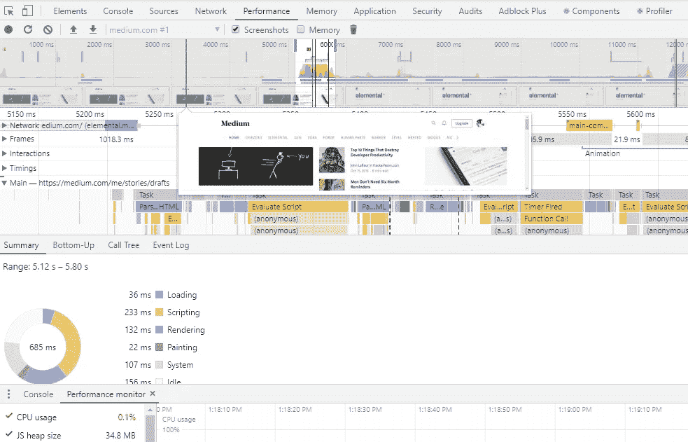
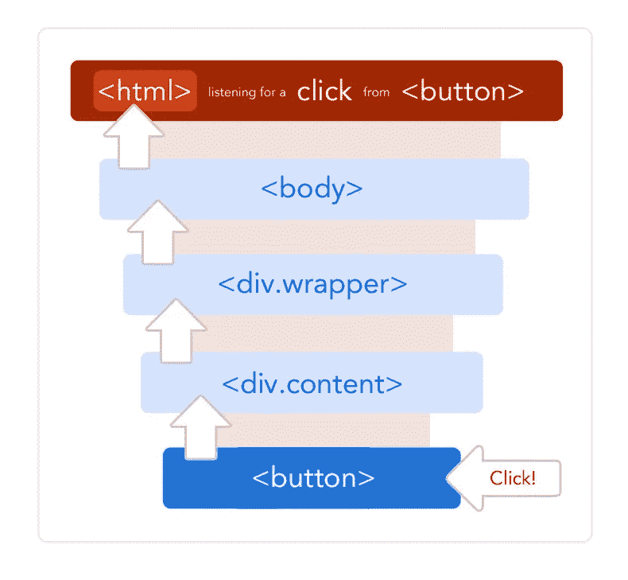
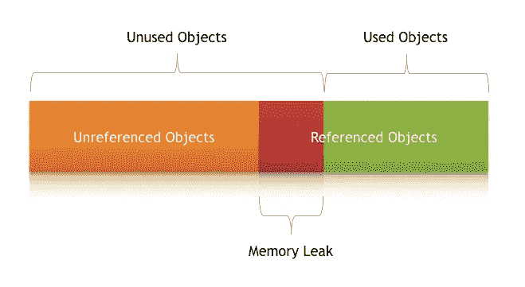

# 提高 JavaScript 性能

> 原文：<https://levelup.gitconnected.com/improving-javascript-performance-f34ef3ed903b>

JavaScript 已经成为领先的脚本语言之一。JavaScript 无处不在——在客户端和服务器端。它也是 GitHub 上最流行的语言之一。

# 循环—如果不需要，请避免使用它们

JavaScript 中的循环被认为不是一件好事，因为它会给浏览器带来额外的压力。循环中的代码量应该尽可能少。我们在循环中做的工作越少，循环就越快。此外，我们还可以采用一些简单的技巧，比如，我们可以将数组的长度存储在不同的变量中，而不是在循环的每次迭代中读取长度。这对于优化我们的代码和以更有效的方式运行有很大的帮助。

# 最小化 DOM 访问，以获得响应更快的页面

任何发生在 JavaScript 本地环境之外的交互都会导致显著的性能延迟和不可预测性。例如，如果主机浏览器在环境之外与 DOM 对象进行多次交互，这将降低我们的性能，因为浏览器每次都必须刷新。为了避免这种情况，我们应该尽量减少 DOM 访问。有几种方法可以实现这一点。例如，我们可以存储对浏览器对象的引用，或者减少 DOM 遍历的总次数。

# 异步编程

在任何应用程序中，我们都需要对多个 API 进行几次内部调用来获取数据。做到这一点的一种方法是为每种功能配备单独的中间件。然而，JavaScript 是单线程的，有许多同步组件。这些组件具有冻结应用程序的能力。

JavaScript 的 async.js 特性在这种情况下非常方便。它有助于高效管理异步代码。这导致异步代码被推送到事件队列，在那里它在所有其他代码执行之后触发。然而，即使有 JavaScript 的异步特性，仍然有可能使用外部库，这可能会无意中导致同步阻塞调用。这可能会对应用程序的整体性能产生负面影响。

因此，为了以最好的方式解决这些问题，我们应该总是在代码中使用异步 API。然而，我们也需要记住异步编程的复杂性，因为它对于新生来说是一个挑战。

# 问题检测

Lighthouse 是一款广泛用于网页的工具。它有助于可访问性、审计性能、SEO 和其他最佳实践。类似地， [Google PageSpeed](https://developers.google.com/speed/pagespeed/insights/) 旨在帮助 JavaScript 开发人员了解网站的改进和性能优化领域。

在 Chrome 的主菜单中，有一个“更多工具”选项，显示每个标签的内存和 CPU 使用情况。我们还可以使用 Chrome 或 Firefox 中的 Performance 视图进行更详细的分析。有了它，我们能够分析各种指标，例如:

如果我们想潜得更深，我们可以使用 [**导航定时 API**](/navigation-timing-browser-api-track-and-improve-website-performance-in-javascript-f1dbfb45612) 。它提供了可以用来衡量网站性能的数据。

# 变量的范围

每当我们调用某个函数时，用来定义该函数的变量都存储在里面。变量可以分为两种类型。

*   局部变量:只在自身内部定义的变量。
*   全局变量:在整个脚本中使用的变量。

在函数调用期间，JavaScript 编译器对正在使用的变量进行范围查找。随着作用域链中作用域数量的增加，访问当前作用域之外的变量所需的时间也会增加。

这就是引擎访问全局变量比访问局部变量花费更长时间的原因。这意味着如果我们在本地定义大多数变量，变量搜索所需的时间将会迅速减少。最终，它将提升应用程序的整体性能。

# 事件委托

只有当我们使用事件委托时，使用单个事件处理程序来有效地处理多个事件才是可能的，这最终有助于有效地管理整个页面的一类事件。如果我们不使用事件委托，几个事件处理程序的存在会降低大型 web 应用程序的性能，在最坏的情况下，它可能会停止应用程序。

活动授权附带许多额外福利，例如:

需要管理的功能更少

处理所需的内存更少

DOM 和代码之间的联系越来越少，等等。

# 对象缓存

缓存是将频繁访问的数据临时存储在缓存中的过程，以便您可以在后续请求中重用它。

这就是缓存可以帮助减轻服务器负载的地方。它存储每个请求的副本，然后在下一次相同的请求到达时，它检查缓存并从那里提供服务。如果没有副本，请求会被发送到服务器进行处理和编译，在返回浏览器的途中，会在缓存中存储一个副本。

**我们可以通过两种方式做到这一点。**

> [HTTP 协议缓存](https://developer.mozilla.org/en-US/docs/Web/HTTP/Caching)。
> 
> 或者 JavaScript 缓存 API，可以通过服务人员安装来完成。

通过在对该对象的引用中使用变量，或者简单地将重复访问对象存储在用户定义的变量中，我们可以显著提高性能。

# 限制内存使用

限制内存使用是 JavaScript 开发人员必须掌握的主要技能之一。原因是，当我们的应用程序在设备上运行时，很难确定设备所需的确切内存。

如果应用程序请求为浏览器保留新的内存，那么浏览器的垃圾收集器就会开始工作，并尝试释放一些内存。JavaScript 代码必须等到有内存的时候。如果这种情况持续发生，那么它会降低页面速度。

# JavaScript 延迟加载

很明显，用户希望页面能够快速加载。然而，没有必要在页面初始加载时所有的功能都可用。如果用户执行各种功能，比如单击和更改标签，那么您可以将该功能的加载推迟到初始页面完成加载之后。

这种方法帮助我们避免加载和编译 JavaScript 代码，否则这些代码会保存页面的初始显示。一旦页面被加载，我们就可以开始加载用户以后需要的所有功能，当它开始与应用程序交互时。根据 Google 的 RAIL 模型，我们应该在 50 毫秒内延迟加载。这将避免用户与页面交互的任何影响。

# 对内存泄漏说不

在内存泄漏的情况下，页面将使用越来越多的内存，并最终占用设备中所有可用的内存。这将对整体性能产生不利影响。

有一些工具可以用来分析内存泄漏问题。Chrome Dev Tools 就是这样一个工具，它在 performance 选项卡中记录时间线。通常，从页面中移除的 DOM 片段会导致内存泄漏，因为它们有一些负责引用的变量，这些变量会阻止垃圾收集器清除它们。

# 使用各种优化

为了用最优的数据结构解决所有的任务，我们应该总是使用计算复杂度最低的算法。

*   避免递归。
*   使用搜索数组获取基于另一个数组的值，而不是基于 case 语句或开关的值。
*   为所有重复的函数输入计算、调用和变量
*   重写算法，用更少的计算得到相同的结果。
*   通过利用处理器推测性执行来创建可能为真的条件。