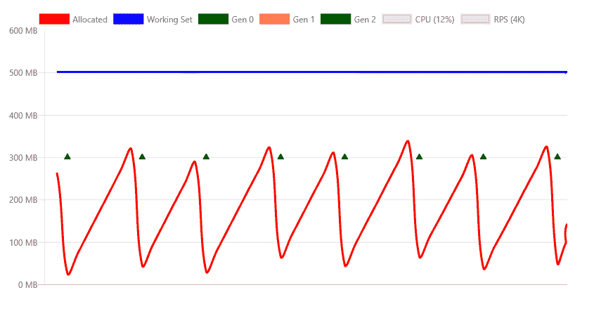
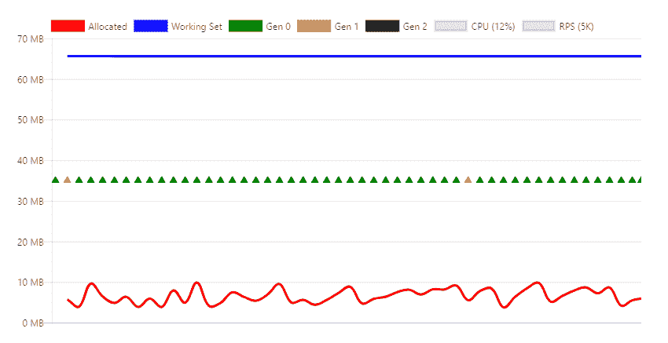

# 提高 AWS Lambda(上的内存使用和稳定性。网)

> 原文：<https://levelup.gitconnected.com/improving-memory-usage-and-stability-on-aws-lambda-net-7c0c47c5b52e>

*这个简单的优化技巧将提高你的内存消耗和稳定性*

由[霍比工业](https://unsplash.com/@hobiindustri?utm_source=medium&utm_medium=referral)在 [Unsplash](https://unsplash.com?utm_source=medium&utm_medium=referral) 上拍摄的照片

我最近意识到了一个意想不到的问题，即在 dotnet core 中的 AWS Lamba 上的无服务器功能的垃圾收集(这可能也适用于其他提供无服务器产品的云提供商)。幸运的是有一个简单的修复方法！

当 Lambda 函数在长时间内经历一致的调用时，问题就出现了。当这种情况发生时，将需要该函数的所有并发实例，并且工作线程将很少被回收。在这种情况下，我们依靠垃圾收集器来移除未使用的资源并释放内存。如果不这样做，worker 最终会耗尽内存并崩溃。

通常开发人员不需要关心垃圾收集器。这就是它们被制造出来的原因:为了简化内存管理。但是，在无服务器函数中运行时，垃圾收集器可能无法正常工作。要解决这个问题，我们需要对 dotnet 中的垃圾收集器有更多的了解。

dotnet 核心中有两种类型的垃圾收集:工作站垃圾收集和服务器垃圾收集。**服务器 GC** 针对服务器使用进行了优化，假设 CPU 使用比内存使用具有更高的优先级。这种类型的垃圾收集允许更高的内存使用率，这在大型服务器上可能没有问题，但对于内存非常稀缺的 Lambda 函数(毕竟我们正在为此付出代价！)这可能并不总是最好的方法。**在很多情况下，当内存有限时，工作站 GC** 可以提高性能，例如对于无服务器功能或资源有限的 docker 容器。

值得注意的是**服务器 GC** 是 ASP.NET 核心应用的默认垃圾收集器。

看看来自微软[的一些示例图表](https://docs.microsoft.com/en-us/aspnet/core/performance/memory?view=aspnetcore-3.1#gc-using-docker-and-small-containers)

服务器垃圾收集—更高的内存消耗和更少的垃圾收集(三角形)

工作站 GC —更低的内存消耗和频繁的垃圾收集

这里的差别是相当大的；服务器垃圾收集在收集之前会消耗高达 300 MB 的内存，而工作站垃圾收集的内存不足 10MB。

幸运的是，这里的修复很容易，只需将以下属性添加到您的。lambda 的 csproj 文件:

和往常一样，您的 lambda 函数的内存消耗可能会随着您的应用程序而变化，但随着时间的推移，这应该会在您的 lambda 函数上产生更稳定的内存消耗。这将减少工人撞车，从而减少冷启动。

附加信息:

 [## ASP.NET 核心中的内存管理和模式

### 内存管理是复杂的，即使是在像. NET 这样的托管框架中。

docs.microsoft.com](https://docs.microsoft.com/en-us/aspnet/core/performance/memory?view=aspnetcore-3.1#gc-using-docker-and-small-containers)  [## Kubernetes 上 ASP.NET 核心的高内存使用率故障排除

### 在工作中，我们在 Google Cloud (GCE-Google…)的 Kubernetes 托管版本上运行几个 ASP.NET 核心 API

blog.markvincze.com](https://blog.markvincze.com/troubleshooting-high-memory-usage-with-asp-net-core-on-kubernetes/)