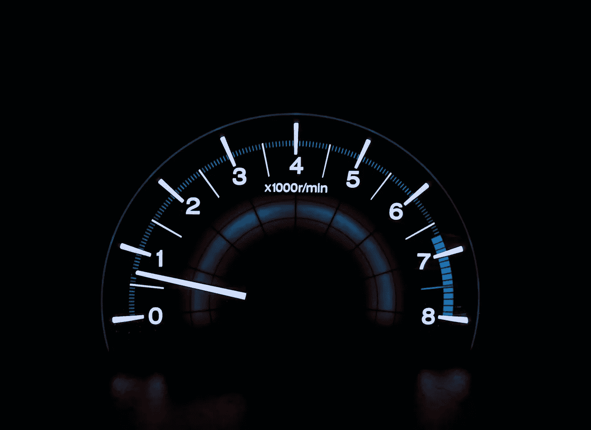
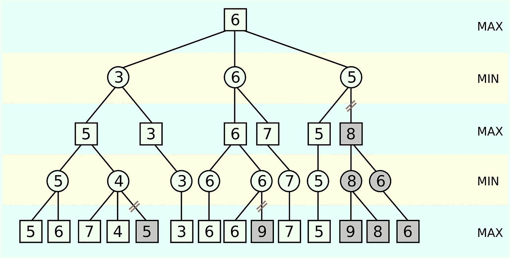

# 提高 Minimax 性能

> 原文：<https://levelup.gitconnected.com/improving-minimax-performance-fc82bc337dfd>



[https://unsplash.com/photos/HUJDz6CJEaM](https://unsplash.com/photos/HUJDz6CJEaM)

[Minimax](https://en.wikipedia.org/wiki/Minimax) 算法，也称为 MinMax，是一种流行的算法，用于计算玩家在零和游戏(如井字游戏或国际象棋)中的最佳可能棋步。它利用开发者提供的评估函数来分析给定的游戏板。在执行过程中，Minimax 会构建一个可能会变得很大的博弈树。这导致算法的运行时间非常长。

在这篇文章中，我将介绍 10 种方法来提高极大极小算法的性能并优化其运行时间。有些影响较大，有些影响较小。将来我会尝试添加新的方法。关于算法是如何工作的，我就不多说了。只是优化一下而已。查看上面的链接，了解算法实际上是如何工作的。

本文中讨论的所有技术的快速概述:

1.  阿尔法-贝塔剪枝
2.  预分类移动
3.  比特板
4.  换位表
5.  棋盘对称性
6.  减少可能的移动
7.  即时获胜
8.  提高。hasPlayerWon()函数
9.  提高。evaluate()函数
10.  降低搜索深度

# 1.阿尔法-贝塔剪枝

最广为人知的改进之一是[阿尔法-贝塔修剪](https://en.wikipedia.org/wiki/Alpha%E2%80%93beta_pruning)，也被称为阿尔法-贝塔切割或阿尔法-贝塔搜索。这个稍加修改的 Minimax 版本可以大幅减少算法的运行时间。这里的关键思想是通过删除来减少游戏树中的节点数量。因此，沿着树传递两个值α和β。这些值代表了每个玩家的最坏情况。



[https://en . Wikipedia . org/wiki/Alpha % E2 % 80% 93 beta _ pruning #/media/File:AB _ pruning . SVG](https://en.wikipedia.org/wiki/Alpha%E2%80%93beta_pruning#/media/File:AB_pruning.svg)

看一下第二排(`3 6 3`)。这里的α值是 6，这是对前两个节点(`3 6`)进行评估后`MAX`将达到的最低分数。在评估第三个节点`MIN`时，请记住`MAX`至少会获得`6`的分数。如果`MIN`找到小于α的值，这里是`5`，则另一个节点`8`可以被切断。原因:无论`MIN`选择什么，`MAX`都会选择α值`6`。而`MIN`会选择一个肯定是< = `5`的值。

更详细的解释请看上面的链接。

# 2.预分类移动

当使用 Alpha-Beta 修剪时，尝试从最好的移动开始对可能的移动列表进行预排序。在这种情况下，有更高的机会在游戏树中切割节点，因为算法在每一关开始时以高 alpha 值或低 beta 值开始。

# 3.比特板

[Bitboards](https://en.wikipedia.org/wiki/Bitboard) 是一种用比特表示游戏棋盘的方式。在这种情况下，每一位代表棋盘上的一个位置。而且，两个玩家都有自己的棋盘。

井字游戏的位棋盘示例:

```
const board = [
    0b000_000_000,  // Player 1 Board (X)
    0b000_000_000   // Player 2 Board (O)
]
```

bitboards 的一个主要优势是它们允许在评估中有很大的灵活性。使用像`AND`、`OR`、`XOR`和 short 这样的按位操作，你可以在很短的时间内检查获胜条件、玩&验证移动或旋转游戏板。它们对于计算用于转置表的电路板散列也很有用。

根据游戏的复杂程度，bitboards 可能会在性能方面产生显著的差异。查看此[链接](https://github.com/denkspuren/BitboardC4/blob/master/BitboardDesign.md)以查看使用 bitboards 的 Connect Four 实现。

# 4.换位表

[转置表](https://en.wikipedia.org/wiki/Transposition_table)用于存储已经分析过的板卡的结果。这可防止算法多次评估同一块电路板，并从存储器(转置表)中读取。

通常，转置表被实现为一个`HashMap`,其中的关键字是散列板。您可以将转置表存储在内存中，并在 Minimax 执行期间构建它，或者将其存储在非易失性内存中，例如文本文件。

转置表可能如下所示:

```
8063104835353205054 2 -8534.0 -1
3522504971336218492 1 1082.0 -1
9207316698546002515 5 2705.0 1
```

每行包含以下信息:

*   董事会杂凑
*   玩过的招式
*   移动的评估分数
*   移动的玩家

在 Minimax 中，你可以在转置表中搜索当前的棋盘散列，并返回相应的条目。

```
function minimax(storage, game) {
    // recursion anchor ...

    const storedMove = storage.get(game.calcBoardHash());
    if(storedMove) return storedMove;

    // evaluation ...
}
```

如果未找到条目，则必须首先评估电路板。在极小极大结束时，您可以在评估的移动返回之前将其推送到换位表:

```
function minimax(storage, game) {
    const bestMove; // evaluation ...
    storage.set(game.calcBoardHash(), bestMove);
    return bestMove;
}
```

# 5.棋盘对称性

关键的想法是，你把一个对称应用到你当前检查的电路板上，并从内存中读取它的对应物，如果存在的话。这极大地减少了董事会评估的次数。对称是非常强大的，尤其是在与比特板结合的时候。

根据你的游戏，你可以利用不同的对称。例如:

*   翻转电路板
*   旋转棋盘(并反转)= >井字游戏，旋转
*   在 x/y 轴上镜像棋盘(并反转)= >连接四个棋子

使用 Bitboards，您可以使用二进制操作轻松旋转和镜像电路板。看看这个 GitHub Gist，看看 Kotlin 中的井字游戏。

## 翻转电路板

井字游戏

```
1)          2)

X . .       O . .
X O O       O X X
. . .       . . .
```

在第一个场景中，玩家`X`的最佳选择是占据位置`7`(左下角)。第二种情况同样适用于玩家`O`。如果 Minimax 已经计算出了棋盘#1 的最佳可能移动，并将其存储在转置表中，您可以在棋盘#2 的情况下反转棋盘，得到棋盘#1，并从内存中读取并应用棋盘#1 的最佳可能移动。请记住，这只适用于第二局的玩家`O`。

## 旋转棋盘

井字游戏

```
1)          2)

X . .       . X X
X O O       . O .
. . .       . O .
```

同样，玩家`X`的最佳行动是在第一个场景中选择位置`7`。第二块板与第一块板相同，但顺时针旋转了 90°。这一次，如果 Minimax 已经评估了棋盘#1，您可以将棋盘#2 旋转 90 °,这将得到棋盘#1，并再次从内存中读取棋盘#1 的最佳可能移动。在这种情况下，你必须稍微修改一下走法:因为棋盘顺时针旋转了 90 度，所以你必须逆时针旋转 90 度。对 180°和 270°重复此程序。

而且，你可以把这个方法和上面的倒板结合起来。

## 镜像电路板

连接四个

```
1)                  2)

. . . . . . .       . . . . . . .
. . . . . . .       . . . . . . .
. . . . . . .       . . . . . . .
. X . . . . .       . . . . . X .
. X . O O . .       . . O O . X .
. X O X O . .       . . O X O X .
```

这里，玩家`X`的最佳行动是在第一个场景中玩列`2`。第二块板与第一块板相同，但镜像在中心 y 轴上。这一次，在评估了棋盘#1 之后，你可以镜像给你棋盘#1 的棋盘#2，并应用它的最佳移动。别忘了也要模仿这个动作。

再一次，你可以把这种技术和翻转板结合起来。

# 6.减少可能的移动

请记住，每次移动都会产生一个新的子节点，必须对其进行递归计算。因此，很简单:每个棋盘可能的走法越少，游戏树中的节点和评估就越少。这意味着:删除不必要的和不相关的举动。例如，在连四中，不要玩任何肯定不会在未来导致连续 4 的移动。小心不要移动任何可能阻止对手获胜的移动。

# 7.即时获胜

在评估所有可能的移动之前，您可以检查其中是否有任何一个会为当前玩家带来即时胜利。如果是这样的话，你可以直接退回这步棋，而不必评估其他的棋。

```
function minimax(game) {
    // recursion anchor ...

    for(const move of game.getPossibleMoves())
        if(game.doMove(move).hasPlayerWon(game.currentPlayer))
            return [1_000_000, move];

    // evaluation ...
}
```

此外，确保返回一个高分，因为这是一个双赢的举动。

# 8.提高。hasPlayerWon()函数

`.hasPlayerWon()`功能检查玩家是否获胜。当评估游戏板时，它通常用于递归锚点。在这里，我们可以优化两件事:

1.  在可能赢之前不要过牌
2.  不要同时检查两个玩家

```
game.hasPlayerWon = function(player) {
    if(this.playedMoves < 5) return false;
    // check if the given player has won ...
}
```

例如，在井字游戏中，玩家至少要走 5 步才能赢。这就是为什么当少于 5 步棋时，我们立即返回`false`。

此外，我们只需要检查一个玩家是否赢了，而不是两个都赢。下最后一步棋的玩家是唯一可能赢的人，所以我们不必检查另一个。

```
function minimax(nodeHeight, game) {
    // recursion anchor
    if (
         nodeHeight == 0 ||
         game.isDraw() ||
         game.hasPlayerWon(-game.currentPlayer)
    )
        return [game.evaluate(), null];
    // ...
}
```

在这里，当调用`game.hasPlayerWon()`时，我们检查前一个玩家(下最后一步棋的那个)是否已经赢了。如果玩家 A 被存储为`1`而玩家 B 被存储为`-1`，你可以很容易地在它们之间切换。

# 9.提高。evaluate()函数

在 Minimax 的执行过程中，评估函数被调用了很多次。那就是说:改进这个功能，让它尽可能快。将它与 Bitboards 结合起来，快速检查玩家的获胜情况。

此外，如果您的评估函数返回的分数很好地反映了棋盘，则没有必要深入博弈树。仅仅是游戏树中的一个下降就可以导致更长的运行时间。

另一个提示:在评估分数中包含当前节点高度。在游戏树中位置较高的棋会有更好的分数，算法会选择最快获胜的棋。

```
game.evaluate = function(nodeHeight) {
    const score; // calc score ...
    return score + nodeHeight;
}

function minimax(nodeHeight, game) {
    // recursion anchor
    if (
         nodeHeight == 0 ||
         game.isDraw() ||
         game.hasPlayerWon(-game.currentPlayer)
    )
        return [game.evaluate(nodeHeight), null];
    // evaluation ...
}
```

# 10.降低搜索深度

最后一个选项可能是最明显的:减少算法的最大搜索深度。你的游戏树真的有那么深吗？你必须向前看 9 或 10 步吗？提前 5 分钟还不够吗？根据游戏的不同，我猜大多数人类玩家最多只能预测 3 到 4 步。正如我上面已经说过的，每一个单独的树级都会导致更长的运行时间。想想吧。

# 更多资源

最后但并非最不重要的一个列表，其中包含一些有用的资源。

*   我们的博客:[极大极小改进](https://blog.theofekfoundation.org/artificial-intelligence/2015/12/18/minimax-improvements/)
*   棋盘编程:[棋盘](https://www.chessprogramming.org/Bitboards)
*   维基百科:[换位表](https://en.wikipedia.org/wiki/Transposition_table)

请查看我的示例项目:

*   [连接科特林的四个](https://github.com/larswaechter/connect-four-kotlin)
*   [科特林的 TTT 比特棋盘](https://gist.github.com/larswaechter/9426ac46cfea79cc8ca5f06f0ca6f486)
*   科特林的[极小极大](https://gist.github.com/larswaechter/595f5f63df3de5579e8dbe47b69ede4e)
*   [佐布里斯特哈希](https://gist.github.com/larswaechter/2c007c00904822b68331fe26736d92a8)在科特林

**本文最初发表在我的博客上。看一看。**

 [## 提高 Minimax 性能

### 2021 年 11 月 29 日最小最大算法，也称为最小最大，是一种流行的算法，用于计算最佳可能…

拉斯瓦切特.德夫](https://larswaechter.dev/blog/minimax-performance-improvements/)