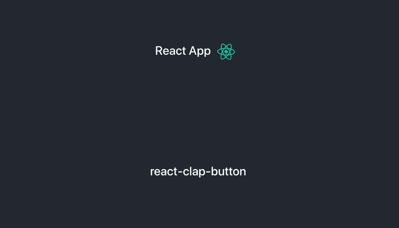
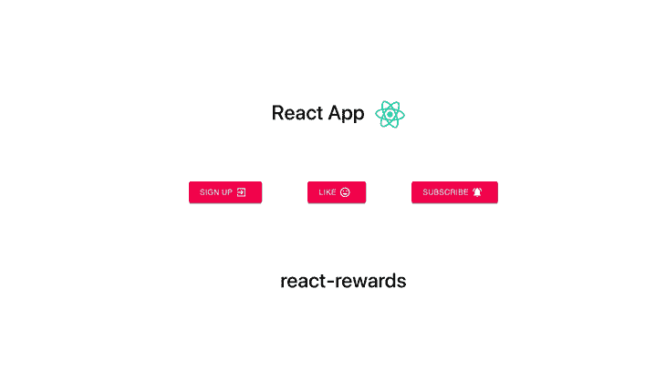

# 改善反应 UX:微观互动

> 原文：<https://levelup.gitconnected.com/improving-react-ux-micro-interactions-1bd19ab3f5e3>

## 围绕应用程序的用户操作构建反馈和动画

Medium 是改善用户体验的完美范例。

## 鼓掌按钮。

按下它会立即释放多巴胺。五彩纸屑，明亮发光的动画，在手机上按下时剧烈的震动，这个拍手按钮是*与*互动的乐趣。这些**微交互**是让用户爱上你的应用的一种即时方式。

让我们看看上面的前后例子。before 示例简单地表明它被按下时颜色发生了变化。平淡无奇，但能完成任务。当你悬停在按钮上时，after 示例会立即给你一个吸引人的绿色外发光，诱使你按下它。一旦按下，你会得到一阵五彩纸屑和一个平滑渐强的亮绿色指示器，这是一个最终吸引人的交互，迫使你再点击几下。之前的例子并不一定*不好……*而且它完成了任务*……*但是我很享受**点击另一个拍手按钮**。所以问问自己，**你的 app 用起来好玩吗**？

如果你想在 React 中实现这个组件，你可以使用 [KikoBeats](https://kikobeats.com/) 的 [react-clap-button](https://www.npmjs.com/package/react-clap-button) 库。这个库是可定制的，这意味着你可以切换图标，改变配色方案，并操纵计数机制。

# 我如何开始在我的 React 应用程序中实现微交互？

启动并运行微交互的最快方法是使用这个小而不可思议的库。无论您是需要一阵五彩纸屑、表情符号游行，还是一个绝妙的形状动画，实现这个高度可定制的库就像用<奖励>标签包装任何组件一样简单。

让我们看看如何在 react 应用程序中逐步实现 react-rewards。

`npx create-react-app rewardexample`

`cd rewardexample`

`npm i react-rewards`

现在让我们编辑 App.js
首先我们要导入 react-rewards

`import Reward from "react-rewards"`

接下来选择一个你想点击奖励的组件！到目前为止，我的 App.js 是这样的:

我将把奖励交互添加到我们的

标签中。

用<reward>标签包裹所选标签，并启动 ref。应该是这样的:(顺便确定 App 是类组件，不是功能组件)</reward>

接下来，我们将向我们的应用程序组件添加一个构造函数，并添加一个 onClick 函数。将 onClick 函数添加到我们的

标签中，我们就完成了！

你可以在我的 Github 上找到完整的代码示例

## [对于 UX 的更多反应](https://medium.com/front-end-weekly/react-loading-screen-tactics-improving-user-experience-9452f183c00b)

 [## 反应加载屏幕策略—改善用户体验

### 如果你的应用程序给用户良好的感觉，他们更有可能继续使用它。反应负载改善…

medium.com](https://medium.com/front-end-weekly/react-loading-screen-tactics-improving-user-experience-9452f183c00b) 