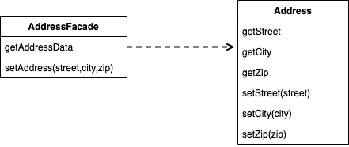
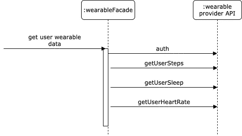

# 改善与远程服务的集成

> 原文：<https://levelup.gitconnected.com/improving-the-integration-with-remote-services-742e093eca6b>

## 远程立面模式

照片由[迪奥戈·努内斯](https://unsplash.com/@dialex?utm_source=unsplash&utm_medium=referral&utm_content=creditCopyText)在 [Unsplash](/s/photos/fa%C3%A7ade-pattern?utm_source=unsplash&utm_medium=referral&utm_content=creditCopyText) 拍摄

在面向对象的模型中，最好用小方法来使用小对象。这为您提供了许多控制和替换行为的机会，并且可以使用善意的揭示命名来使应用程序更容易理解。这种细粒度行为的一个后果是，对象之间通常有大量的交互，而这种交互通常需要大量的方法调用。

在单个地址空间内，细粒度的交互可以很好地工作，但是当您在进程之间进行调用时，这种愉快的状态就不存在了。远程调用的成本要高得多，因为还有很多事情要做:数据可能需要整理，安全性可能需要检查，数据包可能需要通过交换机路由。如果这两个进程在地球另一边的机器上运行，光速可能是一个因素。残酷的事实是，即使两个进程在同一台计算机上，任何进程间调用都比进程内调用昂贵几个数量级。即使对于懒惰优化的信徒来说，这种性能影响也不容忽视。

因此，任何打算用作远程对象的对象都需要一个粗粒度的接口来最小化完成某件事情所需的调用次数。这不仅会影响您的方法调用，还会影响您的对象。例如，不需要单独请求订单及其订单行，但是需要在一次调用中访问和更新订单和订单行。这将影响整个对象结构，编程变得更加困难，生产率下降。

## 远程外观

远程 Facade 解决了标准的面向对象方法将不同的职责划分到不同的对象中的分布问题；因此，它已经成为这个问题的标准模式。

举个简单的例子，比如将应用程序集成到可穿戴数据提供者，远程 Facade 用一个 getter 替换了外部提供者 API 的所有 get 方法，这通常被称为批量访问器。

在更复杂的情况下，单个远程 Facade 可以充当许多细粒度对象的远程网关。例如，订单外观可用于获取和更新订单信息、所有订单行和一些客户数据。当像这样大量传输信息时，您需要它以一种易于在网络上移动的形式存在。如果连接两端都有细粒度的类，并且它们是可序列化的，那么可以通过复制直接转移。

然而，你通常不能这样做。您可能不希望在多个进程上复制域类，或者由于域模型的复杂关系结构，可能很难序列化域模型的一部分。客户可能不想要整个模型，而只是它的一个简化子集。在这些情况下，使用数据传输对象( [DTO](https://en.wikipedia.org/wiki/Data_transfer_object) )作为传输的基础是有意义的。

## 粒度和职责

粒度是远程门面最困难的问题之一。有些人喜欢制作相当小的远程外观，比如每个用例一个。还有的更喜欢粗粒度的结构，较远的立面就少了很多。当与外部服务集成时，比如用于 SMS、聊天和视频服务的 Twilio 或用于电子邮件交付的 SendGrid，我通常为每个外部集成创建一个 Facade。

除了提供粗粒度的接口，还可以向远程 Facade 添加其他职责。例如，它的方法是添加应用程序安全性的自然点。访问控制列表可以告诉哪些用户可以调用哪些方法。远程 Facade 方法也是应用程序事务控制的自然点。该方法可以启动一个事务，完成所有内部工作，然后在结束时提交该事务。

实现远程 Facade 的最大错误之一是将域逻辑放入其中。任何远程门面都应该是薄皮，责任很少。如果您需要工作流或协调的领域逻辑，您可以将它放在一个细粒度的对象中，或者创建一个单独的非远程[事务脚本](https://dzone.com/articles/transaction-script-pattern)来包含它。您应该能够在本地运行整个应用程序，而无需使用远程外观或复制任何代码。