# 在 Unity 中使用滑块改善推进器效果

> 原文：<https://levelup.gitconnected.com/improving-the-thruster-effect-using-a-slider-in-unity-8c91f7a36c51>

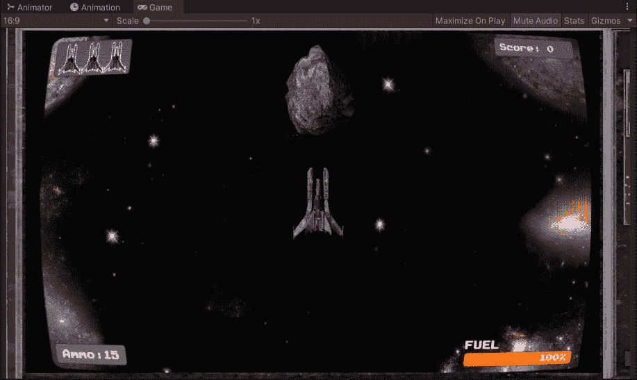

**概述:**

今天，我们将看看如何使用滑块和临时速度提升来改善推进器的效果。让我们开始吧。

**创建滑块 UI:**

1.  要创建滑块，我们可以右键单击画布并选择 UI>Slider。你喜欢怎么放就怎么放。

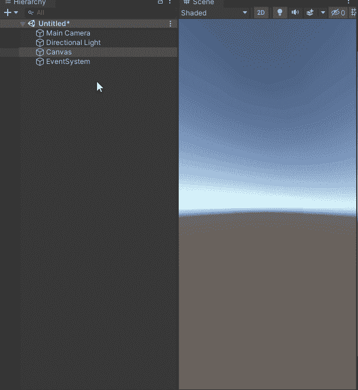

**创建滑块**

2.单击下拉菜单，然后删除手柄和手柄滑动区域，或者仅取消激活它们。

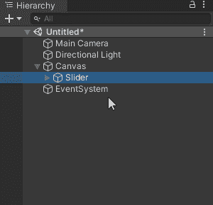

**关闭手柄滑动区域**

3.按照您喜欢的方式缩放滑块。

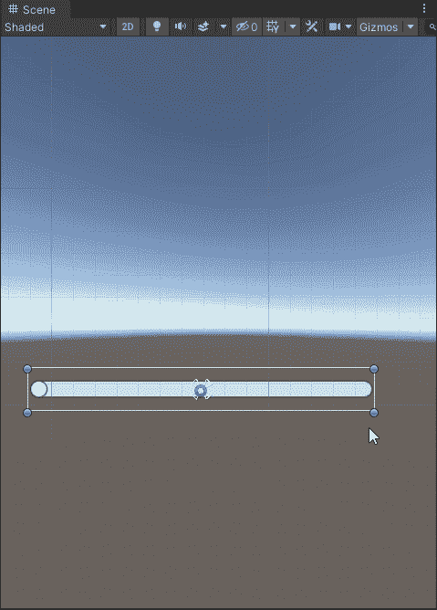

**缩放滑块**

4.选择滑块，检查整数，并将最大值设置为 100。

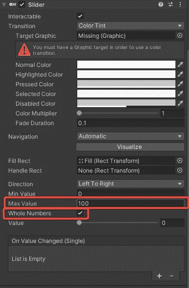

**设置整数为真，设置最大值为 100**

5.选择填充并将其缩小。

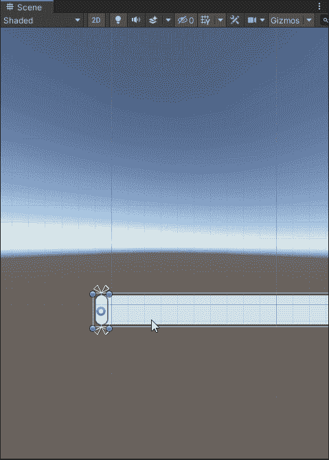

**缩放回填**

6.选择滑块，并将值设置为 100。选择填充区域并缩放它，大致匹配背景。

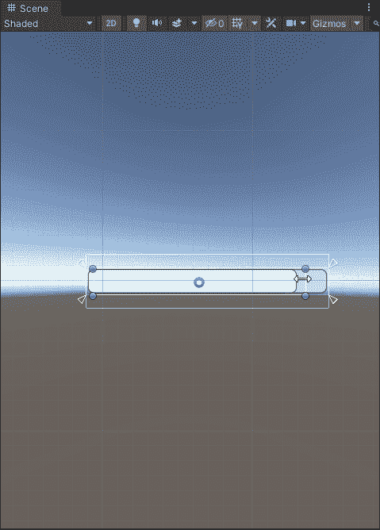

**缩放滑块填充区域以匹配背景**

现在，当我们移动滑块值时，它应该像这样变化。

**上下改变滑块值**

7.创建将用于百分比的新 TextMeshPro 文本。

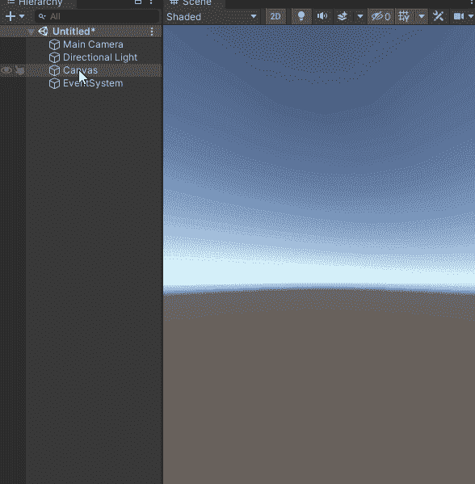

**创建一个 TextMeshPro 文本**

我把我的放在这样的位置。

这就是设置滑块的方法，让我们开始通过代码操作它的值。

**通过代码改变滑块值:**

1.首先，我们将打开 Ui 管理器脚本，并创建一个名为 _thrusterSlider 的新序列化私有滑块变量和一个用于燃料百分比的新私有 TextMeshProUGUI 变量。

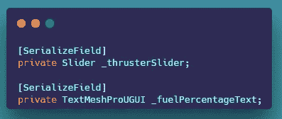

2.接下来，我们可以创建一个名为 UpdateThruster 的新公共方法，它接受 float 参数。接下来，我们可以将滑块值设置为等于 float 参数。对于文本，我们可以设置文本等于燃料百分比，但我们需要使用 Mathf。RoundToInt()将浮点数舍入到一个整数。

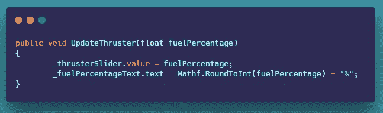

3.这就是设置 Ui 管理器的方法，现在我们在玩家脚本中创建了四个新变量。

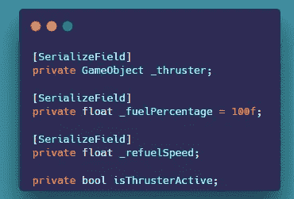

**玩家脚本推进器变量**

确保在检查器中分配推进器游戏对象。

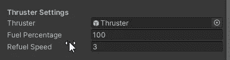

5.现在我们可以创建一个新的方法，叫做激活推进器，我们设置是 isThrusterActive true，然后我们检查燃料是否在零度以上。如果是，那么我们简单地设置推进器游戏对象激活，然后我们减去 15 乘以 2，再乘以时间。

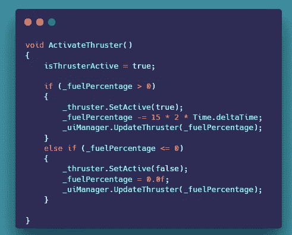

6.我们还创建了一个 IEnumerator，我们运行一个 while 循环来检查我们的燃料是否不等于零，以及 isThrusterActive 是否等于 false。然后我们加上 30 乘以我们的加油速度，再乘以时间。然后我们检查我们是否达到了 100。如果是这样，然后将燃料设置为 100，更新 UI 并中断。

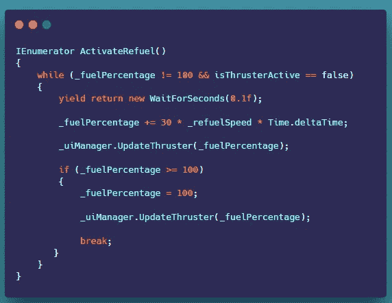

7.现在，在我们的移动方法中，我们可以检查用户是否按住了左 shift 键，以及 fuel 是否大于 100。我们还检查我们的速度提升是否激活，如果激活，不要改变速度。我们还检查用户何时释放左 shift 键，我们将 isThrusterActive 设置为 false。我们还对速度提升进行了同样的检查。

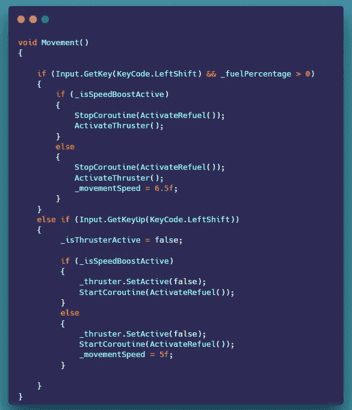

现在我们的滑块应该工作了，我们有了一个更好看的推进器效果。

本文到此为止。

感谢您的时间和关注。

在你离开之前，请为更多的人鼓掌。

# 分级编码

感谢您成为我们社区的一员！在你离开之前:

*   👏为故事鼓掌，跟着作者走👉
*   📰查看[级编码出版物](https://levelup.gitconnected.com/?utm_source=pub&utm_medium=post)中的更多内容
*   🔔关注我们:[推特](https://twitter.com/gitconnected) | [LinkedIn](https://www.linkedin.com/company/gitconnected) | [时事通讯](https://newsletter.levelup.dev)

🚀👉 [**加入升级人才集体，找到一份惊艳的工作**](https://jobs.levelup.dev/talent/welcome?referral=true)