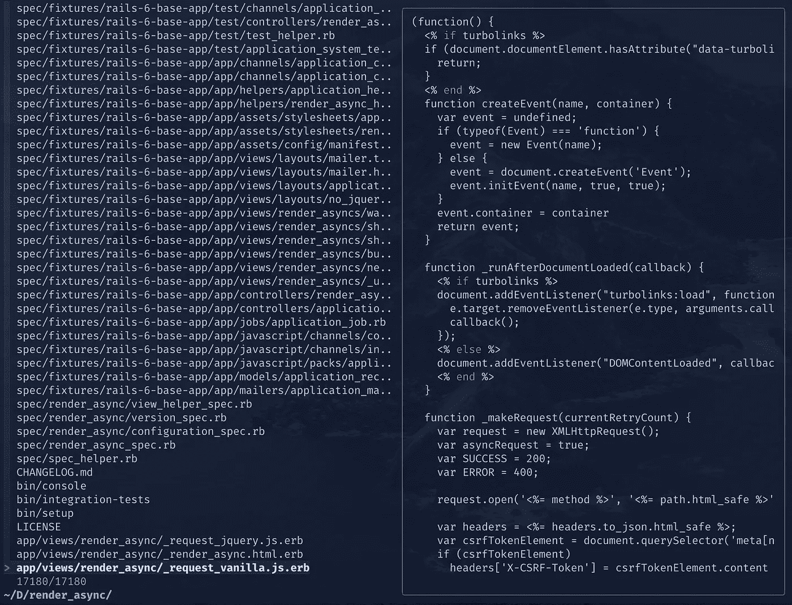

# 用 fzf 改进 Vim 工作流

> 原文：<https://levelup.gitconnected.com/improving-vim-workflow-with-fzf-3f8bedaca1b2>


如果你从未听说过 [fzf](https://github.com/junegunn/fzf) ，它是一个非常方便的通用命令行模糊查找器。除了命令行，它也是一个流行的 Vim 插件。如果你想知道，模糊查找器是一个工具，它可以帮助你找到你要找的东西，而不需要写全名。

作为一个 Vim 用户，我总是痴迷于尽可能少的击键次数。拥有在 Vim 中快速打开文件的能力对我来说超级有用，你很快就会明白为什么。

但是，你知道这个模糊查找器——fzf，能做的比你想象的多得多吗？哦，是的，模糊搜索只是冰山一角。它像酒；你把它留在你的电脑上的时间越长，它从命令行中积累的味道和甜蜜就越多。让我们深入研究一下，看看如何在 Vim 中使用 fzf 来提高您的工作效率。

# 出发

为了能够做我在这篇博文中所做的事情，你需要几个插件。如果你没有使用 [vim-plug](https://github.com/junegunn/vim-plug) 来安装其他 vim 插件，那么你就错过了。继续进行设置，您可以添加以下内容:

```
Plug 'junegunn/fzf' , { 'do' : { - > fzf#install ( ) } } 
Plug 'junegunn/fzf.vim'
```

然后，用`:PlugInstall`安装这些插件或者用我用的这个快捷键:

```
nnoremap < silent > <leader> 1 : source ~/ .vimrc \| :PlugInstall<CR>
```

然后，您可以按下 leader 键和数字 1 来安装并应用您的`.vimrc`中的所有更改。

现在，到了最酷的部分！

# 神奇的发现者

需要的都装好了，就可以到实用的部分了。正如我们之前所说，fzf 是一个模糊查找器，如果你想的话，它是一个文件选择器。让我们马上尝试一下这个特性。要打开文件选择器，在 Vim 会话中键入`:Files`。您应该得到这样的结果:


fzf 在底部打开了一个小窗口，显示我们目录中的文件。如果您查看新打开的窗口，您将会看到文件列表，并且在窗口右侧会显示当前所选文件的**预览**。所以你的文件在左边，预览在右边。你已经和我一样印象深刻了吗？酷，我们继续。

如果你不喜欢这个窗口，你可以通过 fzf 定制选项进行微调。但是如果你想要全屏显示任何 fzf 命令，你可以在命令的末尾加上`!`。例如，让我们做`:Files!`，你应该看到以下内容:



但是，我不常使用`:Files`。事实上，我只用 fzf 的`:GFiles`命令。`:GFiles`将为你的 Git 文件打开一个文件选择器，忽略`.gitignore`中的文件。在 JavaScript 项目中使用它非常简洁，在这些项目中，`node_modules`文件往往会破坏运行`:Files`时的气氛。让我们用`:Files`和`:GFiles`命令来比较同一个项目:


*呸！到处都是“节点模块”。*


*啊，这样更好。*

注意到区别了吗？没有那些`node_modules/**`文件弹出来，我感觉就像背上掉了一个沉重的背包。无论如何，让我们看看这个坏男孩在搜索要编辑的文件时的行动。


就这样，看起来很不错。我不喜欢使用`:GFiles`的唯一一点是，它不会包含你的新文件，除非你用`git add`把它们添加到 Git 索引中。此外，我希望预览文件时有一些现成的语法突出显示，但我们将在另一篇博客文章中讨论这一点。同时，考虑订阅[时事通讯](https://pragmaticpineapple.com/improving-vim-workflow-with-fzf/newsletter)来获得类似的帖子。

综上所述，fzf 在搜索文件时很有用，快如闪电。正如下面的 Drake 所说，求助于使用`:GFiles`或尝试配置`:Files`来忽略某些文件和路径。


为了让这变得更快，你可以创建一个快捷方式。我用 CTRL + p 打开`:GFiles`，这是我从传说中的 [ctrlp](https://github.com/kien/ctrlp.vim) 插件中得到的。要使`:GFiles`连接起来，以便用 CTRL + p 打开它，您可以将以下内容添加到您的`.vimrc`中:

```
nnoremap <C-p> :GFiles<Cr>
```

# 快速搜索您的项目

不时让我震惊的是，在 Vim 中你可以用 fzf 做的其他事情。例如，您可以将[银搜索器](https://github.com/ggreer/the_silver_searcher)或 [ripgrep](https://github.com/BurntSushi/ripgrep) 与 fzf 配合使用。要使用 Silver Searcher 进行搜索，请键入`:Ag`和您想要搜索的术语。并且，要使用 ripgrep 进行搜索，请键入`:Rg`和术语。当然，要让这些命令工作，您需要在您的环境中安装相应的库。

我用的是`:Ag`，效果非常好。它为我连线到 CTRL + g，所以我快速访问它。要进行这种或类似的设置，请将以下内容添加到您的`.vimrc`:

```
nnoremap <C-g> :Ag<Cr>
```

上面的快捷方式将在底部打开`:Ag`搜索窗口，并预览文件。当我需要在一个项目中搜索一个单词时，我发现它非常有用和快捷。让我们看看`:Ag`的行动。


# 擦亮

您可以通过键入`:Buffers`使用 fzf 搜索所有打开的缓冲区。我在我的 leader 键(空格键，BTW) + b 处保留了一个快捷键，就像这样:

```
nnoremap <silent><leader>l :Buffers<CR>
```

使用该命令，您将获得一个 buffers explorer，您可以在打开的文件之间快速切换。我希望那有帮助。让我们看看它是什么样子的:


# ASCII 艺术(一种)

如果你是一个在航站楼内画画的爱好者，那么你一定会喜欢这个。如果您使用的是[vim-逃犯](https://github.com/tpope/vim-fugitive)插件，请尝试键入`:Commits`。这个插件本身就是一个非常棒的 Git 包装器，如果你不想离开你的 Vim 会话的话。不管怎样，如果你输入`:Commits`，你应该得到一个项目提交树，如下所示:


很酷吧。您可以在每次提交时上下滚动并签出更改。您甚至可以输入您感兴趣的提交，并检查那里所做的更改。多亏了`vim-fugitive`，所有这些都成为可能，所以来看看吧。关于在 Vim 内部使用 Git 的博文来了，一定要订阅[时事通讯](https://pragmaticpineapple.com/newsletter)。

# 快速总结

Vim 生态系统有很多插件，fzf 是一个很棒的插件。可以用`:GFiles`和`:Files`搜索文件。如果你想做文本搜索，尝试使用`:Ag`或`:Rg`，它们分别使用 Silver Searcher 和 ripgrep。厌倦了开放缓冲区之间的缓慢切换-尝试`:Buffers`。或者，如果您想要一些好的提交信息，请执行`:Commits`。

这些只是 fzf 的几个命令和技巧，请务必查看它们的自述文件以获取更多信息。另外，请继续关注我发的更多类似的帖子，并考虑订阅[时事通讯](https://pragmaticpineapple.com/newsletter)。如果你觉得这篇博文很有趣，一定要传播出去，与你的朋友和同事分享:

直到下一个，干杯！

*最初发表于*[*https://pragmaticpineapple.com*](https://pragmaticpineapple.com/improving-vim-workflow-with-fzf/)*。*