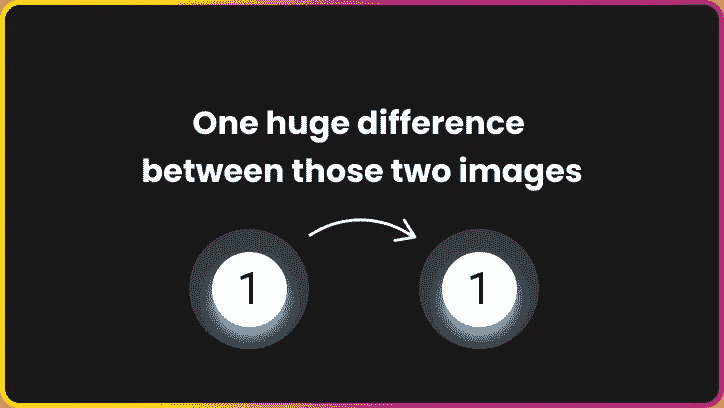

# 通过用 CSS 替换图像来改进网站

> 原文：<https://levelup.gitconnected.com/improving-website-by-replacing-images-with-css-e0b23f9375f2>

## 很多图片可以用 CSS 代替

提高网站的性能是一件严肃的事情。大多数人不知道标准库存照片有多重。

我的博客建立在盖茨比的基础上，因为我希望它在图像方面有最好的表现。高质量的图像是巨大的和非常沉重的；这就是为什么我们应该不断优化它们。

# 图片如何降低我的页面速度？

*   大图片:一个大图片的网站加载速度会慢很多。每个图像都是对服务器的额外请求和额外的等待时间。
*   **尺寸错误**:每张图片应该有几个不同的尺寸。例如，在手机上，我们不想加载全高清图像，我们希望加载小得多的图像。
*   **旧文件格式**:自然，不同的格式比其他的大。与 JPEG 和 PNG 的祖先相比，下一代图像具有更高的质量和压缩率。我们应该尽可能地使用它们。

如果你做到了以上这些，你就很棒了！但是…你有没有想过走得更远？如果你使用的是下一代小型 RWD 友好型图像，你还能做些什么？**用 CSS 替换图片**！很多图片可以用纯 CSS 代替。这是你的网站性能的下一个层次。考虑一个 4kB 图像的例子，十个相似的图像重 40kB！当然，还有经常被忽略的—另外 10 个需要解决的请求。

作为一名开发人员，我总是试图减轻捆绑应用程序的重量，这是一种简单的方法。

# 真实的例子

大量的图片可以用纯 CSS + HTML 代替，提高网站的性能。所有的小点、云、语音气泡、形状、星星、线条都可以不用图像来创建。我将给你看两个真实项目的例子。开始吧！

## 前端独角兽图书

[https://frontenduniorn.com](https://frontendunicorn.com/)

在我的图书网站— [Frontend Unicorn](https://frontendunicorn.com) 上，所有那些矩形都是纯 CSS。它们非常简单——有背景和阴影的正方形。当我的朋友也是我认识的最好的设计师之一——Diana——设计这个布局时，她想把所有这些方块切割成一个大图像。

> *嘿！不要那样做！我将在 CSS 中创建它们。*

这张图片可能会浪费 20-50kB，会使页面速度变慢一点点，而且用 CSS 做这个可以让我在不损失质量的情况下制作这些方块的动画！

一个 37x37px 的正方形，PNG 重 3KB，SVG 重 1kB。用 CSS + HTML 写的话我们得用 150B/0.15kB (minified)。当然，图像和 SVG 也需要一些 HTML + CSS，我没有计算在内😉。

在这种情况下，使用 SVG 也比 PNG 好得多。我们可以在里面使用`currentColor`来创建更多的彩色方块。

所有这些云将很快被 CSS 取代。

## 计数器图像

几周前，我们的一个客户问我:

> *由于某种原因，我找不到数字图像的文件。这是 1，2，3，4 & 5 个圆形图像。*

图片来自我们客户的一个网站

哈！没有任何图像。这张图片是用几行 CSS 和 HTML 创建的。这是我最喜欢的性能改进示例。

当然，就像上面的例子一样——图像和 SVG 权重的计算没有任何样式和 HTML。

这位客户在他的网站上有 5 个类似的图像，但上面有不同的数字。所以让我们再数一遍:

你看到了吗？五个小**图片换成 CSS** 还有这样的改进！

用 1、2、3、4 和 5 个数字创建图像会产生另一个问题。可达性。Web 内容可访问性指南(WCAG)建议，如果您希望用户阅读文本，则不要使用文本图像。你可以在这里阅读更多:[图片文字](https://www.w3.org/TR/UNDERSTANDING-WCAG20/visual-audio-contrast-text-presentation.html)。

# 图像到 CSS

大多数形状都是用一个 HTML 元素和一两个伪元素[:在](https://developer.mozilla.org/pl/docs/Web/CSS/:before)之前和[:在](https://developer.mozilla.org/pl/docs/Web/CSS/:after)之后构建的。

本文是关于用 CSS 替换图像的系列文章[的开始。我将教你 CSS 形状的基础知识，然后我们将进一步研究一些更复杂的情况。](https://www.albertwalicki.com/tags/image-to-css)

谢谢！😎