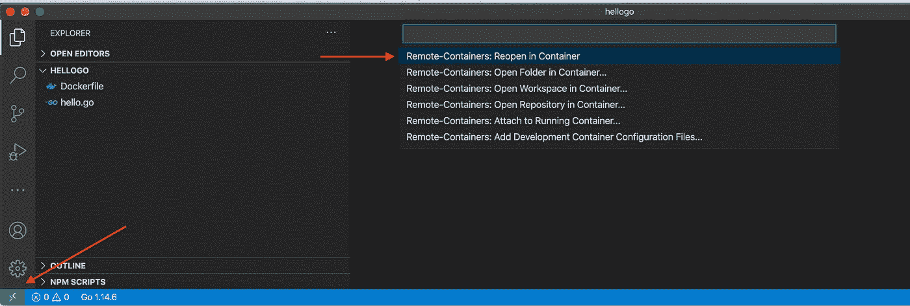
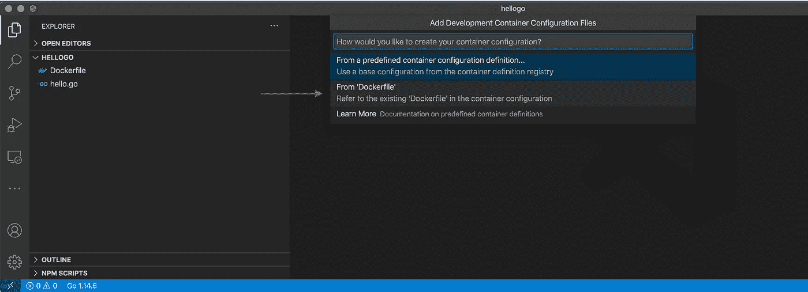
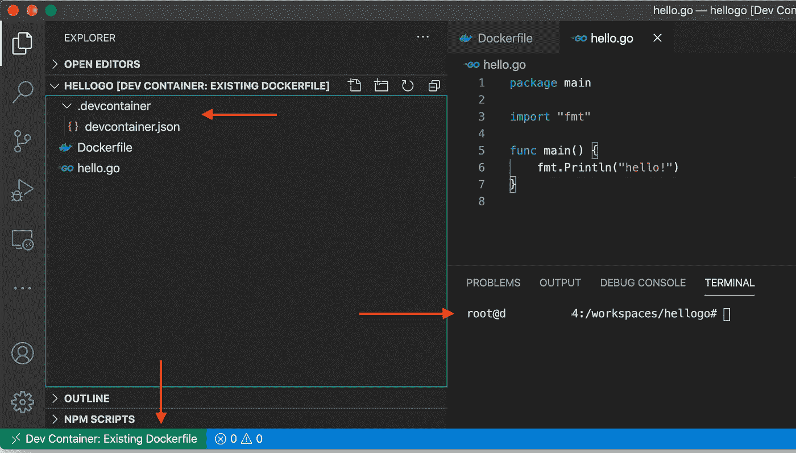
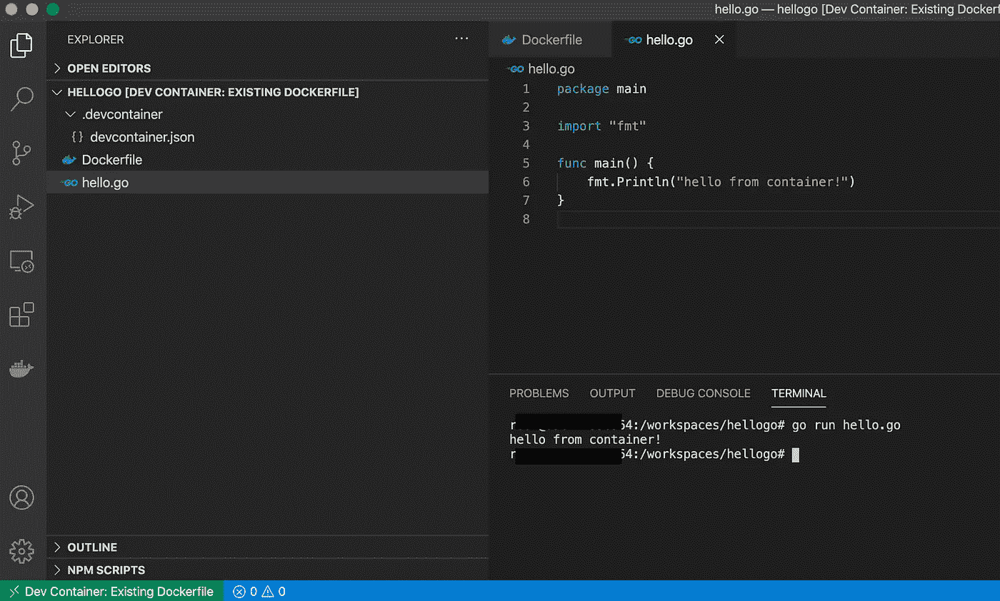
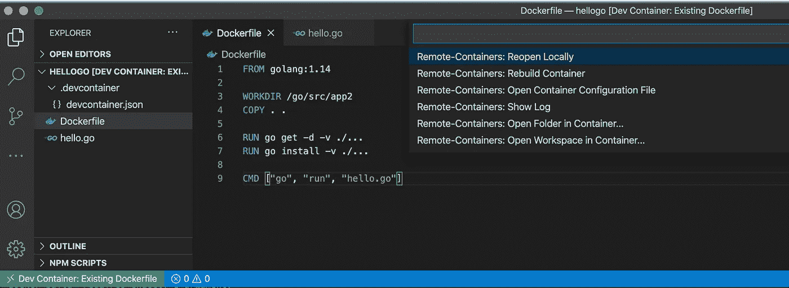
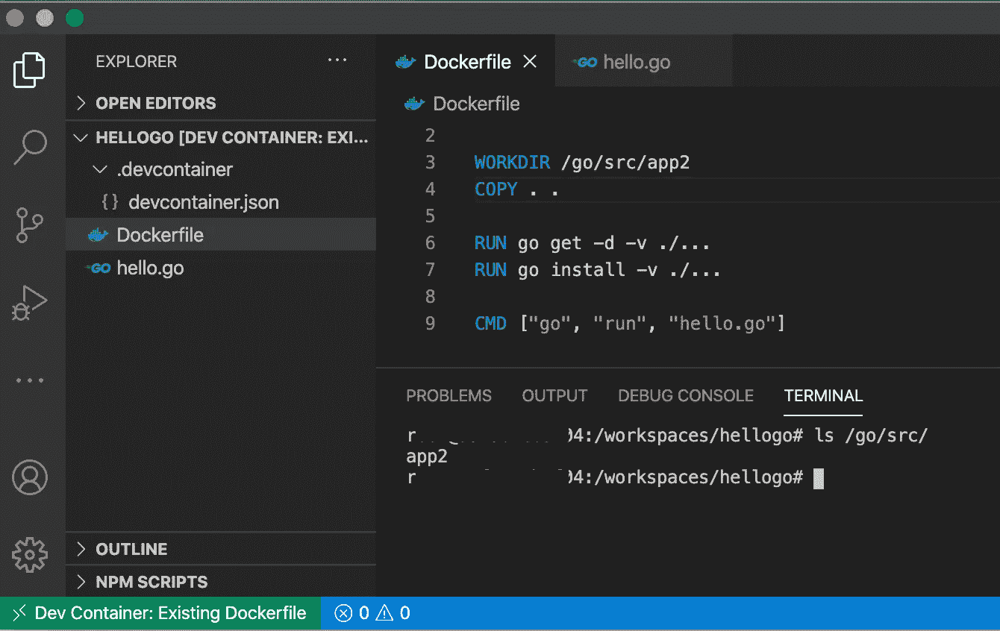

# 使用 VSCode +远程扩展改善您的 Docker 开发体验

> 原文：<https://levelup.gitconnected.com/improving-your-docker-development-experience-with-vscode-remote-containers-extension-da81d288e0c1>


照片由[克莱门特·H](https://unsplash.com/@clemhlrdt?utm_source=medium&utm_medium=referral)在 [Unsplash](https://unsplash.com?utm_source=medium&utm_medium=referral) 上拍摄

## Docker 是编写和交付软件的革命性方式。然而，在某些情况下，创建您自己的图像的过程可能会很痛苦。

## 码头工人

我喜欢来自他们自己的[网站](https://www.docker.com/)的 Docker 定义:

> 我们帮助开发者和开发团队构建和发布应用。

在我看来，那个定义是真的。除了这个平台带来的所有好处之外，作为一名软件开发人员，我想说主要的收获是可以非常快速地尝试新工具，并且不会搞乱我的本地环境。

然而，就像上面的所有东西一样，在多次使用和尝试不同的方法后，我们开始发现一些不使用该工具时不会出现的问题。例如，当我们需要创建 Docker 图像时。

## 创建 Docker 图像

这个过程本身非常简单，我们需要做的只是创建一个 *DockerFile* 文件。很简单吧？

所以，假设我想创建一个 Docker 映像来运行一个非常基本的 [Go](https://golang.org/) 项目。

我们需要做的是创建两个文件。第一个是负责配置映像的 Dockerfile，另一个是 Go 代码本身。

太棒了。现在，让我们运行它。

## 构建和运行

这些步骤是:

1.  构建映像(假设我们将两个文件放在同一个目录中)

```
docker build -t mygoapp .
```

2.运行它

```
docker run mygoapp
```

就它而言，输出将是:

```
hello!
```

简单吗？那么，为什么会如此痛苦呢？

假设我们想要更新代码，向容器添加更多资源，甚至调试它。您能想象在大型应用程序中实现它吗？试图识别问题，连续多次构建、运行和测试？

幸运的是，有一个工具可以帮助我们以一种简单的方式解决这些问题。所以，我们来检查一下！

## Visual Studio 代码

我想说，如果你没有使用 Visual Studio 代码[的话，你可以给它一个机会，它是一个很棒的工具(免费的),有很多插件和扩展。实际上，我这么说是有偏见的，因为我从第一个版本开始就一直在使用这个工具:)](https://code.visualstudio.com/)

此外，在 [Stack Overflow 2019 调查](https://insights.stackoverflow.com/survey/2019#development-environments-and-tools)中，Visual Studio 代码被评为最受欢迎的开发人员环境工具。

然而，仅仅工具本身并不能帮助我们解决我们正在谈论的问题。正如我之前说过的，关于 Visual Studio 代码最有用的一点是大量的插件。我们将要使用的是远程开发。让我们检查一下。

## Visual Studio 远程开发扩展

来自扩展[网站](https://marketplace.visualstudio.com/items?itemName=ms-vscode-remote.vscode-remote-extensionpack)的定义:

> 远程开发扩展包允许你打开容器中的任何文件夹，在远程机器上，或者在 Linux 的 Windows 子系统(WSL)中，并且利用 VS 代码的全部特性集。

基本上，我们可以直接在容器内部编辑代码。那么，让我们来看看它是如何工作的。我们需要什么:

*   [Visual Studio 代码](https://code.visualstudio.com/)
*   [远程开发](https://marketplace.visualstudio.com/items?itemName=ms-vscode-remote.vscode-remote-extensionpack)

## 代码

我们的文件夹结构非常简单，基本上我们需要的是 docker 文件和同一级别的源代码，就像这样:

```
.├── Dockerfile└── hello.go
```

在 Visual Studio 中，您应该能够在左下角位置看到远程开发扩展。此外，系统会提示您选择打开当前文件夹的方式，让我们选择“在容器中重新打开”



打开容器中的当前文件夹

现在，我们将从“Dockerfile”中选择:



容器选项

配置完成后，我们可以观察到一些情况:



远程容器

*   。devcontainer 文件夹:这个文件夹包含了 *devcontainer.json* 。这个文件负责配置您的环境(更多细节[在这里](https://code.visualstudio.com/docs/remote/containers-tutorial#_devcontainerjson))。
*   终端:您以根用户身份登录
*   Dev 容器扩展:标签显示了您当前的环境

## 在容器内编辑

现在我们能够直接在容器内部编辑:



在容器内编辑

此外，您还有一些与容器本身相关的选项:



容器选项

在我的例子中，我更新了“工作目录”并选择了“重建容器”。



WORDIR 已更新

正如你所看到的，我的 WORKDIR 已经被更改，我已经直接在 Visual Studio 代码中更新了。

值得注意的是，当您在容器中没有源代码时，或者甚至当您有一个仅包含应用程序构建的[多阶段构建](https://docs.docker.com/develop/develop-images/multistage-build/)时，这种方法就不能使用。但是，为什么不在你的发展阶段尝试一下呢？:)

我希望这种方法能像帮助我一样帮助你！

由于这只是一个简短的小场景，您可以使用更多链接来探索更多选项:

[](https://code.visualstudio.com/docs/remote/remote-overview) [## Visual Studio 代码远程开发

### Visual Studio 代码远程开发允许您使用容器、远程机器或用于 Linux 的 Windows 子系统…

code.visualstudio.com](https://code.visualstudio.com/docs/remote/remote-overview) [](https://marketplace.visualstudio.com/items?itemName=ms-vscode-remote.vscode-remote-extensionpack) [## 远程开发- Visual Studio 市场

### 远程开发扩展包允许您打开容器中的任何文件夹，在远程机器上，或在…

marketplace.visualstudio.com](https://marketplace.visualstudio.com/items?itemName=ms-vscode-remote.vscode-remote-extensionpack) [](https://code.visualstudio.com/docs/remote/ssh) [## 使用 SSH 和 Visual Studio 代码在远程机器上开发

### Visual Studio Code Remote - SSH 扩展允许您打开任何远程机器上的远程文件夹，虚拟…

code.visualstudio.com](https://code.visualstudio.com/docs/remote/ssh) 

你觉得怎么样？这是你已经用过的东西吗？还是换个方式用了？请告诉我，我们非常感谢您的反馈。

非常感谢您的宝贵时间！