# 改进您的 React 应用程序 UI:升级到五个基本组件

> 原文：<https://levelup.gitconnected.com/improving-your-react-app-ui-upgrades-to-five-essential-components-ea440701c021>

## 升级 React 应用程序的表格、地图、标题、列表和通知

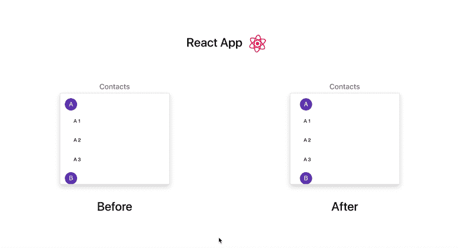

今天，我们将探讨应用程序的五个基本部分，这些部分通过使用以下组件得到了显著改进。

**#1:** [**改善我们的表格**](#7c00) **# 2:**[**改善我们的地图**](#23e1) **# 3:**[**改善我们的标题**](#8412) **# 4:**[**改善我们的列表**](#8a2c) **# 5:**[**改善**](#e54a)

## #1:用多功能[材料改进我们的桌子——桌子](https://material-table.com/)


Material-Table 是一个基于 Material-UI 的即插即用的 React 数据表。这个库是 web 表的泰斯拉。它美观、时尚、易于使用，并且完全可定制。

我们来看看上面的前后。您的标准 HTML `<table>`完成了这项工作，但是几乎不需要额外的努力，您就可以拥有一个可排序、可导出、可自由搜索的表格，看起来绝对令人惊叹。可以使用拖放界面对结果进行分类(这一定会给你的老板留下深刻印象)，定制颜色，甚至将整个表格本地化为适合你需要的任何语言。

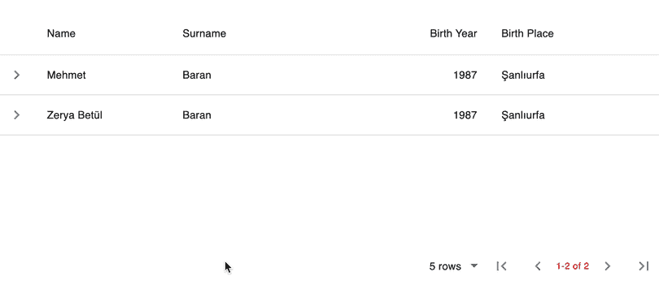

显示附加到任何数据点的多媒体

这个库具有非常广泛的特性，例如显示附加到任何数据点的多媒体，甚至使整个表格可编辑。使用他们的[优雅的文档](https://material-table.com/#/docs/features/editable)，你可以找到 Material-Table 的所有强大功能。

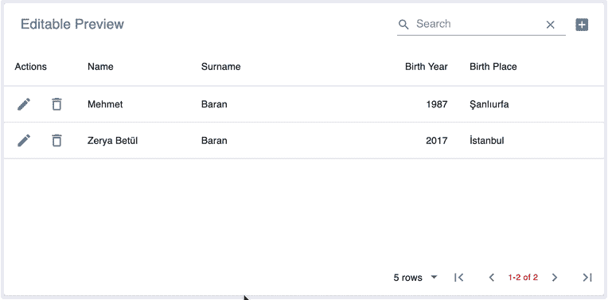

可编辑的表格！

基本实现

对于基本代码示例，您可以查看本文的 [Github Repo](https://github.com/deeayeen/medium-ui) 。或者查看实例，您可以查看本文的[实例网页](https://mediumreactui.netlify.com/)。

## #2:用强大的 [React-Map-GL](https://uber.github.io/react-map-gl/#/) 改进我们的地图

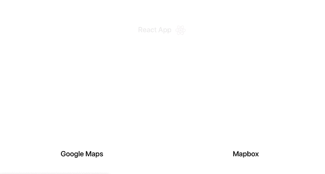

几年来，我一直使用谷歌地图来满足我所有的 React 地图需求，但后来我发现了 Mapbox 的强大之处。除了视觉上的升级，Mapbox 还提供了许多谷歌地图没有的功能，比如你在上面的例子中看到的 3D 建筑拉伸。让我们来发现这个不可思议的平台的真正力量。

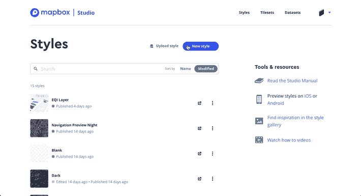

Mapbox 工作室

Mapbox studio 使您能够自定义底图样式的各个方面，例如标注、颜色、字体、图标以及您想要在地图中添加或减去的任何其他内容。或者，从社区的各种预构建风格中挑选。

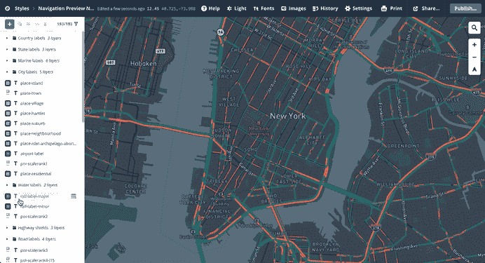

编辑底图

对底图满意后，使用 [mapbox-gl-js](https://docs.mapbox.com/mapbox-gl-js/api/) 导出您的样式并在您的应用程序中实现。这个库被领先的公司(如优步)用来以巨大的方式动态地与他们的地图交互。大数据、复杂的点云可视化和动态样式定制使 Mapbox 成为 JavaScript 社区目前可用的领先地理空间平台。

基于 Mapbox 库的一些令人震惊的例子:

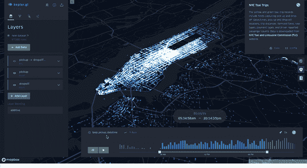

使用 Kepler.gl 绘制大数据

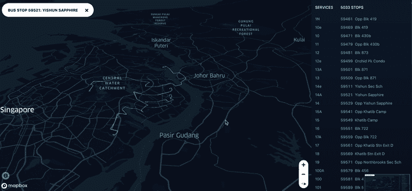

使用 Deck.gl 的点云可视化

这就把我们带到了 React 组件， [react-map-gl](https://github.com/uber/react-map-gl) 。使用这个友好的 React 包装器，您可以使用 React 语法在您的应用程序中轻松实现 Mapbox。定义你的风格，添加一些层，并用状态操纵它们！我在下面提供了一个简单的代码示例，帮助您在 React 中启动并运行 Mapbox。

如果您更喜欢在 React 中使用传统的 mapbox-gl-js 语法(使用引用)，下面是在 3D 中生成全球建筑拉伸的示例代码:

全球三维建筑拉伸示例

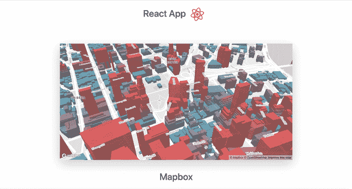

对于基本代码示例，您可以查看本文的 [Github Repo](https://github.com/deeayeen/medium-ui) 。或者查看实例，您可以查看本文的[实例网页](https://mediumreactui.netlify.com/)。

## #3:用简单的[反应空间](https://kyleamathews.github.io/react-headroom/)改进我们的头球

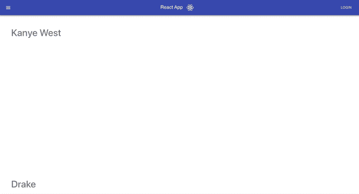

这个组件是对我们的应用程序的一个小但有意义的升级。用`<Headroom>`标签包装你的 header/navbar 组件，当用户不需要看到它的时候隐藏了这个 header。

**为用户提供尽可能大的视窗来欣赏他们的内容**是很重要的，尤其是在移动设备上，屏幕空间非常昂贵。使用 [Headroom](https://kyleamathews.github.io/react-headroom/) 组件，我们可以在用户滚动时隐藏标题。一旦他们决定向上滚动，标题就会重新出现，允许他们导航到其他地方，而不用一直滚动到页面的顶部。实现起来就像用`<Header></Header>`标签包装任何组件一样简单。

提示:确保在你的 Header 标签中添加以下样式，以在所有浏览器上获得漂亮流畅的动画效果:

对于基本代码示例，您可以查看本文的 [Github Repo](https://github.com/deeayeen/medium-ui) 。或者查看实例，您可以查看本文的[实例网页](https://mediumreactui.netlify.com/)。

## #4:用漂亮的[反应粘性](https://www.npmjs.com/package/react-sticky)改进我们的列表


当使用可滚动列表时，一种显著改善外观的方法是使用 [<粘性>](https://www.npmjs.com/package/react-sticky) 组件。

让我们看看上面的前后例子。在 before 示例中，我们滚动联系人，按字母顺序排序。这种方法真的没有错，列表还是很直观的。但是要注意“之后”列表的外观和感觉有多专业和升级，并且在这个过程中，你要让用户知道他们正在查看哪个部分。

这些小功能让你的应用保持吸引力和现代感。这个组件也很容易实现。只需用一个`<StickyContainer>`包装父列表，用`<Sticky>`包装子部分。将这种方法与本文中列出的组件#3 结合起来，以获得最佳的用户体验。

对于基本代码示例，您可以查看本文的 [Github Repo](https://github.com/deeayeen/medium-ui) 。或者查看实例，您可以查看本文的[实例网页](https://mediumreactui.netlify.com/)。

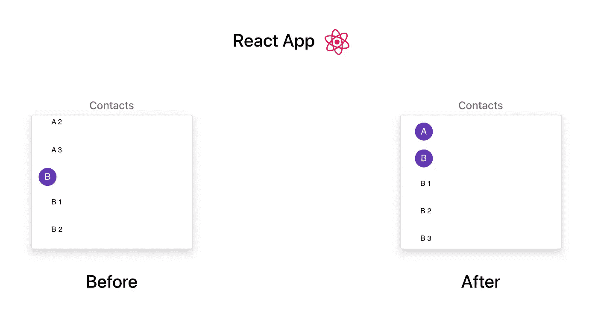

## #5:用简单的 [Cogo-Toast](https://cogoport.github.io/cogo-toast/) 改进我们的通知

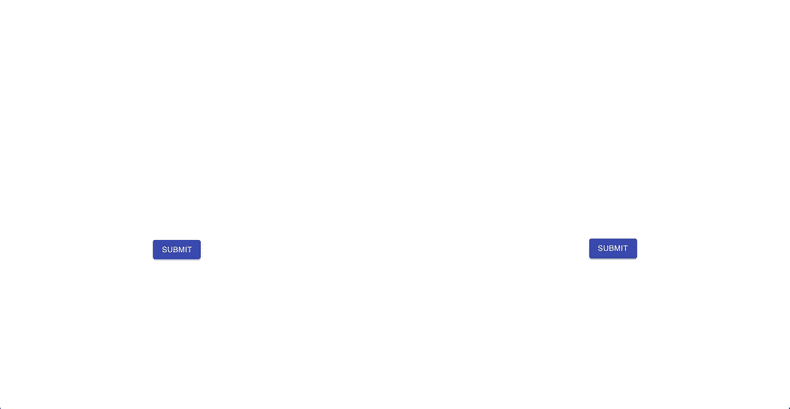

当谈到通知时，我主要优先考虑的是实现一个需要最少配置的方法。我不希望必须处理逻辑、样式或在应用程序中放置组件的位置才能正确显示。幸运的是， [Cogo-Toast](https://cogoport.github.io/cogo-toast/) 是一个零配置通知库，它为我们做了所有的工作。只需点击任意组件调用`cogoToast`函数，就会弹出一个通知！像这样:

```
import cogoToast from "cogo-toast"<button onClick={() => cogoToast.success(“This is a success message”)} />
```

再简单不过了。它也是可定制的，所以检查一下他们的[文档](https://cogoport.github.io/cogo-toast/)中一些有用的选项/变体。

对于基本代码示例，您可以查看本文的 [Github Repo](https://github.com/deeayeen/medium-ui) 。或者查看实例，您可以查看本文的[实例网页](https://mediumreactui.netlify.com/)。

## 寻找更多的 React 升级？

今天，我们讨论了一些有用的组件来改进我们的表格、地图、标题、列表和通知，但这仅仅是我们旅程的开始。对 2020 年升级您的**用户体验**的 react 组件感兴趣？查看这篇文章:

[](/master-ux-with-react-in-2020-four-ways-to-upgrade-your-react-app-user-experience-a053b3ffbf59) [## 2020 年 React 掌握 UX:升级 React 应用用户体验的四种方式

### 如果你的应用程序给用户良好的感觉，他们更有可能继续使用它。

levelup.gitconnected.com](/master-ux-with-react-in-2020-four-ways-to-upgrade-your-react-app-user-experience-a053b3ffbf59)