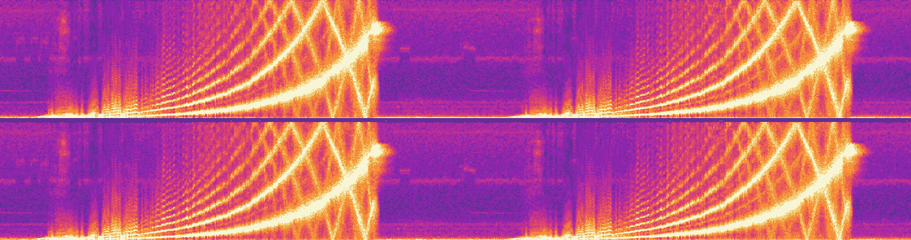
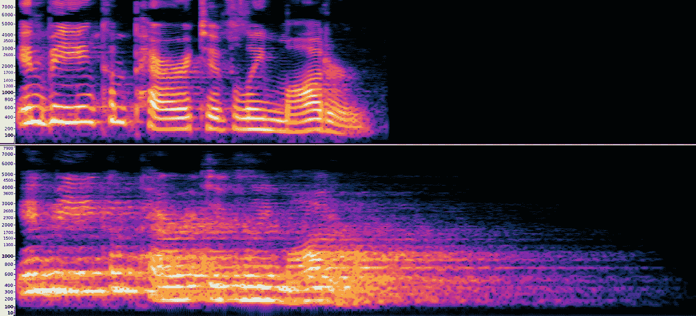
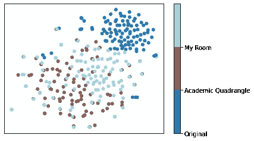

# 脉冲响应—用于音频深度学习的数据增强

> 原文：<https://levelup.gitconnected.com/impulse-response-data-augmentation-for-audio-deep-learning-728f9c4e04d0>

## 本文定义了脉冲响应，如何估计房间/麦克风 IR 及其在深度学习数据增强中的使用。

近年来，音频的深度学习已经取得了很大进展，模型在许多下游任务中击败了传统的信号处理技术。然而，许多这样的解决方案是在“同质的”数据集上训练的——在这些数据集上，记录条件(噪声、口音、语言等)几乎没有可变性。).当在真实世界的“音频事件”中使用时，许多这样的模型不能很好地执行(尤其是音频转换/合成任务),真实世界的“音频事件”可能包含短脉冲串、环境噪声、背景扬声器、劣质麦克风等。虽然有许多技术可以解决这些问题，但在这里，我们关注的是利用脉冲响应进行数据增强，这有时会非常强大，因为它模拟了不同的记录环境。

# 声学和脉冲响应(IR)

> 动态系统的脉冲响应描述了它在受到一个称为脉冲的短暂输入信号时的反应。因此，如果你记录一个脉冲信号，你不仅会听到脉冲，还会听到它的反射，以及它们的反射。

系统的反应会受到其周围环境的影响，例如物体或系统的几何形状。脉冲信号包含所有频率，因此系统的脉冲响应决定了所有频率的响应。然而在实践中，很难产生完美的脉冲响应。取而代之的是采用一个短脉冲作为近似值(假设它与理想脉冲相当，那么 IR 将接近真实 IR)。

IR 的一个重要应用是确定房间(或任何位置)的声学特性。由于房间的几何形状或扬声器或麦克风的位置，可能会有很多混响。通过捕捉/计算房间的 IR，混响可以应用于任何音频源。

音频的 Mel 声谱图，LJ 001–0002 . wav，来自 LJSpeech 数据集。上面的声谱图显示了原始音频，而下面的声谱图显示了用房间脉冲响应增强的相同音频，来自 EchoThief 数据集的 academic quadrangle . wav(x-xis 表示时间)。由于混响的原因，增强的声谱图更长。

## 为什么脉冲响应在深度学习中很重要？

用同质音频数据集训练的深度学习模型可能会成为域外数据点的牺牲品，有时会导致严重的性能下降。房间几何形状和麦克风的传递函数等因素可能会在音频数据点中引入可变性(模型尚未发现)。缓解这一问题的一种方法是开发稳健的模型——例如，通过使用*消除混响*和*去噪*的方法。这里使用的一个强大工具是**数据增强**。使用脉冲响应(卷积混响)，我们可以模拟音频文件听起来好像是在各种真实/不真实的房间里录制的。

在下图中，从 LJSpeech 数据集中随机抽取了 100 个音频文件。样本是在相对安静的环境中记录的。对于每个数据点，生成两个扩充:a)来自 EchoThief 数据集的学术四边形 IR 和 b)使用下一节描述的方法生成的我的房间的 IR。原始音频和增强音频中的每一个都作为输入提供给 fairseq 的 [wav2vec2](https://github.com/pytorch/fairseq/blob/master/examples/wav2vec/README.md) 预训练模型。从 wav2vec2 嵌入中生成 tSNE 图。我们可以看到原始音频和 ir 增强音频之间的清晰聚类。

原始音频和增强音频的 tSNE 图。颜色代表使用的脉冲响应。

# 计算脉冲响应

> 这部分内容(和代码)很大程度上受以下项目的启发: [DIY 房间脉冲响应捕捉](http://tulrich.com/recording/ir_capture/#menu)【1】。

几个房间脉冲(真实的和模拟的)可以在以下资源库中找到:[微软 DNS 挑战赛](https://github.com/microsoft/DNS-Challenge/tree/master/datasets/impulse_responses)，[麻省理工麦克德莫特](https://mcdermottlab.mit.edu/Reverb/IR_Survey.html)， [EchoThief](http://www.echothief.com/) 。然而，在本节中，我们将研究如何计算房间的脉冲响应。实际上，所计算的脉冲响应将是一个复杂的动态系统，包括(房间、扬声器和麦克风)。通过*微调*它们，这些 IRs 可以用来使模型更加健壮:顶部的樱桃！

虽然通过直接记录脉冲信号来捕捉 IR 的响应是直接的，但它可能会有噪声(环境噪声可能难以消除)并且单调乏味(由于脉冲信号非常短，混响尾部可能不够长)。

## 指数正弦扫描

使用已知信号，我们可以使用卷积/去卷积计算 IR(参见下面的等式):

让 *yᵣ* 代表记录的信号。它是房间脉冲响应、 *fₘ* 和一个已知信号、 *z* 的混合。在频域中，这是两个信号的卷积(用*表示)。然后，通过将记录的信号与已知信号的逆信号 *zᶦ* 进行卷积，可以计算出房间脉冲响应。Farina，2000 [2]通过使用指数正弦信号解决了计算 IR 的问题。ESS 信号的倒数可以很容易地计算出来(带音量斜坡的反向 ESS，见[1])。

下面给出了计算房间的**脉冲响应的步骤**

1.  产生 ESS 和反 ESS 信号
2.  在一个(相对)安静的房间里安装麦克风和扬声器。
3.  在扬声器上播放 ESS 信号，同时在麦克风中录音(在 ESS 信号结束后继续录音几秒钟，以捕捉混响)
4.  使用下面的脚本计算 IR

合成生成的 IR(参见[微软 DNS 挑战](https://github.com/microsoft/DNS-Challenge/tree/master/datasets/impulse_responses)库的合成房间 IR 数据集)和使用“真实世界”房间设置生成的 IR 之间的主要区别是:1)背景/环境噪声，2)由于扬声器和麦克风的限制，房间 IR 会被破坏。

> **频率响应**:麦克风的频率响应表示它能够再现的声音/频率范围，以及它对各种频率范围的敏感程度。

麦克风将音频转换为电信号，可以通过响应其振膜上的声波来记录；本质上转换机械波能量。频率响应表示话筒重现音频的有效程度(比如，在 20Hz 至 20kHz 的可听范围内)。虽然平坦的响应(对所有频率范围同等敏感)是可取的，但它在人声上听起来不太好。因此，许多麦克风(如智能手机上的麦克风)可能具有整形响应，在非常高或非常低的频率下不太敏感。

在多个麦克风上录制的相同音频事件可能听起来不同(假设房间非常安静且位置相同)。如果一个模型只看到了一个设备的音频，那么当看到一个新设备的音频时，它的表现*可能会很差*。**进入麦克风增强**。

## 计算麦克风的红外辐射

假设以下条件:一个*完全隔音的房间*(无背景噪音)*吸收*所有声波(无混响)和一个*平坦频率响应的扬声器*。现在，记录信号的任何变形都是由于麦克风对不同频率的灵敏度造成的。前面提到的使用 ESS 方法计算的脉冲响应条件将表示麦克风的频率响应。

然而，在实践中，上述条件很难/很难实现。麦克风脉冲响应项目( [MicIRP](http://micirp.blogspot.com/p/about-micirp.html) )使用与上述类似的设置来获取几个麦克风的 IR。在他们的网站上可以免费获得！

# 数据增强—在现实世界中

在真实环境中，录制的音频会被麦克风灵敏度、环境声学、背景噪声(白/粉红噪声、环境噪声)等破坏。虽然这取决于手头的任务，但为了建立一个健壮的模型，通常混合各种增强是有帮助的。给定语料库，通过 1)添加具有各种 SNR 水平的白/粉红噪声，2)添加环境噪声，3)与随机选择的房间 IR 卷积，4)与随机选择的麦克风 IR 卷积，来生成并行语料库。

# 参考

1.  DIY 脉冲响应捕捉。[T3【http://tulrich.com/recording/ir_capture】T5](http://tulrich.com/recording/ir_capture/#menu)
2.  安杰洛·法里纳。“用正弦扫频技术同时测量脉冲响应和失真”。音频工程学会第 108 号会议。音频工程学会，2000 年。