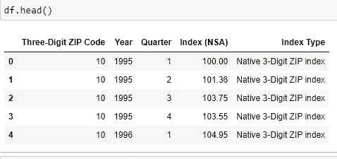
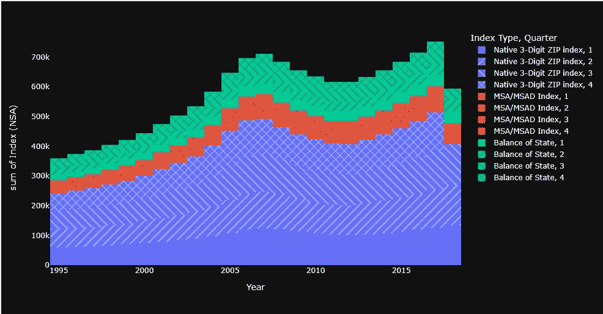

# 用抵押数据格式化 Python Dash 中的主题

> 原文：<https://levelup.gitconnected.com/in-a-not-so-distant-past-we-relied-on-newspapers-for-information-409fac612d1c>

## 个性化视觉效果的一分钟变化

在不太遥远的过去，我们依靠报纸获取信息。在那段时间里，我父亲作为一名健康和科学记者支撑着我们的家庭。他为自己的职业所做的很多事情都转化为我在我们数据驱动的工作环境中的角色。像他一样，我获取复杂的信息，并以更适合观众的方式进行分解。


汤姆·朗布尔在 [Unsplash](https://unsplash.com?utm_source=medium&utm_medium=referral) 上拍照

找到适合受众的流程的一部分不仅是创建可视化，而且还要评估那些可视化工具的最佳适合度。市场上充斥着开发分析工具的软件。至少可以说，它们的能力、市场整合和许可费用各不相同。

与前面提到的工具不同，Dash 是 Python 自带的，可以从 Jupyter 笔记本上运行，所以如果您正在熟悉 Python，这可以是一个很容易将您正在学习的技能转化为交互式可视化的工具。此外，虽然 Dash 确实提供企业许可证，但如果您有非专有数据，或者您希望出于学习目的发布数据，您可以将您的工作连接到 Heroku，以进行公共仪表板共享。

在我的上一篇文章中，我介绍了使用 SQL 提取抵押贷款数据的过程。今天我想继续抵押贷款的例子，因为**我理解数据，所以我知道如何建立一个有意义的可视化。**

我想花点时间来理解这些数据。例如，取索引行 0 的数据。第一行数据引用以“010”开头的邮政编码中的住宅，并列出 1995 年第一季度的值。最上面一行数据列出了 100.00 的指数(NSA)，这是由指数评级系统原生 3 位数字邮政编码指数创建的值。指数为 100 时，我们可以认为该地区的房屋价值正好等于当时美国的平均指数价格。了解这些信息使我能够理解如何建立我的视觉化。*我的数据来源于我在* [*Git*](https://github.com/kr900910/mortgage_data_analysis) *找到的公开房利美数据。*



数据帧头

如果您注意到，这些数据的格式类似于我们在 Excel 中安排数据透视表的方式，其中我们的主要索引类型都混合在一列中。该列中总共有三个指数类型评级系统，现在知道了数据的业务案例，我们希望在输出中对每个指数类型进行颜色编码，因为这些是数据的类别。

数据以这种方式格式化后，我们就可以制作第一个 plotly 条形图了。

要在 Jupyter 笔记本中填充可视化“fig ”,请在上面代码后面的单独单元格中插入一个单元格`fig.show().`

回到构建可视化的代码。虽然上面的大部分代码被包装在 html 中以实现一些交互特性，但是代码的核心应该为了解 Pandas 库的人所熟悉。`fig=px.histogram()`指定图形的参数。请注意，在接下来的视觉效果中，背景启用了深色主题。这是使用以下插件完成的:

```
import plotly.io as pio
pio.templatesEnabling
```

一旦这个包被安装，我们要添加`theme=`配置，并可以从以下十个主题中选择，改变视觉背景和文本。这种快速的变化使数据能够更加显著地弹出页面。这通常可以创造出吸引最终用户注意力的创造性优势。使用这些工具会生成以下可视化效果:



住宅价格指数比较

我们观察了三种不同指数类型的房价波动。我添加了一个模式特性来包含季度，这样就不会打断数据故事中真正相关的部分。

但是等等，还有呢！Dash 为我们提供了默认的交互功能，使我们能够放大、缩小和切换可视化功能，以获得详细的数据:

使用上图中的可视化，这个图表的观众能够快速识别出房价在 20 年间是如何波动的。我们现在有了一个交互式仪表板的基础，它包括这个和其他多种数据可视化工具。

当我在《带你的孩子去上班》节目中去看我父亲时，我记得我坐在他旁边的椅子上，他进行采访，写稿子，和他的编辑交谈。这项工作的来回性质似乎都很乏味。但是在我拜访后的那个星期，我会把报纸拿在手里，放在我那碗冰冻的麦片上。我会被摆在我面前的新科学发现的细节所吸引，所有这些都是在我父亲的办公室里写的。我想这就是所有伟大的数据故事讲述者的力量——获取大量有用的信息，并转化为真正影响受众的信息。