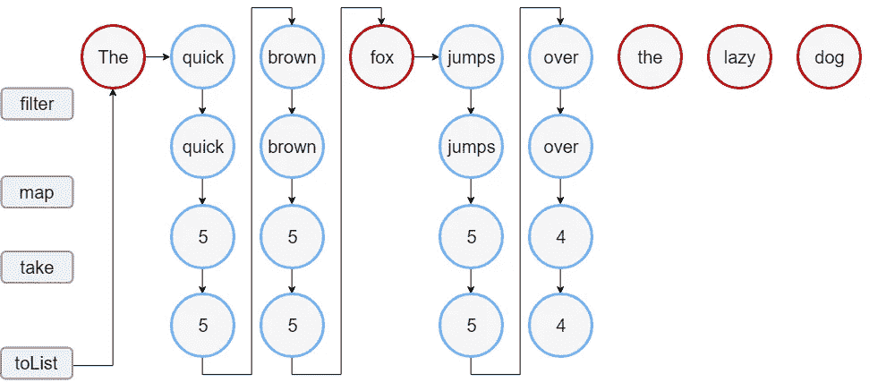

# 为 Python 的流畅集合 API 辩护

> 原文：<https://levelup.gitconnected.com/in-defence-of-fluent-collections-api-for-python-f603b433cf03>

## 用 Python 介绍一个新的带 fluent API 的集合库，以及为什么标准库不够用。



来自科特林的函数式集合操作[的例子。](https://kotlinlang.org/docs/sequences.html#sequence)

另一份工作，对我来说又是一次彻底的技术变革。继 PHP，C++，Objective-C，.NET、Java、Kotlin 等等。NET，我终于开始使用 **Python** 了。在这篇文章中，我将讨论集合(在 Python 行话中称为*容器*，尽管它们位于`collections`模块中)，以及我为了更高效地使用集合而开发的[**py fluent-iterables**](https://github.com/mifeet/pyfluent-iterables)**fluent API 库。**

## **Python 理解**

**我尊重生态系统中常见的惯例。除了标准的[收藏库设施](https://docs.python.org/3/library/collections.html\)，Python 还提供了[列表](https://docs.python.org/3/tutorial/datastructures.html#list-comprehensions)和[字典](https://docs.python.org/3/glossary.html#term-dictionary-comprehension) **释义**。我特别喜欢字典理解——我不记得在其他主流语言中，有如此强大的构造可以在一个表达式中创建字典/地图。**

```
*# Find the number of occurrences of alphanumeric characters in text*
{ c: text.count(c) for c in text if c.isalnum() }
```

**似乎有一种强烈的 [偏好](https://www.artima.com/weblogs/viewpost.jsp?thread=98196)使用综合函数，而不是函数式语言中常见的`map()`或`filter()`之类的函数。我明白——这是一个既定的惯例，有一个单一的做事方式更好，它避免了多余的 lambdas。**

**但是这加上标准容器库的当前状态*不能成为不使更复杂的集合操作更可读、更容易编写的借口*。**

## **一个流畅的集合 API 会让事情更具可读性吗？**

**下面是我看到的一个实际代码示例，它打印了一些 CI/CD 作业的统计数据，这些统计数据按它们相关的问题标识符分组:**

```
jobs = [Job.parse_obj(job) for job in get_all_jobs_from_api()]
jobs.sort(key=get_issue_for_job)
jobs_by_issue = itertools.groupby(jobs, key=get_issue_for_job)
job_summaries = []
for issue, jobs_iter in jobs_by_issue:
    job_summaries.append((issue, JobSummary(list(jobs_iter)))) 
job_summaries.sort(key=lambda pair: pair[1].failed_rate,
                   reverse=True)
for issue, summary in job_summaries: 
    print(issue, summary)
```

**对你来说破译它的功能有多难？你如何将它与下面的片段进行比较？**

```
(fluent(get_all_jobs_from_api())
  .map(Job.parse_obj)
  .group_by(get_issue_for_job)
  .map_values(JobsSummary)
  .sort_items(lambda job, stats: stats.failed_rate, reverse=True)
  .for_each_item(print))
```

**也许我对我的函数式编程经验有偏见，但是我发现后者更具可读性。**

## **流畅的集合 API 会让事情更容易编写吗？**

**另一件事是，[流畅的 API](https://www.martinfowler.com/bliki/FluentInterface.html) 让编写帮助你利用现代 ide 提供的建议，加上 Python 中的标准集合库可以说不是最直观的使用方式。**

**你能直接告诉我如何连接一个列表吗？这个库的方法是`itertools.chain.from_iterable(lists)`。很直观的名字，对吧？现在对比一下`**fluent(lists).flatten()**`。即使你不记得`flatten`的名字，你的 IDE 也会在你键入`fluent(lists).`后在建议列表中提供(不像`from_iterable()`)。**

**当然，您可以使用列表理解，但它不是灵丹妙药——可读性问题仍然存在，并且它不能解决所有情况。如何从你的头顶*通过一个值列表*的键来分组项目？叫`groupby(iterable, key)`？*错了*，你需要调用`sort(iterable) ; groupby(iterable, key)`，即使那样也没有给你值作为列表(见解[此处](https://stackoverflow.com/questions/3749512/python-group-by)；理解也不是灵丹妙药。你觉得这个怎么样:**

```
fluent(iterable).group_by(key)
```

# **为 Python 集合引入流畅的 API**

**出于以上原因，我创建了一个名为 `[pyfluent-iterables](https://github.com/mifeet/pyfluent-iterables)`的[库，它提供了一个流畅的界面，就像上面建议的那样。](https://github.com/mifeet/pyfluent-iterables)**

**它为任何类型的 iterable ( `list`、`tuple`、generators、…)和 mapping(`dict`、…)提供了一个流畅的 API。现有的容器可以用`fluent()`函数包装，或者可以用工厂方法`fluent_of(*values)`或`fluent_dict(**kwargs)`直接创建集合。**

**产生的 fluent 接口类提供了一个丰富的集合方法的[调色板，很大程度上遵循了标准 Python 库，但也增加了来自其他丰富库的方法，如](https://github.com/mifeet/pyfluent-iterables/blob/main/README.md#overview-of-methods) [Kotlin collections](https://kotlinlang.org/api/latest/jvm/stdlib/kotlin.collections/-collection/#kotlin.collections.Collection) 。**

## **结论**

**由于我相对来说是 Python 的新手，我认识到更有经验的 Python 开发者可能会有不同的看法。我将把流畅的集合 API 的有用性留给读者——**我很乐意在评论中听到您的意见。****

**无论如何，这是一个有趣的项目，我不认为已经建立的惯例会妨碍提供更好、功能更多的 API。即使你更喜欢 Python comprehensions，我也确实发现 **fluent API 非常有用，至少对于快速原型制作**。**