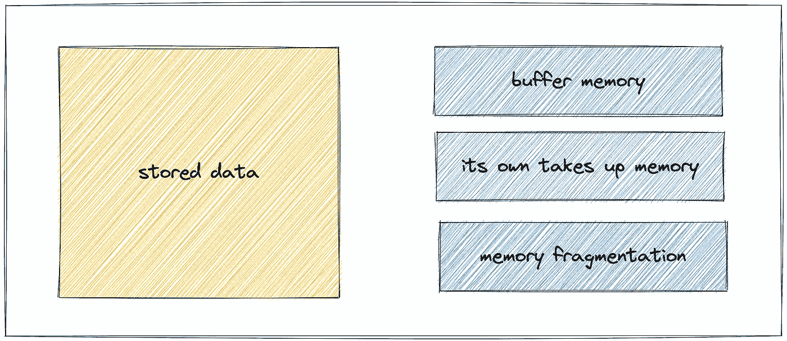
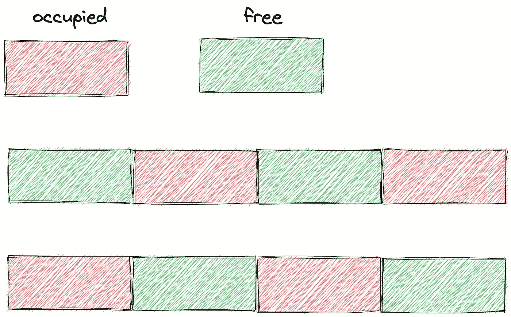
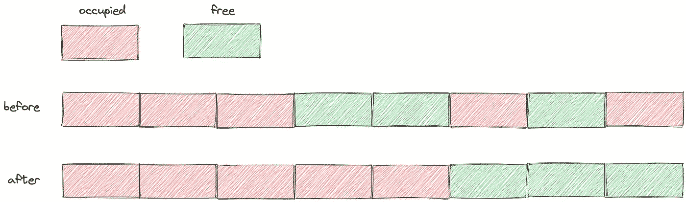

# Redis 内存碎片的深入分析

> 原文：<https://levelup.gitconnected.com/in-depth-analysis-of-redis-memory-fragmentation-25eeca1a85a2>

Redis 内存碎片


照片由[菲尔在](https://unsplash.com/@philhearing?utm_source=unsplash&utm_medium=referral&utm_content=creditCopyText) [Unsplash](https://unsplash.com/s/photos/house?utm_source=unsplash&utm_medium=referral&utm_content=creditCopyText) 上听到

我们先来看一个问题。假设 Redis 实例保存了 5GB 的数据，现在删除了 2GB 的数据，Redis 进程占用的内存会减少吗？

答案是:即使 Redis 数据只占用大约 3GB，它仍然可能占用大约 5GB 的内存。

如果没有设置`maxmemory`参数，Redis 不会触发内存消除策略删除数据。

Redis 将继续为新写入的数据分配内存。分配失败将导致应用程序报告错误，但是当然，这不会导致停机。

> 注意:要设置`maxmemory`参数，执行`CONFIG SET maxmemory 100mb`命令，或者在`redis.conf` 配置文件中设置`maxmemory 100mb`。

您可以确认数据已被删除，并使用`top`命令查看数据。为什么还占那么多内存？

**被释放的内存去了哪里？**

当我们使用 top 命令检查系统使用情况时，会发现内存仍然很高，Redis 并没有真正释放内存。

所有的记忆都去哪了？这时候我们需要使用`info memory`命令来获取 Redis 内存相关指标。

Redis 进程的内存消耗主要由以下几部分组成:

*   内存是 Redis 自己启动占用的。
*   存储对象数据存储器。
*   缓冲内存:主要由客户端输出缓冲区、限制客户端输出缓冲区、副本积压缓冲区和 AOF 缓冲区组成。
*   内存碎片。



作者图片

Redis 自己的空进程占用的内存非常小，可以忽略不计，对象内存是最大的一个，它存储了所有的数据。

缓冲区出现大流量场景容易失控，导致 Redis 内存不稳定，需要注意。

内存碎片过多导致有空间可用，但数据无法存储。

**碎片= used_memory_rss 实际使用的物理内存(rss 值)除以 used_memory 实际存储的数据内存。**

**什么是内存碎片？**

内存碎片会导致内存空间空闲，但数据无法存储。比如和女朋友去电影院看电影，肯定是想在一起的。

假设现在有 8 个座位，已售出 4 张票，还有 4 张可供购买。但巧合的是，买票的人很奇怪，买的票隔了一个座位。

即使还有 4 个座位，你也不能买一张顺序连接两个座位的票。



作者图片

**什么原因导致内存碎片？**

有两个主要原因:

*   内存分配器的分配策略。
*   键值对的大小是不同的，删除操作。

接下来，我们讨论实际发生的原因。

***# 1。内存分配器的分配策略。***

Redis 默认的内存分配器使用`jemalloc`，可选的分配器有:`glibc`、`tcmalloc`。

内存分配器不能按需分配，而是使用固定范围的内存块进行分配。

比如 8 字节，16 字节…，2 KB，4KB，当应用内存最接近某个固定值时，`jemalloc`会分配最接近固定值的空间。

这样就会出现内存碎片。

比如程序只需要 1.5 KB，内存分配器会分配 2KB 空间，那么这 0.5KB 就是碎片。

这样做的目的是减少内存分配的数量。例如，如果你申请 22 字节的空间来存储数据，`jemalloc`将分配 32 字节。

如果后面需要写 10 个字节，不需要向操作系统申请空间。您可以使用之前请求的 32 字节。

当一个键被删除时，Redis 不会立即将内存返回给操作系统。发生这种情况是因为底层内存分配器的管理。例如，大多数已删除的键仍然与其他有效键分配在同一个内存页中。

此外，为了重用空闲的内存块，分配器删除了原来 5 GB 数据中的 2 GB。当数据再次添加到实例中时，Redis 的 RSS 会保持稳定，不会增加太多。

因为内存分配器基本上重用了前一次删除释放的 2GB 内存。

***# 2。键值对的大小是不同的，删除操作。***

由于内存分配器是按照固定的大小来分配内存的，所以分配的内存空间通常大于实际数据占用的大小，这样会造成碎片，降低内存的存储效率。

另外，键值对的频繁修改和删除导致内存空间的扩大和释放。例如，如果最初占用 32 个字节的字符串现在被修改为占用 20 个字节的字符串，那么释放的 12 个字节就是自由空间。

如果下一个数据存储请求需要申请一个 13 字节的字符串，那么刚刚释放的 12 字节空间就无法使用，导致碎片。

碎片化最大的问题:空间总量足够大，但是这些内存不是连续的，不一定能存储数据。

**如何解决？**

首先需要确定是否发生了内存碎片，重点是前面的`info memory`命令提示的`mem_fragmentation_ratio`指示器，表示内存碎片率。

```
mem_fragmentation_ratio = used_memory_rss/ used_memory
```

如果`1 < mem_fragmentation_ratio < 1.5`，可以认为是合理的，如果大于 1.5，说明破碎度已经超过 50%，我们需要采取一些措施来解决破碎度过大的问题。

***# 1。重启。***

最简单的方法就是重启。如果没有启用持久性，数据将会丢失。

如果启用了持久性，您需要使用 RDB 或 AOF 来恢复数据。如果只有一个实例，那么大的数据会导致恢复阶段长时间无法提供服务，高可用性会大打折扣。

***# 2。自动清理内存碎片。***

Redis 版之后，提供了内存碎片清理机制。

对于 Redis 来说，当连续的内存空间被分割成若干个不连续的空间时，操作系统首先将数据移动缝合在一起，释放原数据占用的空间，形成一个连续的空闲内存空间。



作者图片

自动清洗虽然好，但也不要蛮干。操作系统需要消耗资源将数据移动到新位置，然后释放原始空间。

Redis 操作数据的指令是单线程的，所以在复制和移动数据时，只有在清理完碎片后才能处理请求，导致性能损失。

**如何避免清洁碎屑对性能的影响，实现自动清洁？**

好问题，用以下两个参数控制内存碎片清理和结束的时机，避免占用过多 CPU，减少清理碎片对 Redis 处理请求的性能影响。

**启用自动内存碎片整理。**

```
CONFIG SET activedefrag yes
```

这只是为了启用自动清洗。当清洗需要同时满足以下两个条件时，就会触发清洗操作。

***# 1。清洁条件。***

`active-defrag-ignore-bytes 200mb`:内存碎片占用的内存达到 200MB，开始清理；

`active-defrag-threshold-lower 20`:内存碎片的空间超过系统分配给 Redis 的空间的 20%，开始清理。

***# 2。避免性能影响。***

清理时间可用，清理对性能的影响需要控制。一个或两个设置首先分配清理碎片占用的 CPU 资源，以确保碎片可以正常清理，并避免对 Redis 处理请求的性能影响。

`active-defrag-cycle-min 20`:自动碎片整理过程中，CPU 时间占用比例不低于 20%，以保证清理任务能够正常进行。

`active-defrag-cycle-max 50`:自动清洗过程占用 CPU 时间的比例不能高于 50%。如果超过，将立即停止清理，以避免阻塞 Redis 并导致高延迟。

**总结一下。**

如果你发现 Redis 存储数据占用的内存比操作系统分配给 Redis 的内存小很多，但是数据无法保存，可能会出现大量内存碎片。

使用`info memory`命令检查内存碎片`mem_fragmentation_ratio`指示灯是否正常。

然后我们启用自动清理，合理设置清理时间和 CPU 资源使用。这种机制涉及内存复制，这给 Redis 性能带来了潜在的风险。

如果 Redis 性能变慢，检查是否是清理碎片造成的。如果是，减小`active-defrag-cycle-max`的值。

如果你喜欢这样的故事，想支持我，请给我鼓掌。

你的支持对我很重要，谢谢。

# 分级编码

感谢您成为我们社区的一员！在你离开之前:

*   👏为故事鼓掌，跟着作者走👉
*   📰查看[升级编码出版物](https://levelup.gitconnected.com/?utm_source=pub&utm_medium=post)中的更多内容
*   🔔关注我们:[Twitter](https://twitter.com/gitconnected)|[LinkedIn](https://www.linkedin.com/company/gitconnected)|[时事通讯](https://newsletter.levelup.dev)

🚀👉 [**加入升级人才集体，找到一份神奇的工作**](https://jobs.levelup.dev/talent/welcome?referral=true)