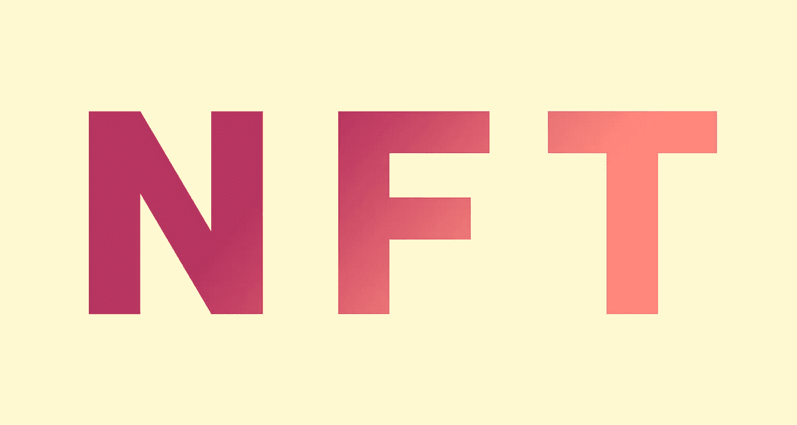
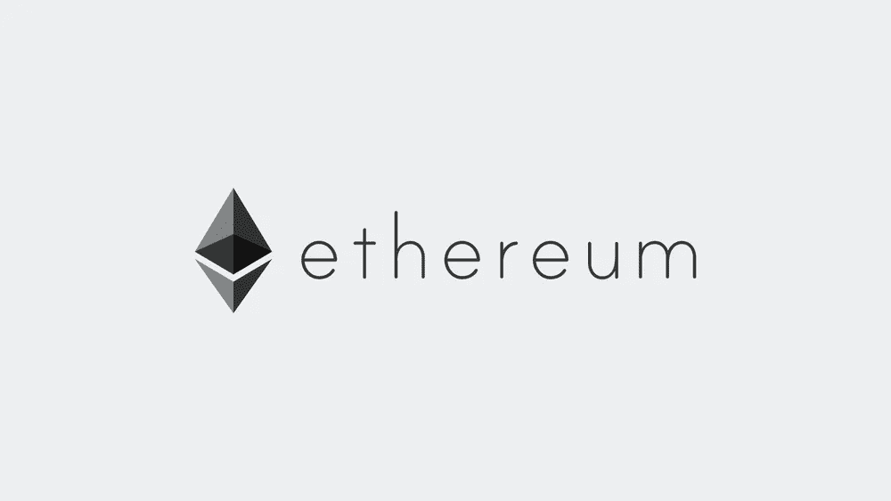
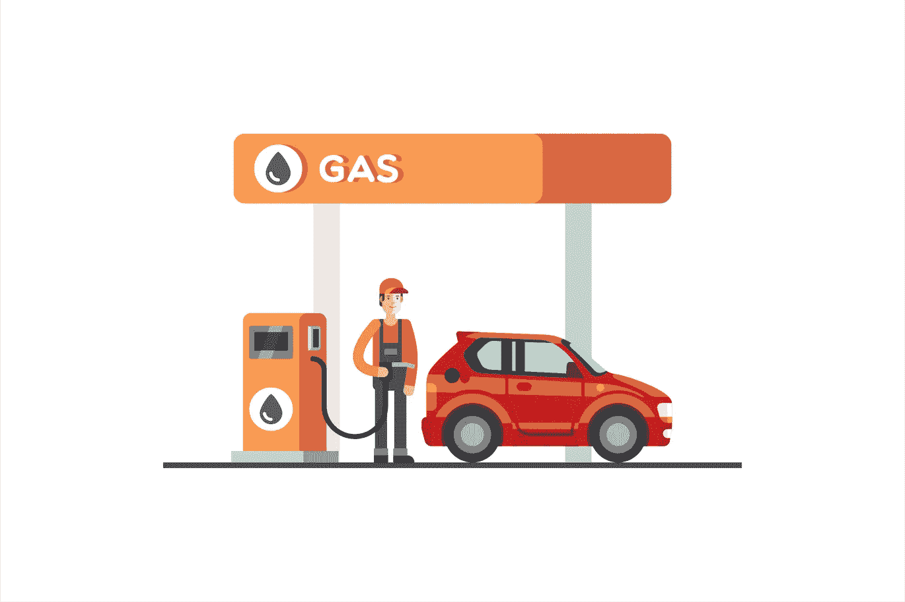
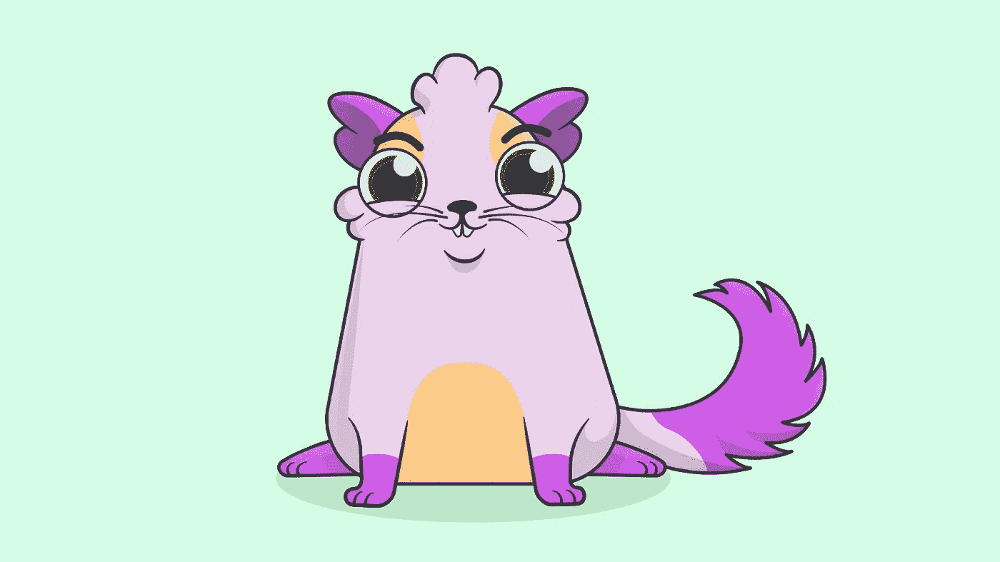

# 对 NFTs 的深入解释

> 原文：<https://levelup.gitconnected.com/in-depth-explanation-on-ntfs-d9960db3df69>

关于 NFTs 的文章很多，但问题是，大家写的都是一样的东西。没有人真正深入研究 NFTs，没有人写它是如何工作的，以及如何创建一个，等等。

他们写的大概是这样的。

> NFT 是不可替代的象征。它是独一无二的，只能由一个人拥有。这就像交易卡等。

这不能很好地解释它。而是在这篇文章里，我想深入的解释一下**。我将从一点基础开始，然后解释如何创建一个。**

**基础对于理解 NFTs 非常重要。正因为如此，首先我们要了解以太坊区块链是什么。**

# **以太坊是什么？**

****

**景观以太坊标志**

**以太坊是一个开源的区块链软件。**

**您可以将区块链想象成相互连接的计算机，并在每台计算机中存储相同的数据库。**

**当您想要将数据添加到区块链的数据库中时，您必须进行一个**事务**。您创建一个交易并将其发送到区块链(计算机)。要使该交易成为区块链的一部分，你必须支付一些费用。这叫做**气费**。完成交易后，所有连接的计算机都会验证交易数据，并将其添加到区块链中。**

**以太坊网络中有一台名为**以太坊虚拟机(EVM)** 的单机。每个对以太坊网络有贡献的人都有一份 EVM 状态的拷贝。你可以把 EVM 想象成 Java 虚拟机(JVM ),但是是在区块链中。您可以在 EVM 上运行自己的应用程序。所以 EVM 应该有一种编程语言，对吗？**

**是的，有多种编程语言可以编译成 EVM 可以理解的字节码。最流行的是 [**实性语言**](https://soliditylang.org/) 。你为 EVM 编写的程序叫做智能合约。**

# **什么是智能合约？**

**智能合约是运行在区块链上的应用程序(实际上不止如此)。每个智能合约都有一些**功能**和一些**状态**。此外，这些智能合同有一个**地址**，就像你的钱包地址一样。**

**所以如果这些智能合约有地址，它们一定有余额，对吗？是的。智能合约有一个平衡，他们可以发送交易到区块链。你必须明白的最重要的事情是，智能合约不受某些用户的控制。他们只是运行代码内部的东西。**

**例如，您可以编写一个简单的智能协定，每次调用一个函数，它都会增加一些值。但是我们怎么称呼它的功能呢？你可能猜到了，我们可以用事务调用它们的函数。**

**编写智能合同并不难，尤其是如果你有编程背景的话。但是将智能合同部署到区块链会花费很多，我稍后会解释。**

# **煤气和煤气进料**

****

**不是这种气体。**

**区块链中的每一笔交易都要耗费汽油——进行交易、部署智能合约、读取一个值、两个值相加等等。**

**Gas 是验证和处理交易所需的计算能力。但是谁来验证你的交易呢？**矿工**。**

**Miners 使用一些特殊的硬件，以块为单位处理事务。作为交换，矿工获得**区块奖励**和**天然气费**。**

**这意味着你支付的天然气费用将会流向那些保护区块链和处理你的订单的矿工。**

**此外，不同种类的行动花费不同的气体计数。例如，向账户发送 ETH 比部署智能合约或在智能合约中做复杂的事情更便宜。**

**1 气的成本称为**气价**。如果一个汽油的价格是 1 ETH(不是真实的)，而你想做一笔 10ETH 的交易，你必须支付 10 ETH。**

**天然气价格以 **gwei** 为单位，即**0.000000001 th**。**

**汽油价格经常变化。天然气价格不是由开发商或矿商设定的。都是关于**交易量**。**

**如果许多用户请求验证交易，天然气价格将会很高，因为矿工将选择谁支付更多，并且一些最新交易的平均天然气价格将会是新的天然气价格。那样的话，汽油价格会比前一次高。这取决于**交易数量**。**

**标准交易成本**21000 汽油**。例如，您想向您的朋友发送 1 封邮件。你要付 21000 *气价+ 1ETH。**

**你可以在这里 找到**目前的天然气价格。****

**等等。这篇文章不是要解释 NFT 是什么吗？是的，它是。我们已经完成了更好地理解 NFTs 所需的基础知识。**

# **让我们深入研究 NFTs**

**你还记得什么是智能合约吗？你必须记住，因为 NFT 就是一个智能合约，它适用于 ERC-721 或 ERC-1151 规格。不要让 ERC-721 和 ERC-1151 吓到你，因为这其实很简单。**

**在本文中，我们将讨论 ERC-721 规范，因为大多数非功能性测试都是根据这一规范制定的。**

**因此，智能合约是在区块链上运行的代码，它具有一些功能和状态。**

**让我们创造一个 NFT。我将不会代码一个 NFT，但过程是一样的。**

**为此，我将使用一些小猫，因此我们的令牌将是一只小猫。**

****

**来自 CryptoKittes.co[的可爱小猫](http://cryptokitties.co)**

> *****写这篇*** *的时候没有动物受到伤害。***

**我们的小猫应该有一些属性，例如眼睛的颜色、皮毛的颜色、图案，还需要一个 **ID** 、名字，并且能够与其他猫繁殖。这意味着我们的 NFT 应该包含一个小猫对象，它包含了我们想要的所有属性。此外，我们应该能够创造新的小猫(第 0 代)，这个创造过程被称为**铸造**。最后，我们应该能够把我们的小猫转移给另一个主人**

**在这种情况下，我们的令牌是小猫。它有一个 **ID (TokenID)** 、名称和属性。幸运的是，ERC-721 规范包括 TokenID 和传递函数。接下来，我们必须创建一些**初始小猫**，例如 100 只，并且我们应该限制总共可以创建多少只猫，比如说 50，000 只。**

**为第 0 代创建一只小猫很简单，因为我们在智能合约中有一个函数可以创建随机小猫。第 0 代小猫将是所有下一代小猫的祖先。假设我们创建了 100 只第 0 代小猫，并添加到一个包含所有被创建或出生的小猫的列表中。**

**在这个 kitty 案例中，我们的函数是 **BreedKitten** 、 **CreateKitten** 、 **TransferKittenTo、SellKitten** 。我们的状态是**存储所有小猫**的列表。**

**但是我的小猫在哪里？**

**当我们创建第一批 100 只小猫时，我们在**所有者帐户**中创建了那些小猫(令牌)。所有者帐户通常是部署智能合同的帐户**。简单来说，owner account 就是你自己的以太坊地址。这意味着，如果我将这个智能合同部署到区块链网络，我将成为所有者，100 只小猫将是我的，耶！:)****

**现在，我有 100 个小猫代币。我能用这些做什么？我可以繁殖它们或者我可以把它们免费转让给另一个主人，或者我可以卖掉它们。**

**所以，是的，这是一个 NFT。可以是物体、小猫、绘画、声音、想象中的人等。我上面列出的所有东西都叫做代币。最初，我创建的代币是我的，我可以出售这些代币或将其转让给我的朋友。**

**最重要的是，每个代币都是互不相同的。这就是它们昂贵而有价值的原因。**

# **创造 NFT 要花多少钱？**

**在区块链进行变革的成本越来越高。这是因为越来越多的人正在学习和使用区块链技术。**

**比方说，我们创建了我们的智能契约并编译了它。我们有一个只有 EVM 能理解的密码。把这段代码寄到区块链要花一点钱。**

**你记得我说过什么吗？**

> **每笔交易都要花油钱(除了一两笔，如果我没记错的话)**

**向区块链部署智能合同需要消耗一些汽油。我们需要支付的第一笔费用是，**交易费用**。这要花 21000 油钱。第二笔费用是**创建操作**的费用。**

**创建操作只是为我们的智能契约创建一个地址。当我们部署智能合同时，我们需要访问它，因此它需要一个地址。因此，创建操作创建一个帐户，它有余额等，属于您的智能合同。**

**你的智能合同也对区块链有影响，对吗？我们也必须包括这些。你的智能合约的每一个字节都要花 4 块钱，你在智能合约中做的每一个操作都要花一些钱。**

**因此，总的来说，部署智能合同的成本最低(您可以在[这里](https://ethgasstation.info/)用当前天然气价格填写天然气价格)；**

**(32000 + 21000 +智能合约)气*气价=？？？$**

**在部署智能合同时，优化非常重要。在 [**实体文档**](http://docs.soliditylang.org) 中有一些提示。**

**部署和创建初始 NFTs 后，您可以将这些令牌放在市场上销售，或者创建您自己的网站并将您的网站用作市场。**

**“等等，我可以在 blabla.com 上免费创建自己的 NFT？”**

**是的，你也可以**免费创建 NFT**。但问题是，当你免费创建一个 NFT 时，你实际上并没有在创建它。当有人购买它时，它就产生了。**

**如果你有个人作品想要出售，免费创作是最好的选择。有真正受欢迎的市场，让你创造和销售 NFT。**

**如果你想创建 [**有限的朋克**](https://www.larvalabs.com/cryptopunks) 集合，或者给 [**增加一个功能，繁殖你的猫**](https://www.cryptokitties.co/) ，你大概想自己编码智能契约。**

****TL；NFT 是一个聪明的合同，在区块链运行，在那里做事情。****

**感谢您读到这里:)**

**如果您想更深入地了解，可以查看以下资源:**

*   **[以太坊的官方文档](https://ethereum.org/en/developers/docs/)**
*   **[Solidity 编程语言](https://soliditylang.org/)**
*   **[当前天然气价格](https://ethgasstation.info/)**

**以及一些流行的 NFT 收藏和游戏(用 smart sontracts 制作):**

*   **[隐猫](http://cryptokitties.co)**
*   **[隐朋克](http://larvalabs.com/cryptopunks)**
*   **[月饼提示](http://mooncatrescue.com/)**
*   **[Sorare](http://sorare.com)**
*   **[NBA 顶级投篮](http://nbatopshot.com)**