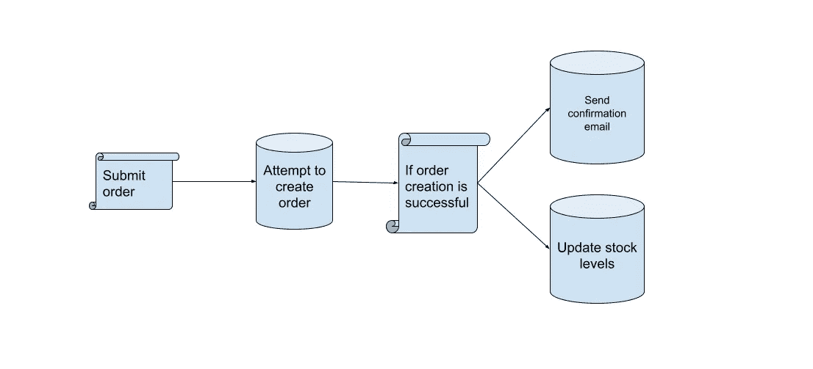

# 用 C#和深入实现 Azure 服务总线。网

> 原文：<https://levelup.gitconnected.com/in-depth-implementation-of-azure-service-bus-with-c-and-net-9f52948ec1d7>

## 如何设置服务并处理主题和订阅

麦克斯韦·尼尔森在 T2 的照片

如果你是 Azure Service Bus 的新手，或者你不知道它到底是如何工作的，我建议你阅读[我关于这个主题的文章](https://blog.devgenius.io/message-broker-architecture-what-is-it-and-how-does-it-work-60a62f8ce784)，这样你就可以更好地理解整个架构以及队列、主题和订阅是如何工作的。这将有希望使这里讨论的事情更清楚。好了，现在，让我们开始吧。

## 主题和订阅

例如，我们将使用上图所示的场景。首先，订单正在创建，如果订单确实成功创建，我们将发送消息向客户发送确认电子邮件，并更新产品库存水平。

主题和订阅背后的基本思想是你有一个主题和几个听众(订阅者)。因此，我们需要创建一个*订单服务*，我们将使用将消息添加到服务总线中，还需要创建一个*订单电子邮件消费者服务和订单股票消费者服务*，它将监听任何消息并相应地采取行动。

最后，在我们开始编写代码之前，我想澄清一下,*主题*和*订阅*的创建将通过编程完成，因为如果团队中有人删除了主题或订阅，在 Azure Portal 中直接创建它们可能会导致问题，这将导致代码中出现错误，因为您试图连接到不存在的*主题/订阅。*

**创建主题**

这将是我们的 OrderService，并将使用 AddMessage 将消息发送到服务总线，其中*电子邮件消费者*和*股票更新消费者*监听任何传入的消息。

构造函数所做的是获取*服务总线连接字符串*，然后如果主题还没有创建，就用它来创建一个新主题。

如果你想知道 enum 是什么，它将包含我们拥有的所有不同类型的消息-目前是电子邮件和股票。

**添加用户**

对于这个例子，我们需要创建两个*消费者服务*，但是为了保持简洁，并且第二个服务几乎完全相同，我将只放其中一个，希望这一切都有意义。

势不可挡，对吧？当你开始阅读代码时，它并不那么糟糕。现在，您可能会发现，我们也在对该主题进行检查，看它是否存在。这是因为如果你运行多个微服务，可能会有一个比另一个快，如果我们的*电子邮件服务*在这种情况下更快，它会在尝试连接到尚未创建的主题时抛出错误，因此检查该主题并继续订阅它是一个好习惯。

这里另一个奇怪的部分是我们可以看到设置的过滤器和规则。如果我们回到前面的代码示例，我们将消息添加到*服务总线*中，我们可以看到我们正在将类型添加到消息的*用户属性*中。我们在这里做的是在订阅上设置一个过滤器，只接受我们想要的特定类型的消息，在我们的例子中，是 *Email* 。

现在，您可以省去过滤器，接收所有消息，然后在 *ProcessMessagesAsync* 中进行检查，查看类型是否为 *Email，*但这并不高效，因为如果流量很大，您会强制服务对数百或数千条消息进行检查。因此，最好的方法是添加一个过滤器来阻止任何不属于服务本身的消息进入。

最后， *ProcessMessagesAsync* 方法会将消息反序列化为我们想要的对象，然后将该消息传递给 *EmailDomain* ，在这里我们可以实现我们想要的逻辑。

有效载荷看起来像这样:

如果我们要做的是 *StockUpdate 服务*,那么有效负载应该是这样的:

在这里您将传递订单上的*产品 Id* 和*数量*，以便您可以相应地进行调整。

**队列**

这篇文章是专门针对主题和订阅的，但是我只想提一下这两者和队列之间的区别，如果有兴趣的话，我可以写另一篇文章更侧重于队列和预定队列。

虽然这个主题支持多个接收者(订阅者),但是队列只限于一个。此外，如果你只使用 Azure 服务总线的基本层，你将只有队列，而你需要为主题付费。

但是撇开价格不谈，如果您有对时间敏感的大量数据，您可能会更喜欢主题，因为扩展能力很强，而队列的可伸缩性有限。

然而，对于低容量和非时间关键的消息，并且可以在队列中停留更长时间而不会成为问题，您可以很好地使用队列。