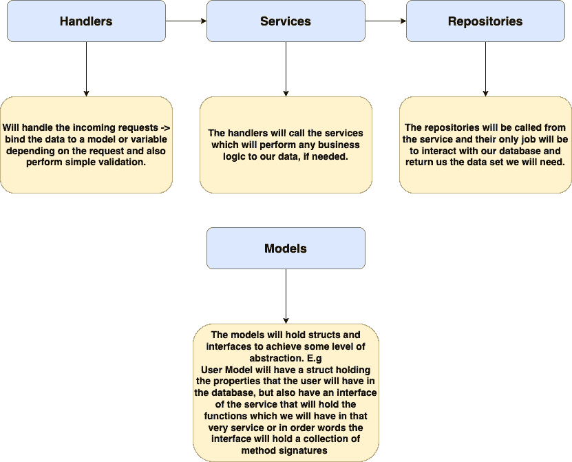
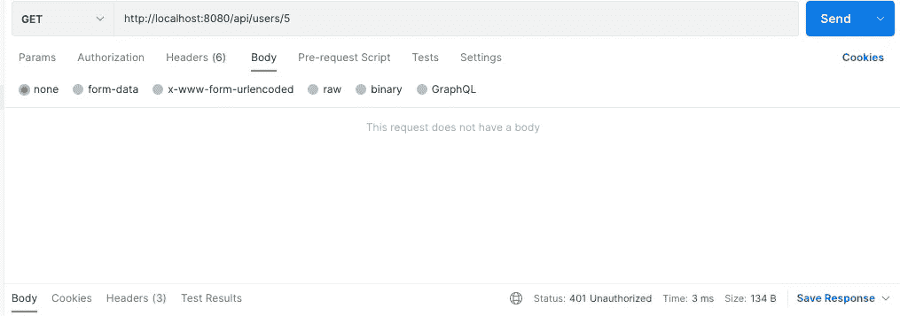
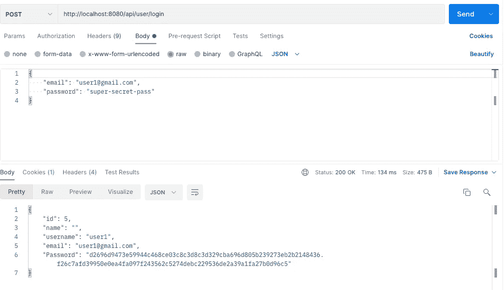
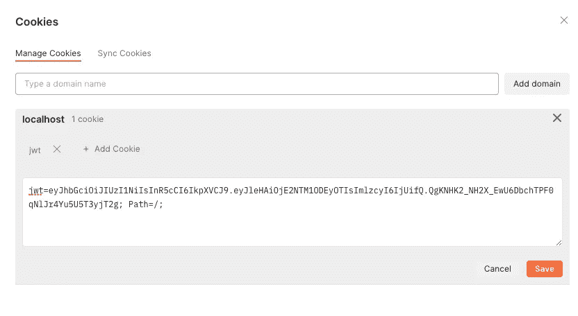
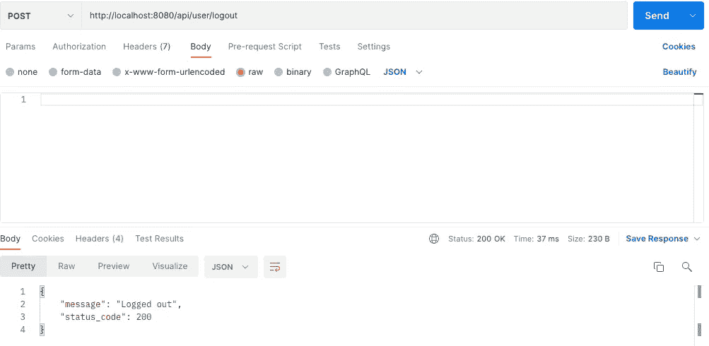

# 在 Go with REST APIs 中深入实现 JWT 认证

> 原文：<https://levelup.gitconnected.com/in-depth-implementation-of-jwt-authentication-in-go-with-rest-apis-8a437be3a54b>

## 如何设置您的应用程序的分步指南


穆罕默德·拉赫马尼在 [Unsplash](https://unsplash.com/photos/gA396xahf-Q) 上的照片

## 介绍

在本文中，我将向您展示如何设置您的 Go 应用程序并使用 REST APIs 实现 JWT 认证。这篇文章可能会有点冗长，所以我将跳过你实际安装 Go 本身所需的不必要的前两步，因为你可以在[他们的网站上找到它，而且设置](https://go.dev/doc/install)非常容易。所以事不宜迟，我们开始吧。

## 我将使用的技术

在整个应用程序中，我将使用 Go 进行以下操作:

*   一种数据库系统
*   ORM 库
*   Gin Gonic (HTTP 框架)

## 文件夹结构

```
Go Project|--handlers|   |--middleware|   |   |--auth.go|   |—data_bind.go|   |—handler.go│|   |—user.handler.go|--modesle.|   |--apperrors|   |   |—app_errors.go|   |   |—field_errors.go|   |   |—http_errors.go|   |—user.go|—repositories|   |—user_repository.go|—services|   |—user_service.go|   |—passwords.go|—data_sources.go|—injection.go|—main.go
```

这将是我们将使用的基本文件夹结构，下面是它的一个更详细的视图:



考虑到这一点，让我们开始编写代码吧！

## 创建一个简单的。环境文件

首先，只需创建一个简单的。env 文件，这样我们就可以将所有敏感数据放在一个地方，并相应地填充数据。对我来说，用 PostgreSQL，Database_url 看起来是这样的→*PostgreSQL://postgres:example password @ localhost:5432/postgres*

## 连接到数据库

既然我们已经解决了。env 文件最简单的方法是用下面的代码创建我们的 data_sources.go 文件:

## 设置用户模型

之后，我们可以创建用户模型，如下所示:

所有这些都是用适当的字段设置用户结构，这些字段将在我们进行数据库迁移时使用。唯一特定的字段是*用户名*和*电子邮件*，因为它们都必须是唯一的。

IUserRepository 和 IUserService 是我们前面提到的两个接口。他们所做的基本上是说，在我们的用户服务中，我们将需要以下 3 个方法:

*   GetUserById
*   注册
*   注册

在用户存储库中，我们将拥有:

*   GetUserById
*   创建用户
*   FindUserByEmail

因此，当我们实现它们时，我们不会忘记添加这些方法，因为我们有义务这样做。

## 设置密码服务

这个真的不言自明。它可以散列密码以获得额外的安全性，并将实际密码与用户提供的密码进行比较。

## 实现用户服务

既然我们提到了用户服务，我们不妨接下来实现它。

好的，除了一些错误检查，这里没有什么特别的。如果您想知道——是的，登录应该会给我们返回一个 JWT 令牌，但这将发生在处理程序中，所以让我们快速添加存储库文件并进入身份验证。

## 添加用户存储库

这里也没什么特别的。我们可以通过 id 或电子邮件检索用户，我们可以在注册时创建一个新用户。

## 错误文件

在进入最后一部分之前，我将删除这些在最后几个文件中使用过的 app_errors 文件，您可能想知道它们到底是什么。不用担心，他们只是帮助者，会帮你返回一些合理的错误给用户。

## 应用程序错误文件

## 现场错误文件

## HTTP 错误文件

## 中间件

现在我们已经讨论了令人厌烦的错误处理，让我们看看我们的中间件。

我们的 auth.go 文件的惟一任务是从请求中提取 cookie，检索其中的 JWT 令牌，然后验证该令牌。如果令牌无效，我们将返回“未授权”。

我们快到了！

## 添加处理程序

我们要做的第一件事是添加数据绑定文件，这样我们就可以处理我们的请求。

它基本上获取传入的 JSON 并将其绑定到一个结构。

那么我们将需要:

*   用户处理程序

因此，这里我们将实际绑定传入的请求，并做一些基本的验证，如修剪空间等。还要检查必填字段是否存在。

这里重要的部分是在登录函数中，我们在 Cookie 中设置了神圣的 JWT 令牌。如果在我们调用我们的用户服务来登录我们的用户之后一切顺利，我们将给他一个 cookie，他稍后将使用它来发出请求，正如我们稍后将在 Postman 中看到的。

我们还需要我们的主处理程序，这样我们就可以处理所有的路线。

*   处理者

好了，这里我们有 3 个端点，GetUserById 使用我们创建的 Auth 文件，这意味着如果我们没有登录并拥有 cookie，我们将无法检索用户——我们稍后将对此进行测试。

我们已经接近终点线了，现在我们只需要在跳进 Postman 之前完成我们的 injection.go 和 main.go 文件。

## 添加注入文件

这真的没什么意思。它只是初始化我们所有的不同层。显然，随着应用的增长，您需要在这里添加新的服务。

## 最后添加 Main.go

main.go 是应用程序的入口点。它将初始化数据库，注入我们在注入文件中添加的所有这些服务，并启动您的服务器。

就是这样！(只花了一分钟，嗯？).最后，让我们跳到 Postman 上，看看这些是否真的有用。

## 测试注册 API


注册 API 确实创建了一个用户，现在一切看起来都很好。首先，让我们尝试在不登录的情况下检索该用户。



我们得到了一个状态代码“401 未授权”,这正是我们所期望的——太好了！

## 测试登录 API



于是，我们登录了，还得到了一块饼干。



现在，如果我们再次尝试检索用户，它应该允许我们这样做。


有了 cookie，我们可以轻松地检索到用户。

## 注销

最后，我们还可以注销，就像将 JWT 设置为空字符串一样简单。



## 结论

我真的希望这对你有所帮助，如果有任何问题，请不要犹豫留下评论，我会尽我所能帮助你。

我还建议按照文件夹结构创建所有文件，如果你在实现所有文件之前已经检查了所有代码，不要太担心，因为你可能还没有创建文件。

此外，如果你喜欢这篇文章，并考虑加入媒体，探索平台上所有伟大的内容，这将是非常有益的，如果你可以使用我的推荐链接，所以我可以继续创造这样的内容。祝你愉快！

[](https://medium.com/@ivan.zstoev/membership) [## 通过我的推荐链接加入 Medium-Ivan Stoev

### 作为一个媒体会员，你的会员费的一部分会给你阅读的作家，你可以完全接触到每一个故事…

medium.com](https://medium.com/@ivan.zstoev/membership)