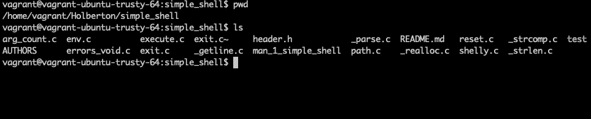
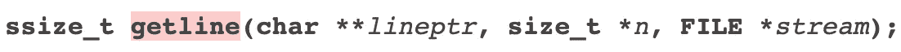
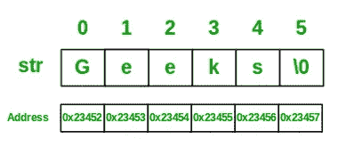
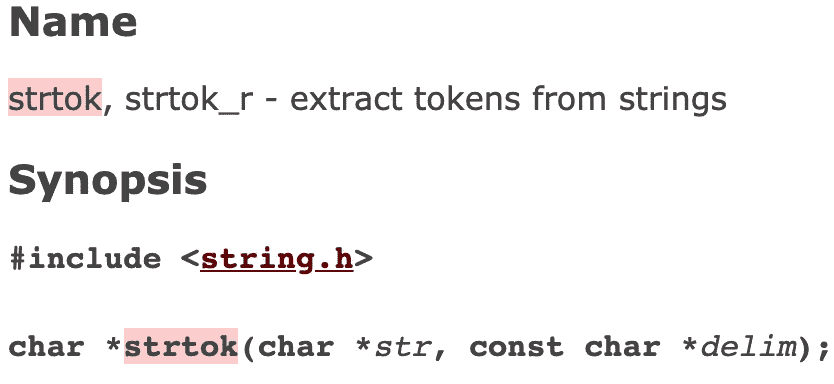
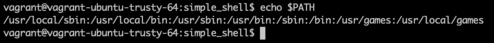
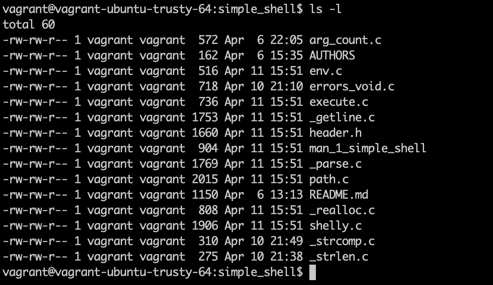

# 在您的外壳中:ls -l

> 原文：<https://levelup.gitconnected.com/in-your-shell-ls-l-2ba54eecb024>


不要害怕你的终端，它只是另一种与电脑互动的方式。

我们又来了，把 GUI 的安全性和鼠标令人安心的点击(或者更可能是触控板的无声敲击)留给了终端未知的黑暗。现在，如果你的年龄足够大，可以从 DOS 引导程序，你可能会感觉好一点，甚至怀念等待你发送指令的黑屏。如果没有，即使你除了点击之外从来没有以任何方式与计算机交互过，也不用担心，一旦你掌握了语法，这个终端就很简单，在遇到麻烦的时候会非常有用。在今天的课程中，让我们深入了解一个简单的过程，列出当前文件夹中的所有文件以及附加信息。

首先，终端是一种与计算机交互的方式的通称，它不需要使用鼠标(图形用户界面或 GUI)。许多不同的程序都可以访问终端，包括机器自带的默认程序。当你打开你的终端时，首先映入眼帘的是一个提示符，不管它是标准的 bash、iterm、fish shell，还是其他任何终端程序。这个提示将由 PS1 提供给您，它是一个包含默认提示值的环境变量。在最近的一个项目中，我有机会与 [@mechantkelsie](https://twitter.com/MerchantKelsie) 一起构建我们自己的非常基本的 shell 程序，对于我们在 PS1 的基本提示，我们使用了一个简单的$。我们很有钱，你说呢？

当然，提示符要求输入，这取决于用户提交。首先运行一个非常简单的命令，让您知道您在文件结构中的确切位置。如果您对此感到疑惑，您可以使用类似 pwd(打印工作目录)的命令来查看您当前的文件路径，输出可能类似于/home/vagger/Holberton/simple _ shell。现在你知道你在哪里了，你可能想看看你当前文件夹中的文件。为此，您可以使用基本命令 ls (LS)来列出目录内容。无论您在命令行上输入什么命令，如果它们是有效的，并且您对机器有正确的访问权限，它们将为您执行，然后会提示您输入更多的内容。



PWD 和 LS 的一个例子

# **深入查看命令 LS -L**

这不是魔法，终端也不是黑匣子。您可以查看一下执行 ls -l 的情况。执行命令的第一步是让终端接收您在命令行上输入的内容。无论你输入什么，都会被一个名为 getline()的函数接收。Getline 设计用于从文件流中获取输入，通常是标准输入(STDIN)，然后将它作为完整的空终止字符串存储在一个行指针中。



来自 man 3 getline 的 getline()原型

好了，稍微深入一下，正如我们在上面的原型中看到的，getline 期望一个双指针(lineptr ),它指向一个可以保存字符的数组。我们通常称之为用来保存用户输入的缓冲区。如果你觉得这纯粹是胡说八道，可以这样想，缓冲区就像计算机内存中的一排盒子，每个盒子里可以放一个字母(abcd)，一个符号(/-)。、“”等)，或者空格。

Getline 将接收您的命令，并每次将一个字母或符号放入我们的一排盒子中。如果已经创建了我们的缓冲区，那么 n 将是现有缓冲区的大小(以字节为单位),因此 getline 可以确保我们没有接收超过我们所能容纳的数据。如果用户输入超过了我们的缓冲区所能容纳的，getline 将重新分配我们的缓冲区，为所有用户输入提供足够的内存。

另一方面，如果我们还没有设置缓冲区，并且 lineptr 为 NULL(没有指向任何地方，因为缓冲区不是预先创建的)，getline 将使用 malloc 为我们的用户输入分配内存。在这种情况下，不需要 n，因为 getline 会为输入分配足够的内存。getline 中的最后一个参数是文件流，在我们的例子中是命令行输入的 STDIN。



geeks 为 geeks 提供的一个关于字符串如何存储在数组中的例子。

好了，我们已经有了一个提示，我们已经输入了一些文本，这比写一篇中型文章要容易得多，但是现在呢？好了，现在 getline 将把我们的空终止字符串交给一个名为 string token 或 strtok()的函数。strtok()是一个函数，它将把 getline 中的字符串分解成令牌或小的独立参数，以便我们的机器可以执行它。

当您键入类似 ls 的内容来列出当前目录中的文件时，由于 strtok()，这个命令变成了一个新的参数数组中的一个标记。另一方面，如果你输入类似 ls -l 的东西，那么我们在参数数组中有两个标记，一个是 ls，一个是-l。



String Token 或 strtok()是一个函数，用于将字符串分解成令牌参数。

现在有了一个令牌数组，我们可以开始寻找我们的参数零，它将是我们的命令名，这样我们就可以执行我们的命令。第一步是检查当前环境，看看我们的第一个参数是否是别名。别名是一个(通常很短的)名称，shell 将其转换成另一个(通常较长的)名称或命令。别名是用户创建的，通常放在~/中。bashrc (bash)或者~/。tcshrc (tcsh)启动文件，以便它们可用于交互式子 they。

这个步骤的一个附加部分是检查任何特殊字符，例如`"`、`'`、```、`\`、`*`、`&`、`#`等。这里需要特别注意的是星号*，因为这个字符是一个“通配符”，这意味着我们可以使用它来查找多个与模式匹配的内容。我之前有一篇关于使用 ls *的帖子。c [这里](https://medium.com/@TMcMac/iframe-src-https-giphy-com-embed-brzz8uavaatrk-6b5a364954b0)，它解释了一点关于通配符扩展。

如果我们处理的不是别名，那么系统会继续检查我们的第一个参数是否是内置的。内置(或内置命令，或 shell 内置)命令或函数是 shell 本身的一部分。该命令是 shell 程序的“内置”命令，因此不需要外部程序来运行该命令，也不需要创建新的进程。有趣的是，alias 本身实际上是内置的，help 和 echo 也是。



ubuntu 14.04 虚拟机中的默认路径示例

如果我们已经做到了这一步，那么是时候寻找命令的可执行版本了，这意味着我们需要访问 PATH。PATH 是 Linux 和其他类似 Unix 的操作系统中的环境变量，它告诉 shell 在哪些目录中搜索可执行文件，以响应用户发出的命令。在我们的 ls -l -a 命令的例子中，我们将在/bin 文件夹中找到我们的可执行文件，幸好它在我们的默认路径上。系统处理路径的方式是，在每个文件夹中查找与第一个参数 ls 匹配的文件。

因此，如果您查看上面我的默认路径的图像，您将首先看到，我的 shell 将查找/usr/local/sbin/ls，但它找不到它，因为该文件不存在。然后，它将检查/usr/local/bin，同样，它将无法找到该文件。这个过程将一直继续，直到我们只到达/bin，因为有一个/bin/ls 和一个可执行的 ls 函数，或者直到它用尽了路径而没有找到匹配，从而给我们一个错误:command not found。

现在我们已经有了可执行文件，是时候分叉我们的流程并运行我们的可执行文件了。分叉是一个进程，通过它，外壳可以完全克隆其当前进程，然后让“子”进程执行特定的命令或程序，而“父”(原始进程)等待甚至继续并发执行。用 fork()创建一个子进程对于一次运行许多任务来说是很棒的，这也是我们如何访问 execve()的方法，execve()是一个允许你劫持当前进程并让它运行其他东西的函数。

在我们的例子中，它的工作原理是这样的:我们的父进程在找到了可执行文件/bin/ls 之后，将会分叉，这样子进程就可以调用 execve()，execve()将会接管子进程并运行/bin/ls。当子进程运行时，我们的父进程等待子进程终止。我们这样做是为了让父进程可以准备好返回到我们的 PS1 提示符并接受您的下一个命令。子进程继承了父进程的所有东西，将使用我们的/bin/ls 命令和任何附加参数调用 execve()，在这种情况下是我们的-l，execve 将执行/bin/ls -l。

用户在这里输入 ls -l，由 shell 读取，然后标记为 ls 和-l。第一个标记由 PATH 环境变量转换为/bin/ls，并进行检查以确认可执行文件存在。然后，一个子进程使用参数变量-l 运行进程/bin/ls。ls 将列出当前工作目录中的所有文件，而-l 以长格式显示这些文件。一旦该过程完成，我们的输出将如下所示:



正如您所看到的，一旦输出了文件列表，我们就会看到一个新的提示，等待下一个命令来重新开始这个过程。好吧，我希望这个命令行下的小小窥视有助于更深入地了解所有正在发生的事情，即使是像 ls -l 这样简单的命令。