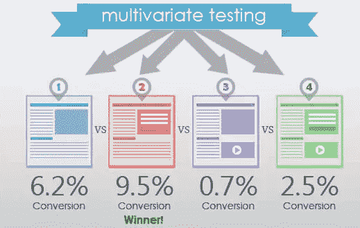
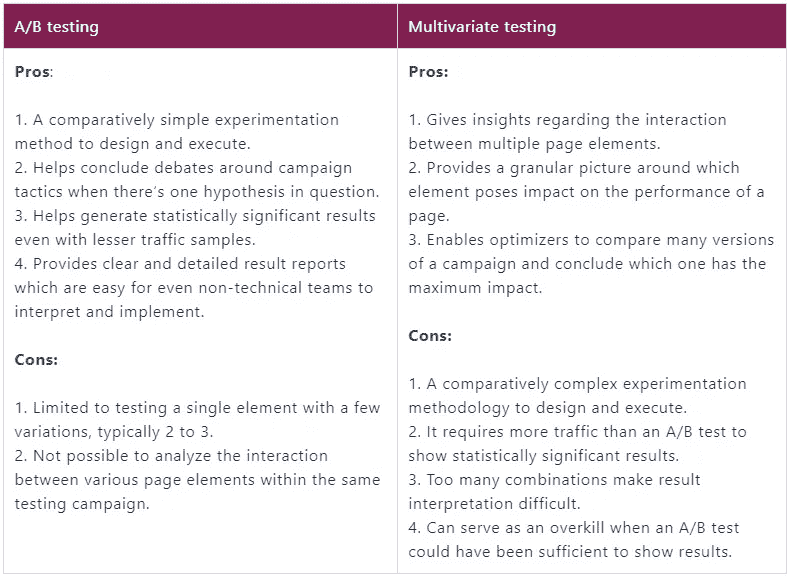
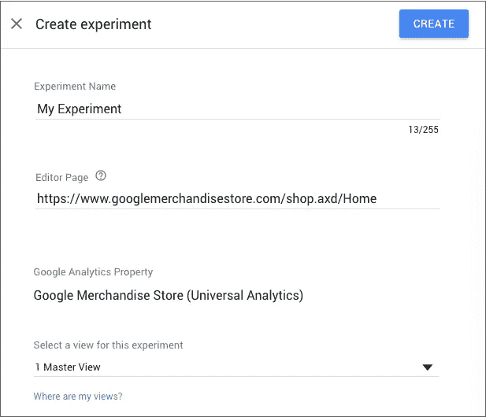
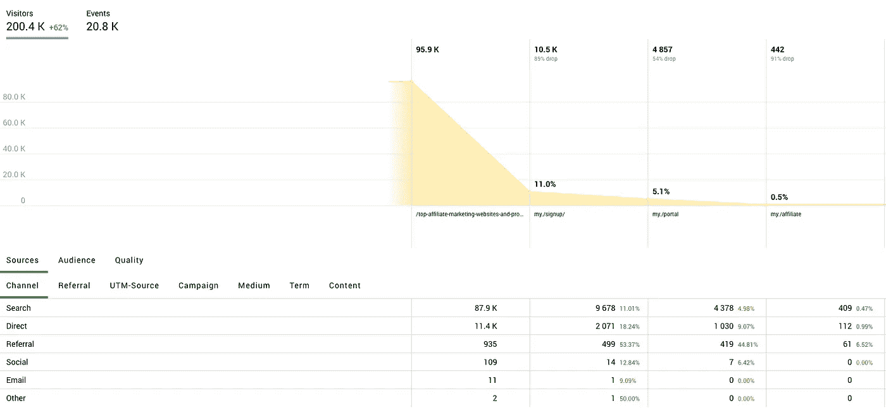

# 将多元测试整合到您的 Web 开发中

> 原文：<https://levelup.gitconnected.com/incorporating-multivariate-testing-into-your-web-development-6d483e3d6b7a>

建立网站最常见的问题之一实际上根本不是技术问题，而是发现你的想法最有可能引起你的观众的共鸣。虽然 [A/B 测试](/the-engineering-problem-of-a-b-testing-ac1adfd492a8)已经成为一种测试不同设计的流行方式，但 web 开发很少是二进制的，并且有可能忽略获胜的小部件和更重要的行动号召。这就是多元测试介入的地方。

多元测试让我们能够在网页上展示我们所有的想法，让我们更全面地了解什么可行，什么不可行。它可以帮助 web 开发者优化他们的页面，产生更稳定的流量。但是到底什么是多元测试呢？如何实施？它与传统的 A/B 测试有什么不同？

# 什么是多元测试？

多元测试是一种测试假设的技术，其中许多不同的变量可以被修改。最终，多元测试旨在揭示哪些变量组合表现最佳——基于访问者如何与不同页面进行交互。

从根本上说，大多数网站和移动应用程序都是由许多可变元素组合而成的。多元测试将改变这些元素——这可能涉及同时改变一个小部件和一张图片。理论上，图片的三种变化和两种不同的标题可以组合起来创建六个版本的内容，然后可以对其进行测试，以找出哪种变化在页面上停留的时间最长或点击最多。

*(图片:***)**

*在上面的例子中，我们可以看到多变量测试呈现了网页的四种不同变化，选项二实现了 9.5%的转化率——与其他呈现相比，这是一个很大的数字。*

*在这方面，多变量测试的[公式](https://www.optimizely.com/optimization-glossary/multivariate-testing/)可视为:*

****[[元素 A 的变化数]X[[元素 B 的变化数]…=[变化总数]****

*多元测试在许多方面与 A/B 测试相似，但在为网站所有者提供的洞察力层面上，多元测试更加全面。记住这一点，让我们探索这些差异，看看多元测试如何成为一种更有效的方法来衡量你的现场元素的吸引力。*

# *探索 A/B 检验和多元检验之间的差异*

*虽然 A/B 测试已经成为通过比较两种不同的设计和布局来找到优秀网页的一种众所周知的方法，但测试和优化公司 wide mile T1 认为，根据你的网站目标，多元测试可能是一种更有效的方法。*

*Widemile 承认，A/B 测试对于“测试两个或更多完全不同的页面”可能是完美的，该公司认为这对于找到所谓的“全局最大值”更有效优化领导者认为，对于多元测试，当涉及到向“局部最大值”精炼页面时，更有效*

*考虑到这一点，A/B 测试是测试两个完全不同的想法的好方法。因为这是一个分割测试，你可以清楚地知道更多的用户使用什么样的设计。多元测试是不同的，因为顾名思义，它采用了设计风格、图像、标题和小部件的多种变化，并将它们结合起来，以提供对哪些特定功能效果最好的更全面的洞察。*

*当然，如果你心中有两个不同的设计，多元测试可能不是一个强有力的解决方案，因为成功的图像可能会与更广泛的页面设计冲突，产生一个误导性的弱评分。考虑到这一点，甚至值得[网站开发人员](/what-are-the-good-ways-to-learn-web-development-cf7d5e6b7a6e)在用多元测试提炼出获胜布局之前，使用 A/B 测试作为初步功能。*

**

**(图片:***)***

**正如我们从上图中看到的，每种方法都有不同的优点和缺点，所以在你的方法中加入 A/B 测试和多变量测试当然是值得的。**

# **创建多元测试**

**有许多多元测试平台[可供选择来帮助优化你的网站，但是为了这个演练的利益，让我们来看看流行的 Google 优化向导来设置多元测试:](https://bestpersonalizationservices.com/best-multivariate-testing-tools/)**

1.  **首先，进入你的优化账户(主菜单>账户)**
2.  **点击一个容器，进入实验页面**
3.  **单击+按钮，并从列表中选择多元测试**
4.  **设置一个实验名称**
5.  **进入编辑器页面——它不会帮助您创建变体**
6.  **选择一个谷歌分析视图用于实验**

****

***(图片:* [*支持。谷歌*](https://support.google.com/optimize/answer/6370723?hl=en) *)***

**一旦您为您的实验命名并选择了编辑器页面，您将在草稿模式下看到实验细节页面。这是您可以为多变量测试创建新变量的地方。这个过程很大程度上类似于[创建 A/B 测试](/a-b-testing-in-react-native-has-never-so-easy-firebase-is-here-67836a35e0d3)变体的过程——然而，在这里，您为每个部分创建新的变体。**

**一旦你点击“创建”，谷歌优化将为您提供一个部分和组合选择器。该平台使用您输入的编辑器页面作为“原始”页面，并创建两个部分来开始该过程——每个部分至少包含原始页面中的两个变体和一个新变体。**

# **如何最好地利用多元测试**

**既然你已经知道了如何在 Google Optimize 中实现多元测试，那么让我们来看看如何最好地利用这种方法。进行一些分析以确定您实际测试的内容是很重要的。一定要及时完成你的实验，以便你开始从中学习。**

# **从分析中学习**

**在你考虑运行你的测试之前，一定要看看网络分析平台，看看你应该测试什么。像 [Google Analytics](https://analytics.google.com/analytics/web/) 和 [Finteza](https://www.finteza.com/en) 这样的平台可以帮助你了解访问者如何与你的网站互动，以及他们浏览你的页面的方式。**

****

**通过利用 web [analytics](https://levelup.gitconnected.com/tagged/analytics) 来更好地了解点击来自哪里以及它们将去往哪里，你可以更好地了解你的页面的哪些区域需要改进，以及哪些元素优于其他元素。从根本上说，没有数据，你就无法优化你的网站。**

# **建立明确的目标**

**花点时间反省一下。你希望实现什么？你想解决什么问题？为自己设定明确的目标是未来成功的关键起点。**

**你想增加订阅你的时事通讯的访问者的数量吗？或者你是想尽量减少反弹的数量？虽然这两个目标一般都是指网站优化，但它们可以通过明显不同的方式来实现。**

**尽管这看起来不言自明，但重要的是你要花一些时间来思考你到底想要实现什么，考虑你想要实现什么，并看看你能改进什么来实现它。**

# **问问你自己为什么你表现不佳的网页表现不佳**

**假设你已经分析了你的网站，并意识到你的问题是时事通讯注册行动号召。你的目标是让更多的人注册，但是一个重要的问题是，为什么这个按钮一开始就不够好？**

**每个人都能看到你的注册链接吗？有没有给他们足够的动力去报名？他们是否在接洽后没有给你提供电子邮件地址？如果你认为你知道 CTA 为什么[表现不如](/5-ways-to-improve-your-sites-performance-2b8f0fa2e70b)的原因，而没有先检查，你是在凭猜测建立你的页面。一定要使用你的[分析洞察力](https://github.com/dwyl/learn-ab-and-multivariate-testing)来更好地理解正在发生的事情，如果可能的话，观察真正的访问者如何与你的页面互动。**

# **构建您的变体**

**现在我们已经到达了你利用多元测试的商业终点。基于你认为网站的哪些部分让你失望，是时候决定如何改变你的页面，使之变得更好。**

**尽量避免将页面结构剥离并一次性测试所有内容的诱惑。记住，你使用的变体越多，为了获得有意义的结果，你需要更多的访问者来访问你的网站。考虑到这一点，让我们看看你认为真正有影响的是什么。**

**把多元测试看作是一个微调过程，以便让你的网站发挥最大作用。你可以用数据来观察访问者如何与你的页面互动，[开发出](/getting-started-in-web-development-b7b3322cd536)前瞻性的解决方案，将被动浏览转化为积极的行动。**

**通过采用多元测试，有可能超越 A/B 测试的限制，探索与受众互动的多种方式。反过来，这也是最有效的优化页面的方法之一。**