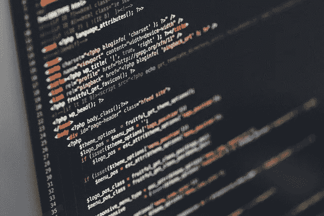

# 学习编码时融入自我同情

> 原文：<https://levelup.gitconnected.com/incorporating-self-compassion-while-learning-to-code-b12722d39754>

自我同情是一个有内涵的词，根据阅读这个词的人以及他们的生活经历和世界观，这个词可能有积极或消极的含义。对我来说,“自我同情”这个短语是由我约会的一个人引入的，他在我完成一个博士项目时积极地帮助我克服了我的冒名顶替综合症。一本非常善意的书作为礼物，导致我没有完全接受自我同情的含义，并导致我阅读心理学家的建议和研究，作为加强我的冒名顶替综合症的一种方式。我没有达到阻止这些负面想法并用相反的理性证据来反驳它们的预期目标，而是在我的脑海中放大它们，从而使我的冒名顶替综合症变得更糟。

自我同情是一个微妙的话题，但它可以归结为一些关键的要点(见克里斯汀·内夫博士的作品— [摘要链接](https://self-compassion.org/the-three-elements-of-self-compassion-2/#:~:text=Self%2Dcompassion%20entails%20being%20warm,flagellating%20ourselves%20with%20self%2Dcriticism.))。

1.  自我仁慈
2.  共同的人性
3.  留意

我没有像对待朋友、家人甚至陌生人一样善待自己，相反，我对自己说了一些侮辱性的话，降低了我的自尊，强化了我的骗子综合症。

我们都在脑子里说过这些想法，“如果你更聪明……”你不够格，“这份工作的其他人都已经知道这些了”，“他们都比我更适合”……这样的例子不胜枚举。在与另一个人的关系中，如果这些短语被不断地说出来，我们可以称之为辱骂、侮辱等等。我们会告诉一个朋友或家庭成员，让那个说那些不友好话的人尽快离开！但当这是一个内在的思维过程时，就不一样了。

图片来自 Pixabay 作者:Pexels(【https://pixabay.com/users/pexels-2286921/】T2)

几年后，我来到了这里，下班后在新兵训练营兼职学习编程，冒名顶替综合症再次抬头。

然而，这一次我反复阅读了这本书。在沮丧、怀疑和挣扎的时候，我向我的支持网络寻求帮助，学习编码来改变我的职业。学习编码并不容易，尤其是因为这是我从未想象过自己会追求的东西，而且我已经努力主动停止被学习一种新的思维和解决问题的框架所吓倒。

由于我只在男性主导的行业工作过，所以在某些方面，我已经做好了学习编码和从事网络开发的准备。我经常是工作或研究团队中唯一的女性，并且已经知道必须在持续学习的环境中工作的现实。

然而，学习编码、web 开发、敏捷和获得“进入技术领域”所必需的技能的旅程并不容易。不管你是谁，真正的在编码碰壁的时候挣扎着突破和坚持，努力调试，不怕分享代码。

清晨、漫长的白天和周末花在学习上，有时还会重新研究同一个概念或代码，直到它真正开始在我的脑海中出现，这可能会产生影响。

编程是困难的，主要是因为它需要不断地学习更多的东西，编写更多的代码，甚至当一个函数不工作或者你不知道语法错误在哪里时也要继续下去。

图片来自 Pexels 的 pix abay:[https://pixabay.com/users/pexels-2286921/](https://pixabay.com/users/pexels-2286921/)

虽然我对展示我的代码很有信心(或者老实说，有时是假装有信心)——特别是当有 bug 并且我被困在调试过程中时，那种感觉就像我在踩水而我的同伴可以游泳的冒名顶替者综合症不会消失。我只是习惯于寻求帮助，因为即使当我陷入一个我的同学似乎有信心解决的问题时，我仍然需要达到相同的最终目标。但是，如果我可以深呼吸，记住我的声音，简单地大声说我迷路了，我不知道从哪里开始调试过程，我不知道为什么一个功能不工作，或者我不确定我理解一个问题提示，那么我将获得我需要的帮助，从我的错误中学习(我犯了很多错误)，然后实现同样的目标。

正是在这些时刻，我深吸一口气，在课堂上大声说出来，向每个人承认我在努力，并主动分享我的屏幕，这样每个人都可以看到我检查我的代码，每个人都可以看到我的错误在哪里，我是如何组织和编写我的代码的，我得到了最有价值的反馈。

我已经在编写更有条理的代码，所以我不仅可以更快更容易地找到 bug 的位置，而且通过展示我的代码，我还可以战胜我的冒名顶替综合症。

我正在收集房地产检查数据，我通过把自己放在一个我正在学习、成长和善待自己的环境中来展示自我同情。通过在课堂上分享我的屏幕，并在观众面前一行一行地浏览 console.log()，我在敏捷和技术环境中变得更加舒适，并且我正在积极收集数据以对抗我的冒名顶替综合症。

收集数据来对抗冒名顶替综合症是学习编码的关键。通过与其他程序员、编码学生、教师或其他人联系，在一个建设性和支持性的环境中学习，我被推动成为一名更好的编码学生、未来的初级开发人员和更好的沟通者。我能够“说技术”，并以另一个第一次看我的代码的开发人员能够理解我的问题的方式交流真正的编程问题。我能够写代码，所以他们可以看到我的逻辑和我在想什么(以及评论-他们是一个生命的救星)。

图片来自 Pexels 的 pix abay:[https://pixabay.com/users/pexels-2286921/](https://pixabay.com/users/pexels-2286921/)

因此，自我同情可以是对抗冒名顶替综合症的一系列方法，这种微弱的声音会说你周围的每个人都更好、更快、更聪明，或者只是更符合成功编码所必需的心态。

相反，通过学习自我同情我的编码，我积极地将自己置于令人生畏的境地，比如非常公开地分享我在编码中的缺陷，但也接受反馈，并将其作为我足够好的证据。

我没有听他们的反馈来证明我的不足或证明我的同事比我更聪明或更适应技术，而是把他们的反馈作为他们承诺在我的编码之旅中帮助我的证据。

如果他们认为我不适合编程，那他们为什么还要浪费时间呢？如果我在代码方面如此糟糕，那么他们将对我的担忧漠不关心。相反，他们积极地帮助去 bug，给出他们如何度过挫折的建议，并分享他们自己与冒名顶替综合症斗争的故事。但是首先我要把我自己和我的代码公开给别人看。

我还有很长的路要走，我需要更多的自怜练习。我的工作还在进行中，但老实说，这是一个非常好的地方。如果我认为我是一个完美的人或者已经掌握了编程，那么我怀疑我会在技术方面走得太远。一个不断转变、变化和改进的行业需要灵活且能够不断学习的人。所以这是我将继续做的事情。

对于那些感到不知所措或正在努力学习编码，正在做出或面临重大生活变化，或只是需要帮助找到自我怀疑的负面想法的人来说，你并不孤单。我和你们在一起，还有许许多多还没有找到自己的声音或不能大声说话的人也在一起。而且很有可能那些看起来比你感觉的“更多”的人，内心也有类似的想法。我在衡量自己在坚持中的“更多”或“好”的水平，并最终继续成长和学习。

你的代码朋友，

雷切尔(女子名)