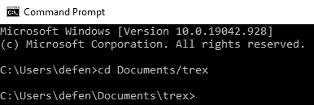

# 通过用水池挖掘以太坊来增加利润

> 原文：<https://levelup.gitconnected.com/increase-profits-by-mining-ethereum-with-pools-83eeef62b366>

停止用 NiceHash 获得比特币支付，登上以太坊列车


照片由[思想目录](https://unsplash.com/@thoughtcatalog?utm_source=unsplash&utm_medium=referral&utm_content=creditCopyText)在 [Unsplash](https://unsplash.com/s/photos/ethereum?utm_source=unsplash&utm_medium=referral&utm_content=creditCopyText) 上拍摄

我最近写了一篇关于[通过挖掘以太坊](/earn-easy-money-mining-ethereum-31dea7c1ed60)赚钱的文章，在文章发表后的几周内，以太坊继续打破所有时间的高价值记录。自去年这个时候以来，以太坊的价值已经增长了 2000%以上，而且没有放缓的迹象。伦敦叉将在 7 月引入乙醚燃烧，这将大大增加稀缺性。我知道许多密码爱好者非常看好以太坊，我绝对属于那个阵营。即使 ETH 2.0 网络即将出现，仍然有时间赚一大笔轻松的钱来挖掘以太坊。

# 是时候抛弃尼斯哈什了

许多新矿工可能会使用 NiceHash，这是一个使采矿变得简单的应用程序。NiceHash 的便利之一是，即使你的电脑可能在挖掘以太坊，它也可以用比特币支付。就在一个月前，即使你支付很少的费用，用比特币支付也是合理的，然而在我们当前的市场上，赚取以太币可能更受欢迎。

除了更喜欢以太坊支付而不是比特币，一旦你的以太坊被转换成比特币，NiceHash 会收取近 7%的费用。用水池采矿的成本要低得多，通常总计约为 2%或更少。

NiceHash 的主要优点是它是一个易于使用的应用程序，但是一旦设置完成，您将很快发现使用池进行挖掘也同样容易。在这篇文章中，我将讨论最佳可用池，以及为什么人们选择一个而不是另一个，然后我将深入挖掘你的硬件的软件。

# 采矿池


照片由[托马斯·帕克](https://unsplash.com/@thomascpark?utm_source=unsplash&utm_medium=referral&utm_content=creditCopyText)在 [Unsplash](https://unsplash.com/s/photos/pool?utm_source=unsplash&utm_medium=referral&utm_content=creditCopyText)

## 什么是游泳池？

采矿池只是一组协调的矿工，他们一起工作*汇集*计算资源——GPU——以增加找到区块的可能性。如果你不熟悉以太坊采矿的基本工作原理，看看我的 [Crypto 101 帖子](/crypto-101-in-2021-4aae9bca9f2d)。由于挖掘以找到一个块本质上是一场猜测正确散列码的比赛，所以拥有小型挖掘设置的个人解决一个块的唯一机会是一起工作。

## 游泳池是如何工作的

加入池的矿工借出他们的处理能力来增加池的总散列率。单个 RTX 3080 可以达到大约 100MH/s(每秒兆哈希)，但我的首选池目前的哈希速率为 112.4 TH/s(每秒 Terrahash)。很像数据存储，1 Terrahash 等于 1000 Gigahash，1 Gigahash 等于 1000 Megahash。这意味着当我写这篇文章时，有相当于 110 万个 3080 的散列值在以太网池中工作。

每个池都有自己的支付结构，但大多数使用一些估计你对解决一个区块的贡献，并根据你做了多少工作支付你一部分区块奖励。每个池都有自己的支出结构，所以请确保您选择的池有适合您的设置的支出计划！

## 泳池的缺点

到目前为止，游泳池听起来不错！我不能用我的 3080 独自开采以太坊，但是如果我跳进一个水池，我可以立即开始赚取以太坊。联营公司的缺点与我认为的区块链最重要的方面之一有关，即权力下放。

矿工对于维护比特币和以太坊等工作证明区块链网络至关重要，他们在网络节点中占很大比例。任何分散式系统的一个关键要素是，没有一个实体控制网络的大部分。一些网络，如以太坊经典，已经有一些所谓的 51%攻击发生多次。51%的攻击是当一个实体获得网络的大部分控制权时，这允许他们进行虚假交易，因为他们控制了网络。这种场景对于以太坊这样的老牌网络来说，绝对是毁灭性的；最后一次以太坊经典攻击重组了[超过 7000 个街区](https://www.coindesk.com/ethereum-classic-blockchain-subject-to-yet-another-51-attack)，本质上类似于重新整理历史。长话短说，如果任何密码是主流，它必须相对安全的 51%的攻击。

池的最大缺点是我们正在集中采矿控制。这可以非常清楚地被视为以太坊的 EIP-1559 更新的一个潜在问题，该更新将于 7 月份与[伦敦硬分叉](https://academy.ivanontech.com/blog/the-ultimate-guide-to-the-ethereum-berlin-hard-fork-and-london-hard-fork)一起推出。EIP-1559 意在降低几个月来暴涨的交易费用(汽油)；用户不再向矿工支付天然气费用，以将交易添加到区块中，而是将天然气费用作为*基本费用*发送到网络，然后烧掉。用户可以在气费中给矿工小费，但对矿工来说肯定有直接利润的损失；随着矿商利用 MEV(矿商提取价值),采矿可能仍然有利可图，MEV 利用矿商作为块状包装仲裁者的地位来增加他们的利润。

EIP-1559 值得拥有自己的职位，然而目前以太坊网络上超过 60%的矿业力量公开反对它的推出。这是由于几个大池发布声明，抗议 EIP-1559。如果这些大型池协调起来，他们可能会在以太坊网络上发起 51%的攻击，破坏平台的稳定。这是集中采矿控制的固有风险，它使网络暴露于协同攻击。这种情况不太可能发生，因为矿工会通过攻击自己的网络来伤害自己。这是一个焦土方法来解决这个问题，但它突出了集中区块链网络的危险。

# 水池采矿指南

# 池选项

有几个受欢迎的游泳池可供选择。有些泳池更适合世界上的某些地区，选择大型泳池或小型泳池各有利弊。总的来说，在比较池时，我们希望跟踪几个属性:使用费、支付费和最低支付阈值。外面有很多泳池，所以我选择了我最喜欢的三个，以便更容易选择一个。

> **注**:在采矿中，“运气”一词简单地指如果池子比预期的更早发现一个区块；基本上，如果我们发现一个区块的工作量比预期的少，运气就会上升。你会在很多泳池网站上看到这个指标，因为它是支出结构的一个因素。

## [**以太矿**](https://ethermine.org/)

在撰写本文时，Ethermine 是最大的可用池之一，速度超过 100 TH/s。使用游泳池只收取 1%的固定费用，当你拿到钱的时候，Ethermine 不会向你收取交易费。相反，Ethermine 在它们的块上挖掘你的事务，这降低了块效率和整体回报。降低区块效率会降低每个区块的总奖励，但这意味着以太矿支付给你时没有交易费。对于小型矿商来说，这可能是有利的，因为你可以接受较小的支出，而不必支付很大比例的费用。我将在下面通过与 Flexpool 的比较来进一步讨论这一点。

## [**Flexpool**](https://flexpool.io/en/)

Flexpool 是一个规模虽小但发展迅速的矿池，约为 6/s。它有一个可选的捐赠费用，默认为 1%，但如果您愿意，可以降至零。Flexpool 在短时间内获得了采矿社区的大量关注，因为它非常透明，并为矿工带来了更多利润。加入一个较小的池对网络来说也是非常健康的，因为它促进了去中心化。

Ethermine 和 Flexpool 之间的一个关键区别是，Flexpool 在向您发送以太坊时不会牺牲块效率来避免交易费用。然而，这意味着，在获得比以太矿更高的利润之前，你必须开采更多的以太矿来补偿 Flexpool 上的天然气费用。

如果你有一个强大的采矿作业，Flexpool 是一个梦幻般的选择；只要您的最低支出接近 0.2 ETH，用不了多久，您就可以通过 Flexpool 获得高达 5%以上的收益。在某些方面，Ethermine 降低了大玩家的利润，使小玩家的采矿利润更高。如果您的散列能力很强，那么最好使用 Flexpool，并将您的最小支出设置为 0.2 ETH 或更高。

如果你愿意减少支付的次数，Flexpool 对小型矿商也有意义。你只需要等到你积累了足够的乙醚来抵消交易费用的成本。

## [**火花池**](https://www.sparkpool.com/en/)

Sparkpool 目前拥有地球上最高的以太坊池。高 hashrate 转化为更一致的支付金额，因为池很可能每天解决块。然而，加入最大的池有助于增加中心性。由于 Sparkpool 没有提供太多让我从 Ethermine 转换的功能，我个人宁愿继续使用 Ethermine 或考虑 Flexpool。

# 矿工选项


蒂姆·福斯特在 [Unsplash](https://unsplash.com/s/photos/pickaxe?utm_source=unsplash&utm_medium=referral&utm_content=creditCopyText) 上的照片

因此，我们已经选择了一个用于采矿的池，现在我们只需要选择正确的应用程序来实际促进采矿。为了简单起见，我再次选择了前三名。一些矿工使用不同的 GPU 工作得更好，即使来自不同制造商的相同 GPU 在矿工之间也可能有性能差异；因为我现在只有一台 3080 FE，所以我主要可以对这款 30 系列卡的相对性能进行评论，并使用我从朋友和论坛上收集的信息。不要害怕下载一对夫妇，并比较自己的性能。

## [**霸王龙**](https://trex-miner.com/) **—英伟达最快**

T-Rex 是目前英伟达显卡最好的挖矿机。如果你使用的是 Nvidia GPU，那么这就是你应该使用的矿工。许多卡受益于 T-Rex 的优化，但 10 和 30 系列卡似乎有最大的收获。我有一个朋友，他在一个有三个 1080 ti 的装备上仍然获得了 7-10%的性能提升，这无论如何都不是新卡。

T-Rex 是一个收取 1%费用的闭源矿商。这意味着使用 T-Rex 带来的性能提升至少比使用 Ethminer 这样的免费选项多 1%。在许多情况下，它确实提高了性能，足以补偿费用。

## [红色矿工队](https://github.com/todxx/teamredminer/releases)—AMD 最快

红色矿工队是专为 AMD GPU 的。它对使用 Polaris GPU 开采乙醚收取 0.75%的费用，对所有其他 GPU 收取 1%的费用。我不能测试它的性能，因为我没有 AMD 卡，但我听说它值得一试。[该](https://2miners.com/blog/best-ethereum-mining-software-for-nvidia-and-amd/)测试显示，与竞争对手相比，红色矿工队表现非常出色，因此如果你是红色矿工队的一员，这将是一个不错的尝试。

## [Ethminer](https://github.com/ethereum-mining/ethminer) —可靠的开源选项

Ethminer 是一个开源的矿工，可以可靠地与 AMD 和 Nvidia GPUs 一起工作。总的来说，我更喜欢使用开源软件，因为它提供了更高的透明度，对社区有益。在加密社区中，开源解决方案有很大的价值，毕竟我们谈论的所有加密货币都是开源项目。

Ethminer 仍然没有 my 3080 上的竞争对手快，但它仍然受到 Nvidia 和 AMD 卡的欢迎。总的来说，您可能会看到 Ethminer 的性能稍低，但它是一个安全可靠的选项，不需要任何费用。

## 值得一提

*   [**GMiner**](https://github.com/develsoftware/GMinerRelease/releases/)
    GMiner 在 Nvidia GPU 上应该是非常快的。我只是还没有尝试太多，网上也没有太多关于它的反馈。[我为 Team Red Miner 链接的这篇评论](https://2miners.com/blog/best-ethereum-mining-software-for-nvidia-and-amd/)显示 GMiner 在 Nvidia GPU 上的表现非常出色。我将在这个月对它做更多的长期测试，并将它与霸王龙进行比较。

# 开始采矿

## 安装矿工

一旦你选择了一个采矿应用程序，继续下载它。然后将它解压到电脑上一个容易找到的文件夹中，比如“文档”文件夹。

## 开始采矿

在 windows 上打开“命令提示符”或在 Linux 上打开“终端”。然后使用以下语法导航到您的 miner。在命令提示符/终端中，“cd”代表更改目录。

```
cd Documents/<miner_folder>
```

现在，您应该看到您已经移动到包含您的挖掘应用程序的文件夹中。



进入我的 T-Rex 装置(由作者创建)

要开始挖掘，我们需要构造一个命令，告诉挖掘者要连接到哪个池，以及您的钱包地址和池的用户名。下面的例子是使用 T-Rex 作为矿工和 Ethermine 作为池。每个挖掘器都有自己的语法，但它们都非常相似；我会确保在最后链接每个矿工的文档。我还使用了美国西部作为地区，但请确保选择离您最近的服务器。

```
t-rex.exe -a ethash -o stratum+tcp://us2.ethermine.org:4444 -u <ETH_WALLET_ADDRESS> -p x -w <ANY_USERNAME>
```

在这里，我们只是告诉 T-Rex，我们希望使用 Ethermine 池使用 ethash 算法挖掘以太坊。然后我们传递 Ethermine 需要跟踪我的收入的信息:我的以太坊钱包地址和我机器的用户名。

您会注意到使用 Flexpool 并不会对语法造成太大的改变:

```
t-rex.exe -a ethash -o stratum+ssl://eth-us-west.flexpool.io:5555 -u <ETH_WALLET_ADDRESS> -p x -w <ANY_USERNAME>
```

或者，如果我们想使用 Team Red Miner 在 Flexpool 上采矿:

```
teamredminer.exe -a ethash -o stratum+ssl://eth-us-west.flexpool.io:5555 -u <ETH_WALLET_ADDRESS>.<ANY_USERNAME> -p x --eth_stratum ethproxy
```

***注意*** *:这些命令是为 Windows 格式化的，不是 Linux。为了使用 Linux，只需去掉“.exe“既然 Linux 不使用”。exe”可执行文件。*

# 包扎

采矿是一个复杂的话题。要完全理解挖掘，需要对区块链和工作共识协议的工作原理有一个相对深入的了解。希望这篇文章中的信息已经帮助你理解了如何用水池开采以太坊。有了游泳池，你将节省 NiceHash 收取的费用，并在以太坊获得支付，这在 7 月份举行的伦敦硬分叉(London hard fork)中处于有利地位。

请继续关注 EIP-1559 对采矿业影响的最新消息。以太坊正处于更新周期中激动人心的时刻。这可能会引起争议，但随着交易费用的降低，网络应该会取得新的成功。

# 资源

*   [Ethermine 开始采矿指南](https://ethermine.org/start)
*   [Flexpool 入门](https://flexpool.io/en/docs/getting-started/)
*   [霸王龙官方网页](https://trex-miner.com/)
*   [Ethminer Github 页面](https://github.com/ethereum-mining/ethminer)
*   [团队红色矿工 Github 页面](https://github.com/todxx/teamredminer)

> **免责声明**:本人不是理财顾问。这篇文章的内容是为了与社区分享我的个人研究和观点。我在这里所说的一切都不打算作为财务建议。