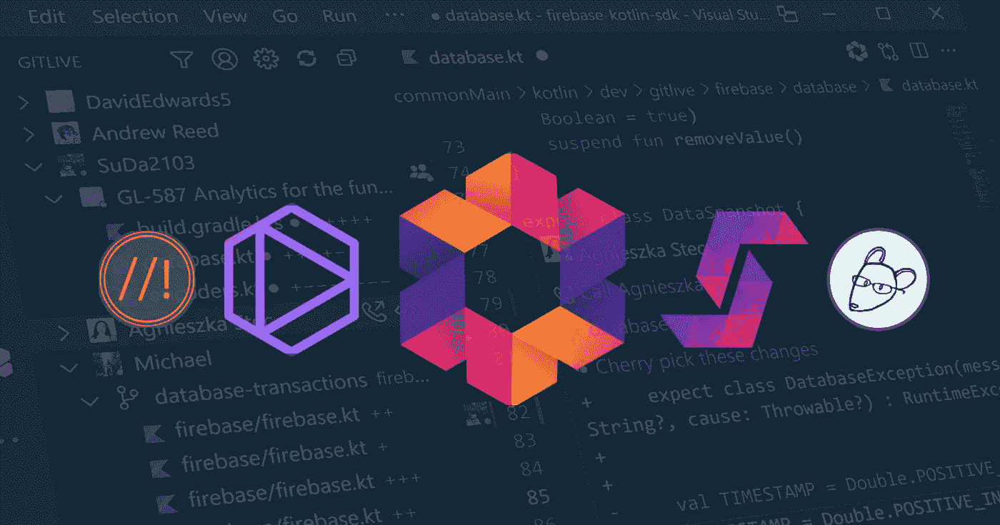
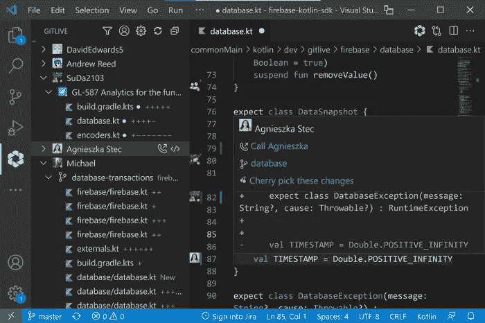
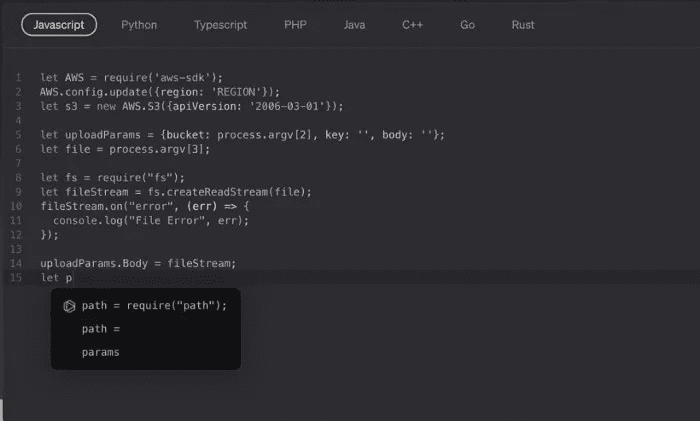
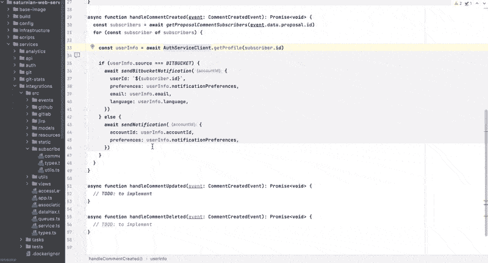
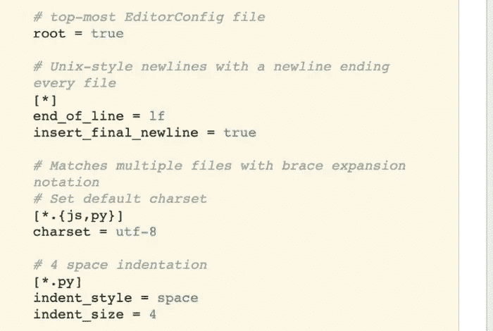
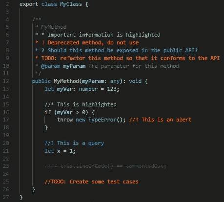

# 提高您的效率:开发团队的 5 大生产力插件

> 原文：<https://levelup.gitconnected.com/increase-your-efficiency-top-5-productivity-plugins-for-dev-teams-801118ffee5e>

作者图片

你的团队是否尽可能高效？我们倾向于在使用我们最了解和最喜欢的工具时最有生产力，这就是为什么在大多数开发团队中，你可以自由地使用你选择的武器(也就是 IDE)进行编码。因此，不管你是对 VS 代码绝对忠诚，还是铁杆 JetBrains 迷:这 5 个跨 IDE 工具绝对值得一试！

# GitLive for [VS Code](https://marketplace.visualstudio.com/items?itemName=TeamHub.teamhub) 和 [JetBrains](https://plugins.jetbrains.com/plugin/11955-gitlive)

假设您的团队使用 Git，那么 GitLive 是 IDE 内置 Git 功能的一个显而易见的增强。安装后，它会添加一个团队视图，显示 Git 存储库中每个合作者正在进行的所有工作。主/主之前的任何非陈旧分支都被视为正在进行中的工作，您可以检查不同的已更改文件，并查看相关的问题或拉请求。

GitLive

但我最喜欢的功能可能是自动合并冲突检测。对于您当前打开的文件，您的本地更改和您的团队成员正在进行的工作之间的差异显示在编辑器的空白处。它向您显示更改的类型(添加、删除、修改或冲突),您可以检查它以查看差异，它来自哪个分支，甚至可以挑选到您的本地文件中。

**生产力提升**🚀GitLive 对于大型团队非常有用，尤其是对于开源或内部源代码项目，因为这些特性甚至可以跨 fork 工作。更酷的是，数据直接来自 Git，不需要手动输入来保持最新。

# [VS 代码](https://marketplace.visualstudio.com/items?itemName=TabNine.tabnine-vscode)和[喷射脑](https://plugins.jetbrains.com/plugin/12798-tabnine-ai-code-completion-js-java-python-ts-rust-go-php--more)的标签

想办法加速你的编码？Tabnine 可能正是你要找的。这是一个人工智能代码完成工具，它可以索引您的代码，并根据您如何编写自己的代码，找到统计模式来创建定制的建议。它允许您在 IDE 中以更少的语法错误和更多的代码片段更快地编码。随着时间的推移，它会变得更好，因为它获得了更多的材料来分析，无论是单独工作还是团队工作。

该插件支持大多数流行的语言、库和框架，包括 Python、Javascript、Java、React、Vue、Rust Typescript、PHP、Angular、C / C++/ C#和 Kotlin。

泰伯宁

Tabnine 为大型团队提供了一个使用高级人工智能模型的专业版和一个基于小型人工智能模型的基础版。两个版本都支持团队训练的 AI(在本地训练和运行)。

**生产力提升**🚀
Tabnine Teams 接受团队项目、偏好和模式方面的培训。每一次交互都提高 AI 准确性，为整个团队带来价值！

# [VS 代码](https://marketplace.visualstudio.com/items?itemName=Stepsize.stepsize)和[喷射脑](https://plugins.jetbrains.com/plugin/14515-issue-tracker-in-ide)的步长

维护您的代码库的健康需要整个团队的努力，Stepsize 就是一个工具的例子，它可以节省您花费在跟踪和解决潜在问题上的时间。它是编辑器中的一个问题跟踪器，用于管理技术债务和维护问题。有时在编码时，我们会遇到需要解决的问题，但是没有时间马上解决。多亏了这个方便的插件，你可以直接在 IDE 中标记代码和创建待办事项，而不会影响你的工作流程！

步长

**生产力提升**🚀这个插件使得与你的队友在维护和重构工作上的协作变得容易。

# [VS 代码](https://marketplace.visualstudio.com/items?itemName=EditorConfig.EditorConfig)或 [JetBrains](https://plugins.jetbrains.com/plugin/7294-editorconfig/versions) 的编辑器配置

对于跨不同编辑器和 ide 为同一项目工作的多个开发人员保持一致的编码风格来说，EditorConfig 是一个很好的帮助。EditorConfig 项目由一个用于定义编码样式的文件格式和一组文本编辑器插件组成，这些插件使编辑器能够读取文件格式并遵循定义的样式。

与大多数内置的特定于语言的格式化程序不同，EditorConfig 的设置适用于所有类型的文件，清除 git diff 的尾随空白、换行符或缩进字符。

编辑器配置

**生产力提升**🚀
该扩展自动为您切换到的每个项目设置正确的 IDE 设置，因此每个从事该项目的开发人员将以相同的风格编写代码。

# 对 [VS 代码](https://marketplace.visualstudio.com/items?itemName=aaron-bond.better-comments)和 [JetBrains](https://plugins.jetbrains.com/plugin/10850-better-comments) 的更好的注释

这个插件是一个非常简单的想法如何提高我们工作质量的例子。这是一个有效的可定制的扩展，可以在你的代码中创建“人类友好的”(更具可读性和组织性的)注释。

您可以将您的注释分为:提醒、查询、待办事项和重点。

更好的评论

它带有默认的注释样式，但是任何其他的注释样式都可以在设置中指定。

**生产力提升**🚀
立即发现代码中重要的待办事项，这样就不会遗漏任何东西！

***

我希望我在这篇文章中收集的一些很棒的插件能让你的团队协作更快、更有效率、更有成果！