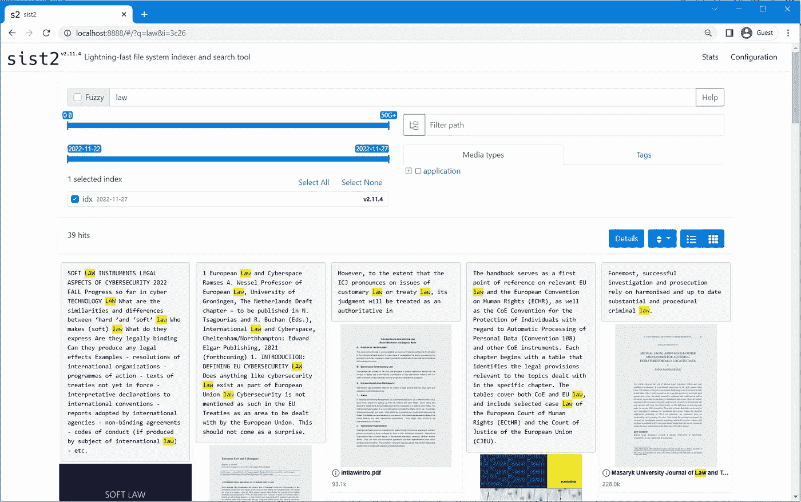
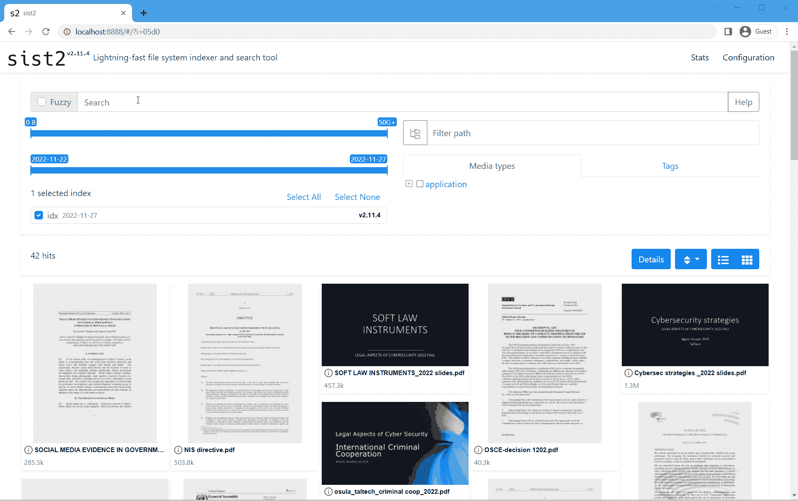
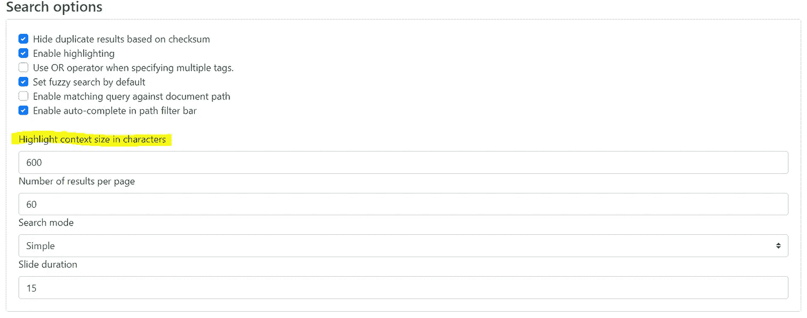
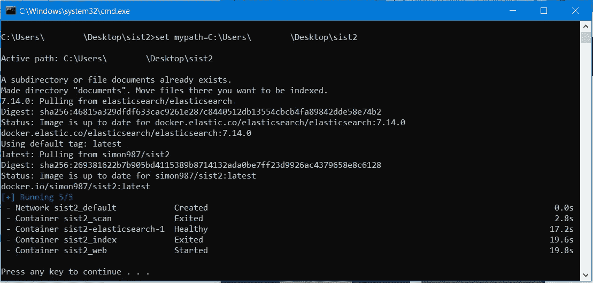
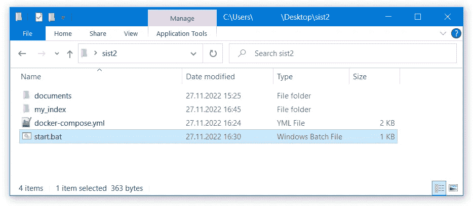
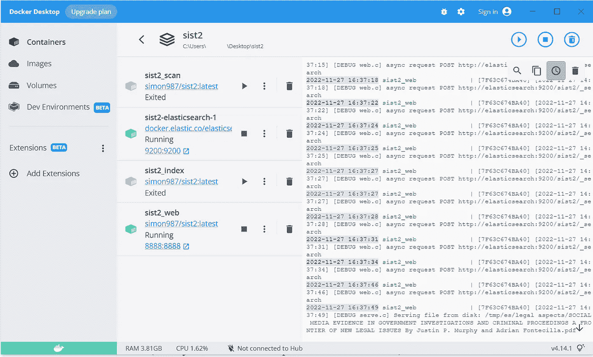

# 使用 ElasticSearch 和 sist2 索引和搜索本地文件中的文本

> 原文：<https://levelup.gitconnected.com/index-and-search-text-from-local-files-using-elasticsearch-and-sist2-c51f3a6f7b7c>

下面这篇文章解释了如何安装和运行 [ElasticSearch](https://www.elastic.co/) 和 [sist2](https://github.com/simon987/sist2) 来索引文件和使用 [Docker](https://www.docker.com/) 搜索你的本地机器。从*索引内容。pdf，*。pptx，*。docx 和其他此类文件，并使用浏览器用户界面从文件内部搜索文本。

至少对我来说，这一叠书的动机是为了准备考试。🤭有些课程分享了 40+。有些文件超过 100 页，所以 CTRL+F 是不可能的。但是我仍然需要快速找到正确的文件，这一点 sist2 非常好！它给出了文件和内容的一个小预览。通过 web UI 可以控制返回文本的长度(请看技巧 2)。

当然，这并不意味着这是该工具的唯一用途。看看 sist2 文档，寻找索引其他内容的灵感。

我查看了不同的选项来索引本地文件并使它们可被搜索。我在网上找到了一些应用程序，但大多数似乎是为 Windows 98 设计的。此外，我希望这个堆栈可以与同学共享(这样他们也可以在开卷考试中使用)。

# 我尝试过的替代方法

[Fscrawler](https://fscrawler.readthedocs.io/en/latest/index.html) 使用 ElasticSearch 和 [Kibana](https://www.elastic.co/what-is/kibana) 。🤔虽然它有效，但我最终没有使用那个堆栈。让 Fscrawler 在 Windows 上工作很难，因为需要冲突的版本和依赖关系。另外，Kibana 第一次可能没那么直观。此外，不支持文件缩略图生成，在 Kibana 中获得更多文本预览或通过 localhost 链接打开文件对我来说是太细粒度的配置。

## 提示#1

开始索引之前，请先转换。doc，。pptx 等。需要外部工具才能打开为. pdf 的文件类型。这允许您在浏览器中打开文件。

## 提示#2

在 sist2 UI 中，进入设置->以字符为单位突出显示上下文大小-以增加文本预览的长度。

# 如何使用

1.  安装 Docker
2.  下载 start.bat 和 docker-compose.yml
3.  运行 start.bat

# 来源

说明和源代码可以在 GitHub[https://github.com/Nurech/sist2_index_files](https://github.com/Nurech/sist2_index_files)找到

# CMD 脚本

做基本的文件夹设置，提取图像，然后运行 Docker Compose。将您想要索引的文件拖到`\documents`文件夹中。容器只运行一次，这意味着扫描将索引您当前在 documents 文件夹中的文件。如果您希望索引和扫描在一定的时间间隔内工作，您必须设置 [windows 服务](https://stackoverflow.com/a/13294293/15439733)来定期运行执行索引和扫描工作的容器。

[https://raw . githubusercontent . com/Nurech/sis T2 _ index _ files/main/start . bat](https://raw.githubusercontent.com/Nurech/sist2_index_files/main/start.bat)

# Docker 撰写

开始堆叠 ElasticSearch 和 sist2 图像。

1.  开始弹性搜索
2.  扫描文件并制作索引
3.  向 ElasticSearch 发送索引
4.  启动 web 用户界面以查看索引文件

[https://raw . githubusercontent . com/Nurech/sis T2 _ index _ files/main/docker-compose . yml](https://raw.githubusercontent.com/Nurech/sist2_index_files/main/docker-compose.yml)

感谢阅读！