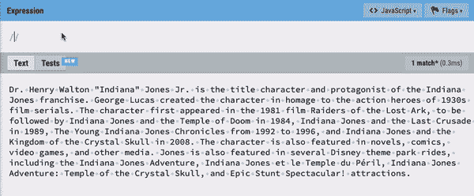
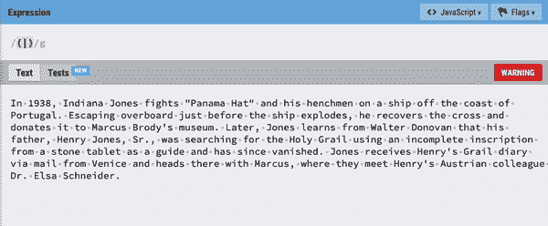
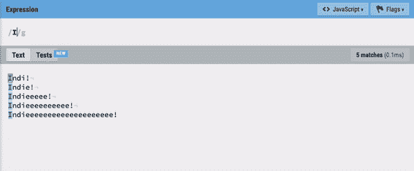
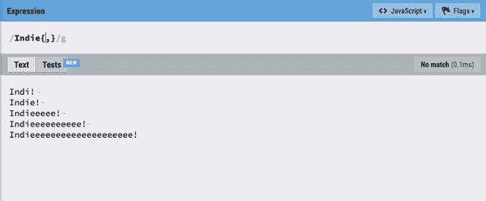
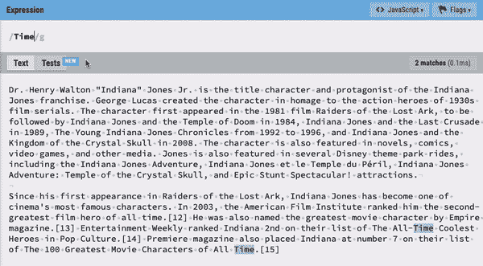
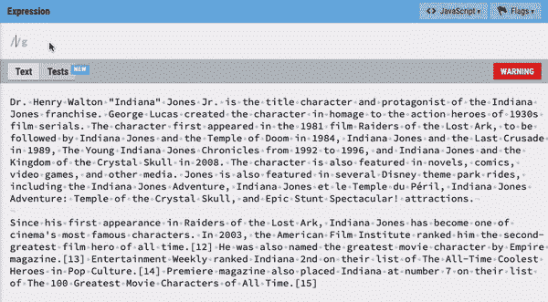
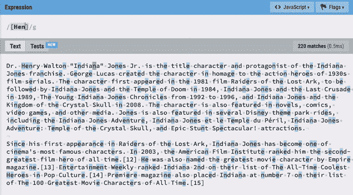
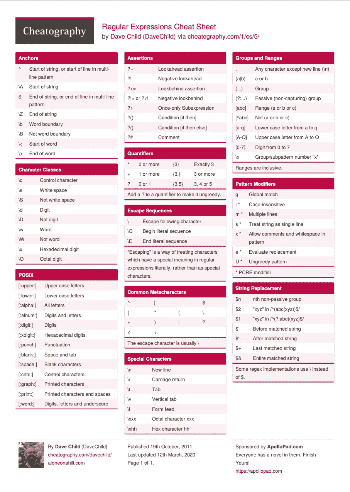

# JavaScript 中的正则表达式与印第安纳琼斯

> 原文：<https://levelup.gitconnected.com/indiana-jones-and-the-universal-way-to-search-for-text-1901990f53ae>

## 用 5 分钟时间使用正则表达式

作者与❤一起创作的艺术

为什么需要这样一个对初学者不友好的话题？！因为您学会了跨所有编程语言验证和搜索文本！这就是原因！

此外，您只需创建一次验证模式，就可以一直使用下去。

虽然因为语法看起来像《夺宝奇兵》中的象形文字而很难学，但真正的价值在于你的工具腰带里有这个工具。

# 动机

正如我提到的，这是一个在任何编程语言中解析文本的通用工具。一把瑞士军刀的编码！

由于 JavaScript 和 Web 开发非常棒，我将首先向您展示如何开始使用 JavaScript 和正则表达式。之后，我们将探索可以在任何地方使用的通用模式！

# JavaScript。搜索/。匹配/。替换

使用正则表达式(RegExp)在 JavaScript 中搜索很容易:

这用于查找单个匹配并返回索引。如果你想要更多，就像贪婪的迈达斯国王，那么你必须使用`match`:

您也可以直接交换出字符串的成员。当有人不尊重你的学业成绩，你必须纠正他们时，使用`replace`:

## 鞭策自己编写正则表达式的知识

我们在`/.../`的两个斜线之间放了一个正则表达式。完全匹配如下所示:

你在上面已经见过了。但是现在我们要用标志来增强这个基本操作。

# 标志又称模式修饰符

我们在正则表达式短语`/.../`后应用标志。字母`g`用于全局查找我们的模式(多个结果)。

我将 Indiana Jones 条目的[第一段放入`longTextFromWikipedia`中，以搜索所有出现的 *Jones* ，并应用了`g`标志。](https://en.wikipedia.org/wiki/Indiana_Jones_(character))

# 组合器(复杂搜索模式)

## 逻辑或

逻辑 OR 使我们能够在文本中搜索多个不同的字符串。使用`|`在要搜索的每个字符串之间进行分割。

要使用的 RegExp 是`/Jones|Jr/g`。

## 分组

分组条件非常威武，就像圣杯一样！它允许我们建立子集，比如:搜索亨瑞·琼斯教授博士，也可以搜索印第安纳琼斯。

要使用的正则表达式`/(Henry|Indiana) Jones/g`。

## 量词

量词太棒了！它们让您决定为了生成一个结果，允许一个模式出现的频率。最好的对比是第二部印第安纳琼斯电影，每当威利斯科特尖叫*indieeeeeee！*

几个量词允许我们确定一个事件发生的频率是可接受的。

*   `?` 0 或 1 次
*   `*` 0 次或多次
*   `+` 1 次或多次

## 显式计数

通过显式计数，我们可以只找到最长的尖叫声，我们说我们从 2 开始，以 10 结束。然后语法是`/regEx{MIN,MAX}/`。

如果我们不关心最大数量，让`MAX`的字段不成文，正如你在 GIF 中看到的。

## 类中的转义字符

正则表达式非常强大，我不能停止重复我自己，因此它也允许我们转义某些特殊字符，如问号或句尾的句号。

这还不是结束，如果你现在选择加入，你还可以逃避整个字符类，如数字或字母！

而且还不止于此，如果你现在向下滚动，你还会得到否定包，其中任何大写字母都不包括完整的字符类！

抱歉，我小时候电视购物频道看多了。

我建议我们继续挖掘我们的考古遗址，找到正则表达式的下一件大事:字符集。

# 字符集

我们可以用`[...]`定义我们想要搜索的字符集。

`/Henry/`搜索字符串“Henry”，`[Henry]`搜索方括号内的所有字母，即 *H，e，n，r & y.*

## 否定集合

在我们的集合前面有一个`^`，我们创建一个否定，并排除字符集，而不是搜索它。

# **一张小抄和一个沙盒可以玩**

首先是沙盒:[www.regexr.com](http://www.regexr.com)(我用本页做了活生生的例子)。

这是我最喜欢的小抄，奇怪的是我喜欢粉红色🤷‍♂️

由戴夫·蔡尔德制作[下载](https://cheatography.com/davechild/cheat-sheets/regular-expressions/)

# 结论

正则表达式学起来简单，但是很难掌握！

您现在已经迈出了第一步，这已经为您节省了大量时间，因为您可以在任何编程语言中使用它们，并且它们比其他搜索机制(例如 SQL 中的 INSTR 和 SUBSTR)更不容易出错。

重要的是要把它们做对，但是我鼓励你跳进你的沙盒工具，可以到处玩。看到编辑如何给你的结果打分是非常有趣的，✌️

我希望你能在不意外触发一些陷阱的情况下获取一些知识，并享受阅读这篇文章的巨大乐趣:)

[***节省自己大量的时间，专注于重要的主题。***](https://arnoldcodeacademy.ck.page/26-web-dev-cheat-sheets)

阿诺德代码学院 26 网页开发人员备忘单

## 参考

正则表达式沙盒工具:[https://regexr.com/](https://regexr.com/)
正则表达式备忘单:[https://cheat ography . com/Dave child/cheat-sheets/Regular-expressions/](https://cheatography.com/davechild/cheat-sheets/regular-expressions/)