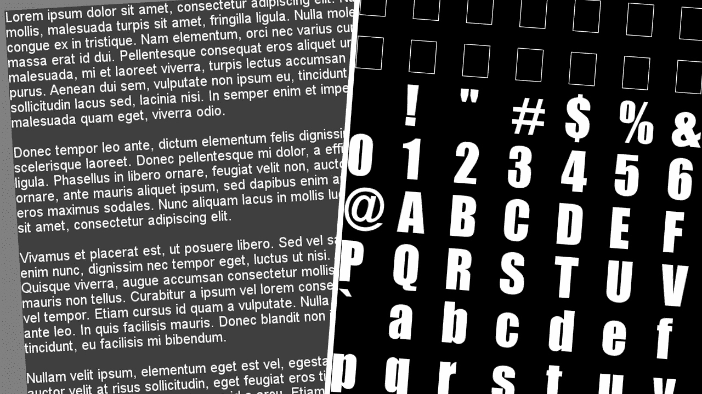
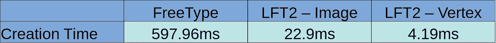
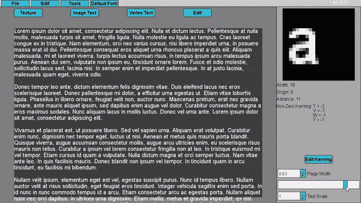
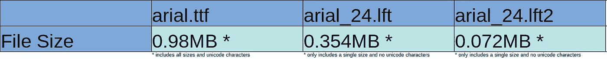

# 独立游戏开发日志 55:新的字体和文本渲染系统

> 原文：<https://levelup.gitconnected.com/indie-game-dev-log-55-new-font-and-text-rendering-system-318eaf76016a>

## 创建更高效的自定义字体文件格式并移除 FreeType 依赖项

一个处理字体的新库和一个为我的游戏引擎渲染文本的改进方法。

我知道，距离我上一篇游戏开发博客已经有一段时间了。我最近没有太多时间从事游戏开发，我一直专注于写作和 3D 建模/艺术。我也正处于游戏中的一个阶段，我需要几周或几个月几乎不受干扰的时间来专注于添加内容和平衡。

总之，我最近有一点时间，我真的很想做一些 C++游戏开发相关的编程。有一段时间我想改进的系统之一是字体和文本渲染。我对当前的实现不满意，我希望从我的代码中删除大多数 FreeType 依赖项，以此来限制第三方库的数量。

# **字体文件格式**

我不想使用 [FreeType](https://www.freetype.org/) 直接访问标准字体文件，而是想为我的引擎创建一个定制格式，为我的需求进行优化。然而，要创建自定义字体文件格式，我们需要先看看现有的文件格式。

像 [TrueType(.ttf)](https://en.wikipedia.org/wiki/TrueType) 是小矢量图形的集合，也称为字形，定义了所有字符的形状和轮廓。除此之外，字体文件包含一系列字符度量，比如它有多宽，它比基线低多远，等等。最后，有一些像 A 和 V 这样的字符，当它们出现在彼此后面时，可以靠得更近。这被称为[字距调整](https://en.wikipedia.org/wiki/Kerning)，许多字体为每个字符对定义了字距调整值。

# **自定义字体文件格式**

使用 FreeType 绘制文本时，我们需要使用 *FT_Render_Glyph* 函数。它将字形从独立于内部像素的轮廓格式转换为位图。然而，这个过程不是特别快，所以我想消除这一步，直接存储位图。虽然这样快了很多，但也有一些缺点:普通的字体文件支持每种字体大小，但直接存储位图只包含一种大小。然而，这是一个我可以忍受的缺点，因为实际上，一个游戏只需要几个不同的大小，不同的字体风格，如粗体或斜体，对于普通字体也是单独的文件。

除了位图之外，文件还需要包括一些度量。FreeType 为每个角色提供了许多不同的度量标准。这些指标非常令人困惑，直到今天，我还没有完全理解它们是如何工作的，但是我想我已经找到了与我想要做的字体渲染相关的指标。

首先，我们存储每个字符的宽度，所以我们知道每个位图有多宽。其次，我们需要预先的价值。前进值告诉我们，在每个字符之后，我们需要向前移动光标多少像素。然后有一个非常令人困惑的字符度量:左方位，或者我在我的格式中称之为偏移量。有些字符从光标的左侧开始，当您想在 x=0 的图像上绘制文本时，这是一个大问题。如果字符从光标左侧 2 个像素开始，我们将试图在图像边界之外绘制，这是一个等待发生的大内存越界异常。因此，我们还需要存储这个值，如果它是负的，就向前移动。

最后，还有字距调整值。我打算不把它们包含在我的文件中，因为不是每种字体都有字距调整值，而且还需要存储很多额外的数据(字符数的平方)。然而，我决定咬苹果，并包括字距值，以便渲染的文本看起来尽可能好。

到目前为止，我的定制格式中缺少的另一个特性是 Unicode 支持。我还没有包括它，因为我的引擎目前也没有适当的 Unicode 支持。将 Unicode 支持添加到我的引擎将会很复杂，我害怕这项任务，但是在某个时候我将不得不这样做。然而，在我的字体文件格式中添加 Unicode 支持应该没有太多问题。

# **文本渲染**

没有进入太多的细节，我保留了我的引擎中的两个主要的文本呈现类型。第一个是图像文本，第二个是顶点文本。对于图像文本，文本被绘制到图像中，然后图像被转换为纹理并显示在单个四边形上，而顶点文本使用纹理贴图集，并为每个角色创建一个具有正确 uv 的四边形。对于这两个系统，font 类完成了大部分工作，因为它提供了一个将文本渲染到图像的函数，以及一个填充正确顶点位置和 uv 的函数。这样，OpenGL 代码不需要知道任何关于文本绘制的细节，而且代码更干净，封装性更强。

# **表演**

正如我上面提到的，FreeType 文本绘制不是很快，因为轮廓到位图的转换很慢，并且库有很多开销。我的新格式去掉了转换步骤和大部分开销，这使得它快了很多。用 FreeType 将相同的文本(一个 5 段的 Lorem Ipsum)绘制到一幅图像需要将近 600 毫秒，而用我的系统只需要 22.9 毫秒。填充顶点位置和 uv 甚至更快，只需 4.19 毫秒。但是，使用 OpenGL 将顶点文本绘制到屏幕上比图像文本慢，因为图像文本只有一个四边形，而顶点文本可能有数百个甚至数千个四边形，这取决于文本的长度。

用 FreeType 和我的自定义字体文件格式画一个文本需要多长时间，图片由作者提供。

# **自动换行**

我的旧文本渲染系统已经有了自动换行功能，但是它有一些问题，而且从来没有很好地工作过。所以我完全重写了自动换行系统，它现在运行得更好了。它基本上遍历了整个文本，在计算一行的总长度时，总是记住最后一个空格字符的位置。一旦行的长度超过页面宽度，最后一个空格字符将被替换为换行符。如果不带空格的字符串比页面宽，该函数只在字符串中间强制一个硬分隔符。由于顶点文本创建速度非常快，这也使得动态调整页面大小和使用自动换行符动态重新创建文本成为可能:

按作者动态更新文本和自动换行。

# **文件大小**

将我的字体格式的文件大小与 FreeType 直接比较没有太大意义，因为它不包含任何 Unicode 信息，只包含单一大小，这意味着它显然会小很多。无论如何，与纹理和其他游戏资产相比，字体所需的存储空间非常小。

然而，与定制格式的第一个版本相比，我做了很多改进。首先，我只存储了位图的一个通道，而不是全部 4 个通道，我还只存储了 96 个可打印 ASCII 字符的值，而不是全部 128 个字符。这使得新版本比第一个版本大约小 5 倍，但仍然包含相同数量的信息。

TrueType 字体的文件大小和我的自定义字体文件格式的第一个和第二个版本，图片由作者提供。

我对我的新字体库和文本渲染系统非常满意。它比旧的更快，尤其是与 FreeType 相比，同时需要更少的存储空间。此外，它允许我从代码中删除所有的 FreeType 依赖项，除了从普通字体文件转换成我的格式的程序。

下一步实际上是删除旧的文本呈现代码，并用新系统替换所有内容。然而，故意破坏工作代码总是很可怕的——即使你知道新系统会更好——所以我现在推迟了这一步。

你喜欢这样的内容吗？通过加入 Medium ，可以无限制地访问所有故事，并支持我和其他作者。*如果你通过这个链接注册，你的一部分会员费将会转给我，不需要额外付费。*

*最初发布于*[*https://ping poli . de*](https://pingpoli.de/gamedev-55-fonts-and-text-rendering)*。*