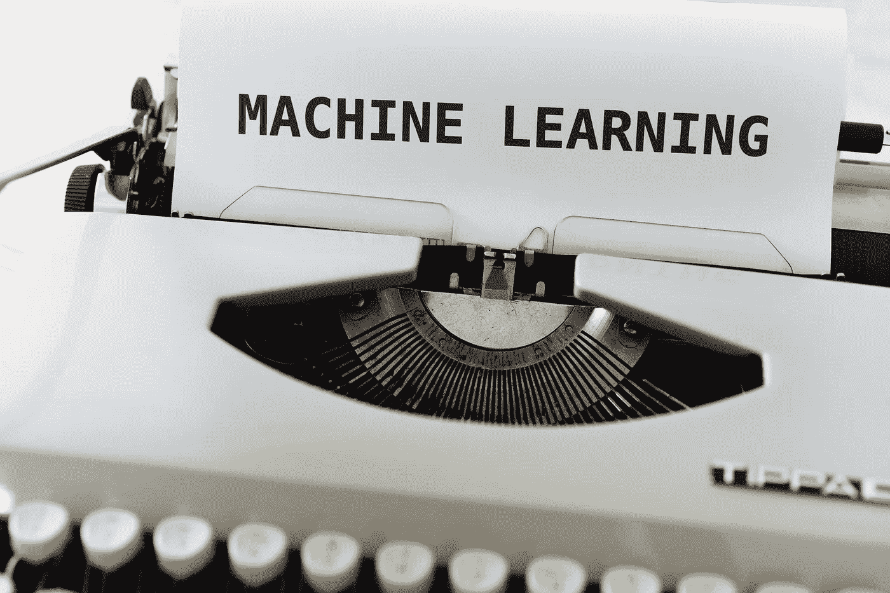

# 臭名昭著的用于机器学习的 Python 库

> 原文：<https://levelup.gitconnected.com/infamous-python-libraries-for-machine-learning-ad55494de357>

为您的机器学习项目精选的九个鲜为人知的 Python 包列表



马库斯·温克勒在 [Unsplash](https://unsplash.com/?utm_source=unsplash&utm_medium=referral&utm_content=creditCopyText) 上的照片

本文将展示一个用于机器学习的精选 Python 包列表。在过去的几年里，Github 中已经出现了相当多的专门研究机器学习的惊人知识库。因此，我编辑了一个列表，里面有 9 个正在开发中的有用的包。最后一个软件包版本必须在撰写本文后的一年内发布。

无论你是机器学习的初学者还是专家，都强烈建议你去看看它们，因为你可能会找到一个对你的项目有用的。让我们探索和发现机器学习 Python 包中隐藏的宝石。

# 链条机

[](https://pypi.org/project/chainer/) [## 链条机

### Chainer 是一个基于 Python 的深度学习框架，旨在实现灵活性。它提供了自动区分 APIs

pypi.org](https://pypi.org/project/chainer/) 

[Chainer](https://pypi.org/project/chainer/) 是一个加速研究周期的深度学习框架。它提供了一种实现大多数最新模型的方法。这包括递归神经网络和变分自动编码器。截至 2019 年 12 月，开发流程仅限于修复和维护错误。

## 装置

要安装 Chainer，请运行以下命令

```
pip install chainer
```

## 用法示例

下面是一个示例代码，它确定蘑菇是可食用的还是会杀死你。

# **提示**

这里有一个简单的技巧，在安装 PyPI 的鲜为人知的包时，可以用它来增强应用程序的安全性。如果你使用的是谷歌 Chrome 或微软 Edge，你可以使用 [WhiteSource Advisor](https://www.whitesourcesoftware.com/browser-integration/) 浏览器集成扩展。它会在加载 PyPI 网页时执行安全扫描。单击扩展后，您应该会看到下面的结果。


作者图片

这个扩展对开发人员来说非常有用，因为它允许您在决定下载之前对组件的细节和漏洞有一个粗略的了解。

如果你想保护你的本地或远程机器，这个扩展肯定会派上用场。安全胜于遗憾，因为鲜为人知的软件包容易受到恶意代码的攻击。

# 数据版本控制(DVC)

[](https://pypi.org/project/dvc/) [## dvc

### 数据版本控制或 DVC 是一个用于数据科学和机器学习项目的开源工具。主要特点:简单…

pypi.org](https://pypi.org/project/dvc/) 

单从名字上看，你应该能看出 [DVC](https://pypi.org/project/dvc/) 是一款专门为机器学习和数据科学项目开发的版本控制工具。它类似于 Git-LFS 和 Makefiles 的组合。它存储数据模型，并将它们与 Git 存储库连接起来。此外，它还作为从其他数据和代码构建模型的指令。

## 装置

有相当多的方法来安装 DVC。

```
# snapcraft/linux
snap install dvc --classic# chocolatey / windows
choco install dvc# homebrew / mac os
brew install dvc# anaconda
conda install -c conda-forge dvc# pip
pip install dvc
```

根据您首选的远程存储，还存在其他依赖关系。

## 用法示例

要跟踪数据，请运行以下命令

```
git add train.py
dvc add images.zip
```

为了连接代码和数据，您应该使用

```
dvc run -d images.zip -o images/ unzip -q images.zip
dvc run -d images/ -d train.py -o model.p python train.py
```

进行改变和繁殖

```
vi train.py
dvc repro model.p.dvc
```

此外，您可以像往常一样通过 git 命令共享代码

```
git add .
git commit -m 'The baseline model'
git push
```

对于共享数据和机器学习模型，您应该使用

```
dvc remote add myremote -d s3://mybucket/image_cnn
dvc push
```

# 神经网络智能(NNI)

[](https://pypi.org/project/nni/) [## 噪音及数值指示(Noise and Number Iindex)

### NNI(神经网络智能)是一个轻量级但功能强大的工具包，帮助用户自动化特征工程…

pypi.org](https://pypi.org/project/nni/) 

根据官方文献记载， [NNI](https://pypi.org/project/nni/) 是一个

> “…用于创建、操作和研究复杂网络的结构、动态和功能的 Python 包。”

它主要用于自动化机器学习生命周期过程。这包括特征工程、神经结构搜索和超参数微调。它为您提供了命令行工具和 web 界面。

## 装置

NNI 支持通过`pip install`安装。有些例子需要 Tensorflow 1.x 来代替。请查看[官方文档](https://github.com/microsoft/nni)了解更多信息。

```
pip install --upgrade nni
```

## 用法示例

在您的终端中运行以下命令来激活 MNIST 示例。

```
nnictl create --config nni\examples\trials\mnist-tfv1\config_windows.yml
```

# ONNX 运行时

[](https://pypi.org/project/onnxruntime/) [## onnxruntime

### ONNX Runtime 是一个面向开放式神经网络交换(ONNX)模型的性能评分引擎。更多信息…

pypi.org](https://pypi.org/project/onnxruntime/) 

如果您正在寻找用 Python 编码的方法，但是部署到 C#/C++/Java 应用程序中， [ONNX Runtime](https://pypi.org/project/onnxruntime/) 是您的正确选择。它主要是作为一个跨平台的推理和训练加速器包。

此外，它还支持通过其 PyTorch 的 Python API`ORTTrainer`通过后端训练现有的 PyTorch 模型。

## 装置

在您的终端中运行以下命令来安装它

```
pip install onnxruntime
```

## 用法示例

事实上，你可以使用你最喜欢的框架来训练一个模型，并将其转换成 ONNX 格式。让我们看看下面的例子，它使用了著名的虹膜数据集。

# PaddlePaddle

[](https://pypi.org/project/paddlepaddle/) [## paddlepaddle

### 并行分布式深度学习

pypi.org](https://pypi.org/project/paddlepaddle/) 

[Paddlepaddle](https://pypi.org/project/paddlepaddle/) 是国内独立研发的深度学习平台。它起源于工业实践，并已成功应用于从制造业到农业的许多行业。

它提供了以下核心功能:

*   深度神经网络工业开发的敏捷框架
*   支持超大规模深度神经网络训练
*   对无处不在的部署进行加速的高性能推理
*   具有开源存储库的面向行业的模型和库

国内相当一部分商业化的 AI 解决方案都是建立在 paddlepaddle 之上的。此外，提供的文件是英文和中文。

## 装置

根据 GPU 的使用情况，您可以通过 pip install 安装它。

```
# Linux CPU
pip install paddlepaddle# Linux GPU cuda10cudnn7
pip install paddlepaddle-gpu# Linux GPU cuda9cudnn7
pip install paddlepaddle-gpu==1.8.4.post97
```

## 用法示例

为了开始，你必须学习流体编程背后的[基本概念](https://www.paddlepaddle.org.cn/documentation/docs/en/beginners_guide/basic_concept/programming_guide/programming_guide_en.html)。完成后，您应该能够创建一个简单的模型，如下所示:

# Pycaret

[](https://pypi.org/project/pycaret/) [## pycaret

### PyCaret 是 Python 中的一个开源低代码机器学习库，旨在将假设简化为见解…

pypi.org](https://pypi.org/project/pycaret/) 

[Pycaret](https://pypi.org/project/pycaret/) 是几个流行的机器学习框架的 Python 包装器。它允许你用几行代码运行复杂的机器学习任务。它遵循以下原则:

*   简单的
*   使用方便
*   部署就绪

这对于创建概念验证项目或快速测试端到端实验非常有用。

## 装置

最简单的安装方法如下:

```
pip install pycaret
```

## 用法示例

以下代码片段是使用 Pycaret 的 NLP 任务的示例。

你可以在下面的[链接中找到其他例子。](https://github.com/pycaret/pycaret/tree/master/examples)

# 热电偶

[](https://pypi.org/project/pyod/) [## 热电偶

### 构建状态&覆盖率&可维护性&许可证 PyOD 是一个全面的、可伸缩的 Python 工具包，用于检测…

pypi.org](https://pypi.org/project/pyod/) 

PyOD 是一个 Python 工具包，专门用于检测多元数据中的异常值。检测外围对象通常被称为异常检测或异常检测。在撰写本文时，它包含相当多的基于神经网络的模型，并支持 30 多种检测算法。

## 装置

建议使用 pip 进行安装

```
pip install pyod
```

## 用法示例

让我们看看下面的例子，它使用 KNN 进行异常值检测。

# SHAP

[](https://pypi.org/project/shap/) [## shap

### SHAP(SHapley Additive exPlanations)是一种解释任何机器学习模型输出的统一方法。SHAP…

pypi.org](https://pypi.org/project/shap/) 

[SHAP](https://pypi.org/project/shap/) 是沙普利加法解释的首字母缩写。它使用博弈论的方法来解释任何机器学习模型的结果。你可以把它想象成一个可视化工具，旨在解决机器学习模型的黑箱问题。当您微调模型时，所提供的见解是必不可少的。

## 装置

SHAP 可以直接从 PyPI 安装。

```
pip install shap
```

## 用法示例

以下示例为 XGBoost 模型定型，并使用 SHAP 对其进行可视化。

# Trax

[](https://pypi.org/project/trax/) [## trax

### Trax 帮助你理解深度学习。我们从基础数学开始，通过层次，模型，监督和…

pypi.org](https://pypi.org/project/trax/) 

[Trax](https://pypi.org/project/trax/) 是由谷歌大脑团队积极维护的端到端深度学习库。主要着眼于代码简洁，执行速度快。

## 装置

您可以通过 pip install 安装它，如下所示:

```
pip install trax
```

## 用法示例

下面的要点举例说明了英语到德语的翻译。

# 结论

至此，您应该对其他鲜为人知的用于机器学习的 Python 库有了一个大致的了解。每个软件包都有自己的优点和缺点。作为一名开发人员，我们应该超越流行的东西，去发现对我们的项目有益的隐藏的宝石。

感谢你阅读这篇文章。希望在下一篇文章中再见到你！

# 参考

1.  [与机器学习相关的 Github 知识库](https://github.com/topics/machine-learning)
2.  [牛逼的机器学习 Github 知识库](https://github.com/josephmisiti/awesome-machine-learning#python)