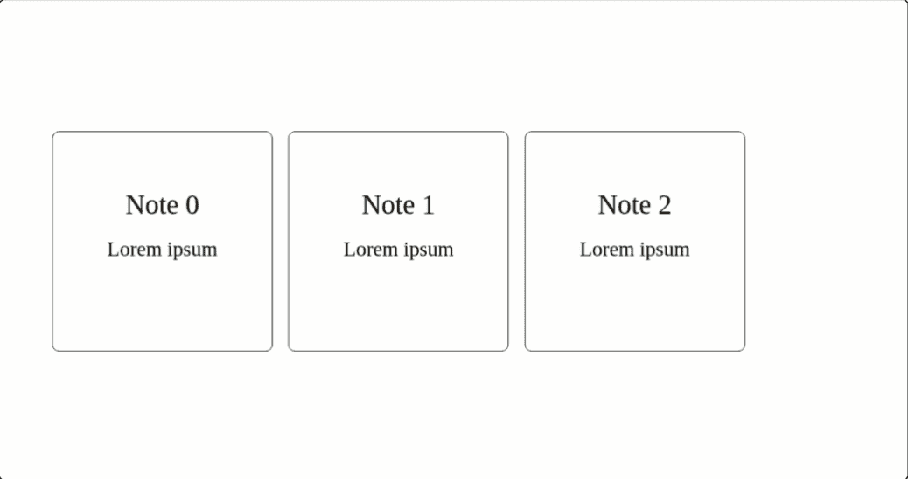
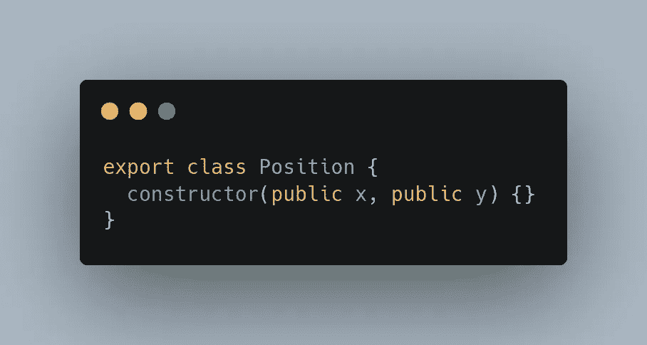
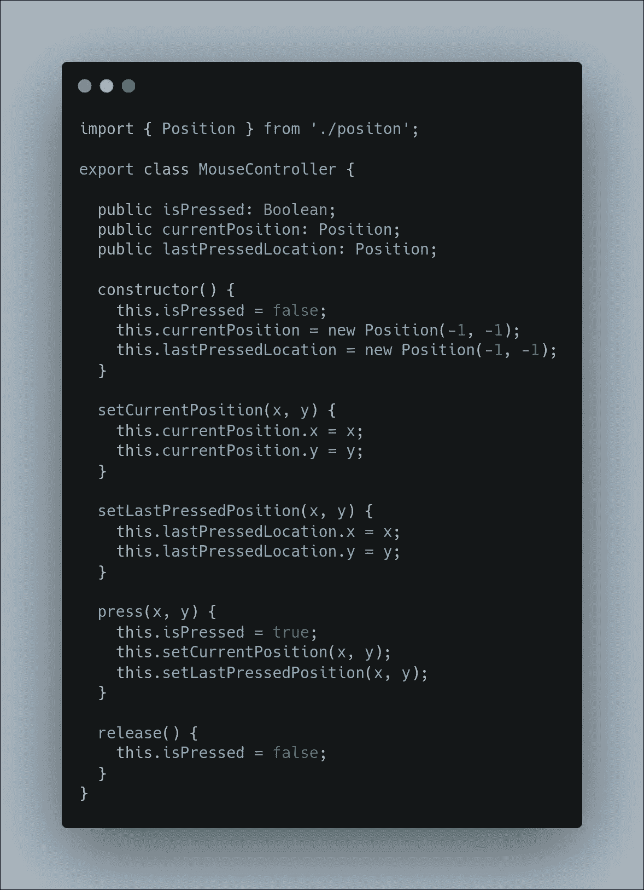
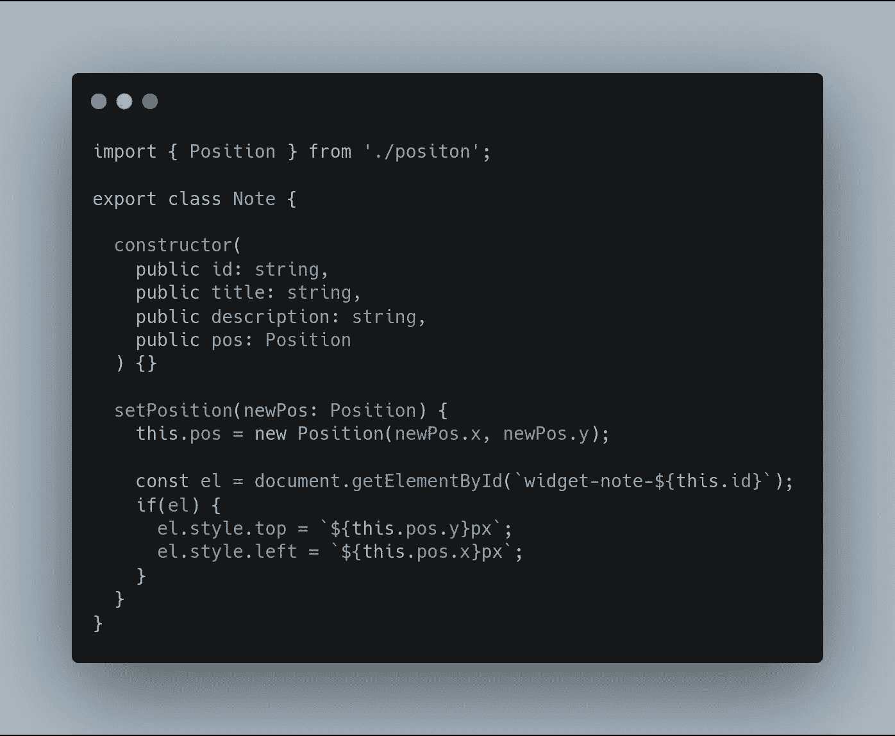
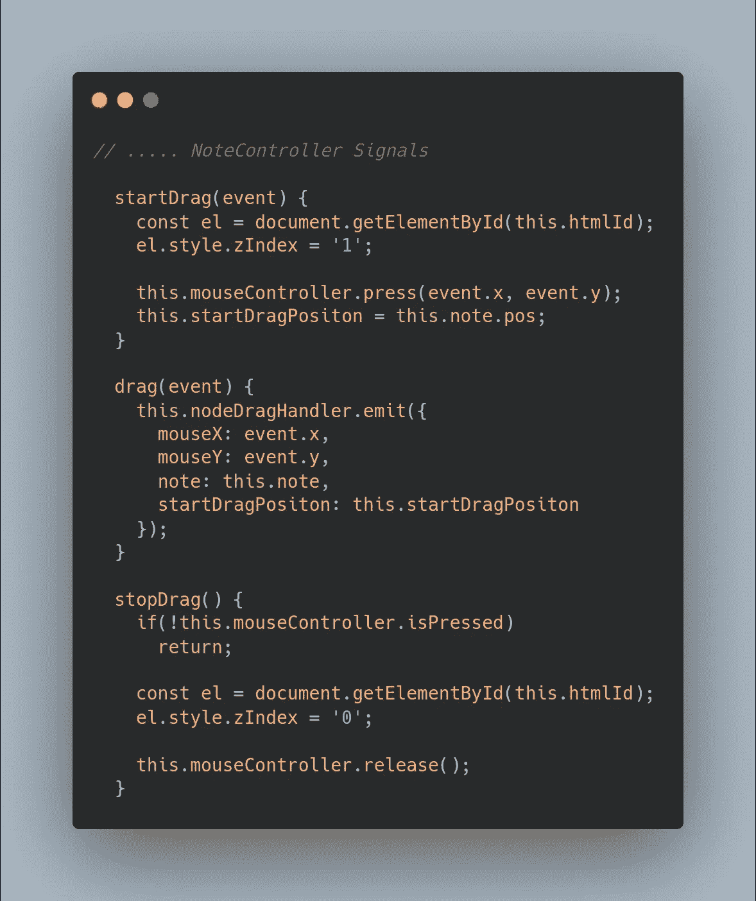
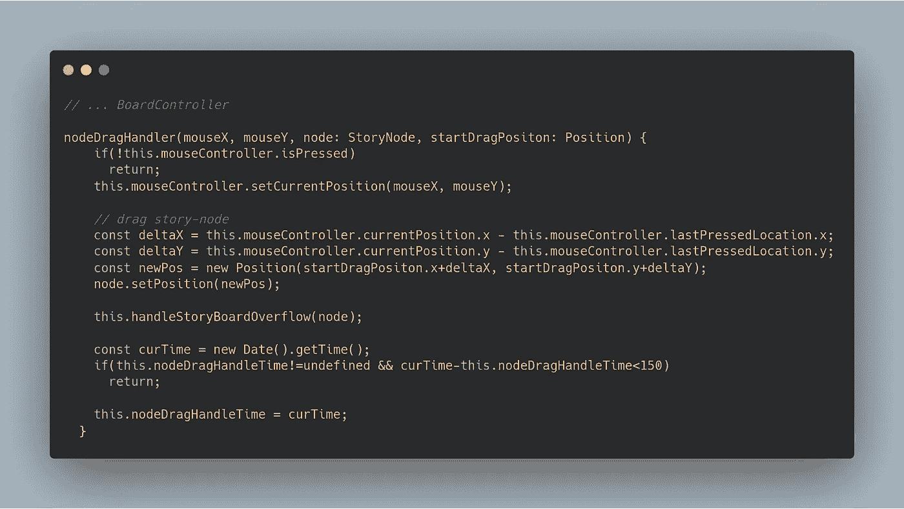
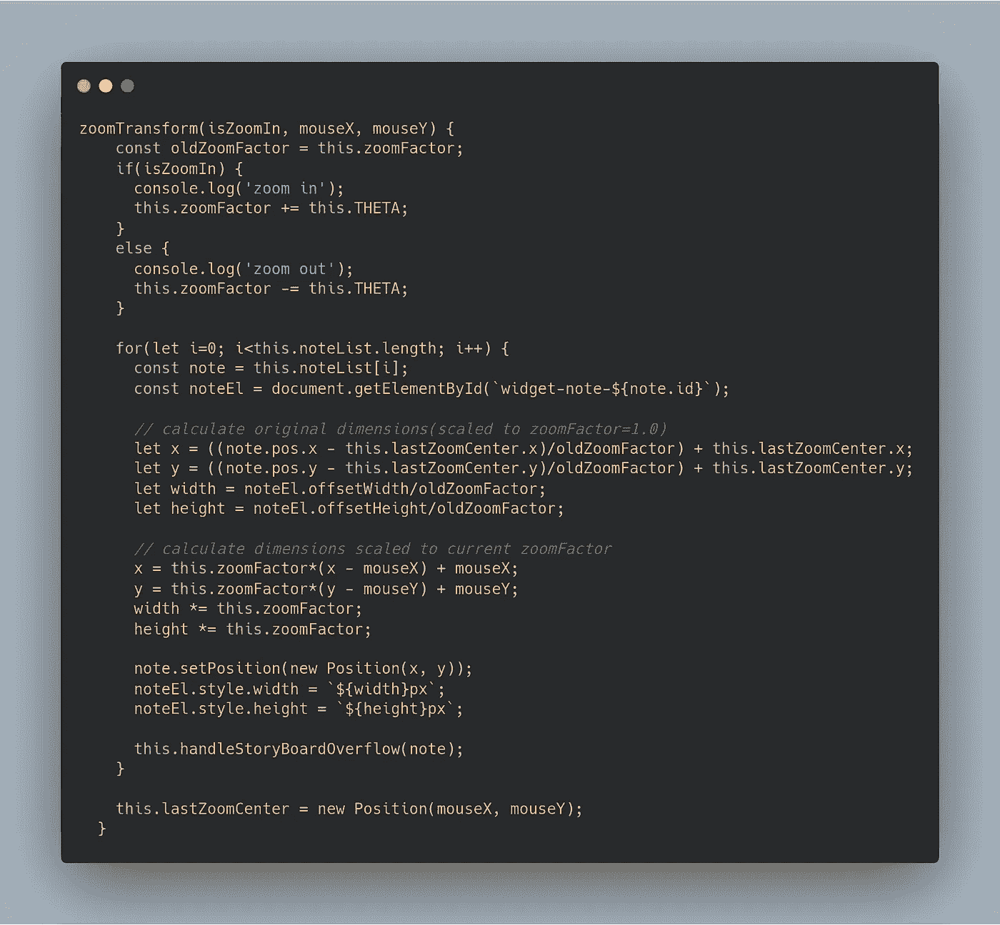

# 无限板的拖放笔记使用角

> 原文：<https://levelup.gitconnected.com/infinite-board-for-drag-and-drop-notes-using-angular-6e2e1280b383>

界面、转换、缩放和方法…

你好。在过去的几天里，我一直在做一个项目，我必须实现一个无限白板并放置便签。这个想法是建立一个可以无限滚动的组件。用户应该能够在这个无限空间的任何地方拖放部件。此外，添加缩放工具会变得非常有趣，这是一个方便的工具。在构建这个项目的过程中，我学到了很多关于转换和扩展机制的知识。请继续阅读，了解如何从头开始构建它！

**组件故障**

让我们从决定需要什么模型和组件开始。显然，有两件事是显而易见的:需要*注释*来表示可拖动的小部件，需要*面板*来包装里面的所有东西。看看我们的无限拖放空间的目标，我们的 *Notes* 容器应该自己扩展， *Board* 应该允许我们滚动到大白板的任何区域。这可以通过添加另一个中间包装器组件来实现:*背景。*该组件将在需要时展开，从而给人一种无限的空间体验。

我们最终的组件结构，以自下而上的方式，将是:

1.  注意:这是一个可拖动的小部件。
2.  背景:这包含所有节点。默认情况下，它占据其父*板*宽度和高度的 100%。当一个节点被拖到它外面时，它将会展开。
3.  Board:所有其他组件的最外层包装。它的宽度和高度是固定的。当*背景*展开时，滚动条会自动在*面板*中触发。

**如何实现无限空间效果？**

仔细观察，我们发现只有 4 种情况需要增加*背景*的尺寸:向上、下、左、右四个方向溢出。这可以简单地通过跟踪被拖动的纸币的当前位置并检查它是否在背景的边界位置*附近*来完成。如果是，根据需要增加宽度和高度。

增加宽度或高度将触发滚动条自动出现。

**鼠标位置如何缩放？**

这实现起来有点棘手。我将给出一个有助于您开始的概述。当我们说我们想放大某一点时，我们想放大所有的东西。更准确地说，每个物体都相对于我们的“缩放中心”被放大了。或者，我们可以说每个点都从我们的 ZoomCenter 移开一定的距离。

这可以通过使用以下公式转换我们的(x，y)值来实现:

> newX = zoom factor *(x-zoom center . x)+zoom center . x
> 
> newY = zoom factor *(y-zoom center . y)+zoom center . y
> 
> newWidth = zoomFactor*width
> 
> newHeight = zoomFactor*height

不过，这里有一个陷阱。我们默认的缩放因子是 1.0

当我们想要放大时，我们把 T2 放大 0.1 倍

当我们想要缩小时，我们将 T4 的缩放因子 T5 减少 0.1

现在，假设我们放大到 1.1。现在，当我们缩小时，我们的 *zoomFactor* 将变成 1.0。根据我们上面的变换操作，没有发生任何变化，因为 1.0 的乘数不会改变任何东西。这可以通过在应用转换之前将我们的值重置为默认值来处理。

一个变换可以简单地通过除以最后一个 *zoomFactor* 来重置。在使用上述规则应用转换之前，我们将使用以下转换来重置值:

> x =((x-lastzoomcenter . x)/oldZoomFactor)+lastzoomcenter . x
> 
> y =((y-lastzoomcenter . y)/oldZoomFactor)+lastzoomcenter . y
> 
> width = width/oldZoomFactor
> 
> height = height/oldZoomFactor

就是这样。这应该让你去。

**型号、控制器和实用程序**

位置

**位置** 一个简单的*位置*模型将用于表示白板上的坐标。
我们需要跟踪鼠标的移动，并在拖动过程中保持光标的初始和最终状态。这是通过创建一个*鼠标控制器*来完成的。

鼠标控制器

鼠标控制器
它帮助我们模拟鼠标的行为。这在逻辑上是通过保持最后的“*鼠标按下*”坐标和存储当前的“*”光标位置来实现的。此外，我们将只在“拖放”事件中使用这个控制器。这就是为什么我们有“ *isPressed* ”旗的原因。*

**

*注意*

*这个注释总结了我们的文本材料的属性。我们将为这个模型提供一个控制器，用户大部分时间都可以直接与之交互。
这里提供了一个小的 DOM 交互，只是为了方便通过 *BoardController 重新定位音符。**

*在我继续讨论最后一个组件之前: *NoteController* 和 *BoardController，*让我们分解一下我们的应用程序行为:*

1.  *拖放笔记:我们需要知道笔记的拖放起点。音符的位置将用于在屏幕上呈现音符。该操作可以使用上述*位置、鼠标控制器、*和*注释*来完成。但是，我们仍然需要告诉 *Note* 已经启动了“拖动事件”。这将通过 *NoteController* 完成，该控制器将在下面定义。*
2.  *检测越界拖动:应该有一种方法来检测节点是否在“边界区域”,这样我们的*背景*元素可以增加它的宽度或高度。*

*不需要有单独的角度分量来表示背景。它可以直接集成在*板*组件 HTML 中。*

***板控制器-通知控制器交互***

*这个想法是将 *NoteController* 呈现为一个“传感器”元素，它将向 *BoardController* 发送拖放事件信号。所有*票据*涉及票据定位和处理越界拖动的逻辑都在 *BoardController* 中定义。*

*以下是 NoteController 如何发送信号的概述。*

**

*注意控制器*

*这里**，***

*   ***startDrag()** 在 *mousedown* 上被调用。*
*   ***拖()**叫上*鼠标移动**。*它只是向*板控制器*发送一个信号，表明*这个*节点被拖动了。*
*   ***stopDrag()** 在 *mouseup* 上被调用。*

**

*电路板控制器*

**

*缩放处理器*

*BoardController 处理所有的逻辑转换。此外，使用 **MVC** 架构编写模块化的东西将使编码变得容易。*

*希望这些示例代码片段能让您了解实际的实现。*

*这是所有的乡亲。
Boiboi。*