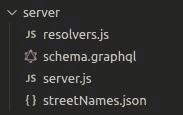

# React 中的无限滚动与 GraphQL 分页

> 原文：<https://levelup.gitconnected.com/infinite-scroll-in-react-with-graphql-pagination-40bfc2294430>

## 创建 React 前端和我们自己的 GraphQL 服务器的分步指南。


我们今天将创造什么！

> 注:所有文件(服务器和前端)都可以在 [GitLab](https://gitlab.com/gvanderput/gerard-graphql-pagination) 找到。

## 介绍

在本文中，我们将:

*   创建我们自己的带有分页的定制 GraphQL 服务器
*   用一个**无限滚动组件**创建一个 React 前端

我在 React 中看过几篇关于无限滚动的文章，**，但是很少有人深入细节**，也没有解释如何创建 GraphQL 服务器(*他们大多数使用现有的服务器，比如 GitHub GraphQL API* )。


动画:无限滚动运行中(带有**人工网络延迟**)。

让我们深入研究一下。我们从后端开始，然后在下半部分继续讨论前端。

# 创建 GraphQL 服务器

我们将创建一个`apollo-server-express` GraphQL 服务器，并用以下四个文件对其进行配置:



我们的后端文件。

这个文件包含了我们的服务器将要返回的数据。我创建了一些虚拟数据(100 个街道名称)。前几行如下所示:


我们的 JSON 包含 100 个街道名称。

每个条目都有一个索引、一个名称和一个*散列*。哈希是通过将索引和名称连接成一个字符串形成的，然后我们对这个字符串进行 base64 编码。稍后，我们将把这些散列称为**游标**。记住这一点。

该文件将引导我们的 Apollo (GraphQL)服务器。配置非常简单:

第六行最有趣。我们必须将`typeDefs`(我们的 GraphQL 模式)和`resolvers`传递给 ApolloServer 构造函数。我们接下来会看那些文件。

> 注意:我们用[**nodemon**](https://www.npmjs.com/package/nodemon)(*每周下载超过 300 万次)启动我们的服务器！这是一个工具，当检测到文件改变时，它会自动重启我们的服务器。这在开发过程中非常实用。
> 启动我们服务器的完整命令:*

```
nodemon -e js,graphql,json --exec babel-node server.js
```

参见库中的脚本`graphql:start` (inside package.json) [。](https://gitlab.com/gvanderput/gerard-graphql-pagination/-/blob/master/package.json)

**schema.graphql**
在我们看这个文件中的 schema 之前，稍微讲一下用 GraphQL 分页的**。有几种方法可以创建支持分页的模式。但是正如 GraphQL 开发者(*脸书和开源社区*)所说:**

> 总的来说，我们发现基于光标的分页是最强大的。

让我们不要固执，继续使用**基于光标的分页**。这本身也可以通过多种方式实现。一个流行的规范是 *GraphQL 游标连接规范*，由 Relay 提供。我们会用这个。脸书是提供该规范的 **Relay** 开源项目的主要贡献者。Relay 是 React 的一个 GraphQL 客户端，由 Facebook.com 使用。

如果你已经研究过这个主题，你可能已经读过关于**节点、边和光标**的内容。这些术语也出现在我们的模式中，该模式部分实现了中继规范。让我们打开它:

如果我们对我们的服务器运行一个查询，并请求完整模式格式的数据，则响应如下所示:

> 注意，我们提供了参数，或者如 GraphQL 世界中所说的“变量”，只返回**的前两条记录**。稍后当我们在前端执行这个查询时，会有更多的细节)。

第 8 行的**边**基本上是我们街道名称的列表，周围有一些“元数据”。每个记录都包含一个游标(正如我们前面提到的，它是记录的哈希值)。它包含我们感兴趣的实际数据，在来自`streetNames.json`的**节点**属性中。

请注意，该响应也表明*还有更多数据要获取*。你可以在 **pageInfo** 里面看到。它显示了返回的最后一条记录的光标(当我们发出下一个请求时，我们可以将它作为一个参数使用)，并且它明确表示可以获取更多的数据(`"hasNextPage": true`)。

在创建我们的前端之前，让我们看看这个数据是如何被我们的服务器用它的*解析器、*返回的。

**resolvers.js**
当我们的服务器接收到一个`streetNames`查询时，它必须*解析*这个查询(它必须找到正确的数据)。在我们的模式定义中，我们可以看到该查询可以接收两个(可选)参数:

```
type Query {
  streetNames(first: Int, after: String): Response
}
```

通过这种方式，我们可以配置需要获取多少条记录，使用`first`和`after`选择数据时应该从哪条记录开始。`after`的值应该是一个*光标*。在我们的例子中，它是 JSON 文件中的一个*散列*。

我们的**解析器** ( *有些简化，以使其更具可读性——完整版* [*中的回购*](https://gitlab.com/gvanderput/gerard-graphql-pagination/-/blob/master/server/resolvers.js) ):

在围绕这一点的所有解释和理论之后，代码应该自己说话。好好看看它，然后我们将继续前进到前端。

# 使用无限滚动对组件进行反应

在继续之前，请确保您的本地 GraphQL 服务器正在运行。如果您已经克隆了[存储库](https://gitlab.com/gvanderput/gerard-graphql-pagination)，您可以运行:

```
$ yarn run graphql:start
```


动画:行动中的无限滚动(**无**人工网络延迟)。

我用 CRA 创建了一个新项目，并添加了一些依赖项。我们将使用流行的 [**Apollo 客户端**](https://www.apollographql.com/docs/react/) 与我们的 GraphQL 服务器对话:

```
$ npx create-react-app myApp
$ cd myApp
$ yarn add @apollo/client graphql
```

## Apollo 客户端实例

首先，我们在`src/client.js`中创建和导出一个客户端实例:

在第 7–13 行上，我们为街道名称查询配置了`typePolicies`。Apollo-Client 从版本 3(2020 年 7 月发布)开始就支持这个。我们在这里所做的是定义**如何将对包含列表**的 GraphQL 模式**的连续调用的数据合并**(并存储在缓存中)。

换句话说，如果我们对服务器进行两次调用:

*   呼叫 1:获取记录 0 到 9
*   通话 2:获取记录 10 至 19

…这将决定两个响应如何组合(合并)并存储在缓存中。您还可以覆盖或定制由预定义的`relayStylePagination`函数返回的值，但这超出了本文的范围。[在文档](https://www.apollographql.com/docs/react/pagination/cursor-based/)中了解更多信息。至少我们现在看到了使用中继分页规范的一个好处:其他库也经常实现对它的支持。

在继续下一步之前，确保您的主组件被包装在一个引用实例化客户端的 Apollo ProviderHOC(高阶组件)中:

## 无限涡旋组件

最后但同样重要的是，无限卷轴组件本身。您可以在库中查看完整的文件[，但是我将在下面描述一些**关键部分**(马上查看整个文件可能会有点让人不知所措)。](https://gitlab.com/gvanderput/gerard-graphql-pagination/-/blob/master/src/App.js)

首先，我们在`queries.js`中定义我们的查询:

然后，在我们的功能组件中，我们用来自 Apollo-Client 的`useQuery`钩子执行这个查询:

`first` (10)配置我们希望每个请求获取多少“行”。除此之外，每当`networkStatus`的值改变时，设置`notifyOnNetworkStatusChange`将重新呈现我们的组件。默认情况下，这是 *false* ，但是我们希望能够在我们的组件中显示“正在发生一些事情”。例如，当我们的用户向下滚动并开始获取更多数据时，我们可以显示一个微调器。

重要提示:注意`useQuery`是如何导出一个名为`fetchMore`的变量(函数)的。这就是我们可以用来*获取更多数据*的函数！

所以当我们渲染我们的**数据**(也由`useQuery`返回；这包含我们的街道名称)作为 DOM 中的行，我们将在它们下面呈现一个“ **load more** 按钮:


数据行下方的**加载更多的**按钮。

看看我们的按钮，以及它的*点击处理程序*:

点击处理程序调用`**fetchMore**`函数。看看我们如何传递变量`after`、*和来自前一个请求*的、`*endCursor*`、*值。*

现在应该说得通了。

现在，您可以打开浏览器进行测试。它的工作:我们可以通过点击“加载更多”按钮加载更多的数据！

*感谢您的时间，我们将在我的下一个*再见……等待。我们不喜欢手工劳动，是吗？

向 [**路口观察者 API**](https://developer.mozilla.org/en-US/docs/Web/API/Intersection_Observer_API) 问好。

每当 DOM 元素在视窗中可见时，交叉点观察器**可以触发一个事件。**

我不会描述细节，因为否则这篇文章会变得太长，但它并不难使用。本质上，您必须:

*   创建新的 IntersectionObserver 实例
*   让*观察*的“加载更多”按钮
*   每当“加载更多”按钮变得可见时(在屏幕上)，在其上触发一个点击事件。

你可以在库的 [App.js 中查找细节，在**第 20–37 行**的两个 useEffect 钩子中。](https://gitlab.com/gvanderput/gerard-graphql-pagination/-/blob/master/src/App.js)

**现在**我们有了一个无限(自动)滚动组件和一个定制的 GraphQL 服务器！


动画:行动中的无限滚动(**无**人为网络延迟)。

感谢您的时间:)

杰拉德·范德普特