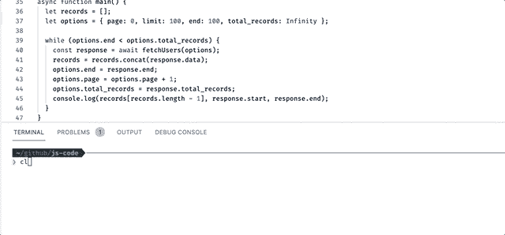
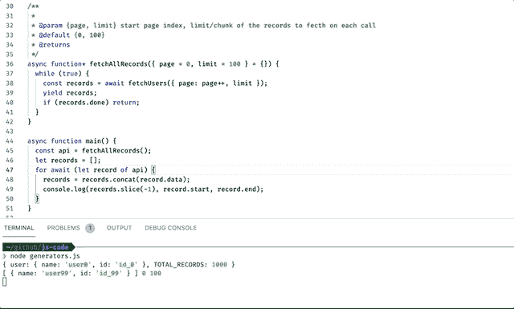

# 无限滚动|使用 JavaScript 生成器在 API 上分页

> 原文：<https://levelup.gitconnected.com/infinite-scroll-pagination-on-an-api-using-javascript-generators-55fae6e7c3e7>


由[奥拉夫·阿伦斯·罗特内](https://unsplash.com/@olav_ahrens?utm_source=medium&utm_medium=referral)在 [Unsplash](https://unsplash.com?utm_source=medium&utm_medium=referral) 拍摄的照片

## 使用 JavaScript 生成器编写干净的代码

在编写前端代码时，您可能需要使用分页从 API 中获取所有记录。为此，您可以将代码分解成多个函数。然而，维护如此多的变量并将状态从一个函数传递到另一个函数，并不像看起来那么简单。数据源的异步特性使得它更加复杂。然而，您可以使用[异步生成器](https://developer.mozilla.org/en-US/docs/Web/JavaScript/Reference/Statements/for-await...of)函数来简化它。在本文中，我将解释如何将复杂的逻辑分解成简单的函数。

# 1.创建一个模拟的数据湖/源

要测试功能，您需要一个数据源。为了模拟真实的 api 数据源，我将创建一个虚拟用户列表。

```
const users = Array(1000)
  .fill()
  .map((_, i) => ({ name: `user${i}`, id: `id_${i}` }));
const TOTAL_RECORDS = users.length;console.log({user: users[0], TOTAL_RECORDS});
// { user: { name: 'user0', id: 'id_0' }, TOTAL_RECORDS: 1000 }
```

# 2.获取用户 API 函数

您可以使用基于承诺的 API 函数来获取记录。然而，我将使用 [async-await](https://developer.mozilla.org/en-US/docs/Learn/JavaScript/Asynchronous/Async_await) 函数来创建这个获取用户 API 函数

```
//service.jsconst delay = () => new Promise((r) => setTimeout(r, 1000));/**
 * fetchUsers
 * 
 * [@param](http://twitter.com/param) {page, limit} current page number, limit of the records to fecth
 * [@default](http://twitter.com/default) {0, 100}
 * [@returns](http://twitter.com/returns) 
 */
const fetchUsers = async ({ page = 0, limit = 100 }) => {
  const start = page * limit; // start index of the records
  const end = (page + 1) * limit; // end index of the records
  await delay(); // virtual delay of 1000ms
  return {
    data: users.slice(start, end), //Slice the records from start to end
    done: end >= TOTAL_RECORDS,
    start,
    end,
  };
};// [optional]
//export { fetchUsers };
```

上面的函数`fetchUsers`采用类似`page`和`limit`的选项。Page 定义为分页的当前页，limit 定义为要获取的记录的限制。延迟仅仅是模拟实际网络的 *1000ms* 的虚拟延迟。

# 3.使用生成器函数提取所有记录

传统上，你可以用递归来写一个函数来解决这个问题。然而，编写递归版本太复杂，难以理解。您也可以使用 *for-loop/while-loop* 使用 *async-await* 。看看下面的例子。

```
async function main() {
  let records = [];
  let options = { page: 0, limit: 100, end: 100, total_records: Infinity };while (options.end < options.total_records) {
    const response = await fetchUsers(options);
    records = records.concat(response.data);
    options.end = response.end;
    options.page = options.page + 1;
    options.total_records = response.total_records;
    console.log(records[records.length - 1], response.start, response.end);
  }
}
// { name: 'user199', id: 'id_199' } 100 200
// { name: 'user299', id: 'id_299' } 200 300 
```

**输出:**



正如您所看到的，使用 while-loop 函数，您的主函数必须过多地考虑其他变量，如*记录*、*分页选项*。在这种情况下，发电机表现出色。让我们试着把上面的例子转换成生成器。

```
/**
 *
 * [@param](http://twitter.com/param) {page, limit} start page index, limit/chunk of the records to fecth on each call
 * [@default](http://twitter.com/default) {0, 100}
 * [@returns](http://twitter.com/returns)
 */
async function* fetchAllRecords({ page = 0, limit = 100 } = {}) {
  while (true) {
    const records = await fetchUsers({ page: page++, limit });
    yield records;
    if (records.done) return;
  }
}async function main() {
  const api = fetchAllRecords();
  let records = [];
  for await (let record of api) {
    records = records.concat(record.data);
    console.log(records[record.end-1], record.start, record.end);
  }
}
```

**输出:**



如您所见，使用生成器使代码看起来更加简单易读。

**注意:**如果你注意到第`for await (let record of api)`行，在这一行，我们看到发电机异步循环。这个`await`信号通知`for-loop`对象`api`是[异步迭代器](https://developer.mozilla.org/en-US/docs/Web/JavaScript/Reference/Global_Objects/Symbol/asyncIterator)函数要迭代。

**Codesandbox:**

# 结论:

Async await 并不能让你的 API 运行得更快。它只是简化了代码，增加了代码的可读性。正如某位智者曾经说过的。

> “任何傻瓜都能写出计算机能理解的代码。优秀的程序员会写出人类能理解的代码。”—马丁·福勒