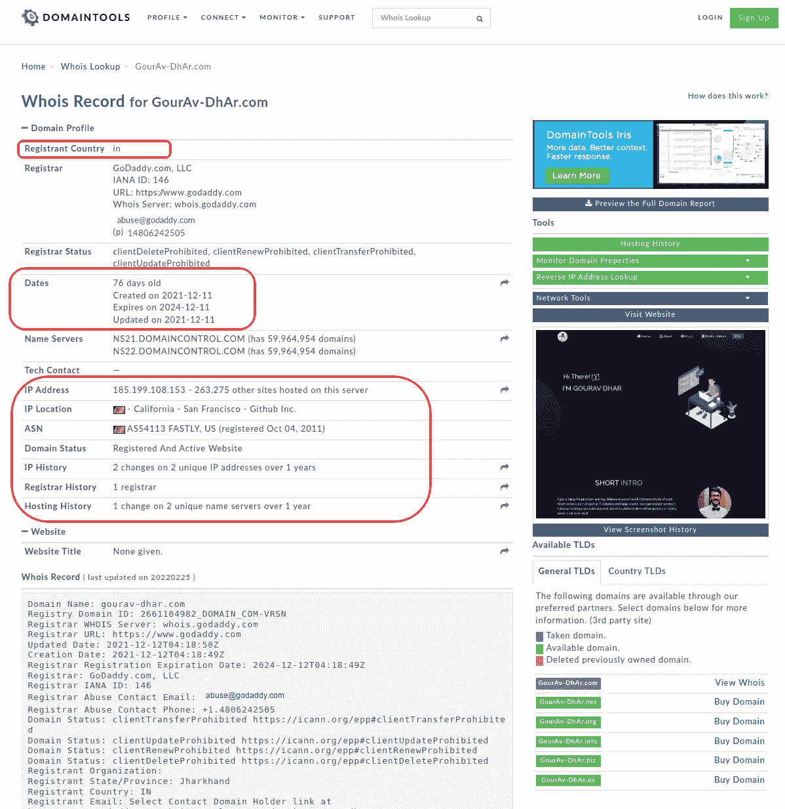
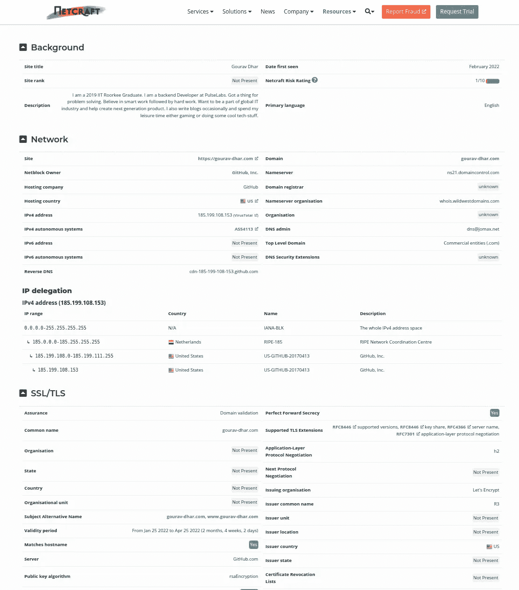
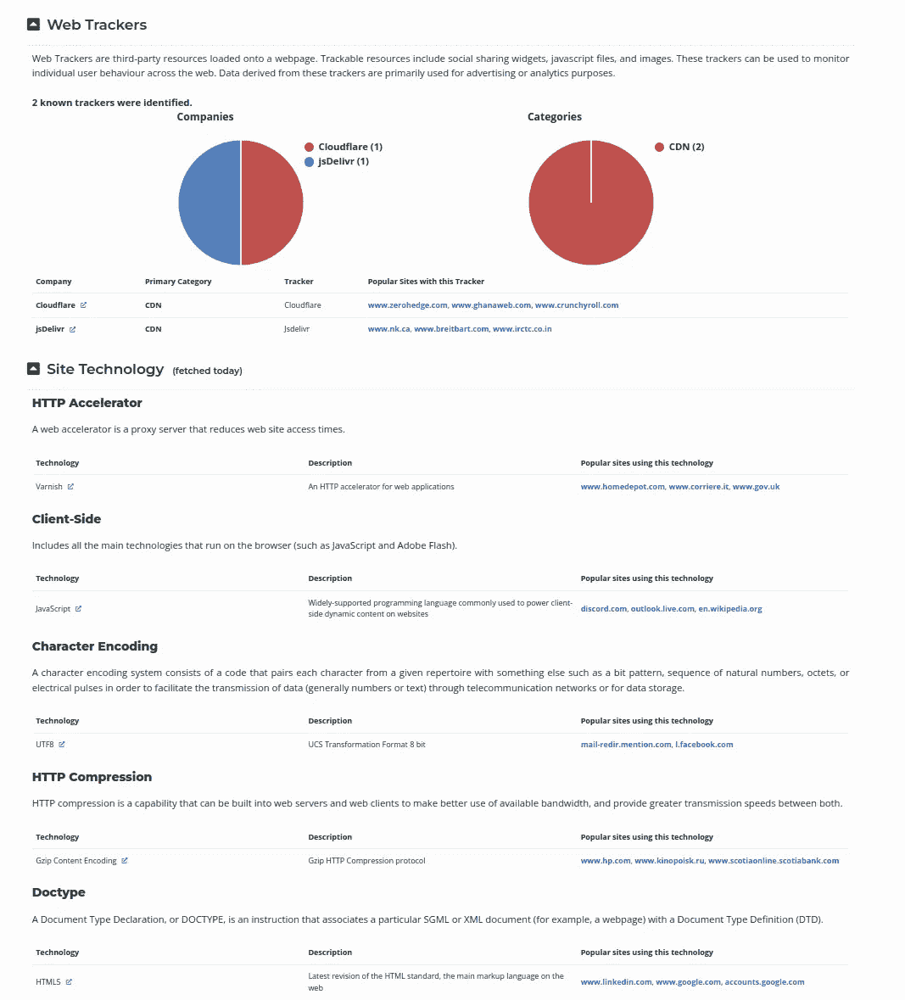
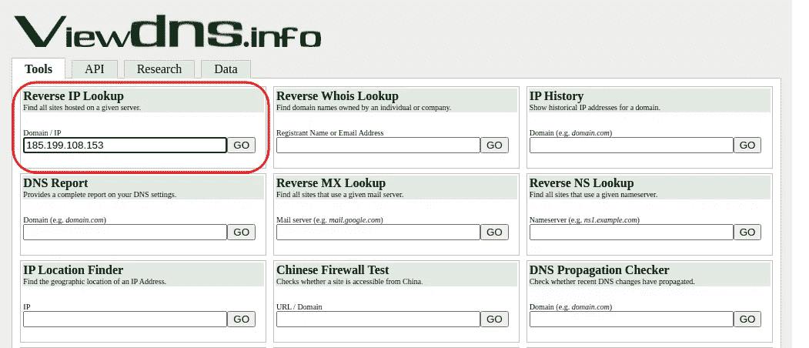
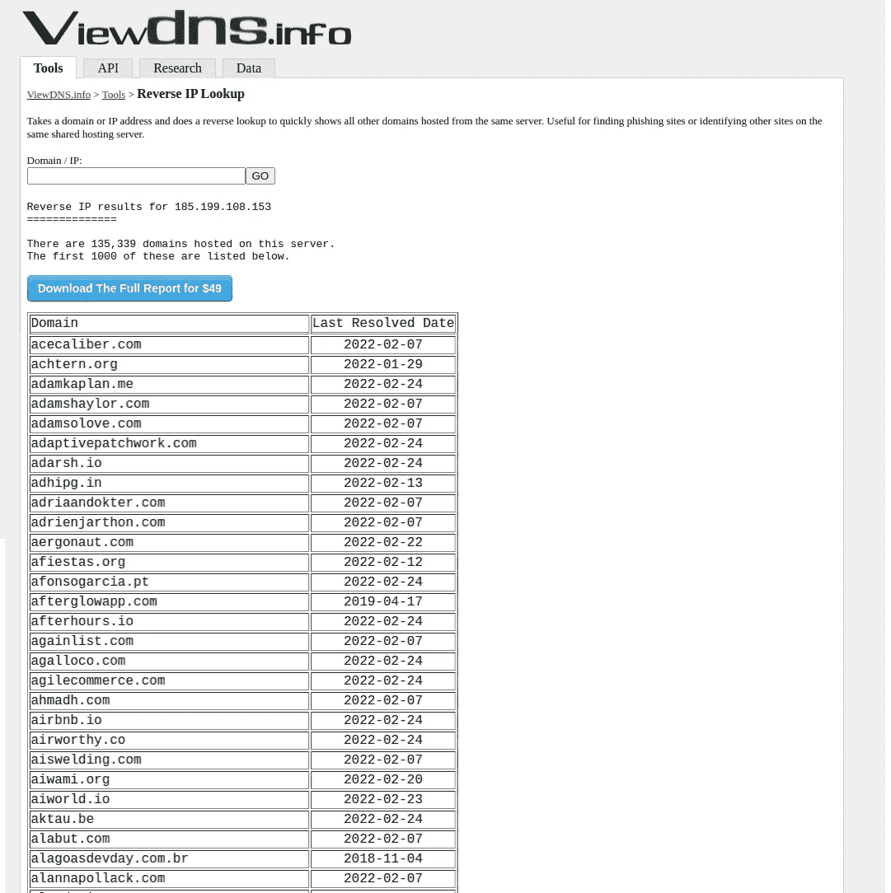
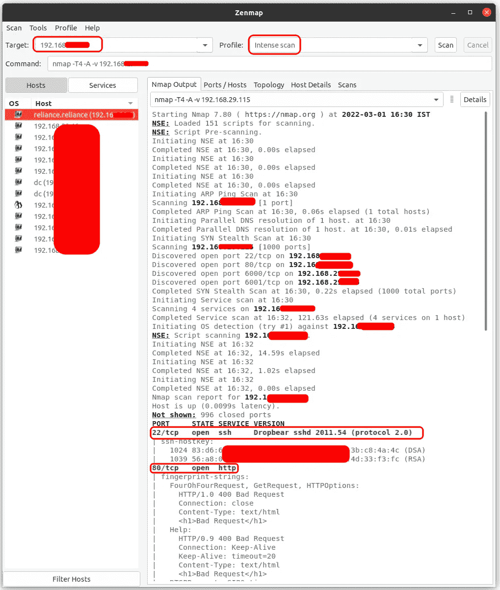
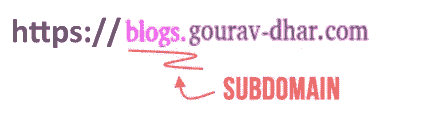
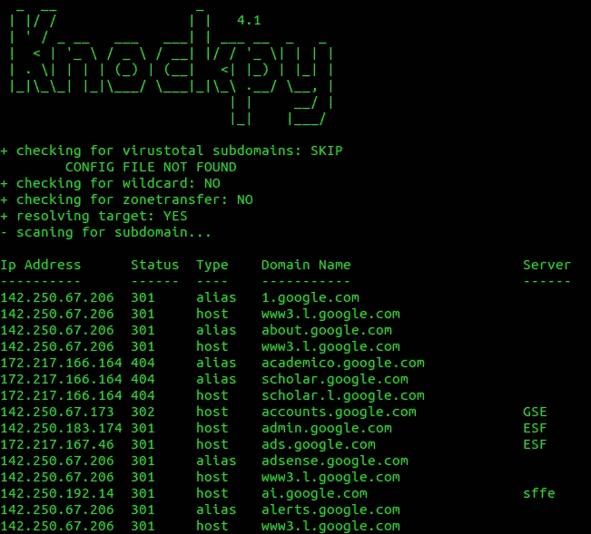

# 信息收集——网站黑客的第一步

> 原文：<https://levelup.gitconnected.com/information-gathering-first-step-towards-website-hacking-462dcad56c5a>

> 黑网站？不要错过这重要的一步！


在入侵一个网站或资源之前，最好先积累与目标资源相关的所有信息。黑客/渗透测试人员收集所有与他们想要攻击的网站相关的可能信息。然后他们想出一个策略，用这些信息攻击资源。这些信息很多都可以在互联网上公开获得。

在这篇博客中，我将介绍一下可以用来获取所有这些信息的主要工具。主要步骤是

*   Whois 查找—域名信息
*   找出使用的技术
*   发现服务器上开放的端口
*   同一服务器上的网站
*   发现网站的子域
*   在网站上发现文件

让我们看看如何执行这些步骤:

# WhoIs 查找—域名信息

**WhoIS 查找**是一种协议，用于查找互联网上任何资源的所有者。它可以是域名或 IP 地址的所有者。这些信息很容易获取，你可以谷歌`whois lookup`找到提供这项服务的网站列表。我已经使用[https://whois.domaintools.com](https://whois.domaintools.com)来获取下面截图中的`WhoIs`细节。



网站的 WhoIS 查找数据库中的详细信息:[https://gourav-dhar.com](https://gourav-dhar.com)

任何人都可以获得与网站所有者的国家、网站启用日期、网站的 IP 地址、注册域名的公司等相关的信息。

# 目标网站使用的技术

为此，在 https://sitereport.netcraft.com/[有一个可用的工具。该网站将提供与许多事情相关的信息，最重要的是用于托管该网站的技术。如果网站使用`javascript`，黑客可以运行一段 javascript 代码，影响客户的电脑。如果网站使用`PHP`，黑客可以编写一个`PHP`代码进行服务器端攻击。我们还获得网站使用的网络跟踪器的信息。我的网站——](https://sitereport.netcraft.com/)[https://gourav-dhar.com](https://gourav-dhar.com)的结果如下。



# 同一服务器上的网站

如果你试图入侵一个网站，却找不到任何漏洞，下一步就是找到存在于同一服务器上的任何其他网站。如果两个网站存在于同一个服务器上，那么它们将拥有相同的 IP 地址。如果您能够入侵任何其他网站，您可以通过文件系统导航到目标网站。为此，您需要进行反向 DNS 查找。

DNS 服务器的作用是将 URL 转换成 IP 地址。每当您浏览 URL 时，互联网服务提供商(ISP)将向 DNS 服务器查询请求需要发送到的 IP 地址，并返回该 IP 地址。

通过反向 DNS 查找，我们可以获得 IP 地址/计算机上托管的网站信息。为此，导航至[https://viewdns.info/](https://viewdns.info/)。在标题`Reverse IP Lookup`下，输入目标网站的 IP 并点击`Go`以获得同一台计算机上托管的网站列表。



185.199.108.153 的反向 IP 查找结果

您将获得目标网站所在的同一 IP 上托管的所有网站的列表。现在，您可以尝试在这些网站中找到最不安全的网站，并导航到目标网站。

# 发现 IP 上的开放端口

有一个工具 Zenmap 可以帮助我们做到这一点。可以使用以下命令安装它:

```
$ sudo apt install zenmap
```

放置目标 IP 并选择密集扫描，以查找可以利用的开放端口和服务版本详细信息。



# 发现网站的子域



很多网站都有子域名。发现与网站子域相关的信息是很有用的。您可以获得网站管理员或管理人员使用的网页信息。您还可以访问 web 应用程序的测试版或仍在开发中的 web 应用程序部分。在开发中的应用程序中发现 bug 的机会很高，因此找到可被利用来访问系统的弱点的机会也更高。

有很多工具可以用来发现子域。一个这样的工具是`knockpy`。安装非常简单。运行:

```
**$** sudo apt install knockpy
```

要使用这个工具，运行`knockpy`，然后运行域名。我将为 google.com 跑一趟。

```
**$** knockpy google.com
```



“knockpy google.com”的结果

# 在网站上发现文件

有时有机会在服务器位置找到配置文件。这些配置文件可以给我们很多信息，这些信息可以用来入侵网站。为了发现这样的文件，有一个叫做`dirb`的工具。要安装它，请运行以下命令

```
**$** sudo apt install dirb
```

该工具将向目标网站发送请求，并从单词列表中选择一个单词。它只能根据用户提供的单词表或`dirb`中的默认单词表来搜索文件和目录。

最后，运行`man dirb`来探索这个命令提供的所有选项。

虽然上面列出了与信息收集相关的主要方法，但是有很多开源工具可以加速这个过程。记住谷歌是你的朋友！


> 这是一个探索我们博客平台[](https://www.thegeekyminds.com/)**的邀请。一个让您了解软件开发和技术领域最新发展的一站式平台。我们在 [**的极客头脑**](https://www.thegeekyminds.com/) 旨在写一些你实际上可以用来提高工作效率和充实你的职业生活的内容。**
> 
> **邀请您在[**https://thegeekyminds.com**](https://thegeekyminds.com/)通过我们的平台。并订阅我们的时事通讯，以便在我们每次发布新帖子时收到电子邮件。我们承诺不会向您的收件箱发送垃圾邮件。点击下面的按钮订阅我们的时事通讯**

**[](https://forms.wix.com/4444cf13-7653-460d-9b32-f2e4e65544d1:c2184260-1ab5-4c6a-a37d-53de0778afa0)**