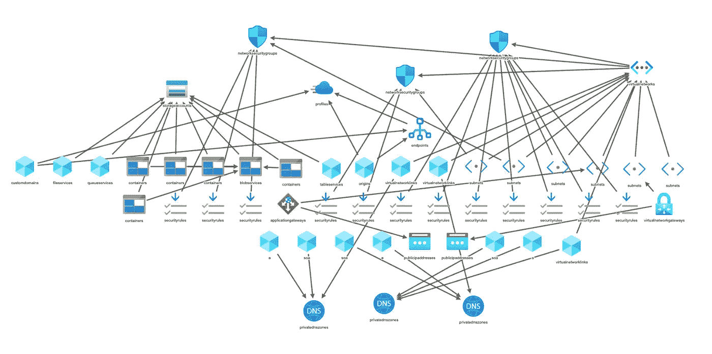
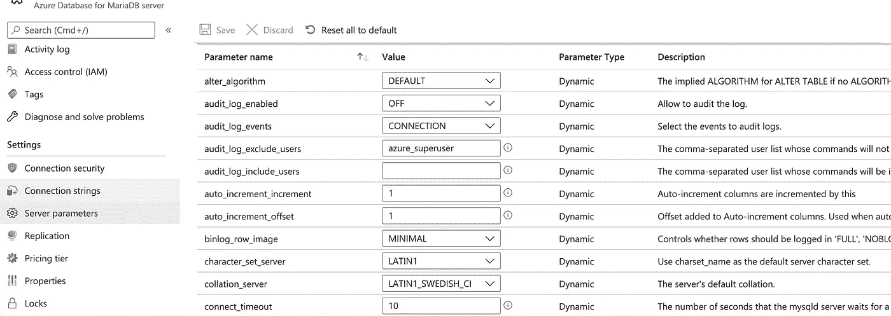
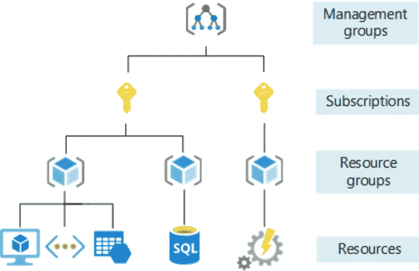
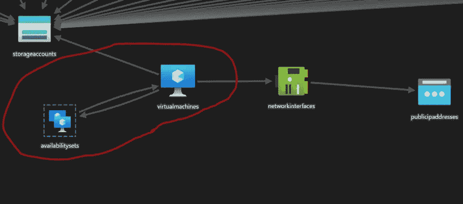
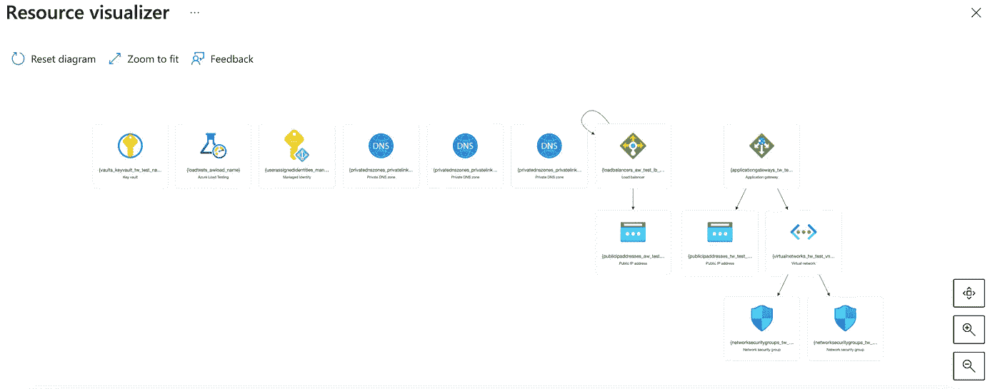

# 基础设施作为 Azure 中的代码

> 原文：<https://levelup.gitconnected.com/infrastructure-as-code-in-azure-7dc5e6d9eab9>

我在 Azure 做 IaC 的快速印象。什么是作为代码的基础设施？有哪些限制和缺陷？

[IaC 概述](#f5a2)
∘ [什么是 IaC？](#5e01)
∘ [为什么需要 IaC？](#5d36)
∘[IaC 的两种做法](#df75)
∘ [流行的 IAC 工具](#e78a)
[IAC in azure](#eede)
∘[azure 管理理念](#a462)
∘ [ARM 模板](#30cc)
∘ [ARM Teamplate 局限性](#bf30)
∘ [6。azure resource visualizer sucks](#a782)
[最终文字](#4c32)
[引用](#431c)

IaC 运行中的可视化

# IaC 概述

在讨论 IaC 是如何在 Azure 中完成的之前，我们先来了解一些关于 IaC 的背景。

## 什么是 IaC？

[infra structure as Code](https://en.wikipedia.org/wiki/Infrastructure_as_code)(IaC)是在文件中管理计算机基础设施的过程。IaC 有两个组成部分。第一个是通过部署提供资源。第二是将部署的资源作为代码进行管理。在这两种情况下，将基础设施描述为代码是必要的先决条件。

## 为什么需要 IaC？

要了解为什么 IaC 是必要的和有益的，请考虑默认情况。对于任何必须管理中型服务器实验室的人来说，您都知道跟踪和配置机架、布线、网络等所有硬件的物理设备是多么痛苦。迁移到云确实使得用漂亮的控制台 UI 来可视化变得更加容易，但是管理它们仍然很有挑战性。下面是一个典型的控制台用户界面的截图。有了多层选项和规则，很容易在云中迷失方向(这不是双关语)。

云服务的典型控制台用户界面

将基础架构的复杂配置作为文件进行调配和管理，可以对它们进行版本控制和代码审查。这将降低人为错误的风险，节省管理成本，并提高部署和设置的速度。

## IaC 的两种方法

有两种方法可以实现 IaC。在**命令式(或程序式)**方法中，您描述了如何实现期望的状态。要做到这一点，您需要知道事情如何工作的细节:即顺序、错误检查条件等。通常，这些过程是用某种脚本语言指定的，如 Powershell CLR 或 Python。

第二种方法被称为“T2”声明性或功能性方法，因为它只是描述了期望的状态，而没有说明如何实现它。Yaml 或 JSON 文件通常用于此目的。需要注意的重要一点是，所描述的状态是'**幂等的**，'这意味着多次执行相同的脚本不会改变期望的结果。

## 流行的 IaC 工具

最流行的 IaC 工具是 [Terraform](https://www.terraform.io/) ，它使用 [Go](https://en.wikipedia.org/wiki/Go_(programming_language)) 作为脚本语言。RedHat 的 Ansible 使用了 Python，是另一个流行的工具。

另一方面，像 AWS、Azure 和 GCP 这样的云提供商有自己的 IaC 工具。AWS IaC 解决方案是 [CloudFormation](https://aws.amazon.com/cloudformation/) ，它使用 YAML 作为文件格式。Azure 有用 JSON 写的 ARM (Azure 资源管理器)模板。另一方面，Google CDM(云部署管理器)模板是用 Python 编写的。

我个人使用过 AWS CloudFormation 和 ARM，它们的用法非常相似。

# 天蓝色的 IaC

建立了一些关于 IaC 的基础知识之后，我们就可以看到 IaC 在 ARM (Azure Resource Manager)中的运行了。

## Azure 管理概念

在 Azure 中，资源被组织在层次结构中，从授权你访问 Azure 服务和订阅的帐户开始。[Azure AD(Active Directory)](https://en.wikipedia.org/wiki/Microsoft_Azure_Active_Directory)是管理帐户访问 Azure 资源的系统。租户是 Azure AD 的一个实例，每个租户都有一个单独的专用可信目录，其中包含租户的用户、组和应用程序。

目录按层次结构进一步分为管理组、订阅、资源组和资源。

[https://docs . Microsoft . com/en-us/azure/cloud-adoption-framework/ready/azure-setup-guide/organize-resources](https://docs.microsoft.com/en-us/azure/cloud-adoption-framework/ready/azure-setup-guide/organize-resources)

## ARM 模板

ARM (Azure 资源管理器)是 Azure 的 IaC 服务，ARM 模板是定义和描述资源和配置的 JSON 文件。

ARM 模板作用于资源和资源组。例如，您可以选择导出一个资源(例如，数据库资源)或包含大量资源的整个资源组。但是，您不能导出到资源组之外:例如，跨多个订阅或目录。

因此，将您的资源放入逻辑相关的资源中是一个很好的做法:例如，将所有与数据库相关的资源放入一个资源组中。例如，一旦相关资源被组织成组，一次性部署整个资源组就变得非常容易。

官方文档有大量的解释和示例，所以我将跳过细节。相反，我将把重点放在我在使用 ARM 模板时遇到的一些个人“陷阱”上。

## ARM 团队板限制

虽然 ARM 模板是管理和部署资源的好方法，具有 IaC 的所有优点，但它们也有一些限制。

1.  **并非所有资源都出口。**

您可能遇到的第一个障碍是，并非所有资源都被导出。例如，下面是我在尝试导出资源时遇到的一些错误消息:

这种错误并不少见，但是绝大多数资源都是导出的，所以这不应该成为不使用 ARM 模板的借口。

**2。ARM 模板只是“尽力而为”。**

ARM 模板的声明性语法意味着您不必担心执行顺序、如何创建它们等等。但是，它们不能 100%保证正确或可部署。如果资源存在依赖关系，而这些依赖关系不存在，则不会创建依赖资源。例如，如果虚拟机依赖于不存在的磁盘驱动器，部署将会失败。

**3。修复循环依赖关系。**

在尝试部署模板时，您可能会遇到的一个错误是“循环依赖”例如，可用性集和虚拟机可能相互依赖。

在这种情况下，模板将在部署前验证失败，因此您必须移除循环依赖。在我的例子中，我简单地从可用性集依赖关系中删除了 VM 来解决这个问题。

**4。机密不会导出。**

所谓“秘密”，我指的是与隐私或安全有关的私有或秘密资源:例如，证书、密码等。例如，当您导出数据库资源时，即使您通过 UI 设置了管理员用户名和密码，它们也不会被导出。显然，这些不是限制，而是保护资源的安全特性。

为了更好地保护您的机密，最佳做法是使用 Key Vault service 来保存您的机密并引用模板文件中的机密。以下模板片段显示了通过用户分配的身份对证书的 KeyVault 机密的引用。

**5。静态资源可能不是静态的。**

部署了静态资源，如 IP 地址，但是它们的实际值可能与您分配给它们的值不同，这取决于当前的可用性。

为了避免部署和服务问题，最好对静态资源使用参数，而不是硬编码实际值。

## 6.Azure 资源可视化工具很烂

您可以使用资源可视化工具在 Azure 中可视化 ARM 模板。但是，我必须警告你，这个工具的功能非常少，除了放大和缩小之外，你不能与元素交互。

幸运的是，VS 代码为 ARM 模板提供了两个很好的扩展。[Azure Resource Manager Tools](https://docs.microsoft.com/en-us/azure/azure-resource-manager/templates/quickstart-create-templates-use-visual-studio-code?tabs=CLI)extension 是编辑模板的好帮手，而 [ARM Template Viewer](https://marketplace.visualstudio.com/items?itemName=bencoleman.armview) 是一个很棒的交互式可视化工具。上面绘制的相同资源组在 ARM 模板查看器中显示如下:

# 最后的话

尽管有上述限制和缺陷，ARM 模板和 IaC 仍然是管理资源和配置的最佳方式。像任何工具或技能一样，也有技术上的权衡，您必须意识到其中的问题，并做出明智的决定，确定哪些工具最适合您的特定需求。我希望我的文章已经告诉了您从哪里开始 IaC 和 ARM 模板之旅。

# 参考

[1]微软文档: [Azure 基础概念](https://docs.microsoft.com/en-us/azure/cloud-adoption-framework/ready/considerations/fundamental-concepts)

[2]微软文档: [Azure 资源管理器](https://docs.microsoft.com/en-us/azure/azure-resource-manager/management/overview)

[3]比较不同 IaC 框架的优秀参考文章:[https://spacelift.io/blog/infrastructure-as-code](https://spacelift.io/blog/infrastructure-as-code)

# 分级编码

感谢您成为我们社区的一员！更多内容见[级编码出版物](https://levelup.gitconnected.com/)。
跟随:[推特](https://twitter.com/gitconnected)，[领英](https://www.linkedin.com/company/gitconnected)，[通迅](https://newsletter.levelup.dev/)
**升一级正在改造理工大招聘➡️** [**加入我们的人才集体**](https://jobs.levelup.dev/talent/welcome?referral=true)