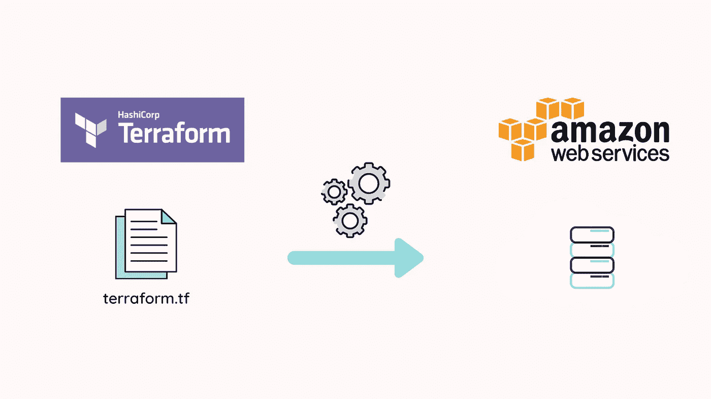
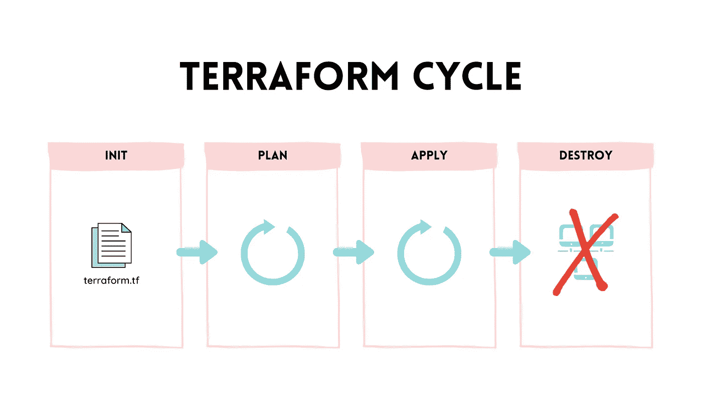
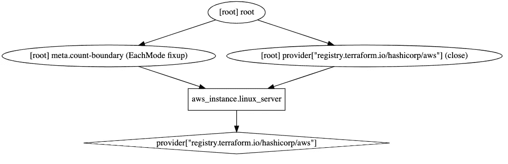

# 使用 Terraform 和 AWS 将基础设施作为代码

> 原文：<https://levelup.gitconnected.com/infrastructure-as-code-with-terraform-and-aws-6c24866a56d9>

## 在 AWS 中运行 Linux 服务器的简单 Terraform 指南



我想到这篇文章是因为我想开始使用 Terraform(来自 [HashiCorp](https://www.google.com/search?q=HashiCorp) )作为一种工具来处理代码形式的基础设施，所以我决定编写一个简单的入门指南/教程，以使用 AWS (Amazon Web Services)作为云提供商来设置 Terraform 项目。

在基础设施建立并运行之后，我们将使用 Terraform 和 Graphviz 来实现基础设施的图形化可视化。

让我们先来了解一下 Terraform 的背景。

# 关于地形的基础知识

Terraform 是一个工具，它允许您将基础设施视为代码。这意味着您可以创建一组定义文件来描述管理基础设施的过程，将它们存储在版本控制存储库中，并以与应用程序代码相同的方式发展您的基础设施。

> Terraform 是一个安全有效地构建、更改和版本控制基础设施的工具。Terraform 可以管理现有的和受欢迎的服务提供商以及定制的内部解决方案。
> 
> 来源:Terraform 网站



地形循环

要开始使用 Terraform，首先需要创建一个文件，其中包含定义基础设施的资源，我们称之为`terraform.tf`。

当您考虑拥有基础设施的第一个版本时，您可以运行命令`terraform init`，Terraform 将创建在创建基础设施时应用的初始计划。

有了合适的计划，你就知道哪些资源将被创建，在确认一切看起来像你所期望的之后，你就可以运行`terraform apply`。这将创建实际的基础设施。

基础设施就绪后，您需要通过添加新资源或更新任何现有资源来改进它。这样做之后，你就可以运行`terraform refresh`了，一个新的计划就创建好了。在验证了新计划中的更改后，您可以再次运行`terraform apply`，实际的基础设施将会更新。

最后，如果您不再需要基础设施，您可以运行`terraform destroy`，实际的基础设施将被终止。

现在我们已经了解了 Terraform 的基础知识，让我们为基础设施的设置做准备，以便在 AWS 上运行 Linux 服务器。

# 安装和设置

除了安装 Terraform 之外，要创建基础设施，您还需要一个 AWS 帐户和 AWS CLI(命令行界面)。本指南将使用 AWS 的免费资源。

我们先在 AWS [官网](https://aws.amazon.com/)上创建一个账号。

创建帐户后，让我们安装 AWS CLI 并通过运行以下命令进行配置

```
aws configure
```

您需要添加您的 AWS 访问密钥 ID 和秘密访问密钥的值，您可以在 [IAM](https://console.aws.amazon.com/iam/home#/security_credentials$access_key) 服务部分找到它们。

现在我们已经有了一个帐户和 CLI，让我们创建一个名为`terraform.tf`的文件，并将下面的内容放入文件中。

地形文件

上面的文件将包含在 AWS 上运行一个 Linux 服务器实例所需的资源。

首先，我们需要告诉 Terraform，我们希望使用 AWS 作为我们的云提供商，我们在`required_providers`元素下添加了一个名为`aws`的配置。

现在我们需要配置我们的提供商，为此我们创建了一个名为`aws`的`provider`，在里面我们描述了将被使用的 AWS 帐户的配置文件，以及我们希望在哪个区域创建我们的资源。

最后但同样重要的是，我们添加一个类型为`aws_instance`的`resource`，并传递与我们想要运行的 Linux 服务器相匹配的配置。

好了，现在让我们转到 AWS 帐户，开始将上面文件中的概念与实际资源对应起来。

首先，进入“服务”，搜索 EC2(弹性计算云)，点击它。您将进入一个页面，该页面将显示与您的帐户相关的 EC2 资源。搜索“启动实例”按钮并按下它。现在，您将看到 AMI(Amazon 机器映像)列表，检查过滤器“Free Tier ”,并复制 Linux 服务器名称下的 AMI 值。在`ami`属性中使用`terraform.tf`文件中的值。

下一步是按下“选择”按钮，选择您之前必须选择的 AMI。您将看到可用实例类型的列表，从空闲层中选择一个，并将列“Type”上的值复制到`terraform.tf`文件，粘贴到`instance_type`属性中。

在 tags 部分，您可以指定将要创建的 EC2 实例的名称。然后，这个名称将用于 AWS 帐户内 EC2 实例表的“名称”列中。

你现在应该可以安全地使用免费层，不需要花任何钱。

⚠️ *始终关注你正在设置的 AWS 配置，并始终选择免费层，否则你可能会被收费。如果你没有任何自由层选项，并决定继续试验，我不会对你可能产生的任何费用负责。*

现在，让我们使用 Terraform 在 AWS 帐户内部创建基础设施。

# 初始化并运行

现在我们已经有了 Terraform 文件，我们可以通过运行

```
terraform init
```

现在，Terraform 已经下载了 AWS 提供者插件，并将提供者配置存储在一个名为`.terraform.lock.hcl`的文件中。

安装了提供者插件后，我们可以通过运行以下命令来应用 Terraform 配置

```
terraform apply
```

现在，您可以看到 Terraform 倾向于执行的计划，它显示了在控制台终端中输入值“yes”后将执行的操作。

现在，您将在控制台输出中看到正在创建的资源，最后是 Terraform 添加、更改和销毁的资源的恢复。

如果你进入你的 AWS 账户并选择 EC2，你会看到一个名为“我的 Linux 服务器”的实例，这就是你的 Linux 服务器。

现在，转到文件`terraform.tf`，在标记部分中更改实例的名称并运行

```
terraform refresh
```

这将生成一个具有新实例名称的新计划，再次运行 apply 命令，并在 AWS 帐户的 EC2 部分检查新名称。

最后，我们将通过运行以下命令来终止 EC2 实例

```
terraform destroy
```

现在，您可以在控制台终端中看到一个计划，通过写入值“yes”进行确认后，销毁资源并终止 EC2 实例。如果您转到您的 AWS 帐户并选择 EC2，您将看到该实例处于“终止”状态。

# 可视化地形图

准备好基础设施的结构后，让我们看看代表当前地形状态的图表。

地形命令`terraform graph`将基于文件`terraform.tfstate`生成一个图形。图形以`dot`格式生成，为了可视化，我们可以安装 [Graphviz](https://graphviz.org/download/) 并通过运行以下命令使用它来生成图形的图像。

```
terraform graph | dot -Tsvg **>** graph.svg
```

生成的图表如下所示。根元素是 Terraform 的核心元素，其余两个节点对应于 AWS provider 资源和 Linux 服务器实例。



地形图

## 包扎

在尝试了 Terraform 之后，这里有一些值得一提的地方:

*   使用 Terraform cycle 并将基础设施增量更改存储在版本控制存储库中是跟踪基础设施发展和回滚的好方法，以防出现问题。
*   Terraform 支持多个云提供商。
*   “导出到图形”功能生成的图形并不是您会发现的最用户友好/人类可读的图形，尽管如此，它还是提供了一种基础设施的可视化方式。随着基础架构变得越来越复杂，分析也变得越来越复杂。

有关本文主题的更多详细信息，请查阅以下书籍:

*   [devo PS 手册:如何在技术组织中创造世界级的灵活性、可靠性和安全性](https://amzn.to/3bsICQt)
*   [Terraform: Up &运行:将基础设施写成代码](https://amzn.to/2N1yC7s)
*   [Terraform Cookbook:跨各种云平台以代码形式高效定义、启动和管理基础设施](https://amzn.to/3bnKgCR)

如果你是一个有声读物爱好者，检查一下 [Audible🎧](https://www.amazon.co.uk/Audible-Membership/dp/B00OPA2XFG?actionCode=AMN30DFT1Bk06604291990WX&tag=20200becb-21)。

如果你有任何建议或贡献，欢迎在下面评论。编码快乐！

*本文是使用以下参考资料构建的:*

*   [*Terraform 网站*](https://www.terraform.io/)
*   [*Graphviz 网站*](https://graphviz.org/)
*   [*亚马逊网络服务网站*](https://aws.amazon.com/)