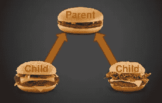
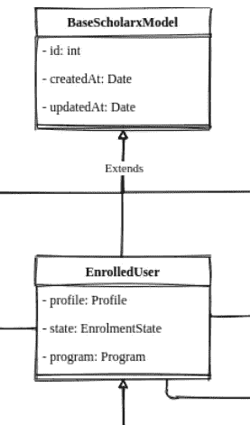

# JPA/Hibernate 的继承映射

> 原文：<https://levelup.gitconnected.com/inheritance-mapping-with-jpa-hibernate-338f0c0b8450>

当使用 JPA 生成数据库时，我们必须做的最重要的事情之一就是映射继承。在这篇文章中，你将会学到一些我们在映射继承时必须知道的基本知识。



遗产

对于 [ScholarX](https://github.com/sef-global/scholarx) 项目，我必须向 spring-boot 项目添加 JPA 注释，以便生成 MySQL 数据库。已经为实体创建了模型。为了启动这个任务，我得到了一个类图。否则，可能很难找到数据类型、关系等。如果你想知道什么是类图，点击这里。

好吧，那么…回到主题。JPA 有几个继承策略。

*   *mapped 超类*
*   单一表格
*   连接表
*   每类表格

如果你已经检查了我们的[类图](https://drive.google.com/file/d/13BsmmxXJBgv3Ul5khC2Isac3Z7IxdfOU/view)，你可能会注意到我们为所有实体都提供了一个名为“BaseScholarxModel”的基础模型。还有另一个名为“EnrolledUser”的父模型，由基本模型扩展而来。这两种型号我们不需要桌子。因此，我不得不利用上述不同的策略。



类图的一部分

# mapped 超类

这是最简单的继承策略之一。我们只需要在类上面添加`@MappedSuperclass`注释。但是请记住，我们在这里没有使用`@Entity`注释，因为我们不需要为基础模型创建一个单独的表。然而，我们只能有一个`@MappedSuperclass`。在我的例子中，您可以看到有两个父类，它们在层次结构中不应该有表。但是我们可以对最顶层的父节点使用这个注释。

mapped 超类继承

(在我们的另一个项目“AcadeMiX”中，我们只有一个基本模型。因此，我们只能使用 MappedSuperclass 策略)

# 每类表格

这和之前的策略很像。但是这个策略也为父类定义了实体。但是，它不会为父类生成表。它为父模型扩展的每个模型创建单独的表。要使用它，我们只需将`@Inheritance(strategy = InheritanceType.TABLE_PER_CLASS)`放在类的上方来定义继承类型。

对于我的情况来说，这是完美的解决方案。

每类表继承策略

到目前为止，我们已经讨论了两种继承策略。还有两个。我会简单解释一下。

# 单一表格

这是默认的继承策略。所以如果你希望使用它，你必须在类的上面加上`@Inheritance`注释。或者可以将策略定义为 SINGLE_TABLE。这将为每个类层次结构创建一个表。为了区分对象，生成了一个鉴别器值列。也可以定制。在我看来，这个策略让事情变得复杂了。

```
[@Entity](http://twitter.com/Entity)
[@Inheritance](http://twitter.com/Inheritance)(strategy = InheritanceType.SINGLE_TABLE)
public class Parent {private long id;

 // getters and setters 
}
```

# 连接表

在这个策略中，为父对象创建一个表。子表是用父表的外键创建的。所以如果我们想得到一个实体，我们必须连接表。您可以如下所示定义这种继承。

父类:

```
[@Entity](http://twitter.com/Entity)
[@Inheritance](http://twitter.com/Inheritance)(strategy = InheritanceType.JOINED)
public class Vehicle{
    private long id;// getters and setters 
}
```

子类别:

```
[@Entity](http://twitter.com/Entity)
[@PrimaryKeyJoinColumn](http://twitter.com/PrimaryKeyJoinColumn)(name = “busId”)
public class Bus extends Vehicle{
    // code
}
```

所以我简要描述了 JPA(Hibernate)继承策略。通过[点击此处](https://github.com/sef-global/scholarx/pull/16)查看我对此任务的请求。促成 [SEF](https://github.com/sef-global) 。如果你是编程新手，我们在 GitHub repos 中有很多好的第一期(特别是在 [sef-site](https://github.com/sef-global/sef-site/issues) )。如果你想解决某个问题，就在这里发表评论吧。

还有…今天就到此为止。希望你学到了新的东西。或者你已经找到了解决你一直在努力的问题的方法。感谢阅读！！再见！