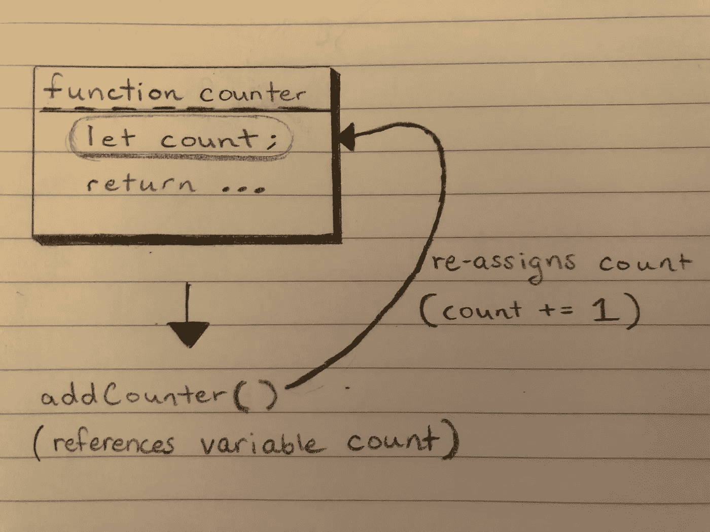

# JavaScript 中的闭包、私有数据和继承

> 原文：<https://levelup.gitconnected.com/inheritance-private-data-and-closures-in-javascript-5618bc78ebf2>

## 理解闭包是在 JavaScript 中实现私有数据的关键。

众所周知，JavaScript 有好的部分，也有不好的部分。

这使得开发人员的工作变得非常容易:

1.  使用好的部分。
2.  不要用坏的部分。

JavaScript 的一个优点是**闭包**。闭包是通过定义函数来创建的。函数和函数块中的变量保留对定义时在范围内的数据的访问。这是一个非常强大的工具。为了创建一个闭包，我们**定义了一个返回函数**的函数，这个内部函数会记住在外部函数中创建的变量的值。

在这个例子中，由函数`counter`创建的闭包包含对以下内容的引用:

1.  定义时全局范围内的任何变量。
2.  `count`局部变量。

因此，当`addCounter`被赋值指向第 10 行`counter()`的返回值时，从`counter()`返回的函数可以被调用而不会引发异常。`addCounter`保留对局部变量`count`的访问，因为`count`在由`counter()`创建的**闭包**内。因此，`count`可以随着`addCounter()`的调用而递增，即使`addCounter()`在声明`count`的范围之外被调用。

> 需要注意的一点是`count`是私有数据；除了`addCounter()`之外，它不能被任何东西引用或访问。

这是一张(手绘)图，显示了`addCounter()`如何引用和重新分配`count`。

对`count`的引用被维护，并且在`counter`被调用后不会被垃圾收集，因为仍然有一个变量`addCounter`，它引用由`counter()`创建的闭包。

闭包封装数据的能力非常有用。当讨论转向对象、继承和私有数据时，请记住这一点。

# 对象和私有数据

在 JavaScript 中使用对象产生的一个问题是缺乏隐私。因为对象是可以用**点**或**括号符号**访问的属性集合，所以对于懂 JavaScript 的人来说，访问保存在对象内部的数据是一件小事。

这个问题甚至更深层次。假设一个应用程序中涉及到继承层次结构；开发人员如何保护可以通过原型查找链访问的数据？

要回答这个问题，请检查下面的代码。这是**伪经典继承**的一个例子，也是一种常见的创建模式，用于在 JavaScript 中创建相互继承的对象。

如第 17-20 行所示，`Person`或`Teacher`的任何属性都可以通过使用**点**或**括号符号**来访问。对于任何来自 Ruby 背景的人来说，这里有封装数据的私有方法、类和对象——这段代码应该发出一些危险信号。

JavaScript 开发人员可以在他们的程序中实现私有数据的一种方法是将对象数据的访问限制为只有方法或函数调用。通过限制对方法或函数调用的属性访问，开发人员可以控制**如何**和**何时**引用或操作对象中存储的数据。

为了同时实现封装和继承，可以使用寄生继承，这是由道格拉斯·克洛克福特提出的概念。

# 寄生继承支持私有数据

几乎没有人喜欢*寄生*这个词。当一个人说出这个词时，扁虱、绦虫和一大堆其他讨厌的生物就会浮现在脑海里。

然而，在编程环境中，寄生行为可能非常有效。

寄生虫成功的原因是什么？

寄生虫非常足智多谋。它依靠宿主的资源生存。它需要做的工作越少，它就是一个越好的寄生虫。

这些不是真正的寄生虫——没人想看真的。

在 JavaScript 中，开发人员可以通过在一个函数中调用另一个函数来复制这种寄生行为。这样，一个函数可以使用另一个函数调用的资源和工作。这里有一个可以被认为是**寄生**的函数的例子。

可以看到，`parasiteSum`除了调用一个函数并返回那个值之外，不需要做任何实际的工作。`sumAllNumbers`是完成计算所有`...numbers`总和这一艰巨任务的函数。这可以被认为是寄生行为。

继承也可以用这个概念来复制。

出于本文的目的，假设有一个应用程序需要表示人及其未来职业的对象。

首先，声明一个名为`Person`的函数。这是`Person`对象被实例化和返回的地方。返回一个可以访问`name`属性和`age`属性的对象。

读者可能想知道:这个练习的目的不就是创建私有数据吗？`name`和`age`很容易被访问，除了在`Person`对象上没有任何启用数据访问的方法。

修改是必要的。这个问题要求`name`和`age`属性是私有的，但是它们也必须是可访问的，并且与返回的`Person`对象一起传递。因为属性不能是私有的，所以使用属性来存储数据对于这个问题来说不是一个好主意。

回想一下**闭包**。有没有办法在函数范围内保留对变量的引用？

是的，有。当`name`和`age`被定义为`Person`的参数时，局部变量通过它们各自的名称被声明。下面的代码展示了 JavaScript 如何处理函数及其参数。

因为这些参数在`Person`的闭包中被隐式声明为局部变量，所以从`Person`返回的对象可以访问最初传递给`Person`的参数，因为它们被存储为局部变量。`Person`对象保留对`name`和`age`的访问，因为它们是其闭包的一部分。

> 这与本文开始时负责`addCounter`功能的机制相同。

重构之前的解决方案。在返回对象内部，包含两个 **getter** 方法:一个用于`name`，一个用于`age`。这些方法将用于保留对变量`name`和`age`的访问。

可以看到，对象上不再有存储数据的属性；相反，有一些方法可以访问属性保存的数据。结果，闭包和 getter 方法的组合为`Person`对象创建了封装。

下一步是实现`Person`和`Teacher`之间的继承。选择“老师”是因为**所有的**老师都是**人**。因此，`Teacher`继承了`Person`的行为，因为它们是类`Person`的成员。

声明一个以`name`、`age`和`subject`为参数的`Teacher`函数。在`Teacher`函数中，返回一个继承自`Person`的对象。此外，该对象应该具有行为`teach`，该行为返回一个字符串，说明`Teacher`的`name`以及它们所教授的`subject`。

在这个解决方案中，`self`指向从`Person()`返回的`Person`对象。通过将对象实例化外包给`Person`，寄生行为被用在`Teacher`函数中。然后，`self`被赋予一个属性`teach`，它作为`subject`局部变量的 **getter** 方法。最后，`Teacher`返回`self`，它是`Person`对象，但是具有额外的数据和行为。

多亏了闭包，`Teacher`对象保留了对局部变量`name`、`age`和`subject`的访问。

可以看到，**寄生继承**可以用来创建私有数据和对象之间的继承。

# 最后的想法

这个问题非常适合寄生遗传；然而，大多数关于原型继承的问题并不是这样。在大多数使用继承的情况下，应该有一些方法来引用调用对象的父对象。

寄生继承是可能的，但是伪经典继承和 OLOO(链接到其他对象的对象)做得更好，因为它们可以使用`Object`和`Object.prototype`方法来引用对象的**原型对象**。

寄生继承失败的另一个领域是不必要的重复。`Teacher`的每个实例都有来自`Person`的方法的实际副本。理想的解决方案是，当调用那些方法时，`Teacher`实例引用来自`Person`的方法，从而将方法的工作和存储外包给单个对象。OLOO 和伪经典遗传比寄生遗传更能减少冗余。

然而，当一个问题需要封装数据并且对象存在于继承层次结构中时，寄生继承可能是完美的解决方案。

编码快乐！