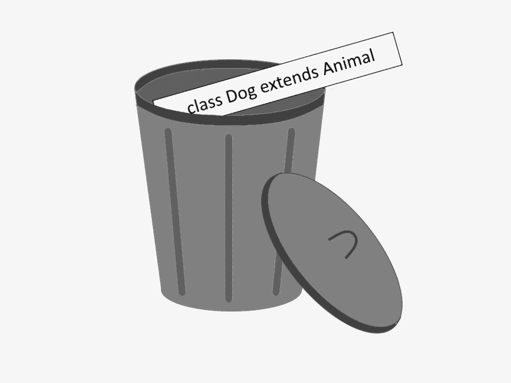

# 继承不应该作为扩展代码的首选方式

> 原文：<https://levelup.gitconnected.com/inheritance-should-not-be-preferred-as-a-means-to-extend-code-569bfe63b85f>

## 继承倾向于创建不灵活的代码库，并且经常被滥用

图片由 [Giedrius Kristinaitis](https://medium.com/@giedrius.kristinaitis) 提供

继承是工具箱中一个强大的工具。它允许我们形成共享公共功能的相关对象的层次结构，最好的部分是父类型不需要知道关于子类型的任何事情，允许我们创建事物的无数变体。

这在理论上听起来很好，然而，在实践中，知道何时使用继承有点棘手，继承经常被用来在不应该的时候扩展功能。

此外，当你阅读倒数第二段时，图像会更有意义。

# 一切都受到保护

被继承污染的代码库过度使用了`protected`访问修饰符。毕竟，如果默认情况下一切都是`private`的话，继承就成问题了，因为你不能访问子类中的`private`父类成员。

默认情况下到处使用`protected`访问修饰符的经典论点是这样的:“*你永远不知道你将需要修改什么代码，你不知道你将需要如何修改它，因此，你应该使用* `*protected*` *访问修饰符，这将允许你在将来修改你的代码中的任何东西*”。

这是真的，你真的不知道你需要扩展什么，只是整个`protected`访问修饰符部分不对。

# 继承被用作扩展功能的首选方式

默认情况下到处使用`protected`访问修饰符是个坏主意。这种观点有一个很大的假设。假设*继承*是扩展功能的唯一和/或首选方式。这种假设阻碍了您的代码健康长寿。

那么继承作为扩展代码的一种方式有什么问题呢？理论上听起来不错。然而…

> 实际上，对于一段给定的代码，通过**使用继承来扩展功能往往只起一次或几次作用。**

时间过得越久，就越难做任何进一步的扩展。

## 继承限制扩展

假设您决定用一堆`protected`实例变量和方法来扩展一个类，假设这个类在屏幕上呈现 HTML 内容。

您需要创建该类的两个变体:一个具有显示布局边界、边距和填充的调试功能，另一个使用 HTML 内容创建呈现日志。

如果你对代码设计有一点点的尊重，你就不会把所有的功能都挤到一个类中，因为，事实是渲染功能不需要调试或登录就能工作，把所有的功能都放在一个类中会创建一个 god 对象，它有一堆条件来控制应该(不应该)使用什么功能。

因此，假设您选择了第二个选项，即创建两个子类，一个用于调试，另一个用于日志记录。

现在，假设您在代码中有一个地方只需要调试功能，而另一个地方需要调试和日志记录功能。

你是做什么的？您需要提供一个 HTML 渲染器类型的类，但是，这些特性在两个独立的子类中，并且您只能使用一个。你无能为力，你不能同时使用两者。

这就是为什么通过使用继承来扩展功能变得非常有限，并导致无路可走的情况。

> 当子类中有两个或更多特性时，生活可能会变得很艰难，因为你不得不使用这些特性的组合只是时间问题。

# 更多关于过度使用继承和受保护成员的争论

## 这不会发生的

使用继承还有另一种说法，比如“*拜托，实际上，大多数时候，你没有父类的多个变体，你只扩展它一次，所以使用继承*就可以了。

这个论点有一个缺陷，因为它假设你*确定*你将来不再需要扩展功能。

这与使用继承来扩展功能的第一个论点相矛盾，即你不知道你需要扩展什么，因此，这是一个无效的论点。

## 开闭原则

然后还有另一个使用`protected`实例变量和方法以及使用继承来扩展功能的论点:“*如果你使用实例变量* `*private*` *，这违背了开闭原则*”。

如果你做对了就不会。开闭原则并不意味着你应该在任何地方使用`protected`访问修饰符，这与访问修饰符无关，因为如果是的话，你就不能在不支持访问修饰符或继承的语言中应用它。

# 继承之上的组合

使用继承来扩展功能是解决设计问题的权宜之计。相反，组合应该是扩展功能的首选方式。

什么是作文？这是一种通过使用单独实现部分功能的其他对象来组合功能的方式。

## 重温示例

让我们回到 HTML 呈现器的例子。你如何用作文解决这个问题？嗯，你可以用很多方法来作曲。您可以将呈现部分与 HTML 元素解析分开。

可以使 HTML 呈现器不关心在屏幕上呈现元素做了什么和如何做，并且可以接受多个这样的呈现器和呈现具有所提供的较小类的元素。一个渲染类可以是真正的渲染器，另一个是调试渲染器，您可以将它们单独或以复合的形式注入到 HTML 渲染器类中，并同时使用它们。

至于日志部分，它真的不应该是 HTML 呈现器的一部分，但是如果你在某种情况下必须是它的一部分，那么你可以做与呈现类似的事情。

> 当你使用组合时，你有更多的选择来实现某些东西，并且有更多的自由来扩展你的实现。

# 是一种关系

当你的代码设计好的时候，继承没有什么意义，除非你有一个真正的`is-a`关系。`is-a`OOP 中的关系通常是这样定义的:“`*is-a*` *当存在另一种类型的子类型*时，关系就存在”。换句话说，在继承的上下文中，当一个类扩展另一个类时。

我认为这是一种糟糕的思考`is-a`关系的方式(除非你正在研究编程语言理论或一些函数概念)。

我喜欢从不同的角度思考这个问题。我想到了类型/类试图表现的基本概念。如果概念不是以一种`is-a`的方式相关联，那么不管你是否使用继承，它仍然不会把它变成一种`is-a`关系。

例如，如果您扩展一个 HTML renderer 类来记录每个渲染，这不会创建一个`is-a`关系，因为如果您看一下概念，日志记录不是渲染，即使在类层次结构中日志记录类扩展了渲染类，它在语义上看起来像一个`is-a`关系。

要点是，当涉及到扩展功能时，你应该更喜欢组合而不是继承，因为继承是非常有限的，除非你正在处理一个实际的`is-a`关系。

过度使用`protected`访问修饰符的被继承污染的代码库是不灵活的，应该引起关注。

忘记经典的`class Dog extends Animal`例子，它只有一个方法来打印动物发出的声音。现实世界要比这复杂得多。

此外，不要把" *OOP 应该模拟真实世界*"的说法看得太过字面化(这种说法实际上有多真实还有待商榷(我认为这有点误导)，但我不会马上进入 OOP vs *<这里插入你最喜欢的范例>* 【洞】(只是暂时的))，这可能会让你过度使用继承。

# 分级编码

感谢您成为我们社区的一员！在你离开之前:

*   👏为故事鼓掌，跟着作者走👉
*   📰查看更多内容请参见[升级编码刊物](https://levelup.gitconnected.com/?utm_source=pub&utm_medium=post)
*   🔔关注我们:[Twitter](https://twitter.com/gitconnected)|[LinkedIn](https://www.linkedin.com/company/gitconnected)|[时事通讯](https://newsletter.levelup.dev)

🚀👉 [**加入升级人才集体，找到一份神奇的工作**](https://jobs.levelup.dev/talent/welcome?referral=true)