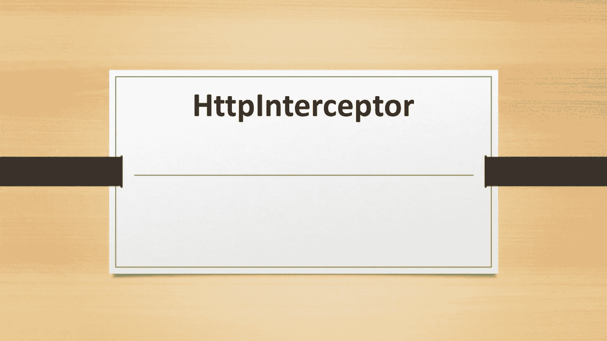

# http 接收器

> 原文：<https://levelup.gitconnected.com/inhttpinterceptors-dfe857c94883>

## 在现实世界的项目中，http 接受器是必不可少的。所以让我们开始吧。



HttpInterceptor

通常 API 由 API 服务器生成的令牌来保护。当我们通过客户端调用 API 时，我们总是在头中传递令牌。这个令牌包含合法用户的所有信息。在每个请求中，在服务器上验证令牌，并相应地返回响应。

在 Angular 中，我们可以在每个请求中发送令牌，如下所示。

我已经在 RapidApi 注册了，它提供了一个令牌来访问托管在其服务器上的 Api，并且在每个请求中，这个令牌都是通过请求头发送的。在您的应用程序中，它可以是任何服务器端应用程序，如。Net，Node，Java 可以生成令牌。

这看起来不错，但是想象一下，如果成千上万的 API 以这种方式被调用，我们的代码将会膨胀，因为**它违反了 DRY【不要重复自己】**原则。如果令牌改变了，那么我们必须在每个 API 调用中改变它。

我们可以使用 HttpInterceptor 为每个请求发送令牌，如下所示。

创建了一个类 *AuthInterceptor* ，它实现了 *HttpInterceptor* 接口。在覆盖拦截方法中，我们克隆请求并添加所需的令牌头。最后，我们用克隆/截取的请求调用 next.handle。

```
next.handle(interceptedRequest);
```

在其他不需要头的请求中，我们只是用原始请求进行调用。

```
 next.handle(req); 
```

我们需要在下面的模块中注册提供者。

现在我们可以把我们的 API 称为

```
getDataFromAPI(): Observable<string> {
return this.http.get('https://imdb8.p.rapidapi.com/auto-complete?q=game').pipe(map((response: any) => response['q'] as string));
}
```

我们还可以优化在每个请求中重复出现的基本 url，并将其移动到拦截器。

所以关键的要点是

## 我们可以通过 HttpInterceptor 拦截请求，并根据需要处理/优化请求和响应。

希望概念清楚。

我在 Udemy 上创建了一个 Angular 课程，涵盖了 Angular 中的许多实际问题和解决方案，包括这个。这可能是你职业生涯的垫脚石。 [***请看一看。***](https://www.udemy.com/course/angular-practicals/?couponCode=F48E50E6ECF6D99AD500)


角实践

也可以观看/订阅我的免费 [**YouTube 频道**](https://www.youtube.com/channel/UC30-Z9Lz8DWe_Vq93dOs-Gw) **。**

请订阅/关注/喜欢/鼓掌。