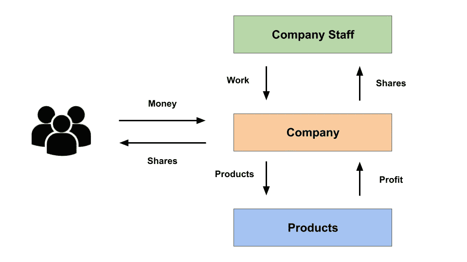
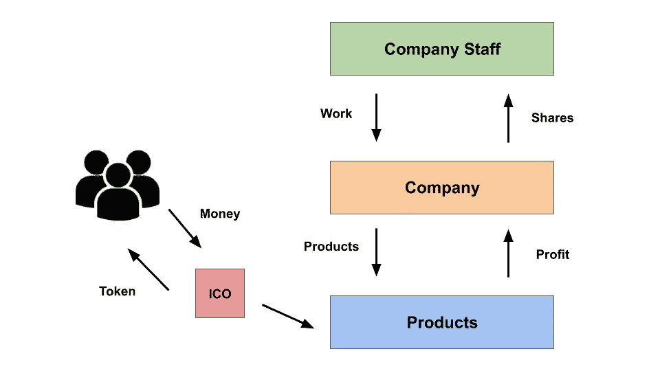
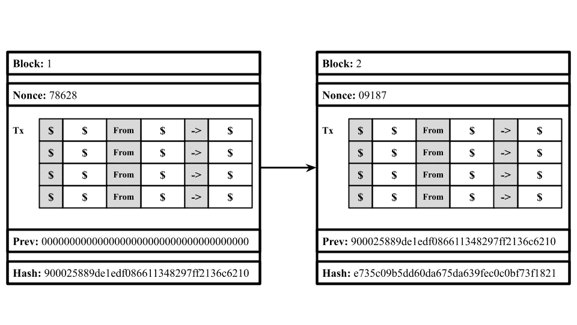

# 首次发行硬币——众筹和投资的未来

> 原文：<https://levelup.gitconnected.com/initial-coin-offering-the-future-of-crowdfunding-and-investing-abb12d423bf6>

[图像来源](https://www.entrepreneur.com/article/309164)

公众投资已经成为企业扩大经营的一个组成部分。此外，它是人们通过支持公司或其他资产来获得被动收入的一种方式，以便他们在未来可以增长。自 1611 年成立以来，投资领域以及公司如何为项目融资一直没有太大变化。它仍然包含许多阻碍小公司成功使用这一系统的障碍。

然而，有一种即将到来的新方法正在改变投资和众筹领域，即首次发行硬币。这个新系统利用了区块链的新兴技术。它支持在区块链上创建代表企业价值的分散代币，人们可以购买代币来拥有。ICO 流程到底是什么，代币是如何工作的，它们如何帮助企业吸引投资？

# **首次公开募股**

为了理解 ico 是什么，我们需要首先了解大多数众筹是如何完成的。首次公开募股是一种相当流行的方法，用来为公司筹集资金。如果你听说过投资，人们可能会告诉你投资公司股票。在基本层面上，这就是 IPO 允许公司和公众做的事情。

在一个公司里，人们把公司的所有权分割成股份。股票是个人或组织(通常是风险投资公司)拥有的公司的一部分。为了筹集资金，公司拿出一些股票，让公众购买和出售。为了进一步理解这个概念，让我们想象我们有一家名为苹果的公司，他们将进行首次公开募股。让我们假设他们总共有 100 万股，他们允许公众购买他们总股份的 50%。另外 50%归公司的创始人、投资者和其他员工所有。每股按照公司的估计价值定价。人们开始购买股票，因为他们真的相信公司会成长。这使得公司能够为其投资提供资金，以促进公司的发展。

随着公司规模的增长，其股票价值也在增长。大多数人经常购买股票以增加其价值，这样他们可以在未来出售。此外，股东还可以获得一部分未来的商业利润作为股息。

# **首次发行硬币**

与首次公开发行相比，首次发行硬币或 ico 是一种新的替代众筹方法。在这种方法中，人们可以通过支付一定数量的钱来投资公司。然而，在这种情况下，股份不在公众中分配，而是留在公司内部。取而代之的是使用代币，这样人们就可以购买代币来投资公司的项目。这些代币可以用来购买公司内部的产品或服务。在这种方法中，公司将通过人们购买代币来获得资金，人们可以使用代币来购买产品和服务。

在这个系统中，有一定数量的令牌可用。公司可以决定允许公众购买所有可用的代币，或者自己保留一些代币。同样，在首次公开募股中，随着公司规模的增长，他们的股票价值也在增长。人们也经常购买代币以增加其价值，这样他们可以在未来出售它们。一个成功的 ICO 为投资者提供回报，因为令牌的价格随着公司的成长而增值。

**逛遍超市**

图片由[罗布·麦克斯韦](https://unsplash.com/@robmaxwell)

为了更好的理解 ICOs 的概念，我们来举个例子。假设我们有一个名为鲍勃市场的超市。该超市希望获得资金来创建其他几家超市商店，以增加他们的连锁店。他们开始创建自己的 ICO，以便获得开展项目的资金。让我们假设他们总共创造了一百万个 ICO 代币。在这种情况下，他们允许公众购买 50%的 ICO 代币或 500，000 个 ICO 代币。投资者可以用这些代币购买产品或持有产品，希望随着公司的发展代币会增值。

# **ICOs 后端——区块链**

现在我们已经了解了 ico 是什么，以及它们在现实世界中是如何使用的，让我们看看它们在后端是如何工作的。它们通常运行在令牌系统上，就像加密货币一样。

为了理解 ICOs 的令牌系统是如何工作的，我们需要首先理解它们背后的关键技术区块链是如何工作的。

区块链是一种分散的记录信息的系统，这种方式使得改变、黑客攻击或欺骗系统变得困难或不可能。它类似于谷歌文档，我们可以创建一个文档并与人分享。当文档被共享时，它被分发而不是被复制，这创建了一个分散的链，使每个人都可以实时访问文档。所有的改变对每个人都是可用的，所以没有人能在每个人都不知道的情况下改变任何事情。

区块链是由存储信息的区块组成的。在加密货币的情况下，块存储交易数据。每个块也有一个随机数和一个散列。散列是一个块的签名，它与该块粘在一起，因此可以在以后被引用。这类似于人的指纹，因为它是交易数据的签名。随机数是区块链矿工在解决任何障碍之前需要发现的第一个数字。为了创建一个块，会发生一个称为挖掘的过程，在这个过程中，人们会找到与哈希匹配的随机数。矿工是完成采矿过程的人。

*如果你想了解更多关于区块链的知识，请查看* [*这篇文章*](https://nivangujral.medium.com/blockchain-say-bye-to-traditional-ledgers-and-currencies-860a397742d0) *是我写的关于更详细解释区块链技术的文章。*

# **令牌**

每当我们听到代币这个术语，我们就会想到加密货币代币，包括比特币、以太币等。然而代币不仅仅是作为货币的替代选择，它们还有更广泛的用途。代币是人们可以转让给其他人的数字资产。该系统建立在区块链上，用于维护令牌交易的安全性和隐私性。

人们开发代币有各种方法，但最常见的方法是利用以太坊区块链。以太坊的区块链或“以太”目前有一堆不同的令牌，包括[灵知](https://gnosis.pm/) (GNO)和[占卜](https://app.augur.net/)(代表)。

# **ICO 用例**

已经有许多成功的公司和服务机构在其成长周期的开始阶段使用初始硬币发行过程来筹集资金。一些最大和最成功的 ico 是由以太坊和 Stratis 创建的。

与比特币不同，以太坊不仅是一种加密货币，也是一种通过智能合约运行和开发去中心化应用的协议。随着以太坊区块链和协议的启动，开发人员开始通过创建第一批 ico 来资助公司。

另一个成功的 ICO 是由 Stratis 公司创造的。这家公司创建了一个平台，允许企业在使用传统编程语言的同时，在区块链上开发应用程序。他们还开展了一项 ICO 活动，为该平台筹集了 1000 BTC 或价值 67.5 万美元的资金。

虽然这两个案例是 ICO 流程最成功的案例，但仍有许多公司使用这一流程来资助他们的项目。随着区块链技术的发展壮大，使用 ico 的公司数量与日俱增。

# **ico 的好处**

最初的硬币提供过程对于代币的顾客以及试图扩展其业务的企业主来说具有许多好处。

首先，尝试使用 ico 的门槛很低。与之相对应的首次公开发行(IPO)程序通常是为顶级公司准备的。这是因为在整个过程中有大量的法律制度在起作用。这意味着需要融资的小公司不能有效地利用 IPO 过程。ico 创造了另一种选择，因此任何规模的公司都可以参与进来，并从热心者那里筹集资金来资助他们的项目。由于 ico 位于区块链，因此它们不受任何中央权力机构的控制。

首次发行硬币的另一个好处是，它创建了一个全球网络，世界各地的人都可以使用这个系统。这使得世界各地的公司和人们都可以从这个众筹系统中受益。这种全球网络也减少了使用这一过程的障碍，因为公司不局限于一个地方，可以帮助他们在全球范围内发展。

# **投资和众筹的未来**

随着新公司和人们尝试这种众筹/投资系统，首次发行硬币或 ico 越来越受欢迎。它将慢慢成为一种非常受欢迎的投资方式，甚至可能在未来超过首次公开募股。

让我们回顾一下刚刚学到的内容:

> *首次发行硬币是一种新的另类众筹方式，人们可以通过购买代币来投资公司。这些代币可以用来购买公司的产品或服务，反过来为公司的项目提供资金。这种投资过程利用区块链技术创造分散代币，可以在人们之间交易。*

首次发行硬币正成为公司和个人投资/众筹以支持其项目的一种重要方法，这种增长每天都在扩大。

*尼万是一名 14 岁的人工智能开发者，他希望利用技术来帮助解决世界上的问题。他目前正在建立一家名为 Lemonaid 的公司，这是一个将青少年与需要志愿者/实习生招聘帮助的组织联系起来的平台。如果你想进一步讨论这篇文章或只是谈谈，请给我发电子邮件到*[*nivangujral@gmail.com*](mailto:nivangujral@gmail.com)*。*