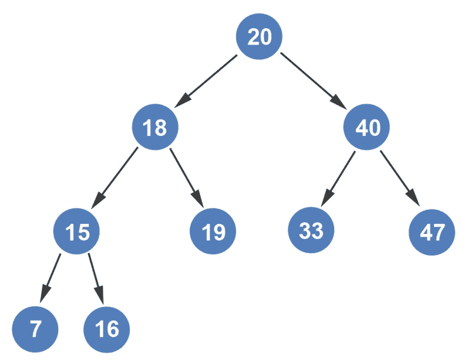
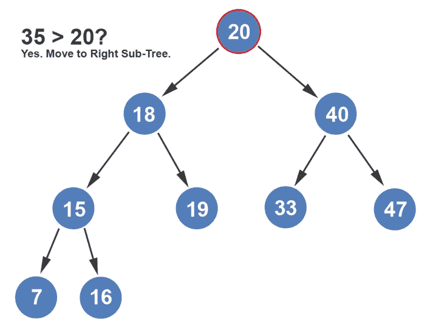
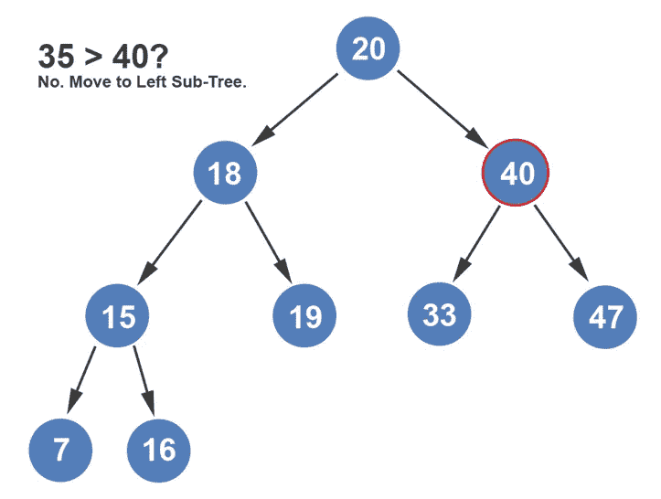
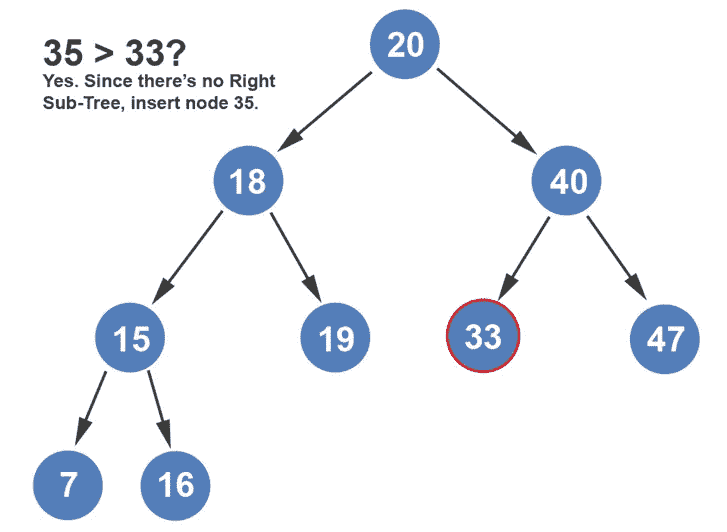
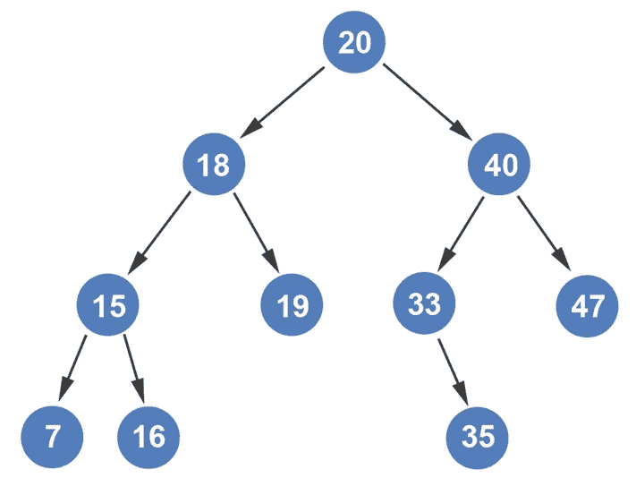

# 在二叉树中插入一个节点

> 原文：<https://levelup.gitconnected.com/inserting-a-node-into-a-binary-tree-visually-explained-efbfaea34546>

当插入一个节点时，请记住这条规则:节点只会作为树叶添加到树中。让我们假设我们有下面的树。

如果我们看这个树，你会注意到在每个节点上，左子树中的值比节点的值小，右子树中的值比节点的值大。

假设我们想要插入值 35。你能预测它在树上的位置吗？让我们从头到尾走一遍，看看它的结局。

我们首先将 35 与根节点的值 20 进行比较。因为 35 比根节点的值大，所以我们移到右边的子树。

接下来，我们比较 35 和 40。由于 35 小于 40，我们移到它的左子树。

接下来，我们比较 35 和 33。由于 35 大于 33，我们试图移动到节点 33 的右子树。

因为在节点 33 没有右边的子树，我们在那里插入节点 35。

很简单的逻辑。就节点插入而言，真的是这样。尽量不要让它过于复杂，你会很快意识到大多数算法都很简单。

如果你喜欢你所读的，我的书，**【算法的说明性介绍】，涵盖了这个算法和更多。**

**

*Dino Cajic 目前是 [LSBio(寿命生物科学公司)](https://www.lsbio.com/)、[绝对抗体](https://absoluteantibody.com/)、 [Kerafast](https://www.kerafast.com/) 、 [Everest BioTech](https://everestbiotech.com/) 、 [Nordic MUbio](https://www.nordicmubio.com/) 和 [Exalpha](https://www.exalpha.com/) 的 IT 负责人。他还是我的自动系统公司的首席执行官。他有十多年的软件工程经验。他拥有计算机科学学士学位，辅修生物学。他的背景包括创建企业级电子商务应用程序、执行基于研究的软件开发，以及通过写作促进知识的传播。*

*你可以在 [LinkedIn](https://www.linkedin.com/in/dinocajic/) 上联系他，在 [Instagram](https://instagram.com/think.dino) 上关注他，或者[订阅他的媒体出版物](https://dinocajic.medium.com/subscribe)。*

*阅读迪诺·卡吉克(以及媒体上成千上万的其他作家)的每一个故事。你的会员费直接支持迪诺·卡吉克和你阅读的其他作家。你也可以在媒体上看到所有的故事。*