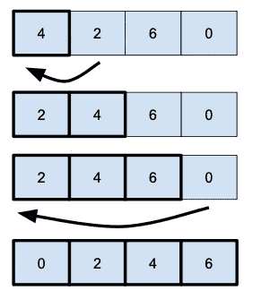

# 插入排序

> 原文：<https://levelup.gitconnected.com/insertion-sort-669f4a15fed1>

## 插入排序是另一种简单的排序算法，但不是最有效的。

它的工作方式是**构建一个排序的子数组**，从给定的数组中一次取出一个元素，并将其放置(插入)在适当的位置。

**这里是代码:**

为了对数组进行排序，**我们将下一个元素从右子数组**(未排序)**移动到左子数组**(已排序)**的正确位置**。

我们使用一个简单的外部 for 循环来遍历所有元素(除了第一个)。内部 while 循环将每个元素放在正确的位置，放入子排序的数组中。

插入排序，像[冒泡排序](https://medium.com/@jbstevenard/bubble-sort-e9d14e2ab994)，对于最好的情况(已经排序的数组)，线性复杂度为 O(n)。对于最坏的情况(逆序)，复杂度的平方是 O(n)，但是平均时间复杂度也是 O(n)。

无论如何，**这是一个你应该知道但不能用**的基本算法；还有**快很多的，看看下面的文章。**

[< <冒泡排序](https://medium.com/@jbstevenard/bubble-sort-e9d14e2ab994) | [书](/@jbstevenard/learn-data-structures-and-algorithms-with-swift-5-6-d9f36a4027dd) | [选择排序> >](https://medium.com/@jbstevenard/selection-sort-38f1196b36ae)

 [## 通过我的推荐链接加入 Medium—JB stevenard

### 阅读 jb stevenard 的每一个故事(以及媒体上成千上万的其他作家)。你的会员费直接支持 jb…

medium.com](https://medium.com/@jbstevenard/membership)