# 直观解释的插入排序算法

> 原文：<https://levelup.gitconnected.com/insertion-sort-algorithm-visually-explained-d76b75deb967>

插入排序从索引 1 处的值开始，并将其与索引 0 处的值进行比较。如果索引 1 处的值小于索引 0 处的值，则交换这些值。索引递增，并且重复该过程。最好的方法是用一个例子。我们将从下面的数组开始。

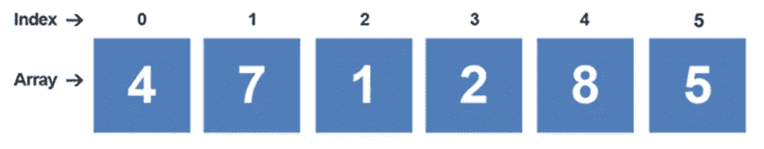

该算法从索引位置 1 开始。

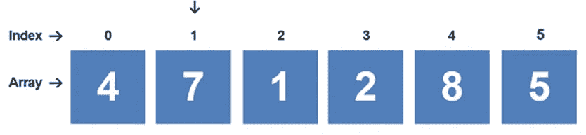

执行第一次比较。插入排序算法从索引 1 开始，并将其与之前的索引(在本例中为索引 0)进行比较。

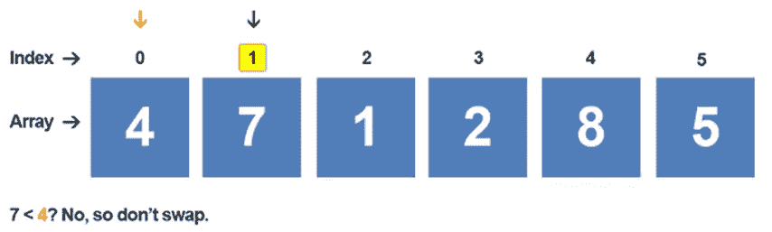

考虑到 7 不小于 4，这些值将保持在当前位置。由于算法达到了索引 0，它需要增加当前位置以开始下一次比较。它现在位于索引 2 处。该算法开始比较索引 2 处的值和索引 1 处的值。

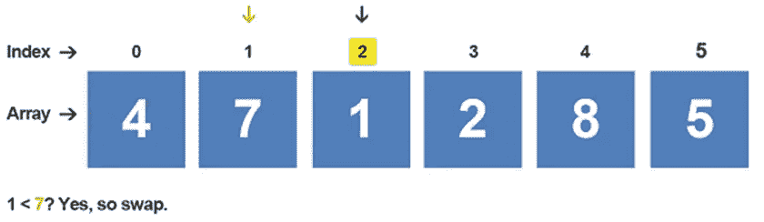

由于索引 2 处的值小于索引 1 处的值，因此该算法将交换这些索引处的值。索引减 1，所以现在回到索引 1。它将索引 1 处的值与索引 0 处的值进行比较。

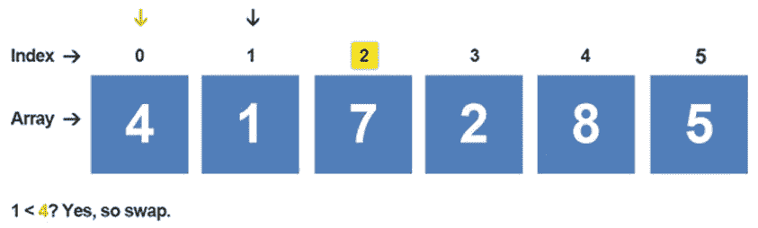

因为索引 1 处的值小于索引 0 处的值，所以它将交换这两个值。插入排序算法已到达比较周期的末尾。它将起始索引值从 2 递增到 3。

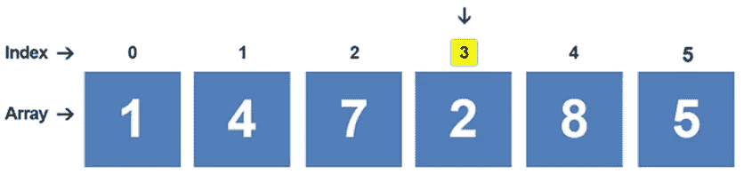

该算法将索引 3 处的值与索引 2 处的值进行比较。

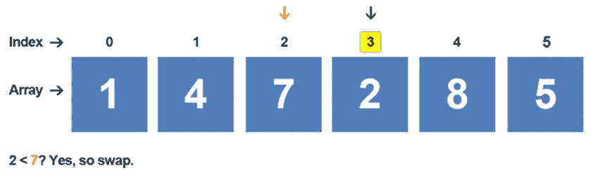

因为索引 3 处的值小于索引 2 处的值，所以它交换这些值。它将索引从 3 递减到 2，并开始与索引 1 进行比较。

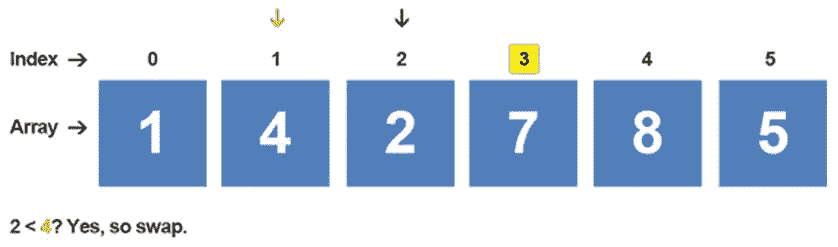

由于索引 2 处的值小于索引 1 处的值，因此该算法会交换这两个值。它将索引从 2 递减到 1，并将该值与索引 0 处的值进行比较。

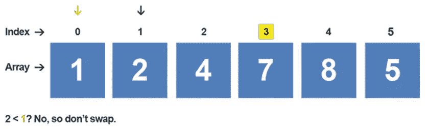

因为索引 1 处的值不小于索引 0 处的值，所以这些值保持在当前位置。起始索引值增加到 4。

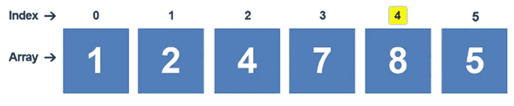

该算法开始比较索引 4 和索引 3 处的值。

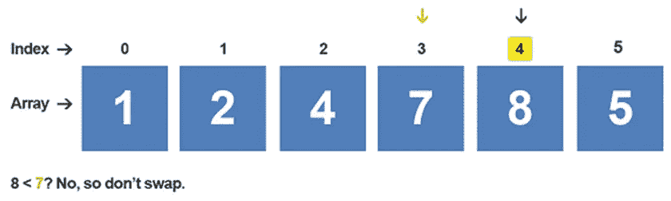

因为索引 4 处的值不小于索引 3 处的值，所以不会发生交换。同样值得一提的是**已知**索引 3 之前的值小于索引 3 处的值；没有理由将索引 4 处的值与那些值进行比较，因为它们已经保证小于索引 3 处的值。起始索引从 4 递增到 5。

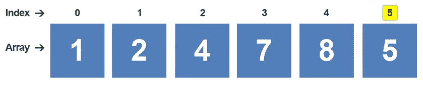

该算法将索引 5 处的值与索引 4 处的值进行比较。

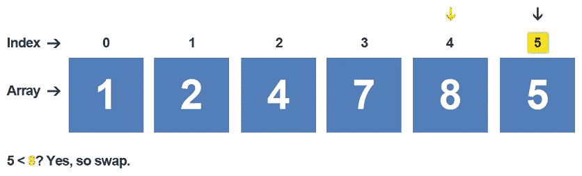

因为索引 5 处的值小于索引 4 处的值，所以这两个值被交换。递减索引，并将索引 4 处的值与索引 3 处的值进行比较。

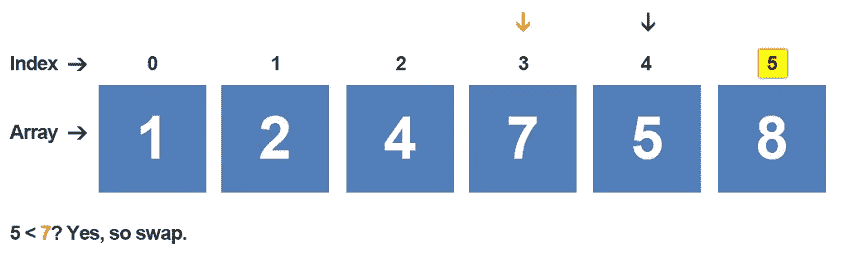

因为索引 4 处的值小于索引 3 处的值，所以两个值交换，索引从 4 递减到 3。将索引 3 处的值与索引 2 处的值进行比较。

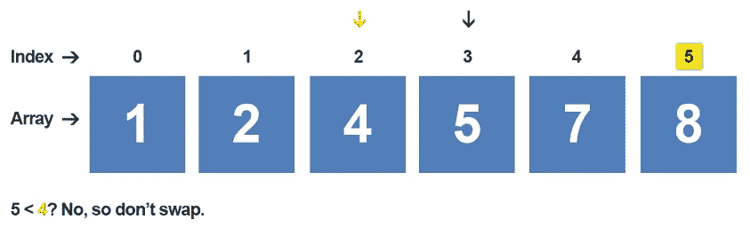

由于索引 3 处的值大于索引 2 处的值，因此这些值不会交换。算法已到达结尾，数组已排序:

> 1, 2, 4, 5, 7, 8.

> ***

如果你喜欢你所读的，我的书，**【算法的说明性介绍】，涵盖了这个算法和更多。**

# *我的书:算法的说明性介绍*

**

*这本书是为了填补计算机科学学生和程序员试图学习和分析目前存在的不同算法的空白而写的。我上了一门算法课程，对目前可用的材料类型感到失望。我经常碰到两种类型的书:*

*   *第一，过于复杂的书。这本书看起来像是为那些已经对这个主题很熟悉，并且想要一个更详细的数学算法的人设计的。*
*   *第二，过于简单的书。算法的基本介绍。这是对一些算法的高级概述，大部分复杂的算法都没有提到。完成后，这个人仍然不能展示当出现问题时算法是如何运行的。*

*这本书是为想要扩展视野的大学高年级学生和程序员设计的。它可以和复杂的书一起作为补充的书。读者将获得必要的知识来解决那些复杂的书中提出的数学密集型算法问题。每章包括一个简单的描述算法是如何工作的，然后是一个或两个详细的例子。遍历过程中不会跳过任何步骤。给读者呈现一个清楚的，简化的方法来解决本章致力于的算法。*

*每一章都遵循前一章的自然发展。如果某些算法很大程度上依赖于先验知识，前一章会讨论这个话题。例如，Kruskal 的算法严重依赖于最小生成树和贪婪算法的先验知识。每个主题都有自己的一章。*

*现可在[**Amazon.com**](https://www.amazon.com/Illustrative-Introduction-Algorithms-Dino-Cajic-ebook-dp-B07WG48NV7/dp/B07WG48NV7/ref=mt_kindle?_encoding=UTF8&me=&qid=1586643862)买到*

**

*迪诺·卡伊奇目前是 [LSBio(生命周期生物科学公司)](https://www.lsbio.com/)、[绝对抗体](https://absoluteantibody.com/)、 [Kerafast](https://www.kerafast.com/) 、[珠穆朗玛生物](https://everestbiotech.com/)、[北欧 MUbio](https://www.nordicmubio.com/) 和 [Exalpha](https://www.exalpha.com/) 的 IT 主管。他还担任我的自动系统的首席执行官。他有十多年的软件工程经验。他拥有计算机科学学士学位，辅修生物学。他的背景包括创建企业级电子商务应用程序、执行基于研究的软件开发，以及通过写作促进知识的传播。*

*你可以在 [LinkedIn](https://www.linkedin.com/in/dinocajic/) 上联系他，在 [Instagram](https://instagram.com/think.dino) 上关注他，或者[订阅他的媒体出版物](https://dinocajic.medium.com/subscribe)。*

*[*阅读迪诺·卡吉克(以及媒体上成千上万其他作家)的每一个故事。你的会员费直接支持迪诺·卡吉克和你阅读的其他作家。你也可以在媒体上看到所有的故事。*](https://dinocajic.medium.com/membership)*