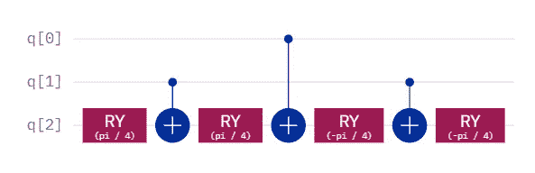
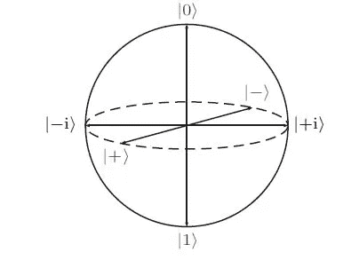
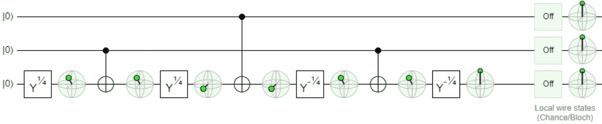
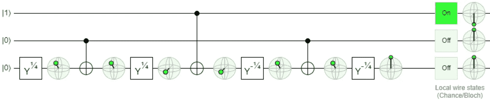
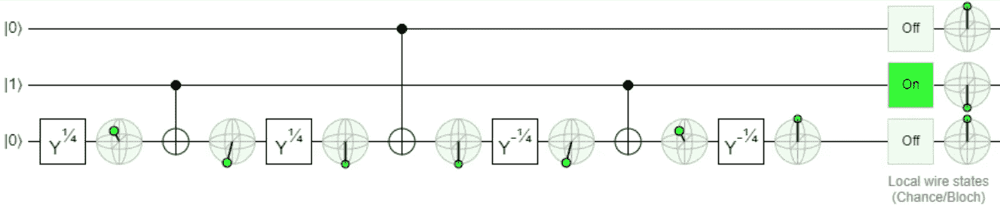
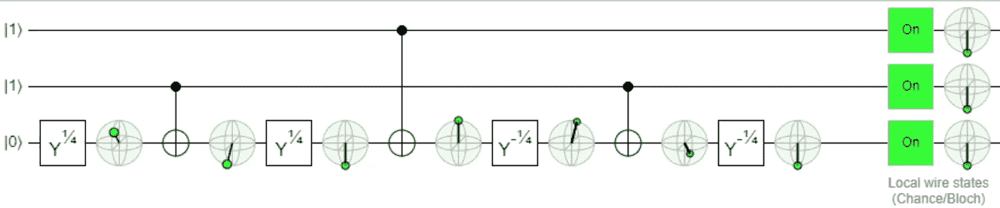

# 在近似托夫里的内部

> 原文：<https://levelup.gitconnected.com/inside-the-approximate-toffoli-43c84f288303>

近似托夫里

# 对于没有数学倾向的人来说

我最近用近似 Toffoli 做了实验，看看它作为[近似互换测试](/approximate-swap-test-108c8febd756)的一部分会有什么表现。在试图回答某人的问题时，我突然想到 Quirk 在线模拟器提供了一个关于近似 Toffoli 如何工作的极好的视觉解释。是的，如果你喜欢的话，你可以做线性代数，但是你也可以使用 Quirk 的迷你 Bloch 球体来开发视觉直觉。

近似的 Toffoli 和 Toffoli 一样，是一个 AND 逻辑门。两个控制量子位是两个输入，目标量子位是一个输出。只有当两个输入都为真(等于 1)时，与门才为真(等于 1)。因为我在这里停止我的解释，我假设一个布尔逻辑的基本知识，更不用说托夫里。

[https://commons . wikimedia . org/wiki/File:Six _ States _ Bloch _ sphere . jpg](https://commons.wikimedia.org/wiki/File:Six_states_Bloch_sphere.jpg)

## 参考

尽管我在这里对读者的知识做了一些基本的假设，但我还是会包括这个版本的 Bloch sphere，供您参考或娱乐。不管怎样。无论如何，我将引用|0 >、|1 >、|+>和|->，所有这些都可以在上面找到。我还将参考 y 轴和 x 轴，y 轴是连接|+i >和|-i >的线，x 轴是连接|+>和|-->的线。所以，当我写绕 y 轴旋转时，一个完整的正旋转从|0 >到|+>到|1 >到|->到|0 >。绕 x 轴的完整正旋转从|0 >到|-i >到|1 >到|i >到|0 >。如果这些都不清楚，我推荐[黑欧泊](https://q-ctrl.com/black-opal)。

事不宜迟，让我们一步一步地看真值表，好吗？

https://alg assert . com/quirk # circuit = { % 22 cools % 22:[[1，1，% 22y^%c2%bc%22],[1,1,%22bloch%22],[1,%22%e2%80%a2%22,%22x%22],[1,1,%22bloch%22],[1,1,%22y^%c2%bc%22],[1,1,%22bloch%22],[%22%e2%80%a2%22,1,%22x%22],[1,1,%22bloch%22],[1,1,%22y^-%c2%bc%22],[1,1,%22bloch%22],[1,%22%e2%80%a2%22,%22x%22],[1,1,%22bloch%22],[1,1,%22y^-%c2%bc%22],[1,1,%22bloch%22]]}

## 00

目标量子位围绕 y 轴向|+>旋转π/4，然后第一个 CX 什么都不做，然后目标量子位围绕 y 轴旋转另一个π/4 到|+>，然后第二个 CX 什么都不做，然后目标量子位围绕 y 轴旋转-pi/4 回到|0 >，然后第三个 CX 什么都不做，然后目标量子位围绕 y 轴旋转另一个-pi/4 回到|0 >。具有两个 0 输入的与门的真值表是 0 输出，所以这是正确的。

https://alg assert . com/quirk # circuit = { % 22 cools % 22:[[1，1，% 22y^%c2%bc%22],[1,1,%22bloch%22],[1,%22%e2%80%a2%22,%22x%22],[1,1,%22bloch%22],[1,1,%22y^%c2%bc%22],[1,1,%22bloch%22],[%22%e2%80%a2%22,1,%22x%22],[1,1,%22bloch%22],[1,1,%22y^-%c2%bc%22],[1,1,%22bloch%22],[1,%22%e2%80%a2%22,%22x%22],[1,1,%22bloch%22],[1,1,%22y^-%c2%bc%22],[1,1,%22bloch%22]],%22init%22:[1]}

## 01

目标量子位围绕 y 轴向|+>旋转π/4，然后第一个 CX 什么也不做，然后目标量子位围绕 y 轴旋转另一个π/4 到|+>，然后第二个量子位围绕 x 轴旋转目标量子位(它什么也不做，但是为了这个解释的目的，将向量留在原位)，然后目标量子位围绕 y 轴旋转-π/4 回到|0 >，然后第三个 CX 什么也不做，然后目标量子位围绕 y 轴旋转另一个π/4 回到|0 >。具有一个 0 输入和一个 1 输入的与门的真值表是 0 输出，所以这是正确的。

https://alg assert . com/quirk # circuit = { % 22 cools % 22:[[1，1，% 22y^%c2%bc%22],[1,1,%22bloch%22],[1,%22%e2%80%a2%22,%22x%22],[1,1,%22bloch%22],[1,1,%22y^%c2%bc%22],[1,1,%22bloch%22],[%22%e2%80%a2%22,1,%22x%22],[1,1,%22bloch%22],[1,1,%22y^-%c2%bc%22],[1,1,%22bloch%22],[1,%22%e2%80%a2%22,%22x%22],[1,1,%22bloch%22],[1,1,%22y^-%c2%bc%22],[1,1,%22bloch%22]],%22init%22:[0,1]}

## 10

目标量子位围绕 y 轴朝|+>旋转π/4，然后第一个 CX 围绕 x 轴旋转目标量子位π(它更接近|1 >)，然后目标量子位围绕 y 轴旋转另一个π/4 到|1 >，然后第二个 CX 什么也不做，然后目标量子位围绕 y 轴旋转-π/4 回到|+>，然后第三个 CX 围绕 x 轴旋转目标量子位π(它更接近|0 >，然后目标量子位围绕 y 轴旋转另一个π/4 回到| 1 具有一个 0 输入和一个 1 输入的与门的真值表仍然是 0 输出，所以这也是正确的。

https://alg assert . com/quirk # circuit = { % 22 cools % 22:[[1，1，% 22y^%c2%bc%22],[1,1,%22bloch%22],[1,%22%e2%80%a2%22,%22x%22],[1,1,%22bloch%22],[1,1,%22y^%c2%bc%22],[1,1,%22bloch%22],[%22%e2%80%a2%22,1,%22x%22],[1,1,%22bloch%22],[1,1,%22y^-%c2%bc%22],[1,1,%22bloch%22],[1,%22%e2%80%a2%22,%22x%22],[1,1,%22bloch%22],[1,1,%22y^-%c2%bc%22],[1,1,%22bloch%22]],%22init%22:[1,1]}

## 11

目标量子位围绕 y 轴朝|+>旋转π/4，然后第一个 CX 围绕 x 轴旋转目标量子位 pi(它更接近|1 >)，然后目标量子位围绕 y 轴旋转另一个π/4 到|1 >，然后第二个 CX 位将目标量子位从|1 >翻转到|0 >，然后目标量子位围绕 y 轴朝|->旋转-pi/4，然后第三个 CX 围绕 x 轴旋转目标量子位 pi(它再次更接近|1 >)，然后目标量子位旋转具有两个 1 输入的与门的真值表是 1 输出，所以这是正确的。

## 结论

量子计算被认为是困难的原因之一是因为它没有得到很好的解释。就我个人而言，我不知道线下有谁会“讲”线性代数，或者其他数学。但是，如果你对布洛赫球和绕轴旋转有一个基本的了解，你可以简单地想象这个逻辑门是如何工作的。

那么，为什么有人会费心去使用托夫里呢？首先，这更容易。就用 CCX 的说法吧。更重要的是，它是[互换测试](/comparing-quantum-states-c6445e1e46fd)的一个组成部分，互换测试无法在[相对相位托夫里](/relative-phase-swap-test-f4a718f4f4b5)或[近似托夫里](/approximate-swap-test-108c8febd756)的情况下正常工作。据称互换测试并不是这种情况的唯一例子，尽管我实际上没有任何其他例子可以分享。幸运的是，Toffoli 的变体有大量的用例，至少在 NISQ 时代减少了电路深度和 CX 计数。

# 分级编码

感谢您成为我们社区的一员！在你离开之前:

*   👏为故事鼓掌，跟着作者走👉
*   📰查看[升级编码出版物](https://levelup.gitconnected.com/?utm_source=pub&utm_medium=post)中的更多内容
*   🔔关注我们:[Twitter](https://twitter.com/gitconnected)|[LinkedIn](https://www.linkedin.com/company/gitconnected)|[时事通讯](https://newsletter.levelup.dev)

🚀👉 [**加入升级人才集体，找到一份神奇的工作**](https://jobs.levelup.dev/talent/welcome?referral=true)