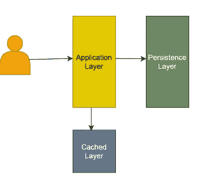

# 系统设计访谈的内部人员指南

> 原文：<https://levelup.gitconnected.com/insiders-guide-to-system-design-interviews-d824dae7a287>

使用有效的模板提升你的技能

由 [You X Ventures](https://unsplash.com/@youxventures?utm_source=medium&utm_medium=referral) 在 [Unsplash](https://unsplash.com?utm_source=medium&utm_medium=referral) 上拍摄的照片

可扩展的系统设计是面试中区分高级工程师和初级工程师的最重要的方面。随着你职业生涯的发展，系统设计面试会变得更加重要，因为它们在决定候选人的水平方面发挥着重要作用。作为一名帮助开发人员进入顶级公司的技术教练，我想分享一种应对这些面试的系统方法。在这篇文章中，我将分享一个可以用来破解任何系统设计面试的模板。

让我们看看构成良好系统设计基础的主要构建模块:

*   功能需求
*   规模要求
*   高级设计
*   容量要求

# 功能需求

在进行系统设计之前，建立一套你和面试官都同意的通用需求是必须的。在大多数情况下，面试官故意对要求含糊其辞。他们只会从一句类似“你如何构建 Instagram？”或者“复制一个优步”。你需要意识到面试官正在评估你在一个模棱两可的情况下获得清晰思路的能力。

考虑到这一点，现在你有责任戴上产品所有者的帽子，识别不同的人物角色，并为每个人物角色列出一个必备功能列表(例如，*，优步有骑手和司机人物角色*)。重要的是，你要在这里与面试官进行开诚布公的讨论，并问一些问题，以确保你没有忽视面试官可能认为很重要的一个特点。这样做除了显示你的分析能力之外，还会显示你思路的清晰。

# 规模要求

虽然我们不需要详细的确切数字，但谈论一下我们将要设计的系统的大概规模总是好的。这包括知道有多少用户将实际使用该系统。

以下是对评估规模非常有帮助的几个指标:

*   目前世界人口约 80 亿
*   40%的世界人口与互联网连接，约 30 亿人
*   脸书、WhatsApp 和 YouTube 等最受欢迎的社交应用拥有最高的日活跃用户(DAU)，在 10-20 亿之间。
*   谷歌每秒接收大约 5 万次搜索。
*   其他受欢迎的应用如 Instagram、Twitter、Snap Chat、LinkedIn 拥有约 3-5 亿 DAU。

这无疑有助于研究广泛流行的系统(尤其是那些由你面试的公司建立的系统)。

基于这些数字，你可以对你的应用程序的日活跃用户数(DAU)或月活跃用户数(MAU)进行快速粗略的估算。除此之外，还要评估系统的读/写比。这有助于确定系统是应该针对读取还是写入进行扩展。使用读/写比率和 DAU，您可以确定系统的中值每秒读取数(RPS)和每秒写入数(WPS)。

现在我们已经有了功能需求和系统的规模，是时候继续前进，从高层次的设计开始了。

# 高级服务设计

设计和构建后端服务是系统设计问题的核心所在。这是你需要花大部分时间来做好的地方。除了功能需求之外，您还需要考虑规模需求，以提供一组可以独立构建和扩展的独立微服务(例如，优步可以提供定位服务、登录服务、预订服务等服务)。

采用微服务架构设计的典型应用有应用层、缓存层和持久层。

典型微服务剖析

对于每项服务，应根据功能和规模要求设计应用程序、缓存和数据库。

**API 设计**

*   资源端点和相应的 HTTP 动词(GET，POST，PUT，PATCH，DELETE) *例如:GET /v1.2/places/{place_id}*
*   API 请求参数(*输入模式*)
*   API 响应(*输出模式*)

**数据库设计**

*   用于保存数据的表模式
*   根据比例要求确定是否需要对表格进行分片
*   确定所需的数据库副本数量

**缓存层**

*   需要缓存的数据
*   缓存刷新频率
*   处理来自外部服务的缓存更新(如果需要)
*   确定缓存是否需要分片和复制

**服务整合**

设计好单个服务后，你要讲讲这些微服务之间是如何通信的。您将采用作为功能需求的一部分列出的每个关键工作流，并解释每个服务之间的交互将如何帮助完成工作流中的端到端场景。

您还需要强调其他重要的设计决策，如“您的缓存层如何避免读取热点”、“消息代理如何避免写入热点”以及“MapReduce 系统如何帮助离线批处理”。

# 容量要求

一旦我们设计了服务，通常一个好的做法是执行一个快速的信封计算，以得出容量需求。

以下是可用于估算的典型生产级系统的几个关键容量指标:

*   单个生产级系统每秒可处理高达 2000 次典型读取
*   单个生产级系统每秒可处理高达 200 次典型写入
*   单个生产级系统可拥有高达 64 GB 至 256 GB 的内存
*   单个生产级系统可以拥有高达 4 TB 的磁盘空间

**估计存储容量**

*   3 年存储=表中每行的大小*每秒写入次数*每天 100000 秒*每年 1000 天
*   碎片数= 3 年/ 4 年的存储(*假设每台服务器有 4TB 的磁盘空间*
*   DB 机器的总数=碎片数* 3(一个*假设每个碎片需要 3 个副本*

**估计缓存容量**

假设 80%的请求由 20%的持久化数据提供服务，这是一个很好的估计。

*   缓存存储=总存储* 0.2
*   缓存服务器数量=缓存存储/100 ( *假设 100 GB 内存/机器*)
*   缓存服务器总数=缓存服务器数量* 2 ( *假设每个缓存服务器有 2 个副本*

**估算应用服务器容量**

*   基于每秒读取次数的应用服务器数量=每秒读取次数/ 2000
*   基于每秒写入次数的应用服务器数量=每秒写入次数/ 200
*   应用服务器总数=最大值(基于每秒读取数的应用服务器数量，基于每秒写入数的应用服务器数量)

请关注我即将发表的系列文章，在这些文章中，我们将使用这些信息作为基础，使用这个模板设计一些流行的系统。