# 洞察网络数据包捕获

> 原文：<https://levelup.gitconnected.com/insight-into-network-packet-captures-7ed72ce310fe>

## 说“PCAP，或者它没有发生！”一切都很好，但如果你看不到 PCAP，你怎么知道发生了什么？


照片由[妮娜拍摄。](https://unsplash.com/@ninaz?utm_source=unsplash&utm_medium=referral&utm_content=creditCopyText)号上[的 Unsplash](https://unsplash.com/s/photos/hidden-network?utm_source=unsplash&utm_medium=referral&utm_content=creditCopyText)

本文面向那些希望了解如何利用网络流量捕获和分析工具作为数字取证和事件响应(DF/IR)流程的一部分的人。这些学科包括分析与安装在您组织的计算机系统上的远程控制恶意软件相关的网络通信。

*   那些希望成为安全运营中心(SOC)分析师的人需要知道他们的网络监控或端点检测系统产生的警报背后是什么。
*   那些寻求在职业生涯中发展更详细的测向/红外任务的人，包括为检测和报告恶意软件的新功能创建新签名，需要更深入地了解网络流量捕获中包含的内容(通常在 [PCAP](https://wiki.wireshark.org/Development/LibpcapFileFormat) 格式文件*)。*

我之前已经描述过[如何使用我编写的名为](/diving-into-sandbox-captured-malware-data-d0bb10a5bfd9) `[l](/diving-into-sandbox-captured-malware-data-d0bb10a5bfd9)im` [的命令行工具来搜索和访问来自 CTU 恶意软件捕获工具](/diving-into-sandbox-captured-malware-data-d0bb10a5bfd9)的恶意软件沙箱数据，该工具归档了数百个恶意软件沙箱捕获，全部(碰巧)*带有* [*PCAP 文件！*](https://wiki.wireshark.org/Development/LibpcapFileFormat)

在本文中，我提供了一些关于使用网络捕获在您的网络上搜寻恶意软件的背景知识，并理解了它是如何工作的，然后解释了如何利用一个新的开源平台，使用相同的命令行工具来处理 PCAP 文件。我将向您展示如何在几分钟内启动并运行它！

[](https://asciinema.org/a/343477) [## 数据包咖啡馆 API 的 lim-cli 子命令

asciinema.org](https://asciinema.org/a/343477) 

## 这么多包，能见度这么低！

如果你是网络取证的新手——通过查看被入侵的网络计算机的通信来了解它们发生了什么的过程——可能很难知道从哪里开始。你如何获得 PCAP 的恶意通信文件？你如何解释它们包含的内容？

正如我在那篇[另一篇文章](/diving-into-sandbox-captured-malware-data-d0bb10a5bfd9)中提到的，在我早期的职业生涯中，我很幸运被允许使用边界级网络监控功能，我可以用它来调查计算机安全事件，识别被入侵的主机，并帮助所有者清理它们。

我可以根据需要获取尽可能多的 PCAP 文件，以分析、理解和生成入侵活动的详细解释。

我只受限于我可以学习的技术、我可以找到的开源工具(在某些情况下，还可以修改)以及可用于执行分析和报告的时间。

我最喜欢的早间读物是 [AlephOne](https://twitter.com/aleph_one?lang=en) 的 [Bugtraq 电子邮件列表](https://seclists.org/bugtraq/)，很多个晚上我都在阅读备受推崇的理查德·史蒂文斯的 [*TCP/IP 图文并茂的*](https://en.wikipedia.org/wiki/TCP/IP_Illustrated) 三卷集时睡着了。(我是*不是*开玩笑。如果你想知道如何调查 PCAP 的档案，你*必须至少*读过第一卷。)

我很快了解到，在一个大型网络的边界上运行就像试图用消防水管喝水一样。您要么必须将注意力集中在少数主机上，要么集中在少量的协议和端口组合上，要么只捕获 TCP 流的开始和结束，要么只捕获短时间的报头(或者只将捕获限制在合理的大小，比如几百兆字节，而不管您正在捕获什么)。

你能告诉我，我学会了不填满系统硬盘驱动器的艰难方法吗？网络工程师们依靠这个系统来保持网络的平稳运行，并好心地让我用它来进行安全操作。

为了和其他人一起工作和娱乐，以保持我的访问权限，我不得不发挥创造力，编写以上任何/所有内容(然后是一些！)

我编写了一个 Bash 脚本，它编写了 Bash 脚本(再次声明，我不是在跟 T8 开玩笑)来生成调度数据包捕获的`cron`作业，这些作业触发了使用`tcpdstat`、`tcptrace`、`tcpflow`等工具对 PCAP 文件进行后处理，还有一个我命名为`ipgrep`的工具，用于在事件响应和公共报告期间操作和过滤 IP 地址。开始捕获需要几秒钟，过了一会儿，我得到了一份报告，其中概述了捕获的内容！基本任务的自动化使我能够专注于分析和报告。

我在[CanSecWest CORE](https://web.archive.org/web/20021021131736/https://staff.washington.edu/dittrich/talks/core02/)02 的一次演讲中描述了这些工具以及如何使用它们来识别文件共享机器人，并在另一篇[媒体文章](https://medium.com/@dave.dittrich/hacking-back-irl-3d512bd5a583)中介绍了我如何使用它们来驱逐入侵活动。

[](https://medium.com/@dave.dittrich/hacking-back-irl-3d512bd5a583) [## 黑客攻击#IRL

### 从网络中根除入侵者

medium.com](https://medium.com/@dave.dittrich/hacking-back-irl-3d512bd5a583) 

这里的教训是，您需要知道在大量网络流量中寻找什么，以及如何有效地找到它，其中大多数流量是良性的。

哦，还有一个自动化流程的工具链！

在我们进入工具链之前，让我离题一会儿，解释一下检测过程，您将想要学习如何使用互联网中继聊天(IRC) XDCC 机器人作为一个例子。

## 识别$ bad

XDCC 机器人被用来广泛共享受攻击系统的版权内容，这些系统的大硬盘在非常快的第二代互联网上充满了盗版内容。那些系统的拥有者甚至不知道这正在发生！

对抗它们(或许多僵尸或老鼠，就此而言)的第一步是理解僵尸网络的基本[命令和控制(C2)风格](http://www.usenix.org/publications/login/2007-12/pdfs/dittrich.pdf)。

集中式僵尸网络 C2 常用的协议包括互联网中继聊天(IRC)协议(默认端口`6667/tcp`)和 HTTP(默认端口`80/tcp`)。垃圾邮件僵尸网络利用它们的 C2 通道获取发送垃圾邮件的地址和模板，然后发起许多成功的(甚至可能更多*不成功的*)简单邮件传输协议(SMTP)流。DDoS 僵尸工具也是类似的，它们的命令通常很容易被发现，因为它们先于巨大的流量流向(通常)一个或几个目的 IP 地址。

接下来，您利用您和安全社区的其他成员对[的了解，在捕获的网络流量中寻找](https://web.archive.org/web/20021118003202/http://staff.washington.edu/dittrich/talks/core02/unisog-xdcc.txt)，在这种情况下，特别是识别 XDCC 机器人的通信。

通过有选择地捕获普通 IRC 端口的短(例如，每次 5 分钟，每小时两次)流量样本，过滤掉任何与 XDCC bot 命令和控制消息的[签名不匹配的内容，我很容易就找到了这些非法服务器，而没有看到*任何*私人通信。](https://web.archive.org/web/20021118002705/http://staff.washington.edu/dittrich/talks/core02/xdcc-analysis.txt)

我调用我编写的程序来进行检测，并向安全运营电子邮件列表`[findoffer](https://web.archive.org/web/20021226140907/http://staff.washington.edu/dittrich/talks/core02/tools/findoffer)`报告(因为它正在检测向那些寻找它们的人提供盗版文件的机器人)。您可以看到如何通过签名来识别、解析和处理有规律的结构化命令，以生成结构化报告(类似于标准的“中断报告”，适用于学习 COBOL 编程的人。)

```
# Offer lines are of the form (element numbers on following line):
# :[mF]-XDCC72!~mF@host.site.edu PRIVMSG #WAREZCHAN :Total Offered: 3147.5 MB  Total Transferred: 266.97 GB# Files served lines are of the form:
# :WC-DCC439!~CENTRAL@host.site.edu PRIVMSG #WAREZCHAN :^B#2 ^B  37x [133M] ^BTivoli.Distributed.Monitoring.Classic.Edition.3.7-JUSTiSO
```

然后，我们可以主动联系那些受损系统的所有者，帮助他们不费吹灰之力清理他们的系统，通常是在 DMCA 关闭请求到来之前很久。

诚然，这远比今天模块化恶意软件的情况更基本和简单，模块化恶意软件通过防火墙和网络防御背后的系统代理命令和控制流量，以逃避检测。当然，二十年前事情要简单得多。但是检查这些早期的“前沿”案例研究——这些案例仍然非常详细和技术性——将帮助你从更简单的例子开始学习，并逐步积累。

## 教，响应者好…🎼

我发布了一个公制$#%!-ton(一个技术术语)在我早期的信息安全职业生涯中。我想帮助许多受到相同 TTP 危害的其他人访问我刚刚发现的信息和我遵循的步骤，以便他们可以更好地保护、检测、响应和恢复。

这包括一份关于[网络嗅探器](https://web.archive.org/web/20000816092648/http://staff.washington.edu/dittrich/misc/sniffers/)的报告，一份关于[响应可疑入侵](https://web.archive.org/web/20000816092639/http://staff.washington.edu/dittrich/R870/reacting.html)的指南，遵循我收集的[综合安全清单](https://web.archive.org/web/20000303125927/http://staff.washington.edu/dittrich/R870/security-checklist.html)，一种用于[计算计算机安全事件损害的方法](https://web.archive.org/web/20010304040516/http://staff.washington.edu/dittrich/misc/faqs/incidentcosts.faq)，关于新生磁盘取证分析工具的首批详细指南之一(后来成为 Unix 系统取证分析的[基本步骤](https://web.archive.org/web/20010124095100/http://staff.washington.edu/dittrich/misc/forensics/)，许多第一批公开的 DDoS 工具分析( [trinoo](https://web.archive.org/web/20000815075728/http://staff.washington.edu/dittrich/misc/trinoo.analysis) ， [部落洪水网](https://web.archive.org/web/20000229182625/http://staff.washington.edu/dittrich/misc/tfn.analysis)、 [stacheldraht](https://web.archive.org/web/20000229173628/http://staff.washington.edu/dittrich/misc/stacheldraht.analysis) 、 [Shaft](https://www.usenix.org/legacy/publications/library/proceedings/lisa2000/full_papers/dietrich/dietrich_html/index.html) 、 [mstream](https://web.archive.org/web/20000816021407/http://staff.washington.edu/dittrich/misc/mstream.analysis.txt) )，我维护了[分布式拒绝服务工具](https://web.archive.org/web/20130705151616/https://staff.washington.edu/dittrich/misc/ddos/)最全的网页。

这些出版物大多涉及硬盘内容分析、逆向工程恶意软件，以及如何分析 PCAP 格式的[网络数据包捕获。我维护了一个](https://wiki.wireshark.org/Development/LibpcapFileFormat)[网络分析工具和指南的列表](https://davedittrich.github.io/network.html)，以便其他人可以重复我所做的。

但是我能分享的东西是有限度的。出于许多法律和道德原因，我不能给出实际的网络数据包捕获，或硬盘驱动器的副本。

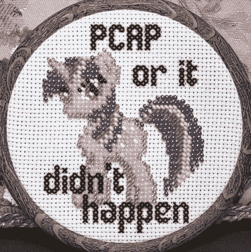

[https://Twitter . com/command rapaul/status/1268257006290378752？s=20](https://twitter.com/CommanderApaul/status/1268257006290378752?s=20)

这是我加入蜜网项目的动力之一。我们发布了许多“[挑战](https://www.honeynet.org/challenges/)”，其中包括蜜罐硬盘驱动器的位映像副本、数据包捕获、恶意软件工件等。供人分析。这些仍然是一种有价值的经常使用的资源。如果你还没有看过，那就去看看吧，因为你会发现你可以从中学到很多东西。

## 使用哪个“工具”？

你可能会问的下一个逻辑问题是，“我应该使用哪个工具来查看 PCAP 文件？”

当然，你应该使用*合适的工具*进行工作！不仅仅只有一种工具。事实上，您可以使用许多不同的工具，它们各自做的事情略有不同。选择哪一个(或哪几个 T21)取决于首先知道你想要完成什么，以及在这个过程中你想要付出多少努力。

您想获得有关协议、端口、流长度(以字节为单位)或持续时间的高级统计信息吗？或者您想将特定的流提取到您可以处理的文件中，也许[将流](https://youtu.be/fX5PCU-KRAE)中传输的文件分割出来？

如果你问`<SOME_SEARCH_ENGINE>` " [使用哪种工具来查看 pcap 文件](https://www.google.com/search?q=which+tool+to+look+at+pcap+files&oq=which+tool+to+look+at+pcap+files&aqs=chrome.0.69i59.7144j0j8&sourceid=chrome&ie=UTF-8)， *Wireshark* 将是最重要的参考。许多人会说，“使用 Wireshark 查看网络上的数据包是多么容易啊！”

好的。不要误解我。Wireshark 有它的位置，是的，安装它、运行它、打开 PCAP 文件很容易——或者非法获取你当地咖啡店无线网络的所有流量……什么，你*没听说过《窃听法案》*?—并查看数据包。*很多*包！(包太多？)

如果您要分析的数据包捕获中有一百万个数据流，所有数据流都分散在几天内，每个数据流都由使用几十种 IP 协议中任何一种的数千个数据包组成，该怎么办？

这么想吧。在上面两个年轻女孩的照片中，如果房间里的灯是关着的，唯一的照明来自一个小的 LED 战术手电筒。他们一次只能看到几根弦的一部分，无论哪一根恰好在他们站的地方的正前方。

他们看不到更大的图片——更重要的是，更大的顶点和边的结构——除非打开房间里所有的灯，并退后一点(就像摄影师的有利位置)。

更大的画面(字面上，就像这个图中的那样)是我们最终想要得到的。(剧透警告:我们不会在本文中实现这一点，但这是您想要产生的可视化，以传达您的分析结果。)

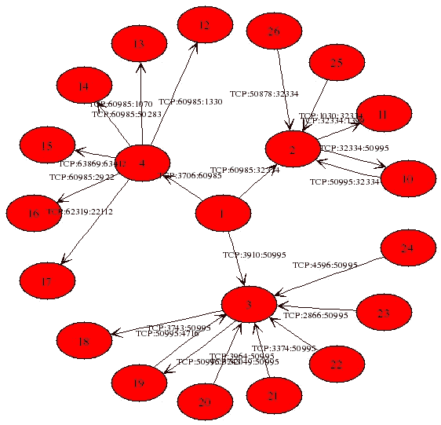

网络边界捕获的 Nugache P2P 僵尸网络节点之间的一小部分连接的图表

使用 Wireshark 可能很容易看出一个小的 PCAP 文件中有什么，但是除非您是真正的超级用户，否则它不会告诉您数百万个数据包中发生了什么。

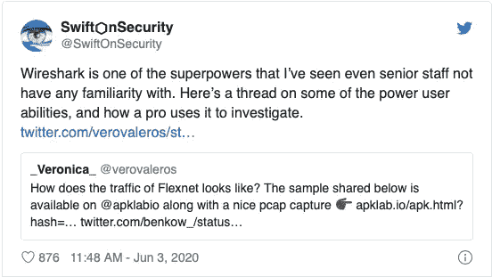

[https://Twitter . com/swifton security/status/1268253139234361350？s=20](https://twitter.com/SwiftOnSecurity/status/1268253139234361350?s=20)

再次，*不要误会*！一个深谙如何深入挖掘 PCAP 文件以本能方式发现不良信息的专家可以迅速(正如 [_Veronica_](https://twitter.com/verovaleros) 在[她的线程](https://threadreaderapp.com/thread/1268244469251543042.html)中很好地展示的)利用 Wireshark 的高级功能来发现 PCAP 文件中的不良信息。Mat Lyons 在[检测播客](https://www.detections.org)的 [**工作系列:事故响应咨询**](https://www.optiv.com/security-solutions/security-services/incident-management-and-response) 集(00:52:16)中将这种基本理解和工具选择的概念应用于更广阔的测向/红外空间。

如果您仍在进行数据包级别的网络取证分析，或者希望自动化该过程，那么就需要更高级别的统计摘要、机器学习分析和感兴趣的流量标记，以及入侵防御系统警报和签名匹配。虽然这是可能的，但编写一个交互工具的脚本却不像 T2 那么容易。

当然，您可能会指出 Wireshark 附带了`tshark`命令行应用程序，它可以自动生成一些高级统计数据。

您仍然需要准备一个系统，通过安装上述工具来处理 PCAP 文件。幸运的是，已经有人这么做了！

## 进入咖啡厅(但是*请*戴上口罩，好吗？😷)

2020 年 5 月 1 日，在一场全球性的疫情中，In-Q-Tel 实验室发布了一款名为 [Packet Café](https://blog.cyberreboot.org/introducing-packet-caf%C3%A9-ea0f439fe1da) 的开源包分析平台。

[](https://blog.cyberreboot.org/introducing-packet-caf%C3%A9-ea0f439fe1da) [## 介绍包咖啡馆

### IQT 实验室很高兴开源一个新的网络重启项目，名为 Packet Café，一个易于使用的自动化网络…

blog.cyberreboot.org](https://blog.cyberreboot.org/introducing-packet-caf%C3%A9-ea0f439fe1da) 

> Packet Café是一个分析平台，通过一套可配置的开源工具来传输数据，以更好地可视化和剖析 PCAP 数据，从而更直观地分析网络流量数据。Packet Café通过两种方式实现这一点。首先，PCAP 通过使用行业标准工具(如 Snort 和 Mercury)的严格分析管道运行，原始输出可供用户进行任何类型的分析。接下来，该数据用于生成一个仪表板视图，以便对所提供的数据进行可视化浏览。目前，所提供的可视化集中于回答关于在任意 PCAP 文件中通信的 IP 地址和端口的分布的问题。我们也在探索增加更多可视化效果和改进仪表板功能的方法。
> ——[https://www.cyberreboot.org/projects/packet-cafe/](https://www.cyberreboot.org/projects/packet-cafe/)

[](https://www.cyberreboot.org/projects/packet-cafe/) [## 小包咖啡馆

### Packet Café专为易于使用的自动化网络流量分析而打造。该平台配置为模块化，并且…

www.cyberreboot.org](https://www.cyberreboot.org/projects/packet-cafe/) 

分析管道如下图所示:

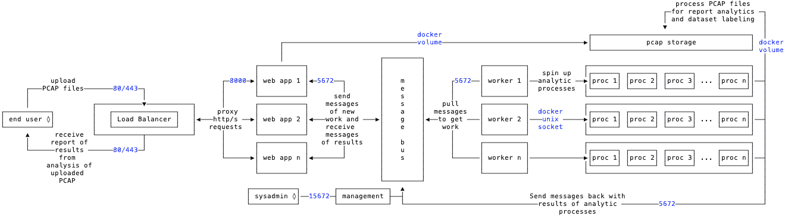

来自[https://iqtlabs.gitbook.io/packet-cafe/design/architecture](https://iqtlabs.gitbook.io/packet-cafe/design/architecture)的数据包咖啡馆组件图

In-Q-Tel Labs 的文章[介绍了 Packet Café](https://blog.cyberreboot.org/introducing-packet-caf%C3%A9-ea0f439fe1da) 提到了产生恶意沙盒捕获的公共语料库的一些困难。

国土安全部长期以来支持一个更加封闭的、审查访问的、用于计算机安全研究目的的数据目录，即“影响网络信任 T4”项目。

我描述了另一个(公开可用！)未编辑文件的来源和[一个我编写的搜索和下载它们的工具](https://pypi.org/project/lim-cli)在"[潜入沙盒捕获的恶意软件数据中被称为`lim`。](/diving-into-sandbox-captured-malware-data-d0bb10a5bfd9)“我们可以利用这些数据为 Packet Café提供信息。

Packet Café唯一没有的是 CLI。所以我写了一个！

## 入门指南

IQTLabs 描述了在 Mac/Darwin 系统或 Linux 服务器上部署 Packet Café 的[步骤。](https://cyberreboot.gitbook.io/packet-cafe/deployment/prerequisites)

我现在的一个主要开发平台是 Surface Pro，它在 WSL2 上运行 Ubuntu 18.04，带有 Docker Desktop WSL2 后端。VSCode 在所有三个平台上都运行良好，与我的 Macbook Pro 相比，该系统唯一的大限制是`lim`在浏览器中直接打开网页的能力。(我相信[这个限制即将消失](https://devblogs.microsoft.com/commandline/the-windows-subsystem-for-linux-build-2020-summary/)，但是如果你需要能力，你可以在 Windows 10 上安装一个 X Window 系统服务器，通过那种方式获得 Ubuntu GUI 应用；只是要确保你这样做是安全的！)

所以虽然 IQTLabs 的网页上没有提到，但是你*也可以*使用运行 Docker for Windows 和 Windows Subsystem for Linux 2 (WSL2)的 Windows 10 系统。

你必须确保你有他们列出的先决条件，但是(从版本 20.8.6 开始)有一个更简单的方法来启动和运行 Packet Café，使用`lim`本身！

首先，按照[步骤从 PyPI 安装](https://lim-cli.readthedocs.io/en/latest/installation.html) `[lim-cli](https://lim-cli.readthedocs.io/en/latest/installation.html)` [包](https://lim-cli.readthedocs.io/en/latest/installation.html)。它可以在所有运行 Packet Café的系统上运行。最简单、最快速、最安全的方法可能是使用`pipx`(如本[asci NEMA](https://asciinema.org/)asci icast 所示)。如果你想从事开发，你会想要使用 Python 虚拟环境(类似于 [Miniconda](https://docs.conda.io/en/latest/miniconda.html) )。

[](https://asciinema.org/a/356160) [## 安装“lim”并启动 Packet Café容器堆栈

### 本视频展示了使用“lim-CLI”Python 包来启动 Packet Café Docker 容器堆栈是多么容易…

asciinema.org](https://asciinema.org/a/356160) 

一旦安装并运行了先决条件，您应该能够运行`lim cafe`子命令(从`lim help`或`lim about --help`开始)。

现在你需要做的就是运行`lim cafe containers build`。

这将克隆`iqtlabs/packet_cafe`库并运行`docker-compose`命令来构建和提取所有容器并启动它们。

就这么简单！

一旦 Docker 容器运行，您将在 Docker 仪表板中看到它们。

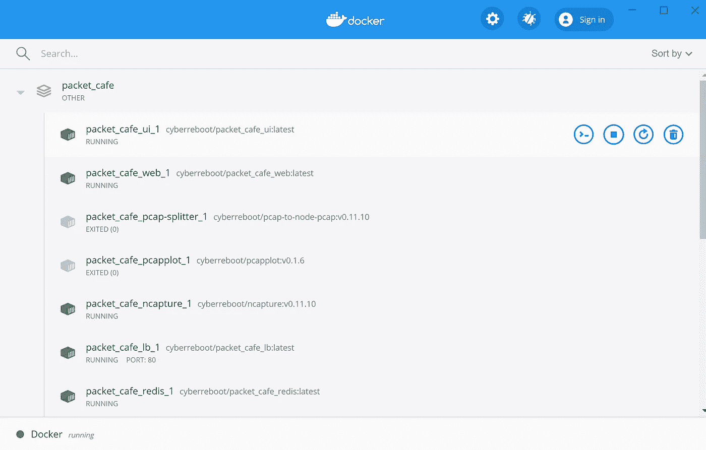

可以用`lim cafe ui`启动 web UI。您在一个命令行中打开容器，然后打开 UI，如下所示:

`$ lim cafe containers build && lim cafe ui`

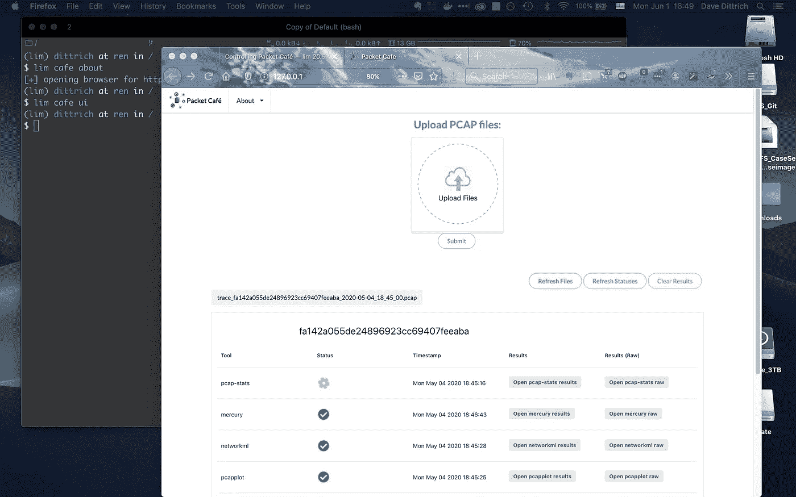

通过网络用户界面，您可以执行 Packet Café网站上记录的所有操作(您可以通过**关于**下拉菜单方便地访问该网站)。更多新的用户界面功能即将推出。

为了方便起见，您也可以使用`lim cafe about.`打开 Packet Café文档网页。您可能会首先访问该网站，以了解有关 Packet Café及其 web UI 的更多信息。

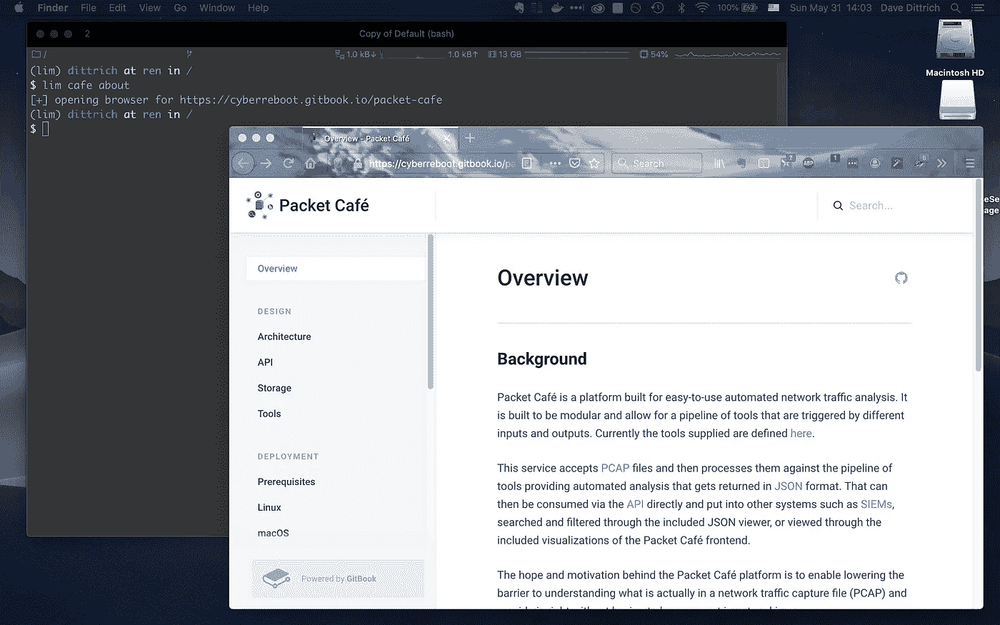

*注意:当您在 UI 和* `*lim*` *之间来回切换时，您可能会注意到，此时，当通过 API 上传文件时，Packet Café UI 不会像我们稍后对* `*lim*` *所做的那样进行自我更新。(这个已经被举报了，应该很快就能修复。)*

我将把探索 UI 作为“读者的一个练习”本文的其余部分将重点介绍如何使用`lim` CLI。

[](https://pypi.org/project/lim-cli/) [## lim-cli

### 用于访问、操作和处理计算机和网络安全信息的 Python CLI(例如，PCAP、Netflow…

pypi.org](https://pypi.org/project/lim-cli/) 

在 5 月最初的 Packet Café发布后的几天内，我开始给`lim`添加`cafe`子命令。(我有没有提到我住在第一个确诊新冠肺炎病例的州，也是全国第二个对新冠肺炎发出“呆在家里”命令的州？)

100%覆盖 API 端点并不需要太长时间，但是稍微润色一下并记录下来[就花了一点时间。令人欣慰的是，您可以通过 CLI 本身的`help`和/或`--help`获得大量内部文档。命令主要反映 API 端点的名称(在帮助输出中提供以供参考)。](https://lim-cli.readthedocs.io/en/latest/)

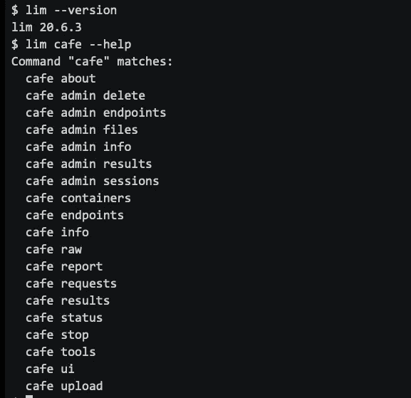

在我们从命令行开始练习 Packet Café之前，让我们仔细检查以确保 Docker 容器正在运行。

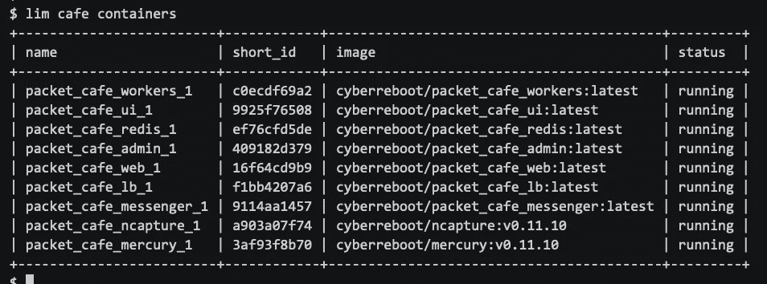

(注意:这些截图是在 IQTLabs 更名之前创建的，所以名称`cyberreboot`显示在这里，而当前的容器名称将在`iqtlabs`名称空间中。)

这比`docker ps`输出要干净得多，因为它只关注于 Packet Café容器，所以如果 UI 容器没有运行，您可以在脚本中使用它来失败。

## 与数据包咖啡馆互动

我们需要一些 PCAP 的数据输入到数据包咖啡馆。让我们从 [CTU 恶意软件捕获设施](https://www.stratosphereips.org/datasets-malware)中获取同样的文件，该文件被`lim-cli` [BATS](https://github.com/bats-core/bats-core) 运行时测试所使用。(如果想使用`lim-cli`源代码，看看那些，尤其是运行时集成测试。)

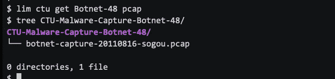

请注意，当我们上传一个 PCAP 文件时,`lim`默认跟踪工人处理文件的进度，类似于 Packet Café UI 的方式。有些只需几秒钟就能返回，而另一些可能需要很长时间(取决于 PCAP 文件的大小和流的数量)。我们还将在这里添加`--elapsed`标志，以包含每个工作人员和总运行时间。

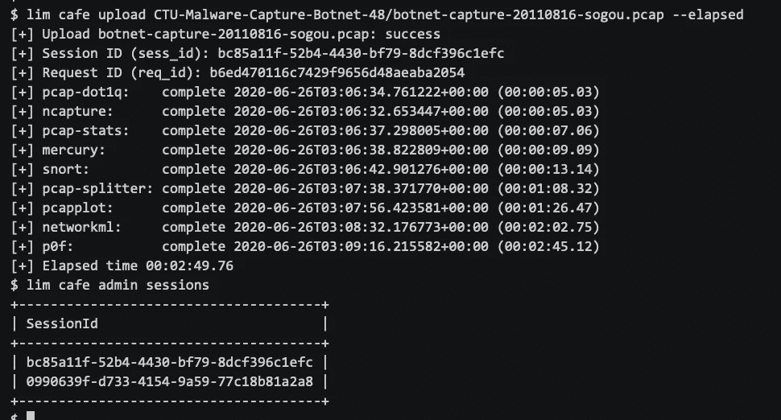

您还可以获得表格形式的工作状态信息，我们马上就会看到。

如果您不想在使用`lim cafe upload`时等待工人完成，您可以禁用跟踪工人，只需使用`lim cafe status`命令交互获取状态。您还可以选择提供您自己的会话 ID(如果您想确保它与您更大的测向/红外工具链的其他部分一起跟踪)。

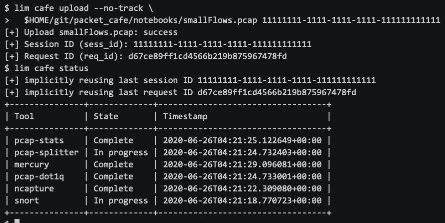

如果您需要获得另一种格式的输出，以便在脚本中处理，或者导入到另一个安全工具中，您有几种选择。对于特定列的过滤、其他程序的管道、或者提供`for`循环的内联命令替换，您可能想要这样做。

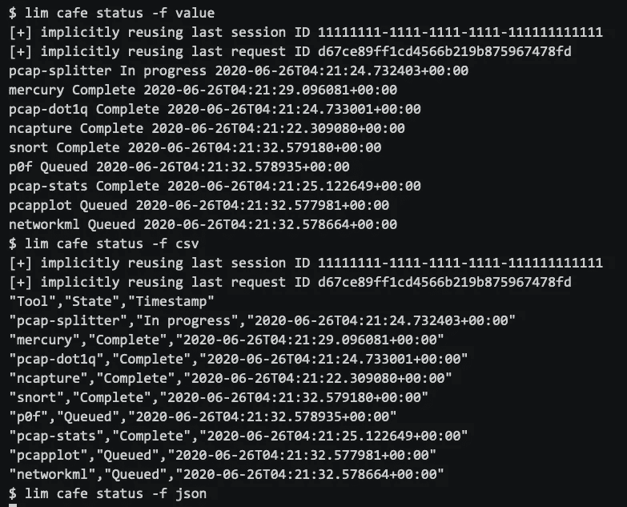

环境变量`VOL_PREFIX`必须设置为指向一个目录树，该目录树将由 Docker 容器进行卷挂载。工人在两个主目录下创建数据。文件存储在路径为`${VOL_PREFIX}/files`的目录中，来自工人的结果存储在路径为`${VOL_PREFIX}/id`的目录中。您应该在您自己的 shell 配置文件中设置它，但是在运行 Docker 命令之前,`lim`会确保它被设置为 IQTLabs 描述的缺省值，以加快速度。

当然，对于本地 Docker 容器部署，您可以使用 Linux 的`ls`、`find`或`tree`命令直接列出这些文件。完全远程部署将需要使用类似于`lim`的东西，这是现成的！

每组数据可以分别用`lim cafe admin files`和`lim cafe admin results`列出。这些命令中的每一个都有一个`--tree`标志，它将产生一个可读性更好的列表，如下所示:

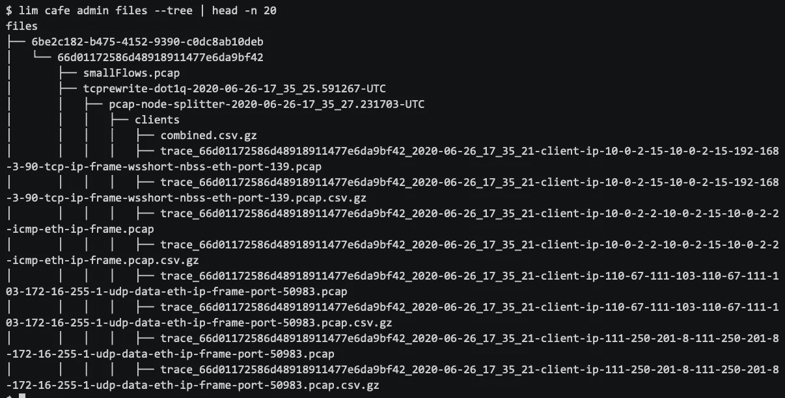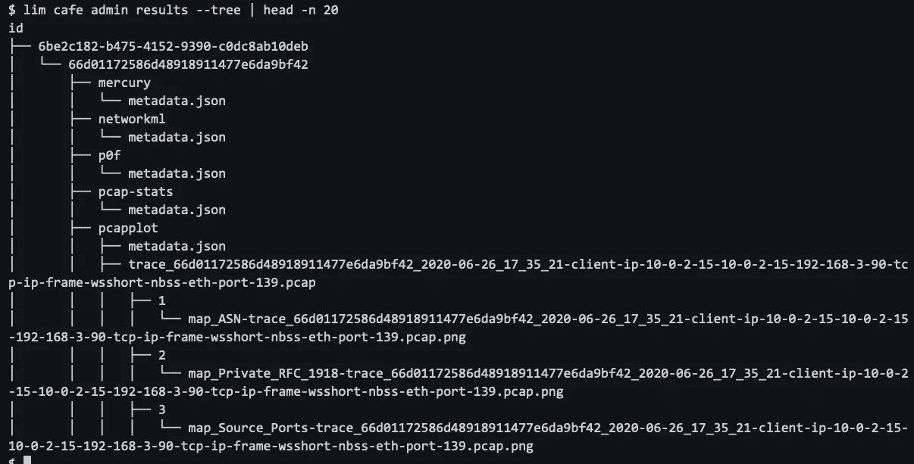

如果您想在命令行(而不是在浏览器中)查看来自工作人员的结果，您可以获得给定工具的原始结果或基本的表格报告。

让我们看看`networkml` worker 的原始输出的第一部分。如果您使用 TTY 从命令行交互运行该命令，输出将会以彩色语法高亮显示的方式显示出来。

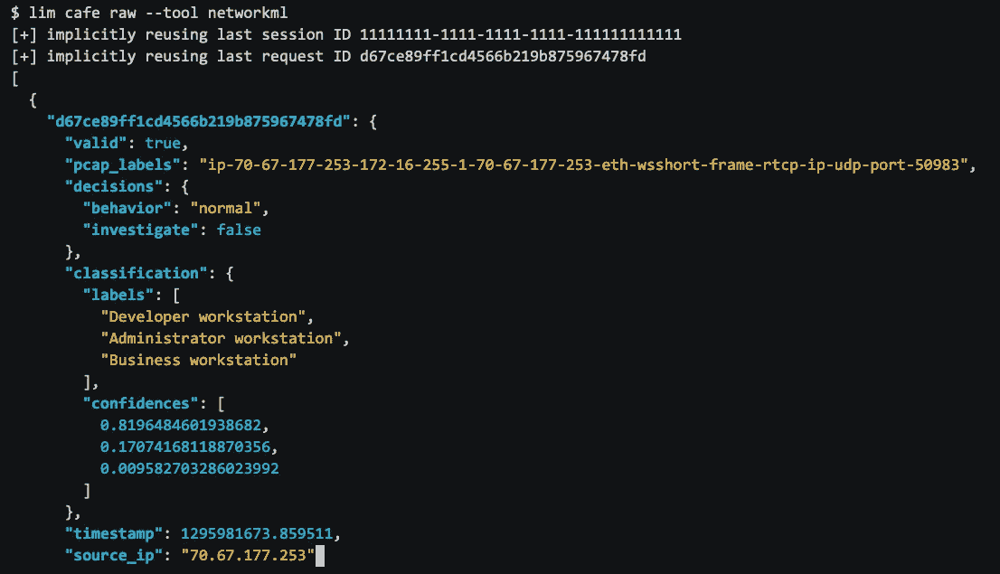

如果在后台运行脚本(或者没有 TTY)，输出将是干净的 ASCII。

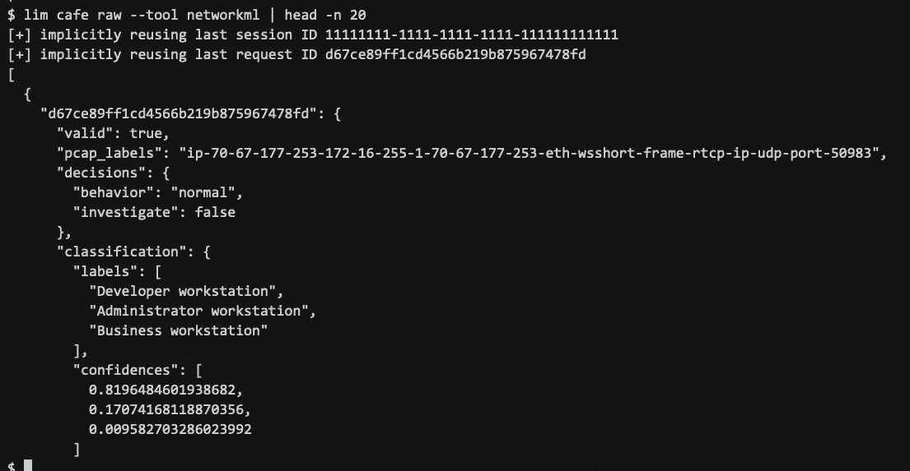

可以为那些生成 JSON 结果的工具生成报告。默认情况下，所有这样的工具结果都将包含在报告中(使用`--help`查看可用工具的列表)，但是在大多数情况下，这将会很长。这是关于`p0f`(被动操作系统指纹识别)的报告的开始。

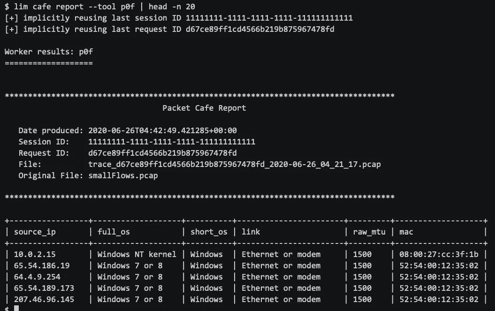

请注意，如果您仔细查看来自`pcap-stats`工具的报告的顶部，有些东西可能看起来有点熟悉。是`tshark`和`capinfos`输出！(我将把它留给读者作为练习。提示:试试`lim cafe report --tool pcap-stats`或者只是`lim cafe report`。)

过一会儿，您将结束几个会话(每个会话有一个或多个请求)。如果最后一个会话和请求不再存在于服务器中(例如，如果您使用`lim cafe admin delete`删除它们)，系统将提示您交互选择可用的会话和请求。(该特性使用 Python [bullet](https://github.com/Mckinsey666/bullet) 模块。)或者您可以添加`--choose`标志，随时自己触发选择行为。

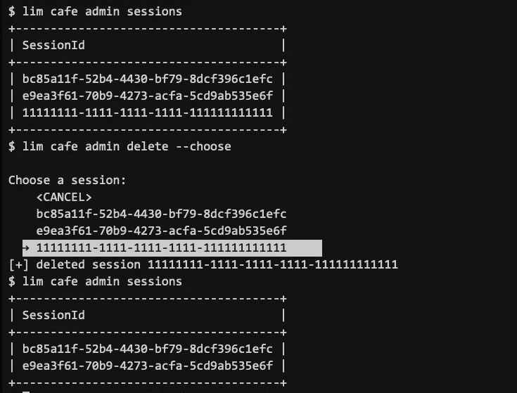

如果只是玩玩或测试，可以使用`lim cafe admin delete`命令删除特定的会话，或者添加`--all`标志删除所有会话。

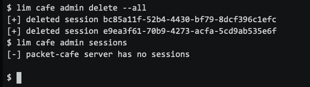

这里有一个[asci NEMA](https://asciinema.org/)asci cast，展示了以上所有(以及更多)内容:

[](https://asciinema.org/a/353492) [## 数据包咖啡馆 API 的 lim-cli 子命令

### lim CLI 应用程序中的 Packet Café子命令演示。

asciinema.org](https://asciinema.org/a/353492) 

## 开始的结束

好了，这应该足够让你开始检查 PCAP 的文件了！还有更多的东西需要实验和探索，包括在现实的分析案例研究模式中使用这些工具。

从我 5 月开始写这篇文章到我 8 月 26 日发布 20.8.7 版本之间，我添加了列出、构建、启动、停止、更新和删除 Docker 图像和容器的功能。我已经向 IQTLabs 提交了几个成功的 Pull 请求，以添加有助于独立开发和测试代码修改和 bug 修复的特性，这将在以后的文章中介绍。

还有更多的功能可以添加到`lim`中，比如扩展 PCAP 编辑功能以供生产使用(例如，编辑数据以供共享或发布)，添加可视化功能，如我之前展示的 Nugache 网络图，以及为 Packet Café本身添加更多工作人员以运行工具，如 [Aguri](https://keio.pure.elsevier.com/en/publications/aguri-an-aggregation-based-traffic-profiler) 和 [Zeek](https://zeek.org) 等。看起来新冠肺炎不会很快结束，所以谁知道呢？(如果您碰巧知道任何可以支持这项工作的拨款或合同资助机会，请告诉我！或者查看我的 [GitHub 页面](https://github.com/davedittrich)。我感谢你的帮助！)

【感谢 Dan Farmer 和 Charlie Lewis 对本文的反馈。]